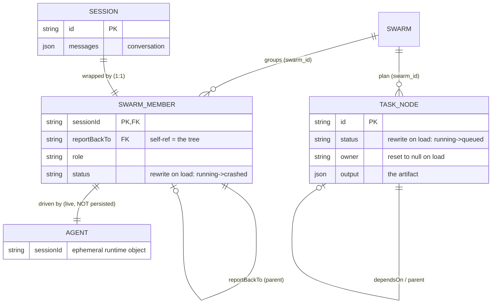

# Building jcode - MVP Learning Plan
## From one agent to a swarm on a task DAG

> The handbook (`SWARM_HANDBOOK.md`) taught you what jcode's swarm *is*. This
> plan makes you build one. By the end you will have a JavaScript program that
> spawns agents which run genuinely in parallel, talk to each other, and grow
> a task graph that refuses to close until its own reviewers are satisfied.
>
> Language: JavaScript (ESM) with JSDoc types. Runtime: Node 20+.
> Every step cites the real jcode source it is modelled on, so you can always
> go read the production version of what you just wrote.

---

## THE MINDSET

jcode is ~700K lines of Rust. You are not rebuilding it. You are extracting
the **architecture** and leaving the **language tax** behind.

That distinction is the single most useful thing to hold onto while you build:

```
jcode does this...                         ...because Rust, or because architecture?
-----------------------------------------  ----------------------------------------
Arc<RwLock<HashMap<String, Member>>>       RUST TAX. Many OS threads touch one map.
                                           You get a plain Map. Skip it.

JoinSet + CancellationToken                RUST TAX. Dropping a JoinHandle silently
  (RuntimeTaskScope)                       detaches the task. JS promises don't
                                           vanish like that. You get a Set +
                                           AbortController.

InterruptSignal = AtomicBool + Notify,     RUST TAX. Guards a cross-thread lost-wakeup
  plus an enable-before-check race guard   race. Node is single-threaded and
                                           AbortController already solves this.

report_back_to_session_id forms the tree   ARCHITECTURE. Build it.
Member cap + live-worker budget            ARCHITECTURE. Build it.
Three different fan-in strategies          ARCHITECTURE. Build all three.
DM vs subtree broadcast vs channel         ARCHITECTURE. Build it.
Status snapshot / summary / full read      ARCHITECTURE. Build it.
Task DAG + critique/verify gates           ARCHITECTURE. Build it. This is the point.
```

Roughly 40% of what looks hard in jcode is Rust defending itself against
threads. Node hands you that for free. What is left - the spawn tree, the
fan-in strategies, the comms topology, and the gated task graph - is the real
design, and all of it is portable.

---

## THE ONE DESIGN RULE THAT DECIDES WHETHER THIS WORKS

Before any code. This is not stylistic - it is the difference between a swarm
that helps and one that produces confidently broken work.

> **Many agents read. One agent writes.**

The failure it prevents is specific: parallel agents make *implicit decisions*
that contradict each other. One worker assumes the config is JSON, another
assumes YAML; each is internally consistent, and the merged result is incoherent
in a way that is hard to debug because no single agent did anything wrong.

The industry converged on this the hard way. Cognition (Devin) published "Don't
Build Multi-Agents" arguing exactly this failure, then revisited it ten months
later with a sharper version: multi-agent works *"when writes stay
single-threaded and the additional agents contribute intelligence rather than
actions."* Anthropic's own research system runs **3-5** subagents, not hundreds -
on a read-heavy research task. Systems that genuinely run 100+ agents use them
for **parallel search**, not collaborative editing.

The shape you are building toward:

```
                 orchestrator (root)
                 - decides
                 - edits files
                 - owns the plan
                        |
       +----------------+----------------+
       |                |                |
   worker            worker            worker
   read/grep         read/grep         read/grep
   reports back      reports back      reports back
```

Step 40 turns this from a convention into something the code enforces, by
handing different tool sets to different roles.

You *can* let workers write - the machinery supports it and jcode allows it.
Just do it knowingly, on tasks touching disjoint files, and expect to spend your
debugging time on merge incoherence rather than on any individual agent.

---

## READ ALONGSIDE: THE HANDBOOK

`SWARM_HANDBOOK.md` explains *why* jcode is built the way it is, with the Rust
walked through chapter by chapter. This plan is the *how*. Read one chapter
before each part:

| Before you build | Read | What it gives you |
|---|---|---|
| Part 0 | Ch 1 - Why parallel agents | Vocabulary: session, member, coordinator, swarm |
| Part 1 | Ch 2 - Anatomy of a spawn | The real spawn path, ancestry, mode gating, member cap |
| Part 2 | Ch 3 - Fan-out / fan-in | The three strategies in jcode's own code, and when each applies |
| Part 2 | Ch 4 - Structured concurrency | Why Rust needs JoinSet + CancellationToken and you need eight lines |
| Part 3 | Ch 5 - Shared state | Why "no locks" and `RwLock` are both true, at different layers |
| Part 3 | Ch 7 - Communication topology | DM vs subtree vs channel, three read tiers, status-on-reload |
| Part 4 | Ch 6 - The task DAG | Gate machinery, confidence debt, the worked T0-T7 example |
| Part 6 | Ch 8 - Glossary | The pattern -> file -> primitive cheat sheet |

Chapter 6 is worth reading *twice* - once before Part 4 and once after, because
the gate rules only feel inevitable once you have tried to write them yourself.

**One more principle, and it shapes everything after Step 5:** you cannot
learn swarm mechanics if every run costs money and takes ninety seconds. You
will build a deterministic fake model *before* you build the swarm. A twenty
agent run should finish in under a second, offline, with the same result every
time. Real API calls are a flag you flip at the end.

---

## SEQUENCE OF IMPLEMENTATION

<table>
<tr>
<td valign="top" width="55%">

**PART 0** — One agent *(the thing you later swarm)* &nbsp;&nbsp;&nbsp; Handbook Ch1

```
 1. src/types.js                     Message/ContentBlock/QueryEvent unions
 2. src/tool.js                      Tool interface (generator execute)
 3. src/tools/{read,write,bash,grep}  Four real tools
 4. src/api/model.js                 The Model interface both backends implement
 5. src/api/mockModel.js             Deterministic scripted model  <- before the swarm
 6. src/toolExecutor.js              Parallel reads, serialized writes
 7. src/query.js                     The agentic loop
 8. src/session.js                   Session = id + history + abort
```

</td>
<td valign="top" width="45%">

**My notes — how this differs from my use case**

jcode swarms the **same agent** in parallel. My case swarms **different types** of agent in parallel. Artifacts are essentially these agents themselves — created through a curriculum (Voyager-style).

jcode agents differ by *prompt*, not by tools. Every member gets the same tool registry. The `SwarmRole` enum has `Agent`, `Coordinator`, and `Other(String)`, but role is never used to pick a toolset. The only role check in the swarm path is `member.role != "coordinator"` for messaging scope.

My use case is a superset. The seam is already there: **Step 40's `toolsFor(member)`** — switch on `agentType` instead of role. ~15 lines:

```js
// src/swarm/types.js
// @property {string} [agentType]  'researcher' | 'coder' | 'reviewer'

const AGENT_TYPES = {
  researcher: [ReadTool, GrepTool, WebTool, MessageTool, GraphTool],
  coder:      [ReadTool, EditTool, WriteTool, BashTool, GraphTool],
  reviewer:   [ReadTool, GrepTool, BashTool, GraphTool],
}

export function toolsForMember(member) {
  if (member.role === 'coordinator') return ORCHESTRATOR_TOOLS
  return AGENT_TYPES[member.agentType] ?? WORKER_TOOLS
}
```

`Swarm.spawn()` passes `agentType` onto the member; `SpawnTool`'s schema gains an `agentType` field so the orchestrator picks the right specialist. Give each type its own system prompt in `systemPromptFor` — tools define what it *can* do, the prompt defines what it *should*.

</td>
</tr>
</table>

```
PART 1 - One agent becomes many                        Handbook Ch2
9. src/swarm/types.js               SwarmMember, lifecycle status, role
10. src/swarm/registry.js            The member Map (+ the lock you don't need)
11. src/swarm/ancestry.js            reportBackTo edges, depth, subtree walk
12. src/swarm/caps.js                Member cap, worker budget, mode gating
13. src/swarm/swarm.js + tools/spawn.ts   The agent-facing spawn
14. src/swarm/lifecycle.js           Completion reports, reparenting on exit

PART 2 - Running them at once                          Handbook Ch3-4
15. src/patterns/planFanOut.js       Promise.all: planner -> workers -> integrate
16. src/patterns/incrementalDrain.js React as each one finishes
17. src/patterns/awaitMembers.js     Event-driven wait with a deadline
18. src/swarm/abortTree.js           AbortController parent -> child
19. src/swarm/interrupt.js           Soft interrupt at safe points

PART 3 - Talking to each other                         Handbook Ch7
20. src/comms/bus.js                 Event bus + replay buffer
21. src/comms/routing.js             DM vs subtree broadcast vs channel
22. src/comms/reads.js               Snapshot vs summary vs full context
23. src/comms/persist.js             Snapshot, and the rewrite-on-reload trap

PART 4 - The task DAG                                  Handbook Ch6
24. src/dag/types.js                 Mode, NodeKind, gateKind, NodeOrigin, NodeStatus
25. src/dag/confidence.js            Lenient confidence parsing
26. src/dag/graph.js                 Private nodes, mutations are the only door
27. src/dag/ops.js                   seed, expandNode
28. src/dag/complete.js              completeNode + artifact validation
29. src/dag/gates.js                 Root gate, injectFromGate, validateGatePass
30. src/dag/scheduler.js             readyNodes, dispatch, assembleInput

PART 5 - Run it and watch it                           Handbook Ch1, Ch8
31. src/ui/swarmView.jsx             Live member tree
32. src/ui/dagView.jsx               The graph, seeded vs grown
33. src/cli.js                       Entrypoint, --mock (replaced by Step 43)
34. src/demo/multimonitor.js         Fan out -> gate finds gap -> re-synthesize

PART 6 - From demo to daily driver                     what makes it usable
35. src/permissions/rules.js         Real gate  <- BEFORE any real repo
36. src/planTask.js                  Your task -> seed nodes (the front door)
37. src/costTracker.js               What did that run cost
38. src/timeline.js                  Proof the agents actually overlapped
39. src/tools/channel.js             Lets agents join channels
40. src/swarm/roles.js               Enforce single-writer structurally
41. src/tools/graph.js               Agents reshape the plan  <- matches jcode
42. src/compact.js                   Survive long sessions
43. src/cli.js                       Run it on a real repository
44. runner.ts + swarm.ts             Let it actually change code  <- do not skip
```

**Setup before Step 1:**

```bash
mkdir jcode-mvp && cd jcode-mvp && npm init -y
npm i @anthropic-ai/sdk zod ink react
npm i -D vitest
```

In `package.json` set `"type": "module"` and add:

```json
"scripts": {
  "start": "node src/cli.jsx",
  "test":  "vitest run"
}
```

No build step and no `tsconfig.json` - Node runs these files directly.

Two small notes about JSX. Ink components (Steps 31-32) use JSX, which Node
cannot parse on its own. You have two options, and either is fine:

- **Skip JSX entirely.** Every `<Box>` can be written as
  `React.createElement(Box, {...}, children)`. Step 43's entrypoint already
  does exactly this, so you can see the shape. Slightly noisier, zero tooling.
- **Add one dev dependency:** `npm i -D tsx`, then run `tsx src/cli.jsx`. It
  handles JSX in `.jsx` files with no config.

The plan writes the two view files as JSX because it reads better. Everything
else in this document is plain JavaScript that Node runs as-is.

Note: every import below carries an explicit file extension
(`from './tool.js'`, `from './ui/swarmView.jsx'`). ESM in Node requires it -
unlike CommonJS, there is no extension guessing.

---
---

# PART 0 - ONE AGENT

You need something to swarm before you can swarm it. Part 0 is the smallest
agent that can do real work: it streams from a model, calls tools, and loops
until done. If you have built an agent loop before, this is familiar ground -
move fast, but do not skip Step 5.

---

# STEP 1 - `src/types.js`

**What jcode does:** every message, event, and result is a typed enum, and Rust's
compiler enforces which fields exist on which variant.

**Why you want this:** you are about to have a dozen agents emitting events
concurrently. When something goes wrong, the difference between an event whose shape is written down and one you have to
reverse-engineer from a log is the difference between a five-minute fix and an
hour.

**Mental model:** a tagged union is a `switch` over a `type` field. TypeScript
would have the compiler check it for you; here the JSDoc typedefs document the
shape and your editor still autocompletes from them.

**What to write:**

```javascript
// src/types.js
//
// Types only. In TypeScript these were `export type` declarations; in
// JavaScript they become JSDoc typedefs. Your editor still reads them for
// autocomplete, and they document the contracts for a human reader.

// --- Content blocks -------------------------------------------------------

/** @typedef {{ type: 'text', text: string }} TextBlock */

/**
 * @typedef {Object} ToolUseBlock
 * @property {'tool_use'} type
 * @property {string} id
 * @property {string} name
 * @property {Object.<string, unknown>} input
 */

/**
 * @typedef {Object} ToolResultBlock
 * @property {'tool_result'} type
 * @property {string} tool_use_id
 * @property {string} content
 * @property {boolean} [is_error]
 */

/** @typedef {TextBlock | ToolUseBlock | ToolResultBlock} ContentBlock */

// --- Messages -------------------------------------------------------------

/** @typedef {{ role: 'user', content: string | ContentBlock[] }} UserMessage */
/** @typedef {{ role: 'assistant', content: ContentBlock[] }} AssistantMessage */

/** @typedef {UserMessage | AssistantMessage} Message */

// --- Usage and termination ------------------------------------------------

/** @typedef {{ inputTokens: number, outputTokens: number }} Usage */

/** @typedef {'end_turn' | 'tool_use' | 'max_tokens'} StopReason */

/**
 * @typedef {Object} Terminal
 * @property {'end_turn' | 'max_turns' | 'aborted' | 'error'} reason
 * @property {Usage} usage
 * @property {string} [errorMessage]
 */

// --- Events the query loop emits ------------------------------------------

/**
 * @typedef {{ type: 'text', sessionId: string, text: string }
 *   | { type: 'tool_start', sessionId: string, toolUseId: string, name: string, description: string }
 *   | { type: 'tool_result', sessionId: string, toolUseId: string, content: string, isError: boolean }
 *   | { type: 'turn_end', sessionId: string, usage: Usage }} QueryEvent
 */

// Makes this a module so other files can reference its typedefs.
export {}
```

**Why `sessionId` is on every event:** in Part 1 these events start arriving
from many agents at once. If an event does not say who emitted it, the UI
cannot attribute it and you will be adding this field back under pressure.
Put it in now.

---

# STEP 2 - `src/tool.js`

**What jcode does:** every tool declares its own concurrency and interrupt
semantics, and the batch executor reads those declarations when it decides
what may overlap (`crates/jcode-app-core/src/tool/batch.rs:282-295`).

**Why it is shaped this way:** the executor cannot know whether two tool calls
can safely overlap - only the tool author knows. Two reads are fine. Two edits
to the same file are corruption. So the tool declares it and the executor obeys.

**Mental model:** a tool is not just a function. It is a function plus a safety
contract.

**What to write:**

```javascript
// src/tool.js
import { z } from 'zod'

/** @typedef {{ content: string, isError: boolean }} ToolResult */

/**
 * @typedef {Object} ToolContext
 * @property {import('./session.js').Session} session
 * @property {AbortSignal} signal
 * @property {string} cwd
 */

/**
 * A tool is a function plus a safety contract.
 *
 * @typedef {Object} Tool
 * @property {string} name
 * @property {(input: any) => string} description
 *   Dynamic: describes THIS call, not the tool in general.
 * @property {z.ZodType} schema
 * @property {(input: any) => boolean} isConcurrencySafe
 *   Can two calls to this tool overlap in time?
 * @property {'cancel' | 'block'} interruptBehavior
 *   On interrupt: kill it, or let it finish?
 * @property {(input: any, ctx: ToolContext) => AsyncGenerator<string, ToolResult>} execute
 *   Yields human-readable progress; returns the final result.
 */

/**
 * @param {Tool[]} tools
 * @param {string} name
 * @returns {Tool | undefined}
 */
export function findTool(tools, name) {
  return tools.find(t => t.name === name)
}
```

**Why `description` is a function:** when a status line says "Bash", that is
useless. When it says "Bash: npm test -- --watch=false", you can actually
supervise it. jcode makes the same choice, and it matters far more once twenty
agents are each running something.

**Why `interruptBehavior` is per-tool, not global:** cancelling a bash command
kills a process, which is recoverable. Cancelling halfway through a file write
leaves a truncated file on disk, which is not. Only the tool author knows which
is which.

**The matrix you will fill in at Step 3:**

| Tool  | interruptBehavior | isConcurrencySafe | Why |
|-------|-------------------|-------------------|-----|
| read  | block             | true              | Reads never conflict |
| grep  | cancel            | true              | Pure and idempotent, safe to kill |
| write | block             | false             | Never interrupt or overlap a write |
| bash  | cancel            | false             | Killable; side effects prevent overlap |

---

# STEP 3 - `src/tools/*.ts`

Four short files, then a barrel export.

```javascript
// src/tools/read.js
import { z } from 'zod'
import fs from 'node:fs/promises'
import path from 'node:path'

const schema = z.object({ path: z.string() })

/** @type {import('../tool.js').Tool} */
export const ReadTool = {
  name: 'read',
  schema,
  description: (i) => `Read ${i.path}`,
  isConcurrencySafe: () => true,
  interruptBehavior: 'block',

  async *execute(input, ctx) {
    const full = path.resolve(ctx.cwd, input.path)
    try {
      const content = await fs.readFile(full, 'utf8')
      return { content, isError: false }
    } catch (err) {
      return { content: `Cannot read ${input.path}: ${err.message}`, isError: true }
    }
  }
}
```

```javascript
// src/tools/write.js
import { z } from 'zod'
import fs from 'node:fs/promises'
import path from 'node:path'

const schema = z.object({ path: z.string(), content: z.string() })

/** @type {import('../tool.js').Tool} */
export const WriteTool = {
  name: 'write',
  schema,
  description: (i) => `Write ${i.path} (${i.content.length} bytes)`,
  isConcurrencySafe: () => false,
  interruptBehavior: 'block',

  async *execute(input, ctx) {
    const full = path.resolve(ctx.cwd, input.path)
    await fs.mkdir(path.dirname(full), { recursive: true })
    await fs.writeFile(full, input.content, 'utf8')
    return { content: `Wrote ${input.path}`, isError: false }
  }
}
```

```javascript
// src/tools/bash.js
import { z } from 'zod'
import { spawn } from 'node:child_process'

const schema = z.object({ command: z.string(), timeoutMs: z.number().optional() })

/** @type {import('../tool.js').Tool} */
export const BashTool = {
  name: 'bash',
  schema,
  description: (i) => `Bash: ${i.command.slice(0, 80)}`,
  isConcurrencySafe: () => false,
  interruptBehavior: 'cancel',

  async *execute(input, ctx) {
    const timeoutMs = input.timeoutMs ?? 30_000
    yield `running: ${input.command.slice(0, 60)}`

    const result = await new Promise((resolve) => {
      const child = spawn('bash', ['-c', input.command], { cwd: ctx.cwd })
      let out = ''
      child.stdout.on('data', (c) => { out += c })
      child.stderr.on('data', (c) => { out += c })

      const onAbort = () => child.kill('SIGINT')
      ctx.signal.addEventListener('abort', onAbort, { once: true })

      const timer = setTimeout(() => child.kill('SIGTERM'), timeoutMs)

      child.on('close', (code) => {
        clearTimeout(timer)
        ctx.signal.removeEventListener('abort', onAbort)
        resolve({ out, code: code ?? 0 })
      })
    })

    return {
      content: result.out.trim() || '(no output)',
      isError: result.code !== 0
    }
  }
}
```

```javascript
// src/tools/grep.js
import { z } from 'zod'
import { spawn } from 'node:child_process'

const schema = z.object({ pattern: z.string(), path: z.string().optional() })

/** @type {import('../tool.js').Tool} */
export const GrepTool = {
  name: 'grep',
  schema,
  description: (i) => `Grep "${i.pattern}" in ${i.path ?? '.'}`,
  isConcurrencySafe: () => true,
  interruptBehavior: 'cancel',

  async *execute(input, ctx) {
    const out = await new Promise((resolve) => {
      const child = spawn('grep', ['-rn', input.pattern, input.path ?? '.'], { cwd: ctx.cwd })
      let buf = ''
      child.stdout.on('data', (c) => { buf += c })
      child.on('close', () => resolve(buf))
      ctx.signal.addEventListener('abort', () => child.kill(), { once: true })
    })
    const lines = out.split('\n').filter(Boolean).slice(0, 50)
    return { content: lines.join('\n') || '(no matches)', isError: false }
  }
}
```

```javascript
// src/tools/index.js
import { ReadTool }  from './read.js'
import { WriteTool } from './write.js'
import { EditTool }  from './edit.js'
import { BashTool }  from './bash.js'
import { GrepTool }  from './grep.js'

export const BASE_TOOLS = [ReadTool, WriteTool, EditTool, BashTool, GrepTool]
export { ReadTool, WriteTool, EditTool, BashTool, GrepTool }
```

**One more tool, and it is the difference between a demo and something you would
actually use.** `WriteTool` replaces a whole file. On a 2,000-line source file
that means the model reproduces all 2,000 lines to change three of them - slow,
expensive, and it *will* silently drop code on the way through. Real coding
agents edit by replacing an exact substring:

```javascript
// src/tools/edit.js
import { z } from 'zod'
import fs from 'node:fs/promises'
import path from 'node:path'

const schema = z.object({
  path: z.string(),
  old_string: z.string().describe('Exact text to replace, including whitespace'),
  new_string: z.string().describe('Replacement text'),
})

/** @type {import('../tool.js').Tool} */
export const EditTool = {
  name: 'edit',
  schema,
  description: (i) => `Edit ${i.path}`,
  isConcurrencySafe: () => false,
  interruptBehavior: 'block',

  async *execute(input, ctx) {
    const full = path.resolve(ctx.cwd, input.path)
    const before = await fs.readFile(full, 'utf8')
    const occurrences = before.split(input.old_string).length - 1

    // Refusing ambiguity is the whole value. A model that edits the wrong one
    // of three matches produces a bug that looks like it came from nowhere.
    if (occurrences === 0) {
      return {
        content:
          `No match in ${input.path}. The file may have changed since you read it - ` +
          `read it again and copy the exact text including indentation.`,
        isError: true,
      }
    }
    if (occurrences > 1) {
      return {
        content:
          `old_string appears ${occurrences} times in ${input.path}. ` +
          `Include more surrounding lines so it matches exactly once.`,
        isError: true,
      }
    }

    await fs.writeFile(full, before.replace(input.old_string, input.new_string), 'utf8')
    return { content: `Edited ${input.path}`, isError: false }
  },
}
```

Note it returns a *message* rather than throwing when the match is ambiguous -
the model reads that string and retries with more context. That is the same
errors-are-control-flow idea you will meet again in the Part 4 gates.

**Note on `ctx.signal`:** every tool that can block threads the abort signal
through. This is the whole of what jcode needs `InterruptSignal`
(`crates/jcode-agent-runtime/src/lib.rs:32-40`) and its lost-wakeup race guard
(`:92-106`) for. The platform gives it to you.

---

# STEP 4 - `src/api/model.js`

**What jcode does:** providers sit behind one interface
(`crates/jcode-provider-core/`), so Anthropic, OpenAI, Gemini and the rest are
interchangeable. You need exactly two implementations: real, and fake.

**Mental model:** the loop should not know or care whether tokens arrive from a
network socket or an array literal.

```javascript
// src/api/model.js

/**
 * @typedef {Object} ToolSchema
 * @property {string} name
 * @property {string} description
 * @property {Object.<string, unknown>} input_schema
 */

/**
 * @typedef {Object} StreamParams
 * @property {string} system
 * @property {import('../types.js').Message[]} messages
 * @property {ToolSchema[]} tools
 * @property {AbortSignal} signal
 */

/**
 * @typedef {{ type: 'text_delta', text: string }
 *   | { type: 'tool_use', block: import('../types.js').ToolUseBlock }
 *   | { type: 'done', stopReason: import('../types.js').StopReason,
 *       usage: import('../types.js').Usage }} ModelEvent
 */

/**
 * Both the real client and the mock implement this.
 *
 * @typedef {Object} Model
 * @property {string} name
 * @property {(params: StreamParams) => AsyncIterable<ModelEvent>} stream
 */

export {}
```

---

# STEP 5 - `src/api/mockModel.js` - do not skip this

**What jcode does:** nothing like this. This is the one place the MVP is
deliberately better than the real thing for learning purposes.

**Why it exists:** you are about to debug ten agents interleaving. If each run
costs money, takes ninety seconds, and makes slightly different choices every
time, you will not iterate - you will guess. A scripted model turns a swarm run
into a unit test: instant, free, identical every time.

**Mental model:** a fixture. The mock is not pretending to be smart. It replays
a decision transcript you wrote, so the *machinery* is what is under test.

```javascript
// src/api/mockModel.js

/**
 * One scripted turn: some text, then zero or more tool calls.
 *
 * @typedef {Object} ScriptedTurn
 * @property {string} [text]
 * @property {Array<{ name: string, input: Object }>} [toolCalls]
 */

/**
 * Called once per turn. `turnIndex` starts at 0 and increments, so the
 * script advances naturally as the loop runs. `params` lets a script branch
 * on what the conversation looks like so far.
 *
 * @typedef {(turnIndex: number, params: import('./model.js').StreamParams) => ScriptedTurn} Script
 */

let counter = 0
const nextId = () => `mock_tool_${++counter}`

/**
 * @param {Script} script
 * @param {{ latencyMs?: number }} [opts]
 * @returns {import('./model.js').Model}
 */
export function createMockModel(script, opts = {}) {
  const latencyMs = opts.latencyMs ?? 0
  let turnIndex = 0

  return {
    name: 'mock',

    async *stream(params) {
      const turn = script(turnIndex++, params)

      if (latencyMs > 0) {
        await new Promise(r => setTimeout(r, latencyMs))
      }

      if (turn.text) {
        // Emit in chunks so streaming code paths actually get exercised.
        for (const chunk of turn.text.match(/[\s\S]{1,40}/g) ?? []) {
          yield { type: 'text_delta', text: chunk }
        }
      }

      const calls = turn.toolCalls ?? []
      for (const call of calls) {
        const block = {
          type: 'tool_use',
          id: nextId(),
          name: call.name,
          input: call.input
        }
        yield { type: 'tool_use', block }
      }

      yield {
        type: 'done',
        stopReason: calls.length > 0 ? 'tool_use' : 'end_turn',
        usage: { inputTokens: 100, outputTokens: 50 }
      }
    }
  }
}
```

**Give the mock a small latency (5-30ms) whenever you are testing the swarm.**
With zero latency everything resolves inside one microtask tick, you never
observe interleaving, your "parallel" agents look serial, and you go chasing a
bug that does not exist. A few milliseconds makes concurrency visible.

---

# STEP 6 - `src/toolExecutor.js`

**What jcode does:** runs a turn's tool calls concurrently with
`FuturesUnordered`, building the set at
`crates/jcode-app-core/src/tool/batch.rs:282-295` and draining it as results
land at `:300-317`.

**The rule you are implementing:** concurrency-safe tools run in parallel,
everything else is serialized through one queue, and results come back in the
order the model asked for them regardless of finish order.

**Mental model:** a bouncer. Reads go straight in as a group. Writes queue at
the door, one at a time.

```javascript
// src/toolExecutor.js
import { findTool } from './tool.js'

/**
 * @typedef {Object} ExecutedCall
 * @property {string} toolUseId
 * @property {string} name
 * @property {import('./tool.js').ToolResult} result
 */

/**
 * @param {import('./types.js').ToolUseBlock[]} blocks
 * @param {import('./tool.js').Tool[]} tools
 * @param {import('./tool.js').ToolContext} ctx
 * @param {(toolUseId: string, text: string) => void} [onProgress]
 * @returns {Promise<ExecutedCall[]>}
 */
export async function executeToolCalls(blocks, tools, ctx, onProgress) {
  // One shared promise chain that unsafe tools queue onto.
  let writeQueue = Promise.resolve()

  const runOne = async (block) => {
    const tool = findTool(tools, block.name)
    if (!tool) {
      return {
        toolUseId: block.id, name: block.name,
        result: { content: `Unknown tool: ${block.name}`, isError: true }
      }
    }

    const parsed = tool.schema.safeParse(block.input)
    if (!parsed.success) {
      return {
        toolUseId: block.id, name: block.name,
        result: { content: `Invalid input: ${parsed.error.message}`, isError: true }
      }
    }

    const invoke = async () => {
      try {
        const gen = tool.execute(parsed.data, ctx)
        while (true) {
          const step = await gen.next()
          if (step.done) return step.value
          onProgress?.(block.id, step.value)
        }
      } catch (err) {
        return { content: `Error: ${err.message}`, isError: true }
      }
    }

    if (tool.isConcurrencySafe(parsed.data)) {
      // 'cancel' tools lose a race against abort; 'block' tools are allowed to finish.
      if (tool.interruptBehavior === 'cancel') {
        const aborted = new Promise((resolve) => {
          ctx.signal.addEventListener(
            'abort',
            () => resolve({ content: 'Interrupted.', isError: true }),
            { once: true }
          )
        })
        return {
          toolUseId: block.id, name: block.name,
          result: await Promise.race([invoke(), aborted])
        }
      }
      return { toolUseId: block.id, name: block.name, result: await invoke() }
    }

    // Not concurrency-safe: chain onto the queue so only one runs at a time.
    const queued = writeQueue.then(invoke)
    writeQueue = queued.catch(() => {})
    return { toolUseId: block.id, name: block.name, result: await queued }
  }

  // Start them all. Ordering is restored by Promise.all, not by finish order.
  return Promise.all(blocks.map(runOne))
}
```

**The subtle bit worth understanding:** `Promise.all` preserves *input* order in
its results even though the promises settle in whatever order they finish. That
is why the model always sees `tool_result` blocks matching the order it asked,
while reads still genuinely overlap in time.

---

# STEP 7 - `src/query.js`

**What jcode does:** a turn loop that streams, executes tools, appends the
results, and loops until the model stops asking for tools.

**Mental model:** `while (model wants tools) { run them; hand results back }`.
Everything else in a production agent - budgets, compaction, retries - hangs off
this skeleton. You are building the skeleton.

```javascript
// src/query.js
import { findTool } from './tool.js'
import { executeToolCalls } from './toolExecutor.js'
import { zodToJsonSchema } from './api/schema.js'

/**
 * @typedef {Object} QueryParams
 * @property {import('./session.js').Session} session
 * @property {import('./api/model.js').Model} model
 * @property {import('./tool.js').Tool[]} tools
 * @property {string} systemPrompt
 * @property {number} [maxTurns]
 */

function toolSchemas(tools) {
  return tools.map(t => ({
    name: t.name,
    description: t.name,
    input_schema: zodToJsonSchema(t.schema)
  }))
}

/**
 * @param {QueryParams} params
 * @returns {AsyncGenerator<import('./types.js').QueryEvent, import('./types.js').Terminal>}
 */
export async function* query(params) {
  const { session, model, tools, systemPrompt, maxTurns = 20 } = params
  const total = { inputTokens: 0, outputTokens: 0 }
  let turns = 0

  while (true) {
    if (session.abort.signal.aborted) return { reason: 'aborted', usage: total }
    if (turns++ >= maxTurns)          return { reason: 'max_turns', usage: total }

    const blocks = []
    const toolUses = []
    let text = ''
    let stopReason = 'end_turn'

    for await (const ev of model.stream({
      system: systemPrompt,
      messages: session.messages,
      tools: toolSchemas(tools),
      signal: session.abort.signal
    })) {
      if (ev.type === 'text_delta') {
        text += ev.text
        yield { type: 'text', sessionId: session.id, text: ev.text }
      }
      if (ev.type === 'tool_use') {
        toolUses.push(ev.block)
      }
      if (ev.type === 'done') {
        stopReason = ev.stopReason
        total.inputTokens  += ev.usage.inputTokens
        total.outputTokens += ev.usage.outputTokens
      }
    }

    if (text) blocks.push({ type: 'text', text })
    blocks.push(...toolUses)

    const assistant = { role: 'assistant', content: blocks }
    session.messages.push(assistant)

    yield { type: 'turn_end', sessionId: session.id, usage: total }

    if (toolUses.length === 0 || stopReason === 'end_turn') {
      return { reason: 'end_turn', usage: total }
    }

    for (const b of toolUses) {
      const tool = findTool(tools, b.name)
      yield {
        type: 'tool_start', sessionId: session.id, toolUseId: b.id, name: b.name,
        description: tool ? tool.description(b.input) : b.name
      }
    }

    const executed = await executeToolCalls(
      toolUses,
      tools,
      { session, signal: session.abort.signal, cwd: session.cwd }
    )

    for (const e of executed) {
      yield {
        type: 'tool_result', sessionId: session.id, toolUseId: e.toolUseId,
        content: e.result.content, isError: e.result.isError
      }
    }

    const resultBlocks = executed.map(e => ({
      type: 'tool_result',
      tool_use_id: e.toolUseId,
      content: e.result.content,
      is_error: e.result.isError
    }))

    session.messages.push({ role: 'user', content: resultBlocks })
  }
}
```

You also need a tiny schema converter. (You can `npm i zod-to-json-schema` and
re-export it instead; this version keeps the dependency count down and is
enough for flat object schemas.)

```javascript
// src/api/schema.js

/** Minimal Zod -> JSON Schema for flat object schemas. Enough for this MVP. */
export function zodToJsonSchema(schema) {
  const def = schema
  if (def?._def?.typeName !== 'ZodObject') return { type: 'object', properties: {} }

  const shape = def._def.shape()
  const properties = {}
  const required = []

  for (const [key, value] of Object.entries(shape)) {
    const isOptional = value.isOptional?.() ?? false
    const inner = isOptional ? (value._def.innerType ?? value) : value
    const name = inner?._def?.typeName

    properties[key] =
      name === 'ZodNumber'  ? { type: 'number' } :
      name === 'ZodBoolean' ? { type: 'boolean' } :
      name === 'ZodArray'   ? { type: 'array', items: { type: 'string' } } :
                              { type: 'string' }

    if (!isOptional) required.push(key)
  }

  return { type: 'object', properties, required }
}
```

---

# STEP 8 - `src/session.js`

**What jcode does:** a session is the unit a swarm member wraps. Spawning an
agent means creating a session and attaching an agent to it
(`crates/jcode-app-core/src/server/comm_session.rs:557-827`).

**Mental model:** the session is *identity and memory*; the query loop is
*behaviour*. Keeping them apart is exactly what makes spawning easy later - a
new agent is just a new session handed to the same loop.

```javascript
// src/session.js

/** @typedef {string} SessionId */

/**
 * @typedef {Object} Session
 * @property {SessionId} id
 * @property {string} cwd
 * @property {import('./types.js').Message[]} messages
 * @property {AbortController} abort
 * @property {number} createdAt
 */

let seq = 0

/**
 * @param {{ cwd: string, prompt?: string, parentSignal?: AbortSignal }} opts
 * @returns {Session}
 */
export function createSession(opts) {
  const abort = new AbortController()

  // Cancellation flows downhill: aborting a parent aborts every descendant.
  if (opts.parentSignal) {
    if (opts.parentSignal.aborted) {
      abort.abort()
    } else {
      opts.parentSignal.addEventListener('abort', () => abort.abort(), { once: true })
    }
  }

  return {
    id: `s${++seq}_${Math.random().toString(36).slice(2, 7)}`,
    cwd: opts.cwd,
    messages: opts.prompt ? [{ role: 'user', content: opts.prompt }] : [],
    abort,
    createdAt: Date.now()
  }
}
```

**Checkpoint - Part 0 works.** Create `scratch.mjs` at the repo root and run
`node scratch.mjs`:

```javascript
import { createSession } from './src/session.js'
import { createMockModel } from './src/api/mockModel.js'
import { query } from './src/query.js'
import { BASE_TOOLS } from './src/tools/index.js'

const model = createMockModel((turn) =>
  turn === 0
    ? { text: 'Let me look.', toolCalls: [{ name: 'bash', input: { command: 'echo hello' } }] }
    : { text: 'The command printed hello.' }
)

const session = createSession({ cwd: process.cwd(), prompt: 'Say hello via bash' })
const gen = query({ session, model, tools: BASE_TOOLS, systemPrompt: 'You are helpful.' })

let step = await gen.next()
while (!step.done) { console.log(step.value); step = await gen.next() }
console.log('TERMINAL', step.value)
```

You should see a `tool_start`, a `tool_result` containing `hello`, and a
terminal of `end_turn`.

**Do not continue until this runs.** Everything in Parts 1-5 assumes this loop
works.

---
---

# PART 1 - ONE AGENT BECOMES MANY

Here is the whole trick, stated once: **a swarm member is a session plus a
sticky note saying who to report back to.** There is no Agent class, no actor
framework, no scheduler thread. jcode's entire spawn tree is reconstructed by
following one string field. Once that lands, Part 1 is bookkeeping.

---

# STEP 9 - `src/swarm/types.js`

**What jcode does:** members live in a registry keyed by session id, each
carrying status, role, and crucially `report_back_to_session_id`. You can see
the member being inserted with exactly these fields at
`crates/jcode-app-core/src/server/comm_session.rs:502-519`.

**The one field that matters:** `reportBackTo`. jcode does not store a tree.
It stores one parent pointer per member and *derives* ancestry, depth, and
subtree membership by walking those pointers. That single choice is why
reparenting (Step 14) is cheap, and why there is no second copy of the tree
that can silently drift out of sync.

```javascript
// src/swarm/types.js

/** @typedef {string} SwarmId */

/**
 * Mirrors jcode's lifecycle states (SWARM_ARCHITECTURE.md, "Agent Lifecycle States").
 *
 *   spawned   - session exists, not started
 *   ready     - has scope, waiting for work
 *   running   - actively executing
 *   blocked   - cannot proceed
 *   completed - scope done
 *   failed    - unrecoverable
 *   stopped   - shut down deliberately
 *   crashed   - died without clean shutdown
 *
 * @typedef {'spawned'|'ready'|'running'|'blocked'|'completed'|'failed'|'stopped'|'crashed'} MemberStatus
 */

/** @typedef {'coordinator' | 'agent'} MemberRole */

/**
 * @typedef {Object} SwarmMember
 * @property {import('../session.js').SessionId} sessionId
 * @property {SwarmId} swarmId
 * @property {import('../session.js').SessionId | null} reportBackTo
 *   The whole tree is derived from this one pointer. null means root.
 * @property {MemberRole} role
 * @property {MemberStatus} status
 * @property {string} friendlyName
 * @property {string} [taskLabel]
 * @property {string} [latestReport]
 * @property {number} createdAt
 */

/**
 * Spawn modes, enforced in Step 12.
 *   adhoc / light - only the root may spawn (one level of fan-out)
 *   deep          - any member may spawn, recursively
 *
 * @typedef {'adhoc' | 'light' | 'deep'} SpawnMode
 */

/** @type {MemberStatus[]} */
export const TERMINAL_STATUSES = ['completed', 'failed', 'stopped', 'crashed']

/** @param {MemberStatus} s */
export function isTerminalStatus(s) {
  return TERMINAL_STATUSES.includes(s)
}
```

---

# STEP 10 - `src/swarm/registry.js`

**What jcode does:**

```rust
swarm_members: Arc<RwLock<HashMap<String, SwarmMember>>>
```

every read is `.read().await`, every write `.write().await`.

**What you write:** a `Map`.

**This is the clearest Rust-tax moment in the whole build, so sit with it.**
jcode needs that lock because tokio may run its tasks across several OS
threads, so two agents genuinely can touch the map in the same instant. Node
runs your JavaScript on one thread: between any two lines of synchronous code,
nothing else executes. A `Map.set` cannot interleave with a `Map.get`. The lock
defends against a hazard your runtime does not have.

What Node does *not* protect you from is the `await` boundary. State can change
across an `await`, so "read, await something, then write based on the value you
read before" is still a bug. That is a logic error, not a data race - and
Step 17 is where it bites.

```javascript
// src/swarm/registry.js

export class SwarmRegistry {
  // `#` is real JavaScript privacy: nothing outside this class can touch these.
  #members = new Map()
  #sessions = new Map()

  /**
   * @param {import('./types.js').SwarmMember} member
   * @param {import('../session.js').Session} session
   */
  add(member, session) {
    this.#members.set(member.sessionId, member)
    this.#sessions.set(member.sessionId, session)
  }

  get(id) {
    return this.#members.get(id)
  }

  session(id) {
    return this.#sessions.get(id)
  }

  all() {
    return [...this.#members.values()]
  }

  update(id, patch) {
    const existing = this.#members.get(id)
    if (!existing) return
    this.#members.set(id, { ...existing, ...patch })
  }

  setStatus(id, status) {
    this.update(id, { status })
  }

  remove(id) {
    const member = this.#members.get(id)
    this.#members.delete(id)
    this.#sessions.delete(id)
    return member
  }

  count() {
    return this.#members.size
  }
}
```

---

# STEP 11 - `src/swarm/ancestry.js`

**What jcode does:** walks `report_back_to_session_id` to reconstruct the tree
on demand. Ownership - "may I stop this agent?" - is defined as *is it in the
subtree I spawned*. The departure path that depends on this is
`crates/jcode-app-core/src/server/swarm.rs:995-1213`.

**Mental model:** parent pointers in, tree out. Nobody stores the tree.

```javascript
// src/swarm/ancestry.js

export function parentOf(reg, id) {
  const me = reg.get(id)
  return me?.reportBackTo ? reg.get(me.reportBackTo) : undefined
}

export function childrenOf(reg, id) {
  return reg.all().filter(m => m.reportBackTo === id)
}

/** Root is depth 0. Guards against cycles defensively. */
export function depthOf(reg, id) {
  let depth = 0
  let cursor = reg.get(id)
  const seen = new Set()

  while (cursor?.reportBackTo) {
    if (seen.has(cursor.sessionId)) break   // cycle: bail rather than hang
    seen.add(cursor.sessionId)
    cursor = reg.get(cursor.reportBackTo)
    depth++
  }
  return depth
}

/** Every transitive descendant, excluding `id` itself. Breadth-first. */
export function subtreeOf(reg, id) {
  const out = []
  const queue = [id]
  const seen = new Set([id])

  while (queue.length > 0) {
    const current = queue.shift()
    for (const child of childrenOf(reg, current)) {
      if (seen.has(child.sessionId)) continue
      seen.add(child.sessionId)
      out.push(child)
      queue.push(child.sessionId)
    }
  }
  return out
}

/** "Do I own this agent?" - the authorization primitive. */
export function isInSubtree(reg, ancestor, candidate) {
  return subtreeOf(reg, ancestor).some(m => m.sessionId === candidate)
}

export function rootsOf(reg) {
  return reg.all().filter(m => m.reportBackTo === null)
}
```

**Why the cycle guards:** `reportBackTo` gets rewritten during reparenting
(Step 14). A bug there turns `depthOf` into an infinite loop that hangs the
whole process with no error message. The guard costs four lines and converts a
hang into a wrong-but-visible number, which you can actually debug.

---

# STEP 12 - `src/swarm/caps.js`

**What jcode does:** two independent limits plus a mode gate. An absolute
member cap, a configurable live-worker budget, and the rule that only
`swarm-deep` roots may spawn recursively - normal and light swarms are one
level of fan-out, so a worker cannot spawn at all. See the "Mode-gated
spawning" section of `docs/SWARM_ARCHITECTURE.md`, and the spawn mode enum at
`crates/jcode-config-types/src/lib.rs:643-657`.

**Why the mode gate exists:** recursive spawning is exponential. A worker that
spawns three workers, each of which spawns three more, is forty agents from one
prompt, and every one of them costs tokens. Making recursion opt-in keeps
casual swarm use bounded *by construction*, rather than by hoping the model is
sensible.

```javascript
// src/swarm/caps.js
import { isTerminalStatus } from './types.js'
import { depthOf } from './ancestry.js'

/** jcode's absolute ceiling is 1000. Yours is small so mistakes stay cheap. */
export const MAX_SWARM_MEMBERS = 50

/**
 * @typedef {Object} SpawnPolicy
 * @property {import('./types.js').SpawnMode} mode
 * @property {number} maxLiveWorkers  How many members may be non-terminal at once.
 */

/** @typedef {{ ok: true } | { ok: false, reason: string }} SpawnDecision */

export function liveWorkerCount(reg) {
  return reg.all().filter(m => !isTerminalStatus(m.status)).length
}

/**
 * @param {import('./registry.js').SwarmRegistry} reg
 * @param {import('../session.js').SessionId} requester
 * @param {SpawnPolicy} policy
 * @returns {SpawnDecision}
 */
export function canSpawn(reg, requester, policy) {
  const member = reg.get(requester)
  if (!member) return { ok: false, reason: 'Requester is not a swarm member' }

  if (reg.count() >= MAX_SWARM_MEMBERS) {
    return { ok: false, reason: `Swarm is at its cap of ${MAX_SWARM_MEMBERS} members` }
  }

  const live = liveWorkerCount(reg)
  if (live >= policy.maxLiveWorkers) {
    return {
      ok: false,
      reason: `Live-worker budget exhausted (${live}/${policy.maxLiveWorkers}); wait for one to finish`
    }
  }

  // The mode gate: in adhoc/light, only the root fans out.
  if (policy.mode !== 'deep' && depthOf(reg, requester) > 0) {
    return {
      ok: false,
      reason: `Only the root may spawn in '${policy.mode}' mode. Do the work yourself and report back.`
    }
  }

  return { ok: true }
}
```

**Write the refusal reason for the model to read.** A refusal that says
"denied" makes the model retry the identical call forever. A refusal that says
"do the work yourself and report back" redirects it. Error strings aimed at an
LLM are part of your control flow, not just diagnostics.

---

# STEP 13 - `src/swarm/swarm.js` and `src/tools/spawn.js`

This is the centre of Part 1: the moment an agent can create another agent.

**What jcode does:** the `swarm` tool's `spawn` action (the action set is
declared at `crates/jcode-app-core/src/tool/communicate.rs:1954-1963`) reaches
`spawn_swarm_agent` at
`crates/jcode-app-core/src/server/comm_session.rs:557-827`, which creates a
session, inserts a member, and then **detaches the child's first turn** with
`tokio::spawn`. The parent's tool call returns immediately without waiting.

**Mental model:** spawning is not calling. It is closer to
`child_process.spawn` - you get a handle now, the work happens elsewhere, and
the result arrives later through a different channel.

**Two things to notice as you write this:**

1. **Track the detached promise.** The moment you write `void run()` you have
   created work nobody can await, cancel, or observe. jcode has a dedicated
   type for this exact problem - `RuntimeTaskScope` at
   `crates/jcode-app-core/src/server/runtime.rs:27-79`, whose doc comment says
   outright that dropping a task handle detaches it, so accepted work must
   never discard the handle. Your `Map<SessionId, Promise<string>>` is that
   same idea in one line.
2. **The parent authorizes, not the caller.** `canSpawn` is evaluated against
   the requesting member's position in the tree, which the requester cannot lie
   about because it comes from the registry, not from tool input.

**First, two small edits to files you already wrote.**

In `src/tool.js`, add one field to `ToolContext`:

```javascript
// src/tool.js - add one property to the ToolContext typedef

/**
 * @typedef {Object} ToolContext
 * @property {import('./session.js').Session} session
 * @property {AbortSignal} signal
 * @property {string} cwd
 * @property {import('./swarm/swarm.js').Swarm} [swarm]
 *   Only swarm-aware tools use it.
 */
```

In `src/query.js`, thread it through - add `swarm?: Swarm` to `QueryParams`,
pull it out of `params`, and pass it in the `executeToolCalls` context object:

```javascript
// src/query.js - three small changes

// 1. QueryParams gains a field:
/**
 * @typedef {Object} QueryParams
 * ...everything you already have...
 * @property {import('./swarm/swarm.js').Swarm} [swarm]
 */

// 2. inside query():
const { session, model, tools, systemPrompt, maxTurns = 20, swarm } = params

// 3. at the executeToolCalls call site:
const executed = await executeToolCalls(
  toolUses,
  tools,
  { session, signal: session.abort.signal, cwd: session.cwd, swarm }
)
```

**Now the orchestrator:**

```javascript
// src/swarm/swarm.js
import { createSession } from '../session.js'
import { query } from '../query.js'
import { SwarmRegistry } from './registry.js'
import { canSpawn } from './caps.js'

/**
 * @typedef {Object} SwarmOptions
 * @property {import('./types.js').SwarmId} swarmId
 * @property {string} cwd
 * @property {import('../api/model.js').Model} model
 * @property {import('../tool.js').Tool[]} tools
 * @property {import('./caps.js').SpawnPolicy} policy
 * @property {(member: import('./types.js').SwarmMember) => string} systemPromptFor
 * @property {(event: import('../types.js').QueryEvent) => void} [onEvent]
 */

/**
 * @typedef {Object} SpawnRequest
 * @property {import('../session.js').SessionId} requester
 * @property {string} prompt
 * @property {string} [taskLabel]
 * @property {string} [friendlyName]
 */

let nameCounter = 0

export class Swarm {
  registry = new SwarmRegistry()
  /** Detached turns, kept addressable. The JS answer to RuntimeTaskScope. */
  #running = new Map()

  /** @param {SwarmOptions} opts */
  constructor(opts) {
    this.opts = opts
  }

  /** Creates the depth-0 member everything else descends from. */
  createRoot(prompt) {
    const session = createSession({ cwd: this.opts.cwd, prompt })
    const member = {
      sessionId: session.id,
      swarmId: this.opts.swarmId,
      reportBackTo: null,
      role: 'coordinator',
      status: 'ready',
      friendlyName: 'root',
      createdAt: Date.now()
    }
    this.registry.add(member, session)
    return member
  }

  /**
   * @param {SpawnRequest} req
   * @returns {{ ok: true, member: import('./types.js').SwarmMember } | { ok: false, reason: string }}
   */
  spawn(req) {
    const decision = canSpawn(this.registry, req.requester, this.opts.policy)
    if (!decision.ok) return decision

    const parentSession = this.registry.session(req.requester)

    const session = createSession({
      cwd: this.opts.cwd,
      prompt: req.prompt,
      // Cancellation flows downhill from the parent.
      parentSignal: parentSession?.abort.signal
    })

    const member = {
      sessionId: session.id,
      swarmId: this.opts.swarmId,
      reportBackTo: req.requester,
      role: 'agent',
      status: 'spawned',
      friendlyName: req.friendlyName ?? `worker-${++nameCounter}`,
      taskLabel: req.taskLabel,
      createdAt: Date.now()
    }

    this.registry.add(member, session)

    // Fire and forget - but keep the handle.
    this.#running.set(session.id, this.runMember(session.id))

    return { ok: true, member }
  }

  /** Runs one member's turn to completion and records its report. */
  async runMember(id) {
    const member = this.registry.get(id)
    const session = this.registry.session(id)
    if (!member || !session) return ''

    this.registry.setStatus(id, 'running')

    try {
      const gen = query({
        session,
        model: this.opts.model,
        tools: this.opts.tools,
        systemPrompt: this.opts.systemPromptFor(member),
        swarm: this
      })

      let step = await gen.next()
      while (!step.done) {
        this.opts.onEvent?.(step.value)
        step = await gen.next()
      }

      const report = lastAssistantText(session)
      this.registry.update(id, { status: 'completed', latestReport: report })
      return report
    } catch (err) {
      this.registry.update(id, {
        status: 'failed',
        latestReport: `Failed: ${err.message}`
      })
      return ''
    }
  }

  /** Await one member's detached turn. */
  join(id) {
    return this.#running.get(id) ?? Promise.resolve('')
  }

  /** Await every detached turn currently in flight. */
  async joinAll() {
    await Promise.allSettled([...this.#running.values()])
  }
}

export function lastAssistantText(session) {
  for (let i = session.messages.length - 1; i >= 0; i--) {
    const msg = session.messages[i]
    if (msg.role !== 'assistant') continue
    const text = msg.content
      .filter(b => b.type === 'text')
      .map(b => b.text)
      .join('\n')
      .trim()
    if (text) return text
  }
  return ''
}
```

**And the tool the model actually calls:**

```javascript
// src/tools/spawn.js
import { z } from 'zod'

const schema = z.object({
  prompt: z.string().describe('Full instructions for the new agent'),
  taskLabel: z.string().optional().describe('Short label for status views')
})

/** @type {import('../tool.js').Tool} */
export const SpawnTool = {
  name: 'spawn',
  schema,
  description: (i) => `Spawn agent: ${i.taskLabel ?? i.prompt.slice(0, 60)}`,
  isConcurrencySafe: () => true,   // spawning is cheap and independent
  interruptBehavior: 'block',

  async *execute(input, ctx) {
    if (!ctx.swarm) {
      return { content: 'Swarm is not enabled for this session.', isError: true }
    }

    const result = ctx.swarm.spawn({
      requester: ctx.session.id,
      prompt: input.prompt,
      taskLabel: input.taskLabel
    })

    if (!result.ok) {
      return { content: result.reason, isError: true }
    }

    // Returns immediately. The child is already running.
    return {
      content:
        `Spawned ${result.member.friendlyName} (${result.member.sessionId}). ` +
        `It is running now; its report will arrive when it finishes.`,
      isError: false
    }
  }
}
```

**Why the tool returns before the child finishes:** if `spawn` awaited the
child, ten spawns would run one after another and you would have built a slow
single agent with extra steps. Returning immediately is what lets the next
`spawn` overlap with this one. Parallelism comes from *not waiting here*, and
from choosing deliberately *where* to wait instead - which is all of Part 2.

---

# STEP 14 - `src/swarm/lifecycle.js`

**What jcode does:** when a member leaves mid-tree, its children are
**reparented rather than orphaned** - they attach to their live grandparent,
falling back to the current coordinator, else they become roots. The design is
stated in `docs/SWARM_ARCHITECTURE.md:40-45` and implemented at
`crates/jcode-app-core/src/server/swarm.rs:1122-1156`, with coordinator
re-election just above it at `:1056-1070`.

**Why this matters more than it sounds:** ownership, stop permissions,
broadcast scope, and report-back routing are *all* derived from parent
pointers. Orphan a node and you have not just lost a link - you have silently
broken authorization ("who may stop this?"), delivery ("who hears this
broadcast?"), and reporting ("who receives this result?") for that whole branch.

```javascript
// src/swarm/lifecycle.js
import { childrenOf, parentOf } from './ancestry.js'
import { isTerminalStatus } from './types.js'

/**
 * Delivers a finished member's report to its parent as a user message,
 * so the parent sees it on its next turn.
 */
export function reportToParent(reg, id, report) {
  const member = reg.get(id)
  if (!member?.reportBackTo) return

  const parentSession = reg.session(member.reportBackTo)
  if (!parentSession) return

  const label = member.taskLabel ? ` - ${member.taskLabel}` : ''
  parentSession.messages.push({
    role: 'user',
    content: `[report from ${member.friendlyName}${label}]\n${report}`
  })
}

/**
 * Removes a member and reparents its children:
 *   live grandparent -> current coordinator -> root.
 *
 * @param {import('./registry.js').SwarmRegistry} reg
 * @param {import('../session.js').SessionId} id
 * @param {import('./types.js').MemberStatus} [status]
 */
export function removeMember(reg, id, status = 'stopped') {
  const member = reg.get(id)
  if (!member) return

  reg.setStatus(id, status)

  const grandparent = parentOf(reg, id)
  const fallback = pickFallbackParent(reg, id, grandparent)

  for (const child of childrenOf(reg, id)) {
    reg.update(child.sessionId, { reportBackTo: fallback })
  }

  reg.remove(id)
}

function pickFallbackParent(reg, leaving, grandparent) {
  if (grandparent && !isTerminalStatus(grandparent.status)) {
    return grandparent.sessionId
  }
  const coordinator = reg.all().find(
    m => m.role === 'coordinator' && m.sessionId !== leaving && !isTerminalStatus(m.status)
  )
  return coordinator?.sessionId ?? null   // null means it becomes a root
}
```

**Wire the report into `runMember`** - one line in `src/swarm/swarm.js`, in the
success branch:

```javascript
// src/swarm/swarm.js - import it
import { reportToParent } from './lifecycle.js'

// ...and inside runMember(), after the status update:
const report = lastAssistantText(session)
this.registry.update(id, { status: 'completed', latestReport: report })
reportToParent(this.registry, id, report)     // <- add this
return report
```

**Checkpoint - Part 1 works.** Write `test/swarm.test.ts`:

```javascript
import { describe, it, expect } from 'vitest'
import { Swarm } from '../src/swarm/swarm.js'
import { createMockModel } from '../src/api/mockModel.js'
import { SpawnTool } from '../src/tools/spawn.js'
import { subtreeOf } from '../src/swarm/ancestry.js'

describe('spawn', () => {
  it('root fans out to three workers that all run', async () => {
    const model = createMockModel(
      (turn) =>
        turn === 0
          ? {
              text: 'Splitting the work.',
              toolCalls: [
                { name: 'spawn', input: { prompt: 'part A', taskLabel: 'A' } },
                { name: 'spawn', input: { prompt: 'part B', taskLabel: 'B' } },
                { name: 'spawn', input: { prompt: 'part C', taskLabel: 'C' } }
              ]
            }
          : { text: 'Done.' },
      { latencyMs: 5 }
    )

    const swarm = new Swarm({
      swarmId: 'test',
      cwd: process.cwd(),
      model,
      tools: [SpawnTool],
      policy: { mode: 'light', maxLiveWorkers: 8 },
      systemPromptFor: () => 'You are a worker.'
    })

    const root = swarm.createRoot('Do a three-part job')
    await swarm.runMember(root.sessionId)
    await swarm.joinAll()

    expect(subtreeOf(swarm.registry, root.sessionId)).toHaveLength(3)
    expect(swarm.registry.all().every(m => m.status === 'completed')).toBe(true)
  })

  it('light mode forbids a worker from spawning', async () => {
    // Build a swarm in 'light' mode, spawn one worker, then call
    // swarm.spawn({ requester: <the worker's id>, ... }).
    // Expect ok:false and a reason mentioning 'root'.
  })
})
```

Fill in that second test yourself. Getting `canSpawn` to reject a request from
depth 1 is the fastest way to prove your `depthOf` walk is correct, and you
will lean on it constantly from here on.

---
---

# PART 2 - RUNNING THEM ALL AT ONCE

You already have parallelism: Step 13's `spawn` returns without waiting, so
three spawn calls in one turn produce three agents running at the same time.
What you do not have yet is a way to *collect* their results.

That is the real subject of this part. Fanning out is easy. Fanning **in** is
where the design decisions live, and jcode contains three genuinely different
answers. The goal of Part 2 is that you can look at a situation and know which
one to reach for.

```
                     Pattern 15            Pattern 16             Pattern 17
                     planFanOut            drainAsCompleted       awaitMembers
                     ----------            ----------------       ------------
Set of workers       fixed up front        fixed up front         changes while waiting
You find out         all at once, at end   one at a time          on each wake-up
Blocks?              yes, one await        yes, streams results   no, event-driven
Deadline?            no                    no                     yes, required
jcode analogue       try_join_all          FuturesUnordered       broadcast + select!
```

---

# STEP 15 - `src/patterns/planFanOut.js`

**What jcode does:** an agent decomposes a task into subtasks, runs them all
concurrently with `try_join_all`, then feeds every result into an integration
prompt. The call is at
`crates/jcode-app-core/src/server/swarm.rs:1657-1671`.

**One honest caveat, because it will save you confusion later:** that specific
function in jcode (`run_swarm_message`) is reachable *only* from two
debug-socket commands (`crates/jcode-app-core/src/server/debug_command_exec.rs:132-139`
and `crates/jcode-app-core/src/server/debug_jobs.rs:77-95`). It is **not** what
happens when a production agent calls the `swarm` tool - that path is
`spawn_swarm_agent`, which you already built in Step 13. The pattern is real
and shipped; it is just dev tooling rather than the main road. Read it as "here
is the cleanest example of this shape in the codebase", not "here is how jcode
fans out".

**Mental model:** `Promise.all`. You know the whole batch up front, you want
every result, and you have nothing useful to do until they all land.

```javascript
// src/patterns/planFanOut.js

/** @typedef {{ prompt: string, label?: string }} Subtask */

/**
 * @typedef {Object} FanOutResult
 * @property {Array<{ label: string, sessionId: string, report: string }>} reports
 * @property {Array<{ label: string, reason: string }>} refused
 */

/**
 * Spawns every subtask, then waits for all of them.
 * Refusals (cap hit, mode gate) are collected rather than thrown - a partial
 * fan-out is usually still useful, and the caller can decide.
 *
 * @param {import('../swarm/swarm.js').Swarm} swarm
 * @param {string} requester
 * @param {Subtask[]} subtasks
 * @returns {Promise<FanOutResult>}
 */
export async function planFanOut(swarm, requester, subtasks) {
  const started = []
  const refused = []

  // Phase 1: fan out. Every spawn returns immediately, so by the end of this
  // loop all of them are already running concurrently.
  for (const [i, task] of subtasks.entries()) {
    const label = task.label ?? `task-${i + 1}`
    const result = swarm.spawn({
      requester,
      prompt: task.prompt,
      taskLabel: label
    })

    if (result.ok) started.push({ label, sessionId: result.member.sessionId })
    else refused.push({ label, reason: result.reason })
  }

  // Phase 2: fan in. One await, everything at once.
  const reports = await Promise.all(
    started.map(async (s) => ({
      label: s.label,
      sessionId: s.sessionId,
      report: await swarm.join(s.sessionId)
    }))
  )

  return { reports, refused }
}

/** Formats fan-out results into a prompt the coordinator can integrate from. */
export function buildIntegrationPrompt(goal, result) {
  const sections = result.reports.map(
    r => `## ${r.label}\n${r.report || '(no report)'}`
  )
  const problems = result.refused.map(
    r => `## ${r.label}\nNOT RUN: ${r.reason}`
  )
  return [
    `Original goal: ${goal}`,
    '',
    'Your workers have finished. Their reports follow.',
    '',
    ...sections,
    ...problems,
    '',
    'Synthesize these into a single answer. Call out contradictions between',
    'workers rather than silently picking one.'
  ].join('\n')
}
```

**The failure decision you are making here.** Rust's `try_join_all`
short-circuits: the first error aborts the whole join and the other futures are
dropped. `Promise.all` behaves the same way on rejection. This code never hits
that, because `runMember` (Step 13) catches its own errors and returns a string
- so a failed worker produces an empty report instead of blowing up its
nineteen siblings.

That is a deliberate choice and you should know you made it. If you would
rather one worker's crash cancel the batch, drop the try/catch in `runMember`
and let `Promise.all` reject. For a swarm, "nineteen good reports plus one
failure" is almost always more useful than "nothing".

---

# STEP 16 - `src/patterns/incrementalDrain.js`

**What jcode does:** `FuturesUnordered` plus a drain loop, so results are
processed in *completion* order rather than declaration order - built at
`crates/jcode-app-core/src/tool/batch.rs:282-295`, drained at `:300-317`,
publishing a progress event as each one lands.

**Why you want this separately from Step 15:** `Promise.all` gives you nothing
until the slowest worker finishes. If nine workers take two seconds and one
takes two minutes, you stare at a blank screen for two minutes holding nine
finished results. Draining incrementally lets you show progress, start
integrating early, or stop the moment you have enough.

**Mental model:** a queue you pull from as things ripen, rather than a barrier
you wait at.

```javascript
// src/patterns/incrementalDrain.js

/**
 * Yields results in completion order.
 *
 * The trick: wrap each promise so it resolves to its own key. Then a race over
 * the pending set tells you not just *a* value but *which* one, so you can
 * remove exactly that entry and race again.
 *
 * @param {Iterable<[any, Promise<any>]>} entries
 */
export async function* drainAsCompleted(entries) {
  const pending = new Map()

  for (const [key, promise] of entries) {
    pending.set(key, promise.then(value => ({ key, value })))
  }

  while (pending.size > 0) {
    const winner = await Promise.race(pending.values())
    pending.delete(winner.key)
    yield winner
  }
}

/**
 * Never-rejecting envelope, so one failure cannot kill the drain loop.
 *
 * @typedef {{ ok: true, value: any } | { ok: false, error: Error }} Settled
 */

export function settle(promise) {
  return promise.then(
    value => ({ ok: true, value }),
    error => ({ ok: false, error })
  )
}
```

Using it against a live swarm:

```javascript
const inFlight = started.map(s => [s.label, swarm.join(s.sessionId)])

for await (const { key, value } of drainAsCompleted(inFlight)) {
  console.log(`[${key}] finished: ${value.slice(0, 80)}`)
  // ...update the UI, or bail early once you have what you need
}
```

**Two traps worth knowing about, because both are easy to write by accident:**

1. **Do not `await` inside the fan-out loop.** `for (const t of tasks) { await
   run(t) }` is sequential code that looks concurrent. Start everything first,
   collect promises, then await the collection.
2. **A rejection inside `Promise.race` throws out of the generator** and
   abandons every other pending entry. If the promises can reject, wrap them
   with `settle()` first. Deciding this consciously is the difference between
   "one worker failed" and "the drain loop died".

---

# STEP 17 - `src/patterns/awaitMembers.js`

This is the most interesting of the three, and the one people get wrong.

**What jcode does:** a long-lived task that waits on `tokio::select!` between a
deadline timer and a broadcast receiver of swarm events, re-evaluating an
"all/any reached this status" predicate against shared state on every wake-up
(`crates/jcode-app-core/src/server/comm_await.rs:271-300`).

**Why it is different from Steps 15 and 16:** in both of those, *you started
the work*, so you are holding its promise. Here you are waiting on agents you
may not own, which may not have existed when you started waiting, and which may
change status for reasons unrelated to you. There is no promise to hold. All
you can do is get woken up and re-check.

**The load-bearing idea, and the reason this step exists:**

> Never trust the event payload. On every wake-up, re-derive the answer from
> the registry.

An event says "worker-3 completed". By the time your handler runs, worker-3 may
have been reparented, another five workers may have finished, and the whole
condition you care about may already be satisfied or newly broken. The event is
a *hint that something changed*, not a fact about the current world. This is
exactly the `await`-boundary hazard from Step 10: Node prevents data races, not
stale reads.

**First, give `Swarm` something to listen to.** In `src/swarm/swarm.js`:

```javascript
// src/swarm/swarm.js - add the import
import { EventEmitter } from 'node:events'

export class Swarm {
  registry = new SwarmRegistry()
  /** Minimal for now; Part 3 replaces this with a real bus. */
  events = new EventEmitter()
  #running = new Map()

  // ...and add this helper, then use it EVERYWHERE you currently call
  // this.registry.setStatus(...) or update a status inside runMember():
  #setStatus(id, status, patch = {}) {
    this.registry.update(id, { ...patch, status })
    this.events.emit('status', { sessionId: id, status })
  }
}
```

Replace the three status writes in `runMember` with `this.setStatus(...)`, and
import `MemberStatus` and `SwarmMember` from `./types.js`. If a status change
does not emit, waiters will hang - which is precisely the bug this step teaches
you to avoid.

```javascript
// src/patterns/awaitMembers.js

/**
 * @typedef {Object} AwaitSpec
 * @property {string[]} members
 * @property {'all' | 'any'} mode  'all' - every member must match. 'any' - one is enough.
 * @property {import('../swarm/types.js').MemberStatus[]} statuses
 * @property {number} timeoutMs
 */

/**
 * @typedef {Object} AwaitOutcome
 * @property {boolean} satisfied
 * @property {'satisfied' | 'timeout'} reason
 * @property {string[]} matched
 * @property {string[]} waited
 */

/** The predicate. Reads current truth from the registry - never from an event. */
function evaluate(swarm, spec) {
  const matched = spec.members.filter(id => {
    const member = swarm.registry.get(id)
    // A member that vanished counts as matched: it is never coming back,
    // and treating it as pending would hang the waiter until the deadline.
    if (!member) return true
    return spec.statuses.includes(member.status)
  })

  const satisfied =
    spec.mode === 'all'
      ? matched.length === spec.members.length
      : matched.length > 0

  return {
    satisfied,
    reason: satisfied ? 'satisfied' : 'timeout',
    matched,
    waited: spec.members
  }
}

/**
 * @param {import('../swarm/swarm.js').Swarm} swarm
 * @param {AwaitSpec} spec
 * @returns {Promise<AwaitOutcome>}
 */
export function awaitMembers(swarm, spec) {
  // Check before subscribing. The condition may already hold, and if it does
  // there may never be another event to wake us.
  const immediate = evaluate(swarm, spec)
  if (immediate.satisfied) return Promise.resolve(immediate)

  return new Promise((resolve) => {
    let settled = false

    const finish = (outcome) => {
      if (settled) return
      settled = true
      clearTimeout(timer)
      swarm.events.off('status', onStatus)
      resolve(outcome)
    }

    // Woken by an event, but the event's contents are ignored on purpose.
    const onStatus = () => {
      const outcome = evaluate(swarm, spec)
      if (outcome.satisfied) finish(outcome)
    }

    const timer = setTimeout(() => {
      const outcome = evaluate(swarm, spec)
      finish({ ...outcome, satisfied: false, reason: 'timeout' })
    }, spec.timeoutMs)

    swarm.events.on('status', onStatus)
  })
}
```

**Read `onStatus` again: it takes no arguments.** That is the whole lesson, made
structural. By refusing to accept the payload, the code cannot be tempted to
trust it. jcode reaches the same conclusion the long way round, by re-checking
its shared status map after every `select!` wake-up.

**Three details that are not decoration:**

- **Check before subscribing.** If the condition already holds, no further
  event may ever arrive and you would wait out the full timeout for nothing.
  jcode's `InterruptSignal` fights the same enable-before-check race at
  `crates/jcode-agent-runtime/src/lib.rs:92-106`.
- **A timeout is mandatory, not optional.** Steps 15 and 16 end when their
  promises end. This one waits on a condition that may simply never become
  true, so without a deadline it is a hang.
- **Always remove the listener.** Forget `events.off` and you leak a listener
  per wait; Node will start warning you about it around the eleventh one.

---

# STEP 18 - `src/swarm/abortTree.js`

**What jcode does:** `RuntimeTaskScope`
(`crates/jcode-app-core/src/server/runtime.rs:27-79`) pairs a `JoinSet` with a
`CancellationToken` so shutdown can cancel every child and then *wait* for them
to actually finish. Its doc comment spells out the motivation: dropping a
`JoinHandle` detaches the task, so accepting work must never discard the handle.

**What you already have:** `createSession` (Step 8) links each child's
`AbortController` to its parent's signal, so cancellation flows downhill by
construction. And `Swarm.running` (Step 13) is your `JoinSet` - the handles you
deliberately did not throw away.

**What is missing:** cancelling is not shutting down. Signalling abort tells
everyone to stop; it does not tell you they *have* stopped. A clean shutdown
does both, with a deadline so one wedged worker cannot block the exit forever.

```javascript
// src/swarm/abortTree.js
import { subtreeOf } from './ancestry.js'
import { isTerminalStatus } from './types.js'

/**
 * Aborts a member and every descendant, then waits for their turns to unwind.
 * Returns the ids that were still running when the grace period expired.
 *
 * @param {import('../swarm/swarm.js').Swarm} swarm
 * @param {string} rootId
 * @param {{ graceMs?: number }} [opts]
 * @returns {Promise<string[]>}
 */
export async function stopSubtree(swarm, rootId, opts = {}) {
  const graceMs = opts.graceMs ?? 2_000

  const targets = [rootId, ...subtreeOf(swarm.registry, rootId).map(m => m.sessionId)]

  // 1. Signal. Aborting the top session cascades automatically via the
  //    parentSignal links, but abort each one explicitly so that members
  //    reparented after their original parent left are still covered.
  for (const id of targets) {
    swarm.registry.session(id)?.abort.abort()
  }

  // 2. Wait, but not forever.
  const drained = await Promise.race([
    Promise.allSettled(targets.map(id => swarm.join(id))).then(() => true),
    new Promise(resolve => setTimeout(() => resolve(false), graceMs))
  ])

  if (drained) return []

  // 3. Whoever is still non-terminal outlived the grace period. Mark them so
  //    the state does not lie about what is running.
  const stragglers = targets.filter(id => {
    const member = swarm.registry.get(id)
    return member && !isTerminalStatus(member.status)
  })

  for (const id of stragglers) {
    swarm.registry.setStatus(id, 'stopped')
  }

  return stragglers
}
```

**The JavaScript version of "silently detached" is worth naming.** Rust drops a
handle and the task keeps running invisibly. JS has two equivalents, and both
bite in swarms:

- A promise nobody awaits still runs. Its rejection becomes an
  `unhandledRejection` far from the cause, often long after you gave up looking.
- A pending `setTimeout` or an open child process keeps the event loop alive, so
  your CLI finishes all its work and then simply refuses to exit.

Keeping every detached turn in `Swarm.running` is what makes both observable
rather than mysterious.

---

# STEP 19 - `src/swarm/interrupt.js`

**What jcode does:** inter-agent messages are delivered as *soft interrupts* -
queued and injected into a running agent at safe points, so a message can be
interleaved into a turn without starting a new one (see the "Communication"
section of `docs/SWARM_ARCHITECTURE.md`).

**Why not just abort?** Because "your teammate found the schema, stop guessing"
should not throw away the work in progress. Hard abort is for stopping. Soft
interrupt is for *steering*. A swarm needs both, and confusing them is how you
end up with agents that either ignore each other or destroy each other's work.

**Mental model:** a note slipped under the door. The agent reads it when it
finishes what it is doing, not mid-sentence.

```javascript
// src/swarm/interrupt.js

const queues = new Map()

/** Queue a message for delivery at the target's next safe point. */
export function queueInjection(id, text) {
  const existing = queues.get(id)
  if (existing) existing.push(text)
  else queues.set(id, [text])
}

/** Take everything queued for this session. Called by the query loop. */
export function drainInjections(id) {
  const pending = queues.get(id)
  if (!pending || pending.length === 0) return []
  queues.delete(id)
  return pending
}

export function pendingCount(id) {
  return queues.get(id)?.length ?? 0
}
```

**Then define the safe point.** In `src/query.js`, at the top of the `while`
loop, right after the abort and turn-count checks:

```javascript
// src/query.js - add the import
import { drainInjections } from './swarm/interrupt.js'

// ...and inside the while loop, before building the request:
for (const text of drainInjections(session.id)) {
  session.messages.push({ role: 'user', content: text })
}
```

That placement is the entire design. Between turns, the conversation is a
consistent list of complete messages, so appending to it is always valid. Try to
inject mid-stream - while the assistant message is half-assembled, with tool
calls parsed but not yet executed - and you will corrupt the conversation in
ways the model responds to very badly.

**Checkpoint - Part 2 works.** A test that proves the workers really do overlap
rather than merely finishing:

```javascript
import { describe, it, expect } from 'vitest'
import { Swarm } from '../src/swarm/swarm.js'
import { createMockModel } from '../src/api/mockModel.js'
import { SpawnTool } from '../src/tools/spawn.js'
import { planFanOut } from '../src/patterns/planFanOut.js'
import { awaitMembers } from '../src/patterns/awaitMembers.js'

it('four workers overlap in time', async () => {
  // 50ms per turn: serial would be 200ms+, parallel should be well under.
  const model = createMockModel(() => ({ text: 'done' }), { latencyMs: 50 })

  const swarm = new Swarm({
    swarmId: 'perf', cwd: process.cwd(), model, tools: [SpawnTool],
    policy: { mode: 'light', maxLiveWorkers: 10 },
    systemPromptFor: () => 'worker'
  })

  const root = swarm.createRoot('go')
  const started = Date.now()

  const result = await planFanOut(swarm, root.sessionId, [
    { prompt: 'a', label: 'a' }, { prompt: 'b', label: 'b' },
    { prompt: 'c', label: 'c' }, { prompt: 'd', label: 'd' }
  ])

  const elapsed = Date.now() - started
  expect(result.reports).toHaveLength(4)
  expect(elapsed).toBeLessThan(150)      // fails loudly if you made it serial
})

it('awaitMembers resolves when the condition already holds', async () => {
  // Spawn, let it finish, THEN await it. Must resolve immediately rather than
  // waiting out the timeout - this is the check-before-subscribe path.
})
```

Write the second test. If your `awaitMembers` hangs for the full timeout on an
already-completed member, you skipped the pre-check - and you have just
reproduced, in miniature, one of the nastier classes of bug in concurrent
systems.

---
---

# PART 3 - TALKING TO EACH OTHER

Right now your agents communicate through exactly one channel: a child finishes
and its report lands in the parent's message list. That is a tree, and it only
flows one direction.

Real coordination needs more. Two workers editing the same file need to talk to
*each other*, not through their parent. A coordinator needs to check on a
worker without interrupting it. And when one worker discovers the API is
actually GraphQL, everyone downstream needs to hear about it before they waste
a turn on REST.

jcode's answer has three parts, and this part builds all three: a bus that
carries events, routing rules that decide who hears what, and - the piece most
people forget - three *different depths* of reading another agent's state.

---

# STEP 20 - `src/comms/bus.js`

**What jcode does:** one process-wide broadcast bus,
`crates/jcode-base/src/bus.rs`, exposed as a singleton via `Bus::global()`
(`:499-502`). Every subsystem publishes to it and any number of subscribers
receive every event.

**One real difference you should know about**, because it changes how you reason
about delivery: Rust's `tokio::sync::broadcast` is a genuine broadcast channel
with a bounded ring buffer. A subscriber that falls behind does not silently
miss messages - it gets an explicit `Lagged(n)` error telling it exactly how
many it dropped. Node's `EventEmitter` has no such concept: handlers are called
synchronously, in registration order, and nothing can fall behind because
nothing is buffered. Simpler, but you lose the ability to detect a slow consumer.
For an MVP that is a fine trade; just do not assume the semantics are identical.

**Mental model:** a radio tower. Anyone can transmit, everyone tuned in hears
it, and the tower keeps a short tape of what just went out.

```javascript
// src/comms/bus.js
import { EventEmitter } from 'node:events'

/**
 * @typedef {{ kind: 'status', at: number, sessionId: string, status: import('../swarm/types.js').MemberStatus }
 *   | { kind: 'dm', at: number, from: string, to: string, text: string }
 *   | { kind: 'broadcast', at: number, from: string, scope: 'subtree' | 'swarm', text: string }
 *   | { kind: 'channel', at: number, from: string, channel: string, text: string }
 *   | { kind: 'file_touch', at: number, from: string, path: string }} SwarmEvent
 */

const REPLAY_LIMIT = 200

export class SwarmBus {
  #emitter = new EventEmitter()
  #history = []

  constructor() {
    // Twenty agents each subscribing is normal here, not a leak.
    this.#emitter.setMaxListeners(100)
  }

  /** @param {SwarmEvent} event */
  publish(event) {
    this.#history.push(event)
    if (this.#history.length > REPLAY_LIMIT) {
      this.#history.splice(0, this.#history.length - REPLAY_LIMIT)
    }
    this.#emitter.emit('event', event)
  }

  /**
   * @param {(event: SwarmEvent) => void} handler
   * @returns {() => void} unsubscribe
   */
  subscribe(handler) {
    this.#emitter.on('event', handler)
    return () => this.#emitter.off('event', handler)   // always return the unsubscribe
  }

  /** Recent history, for an agent that joined late or a UI that just mounted. */
  replay(filter) {
    return filter ? this.#history.filter(filter) : [...this.#history]
  }
}
```

**Why the replay buffer earns its keep:** a worker spawned thirty seconds into a
run has no idea what has already been decided. Handing it the recent history for
its subtree is far cheaper than having it re-derive context by asking, and far
more accurate than letting it guess. jcode keeps an event history for the same
reason.

**Return the unsubscribe function from `subscribe`.** In a swarm, subscribers
are created and destroyed constantly as members come and go. An API that makes
unsubscribing awkward guarantees leaks.

---

# STEP 21 - `src/comms/routing.js`

**What jcode does:** one `message` action routes by which fields you supplied -
`to_session` makes it a DM, `channel` posts to that channel, and neither makes
it a broadcast to *the sender's spawned subtree*. The routing branch is at
`crates/jcode-app-core/src/server/client_comm_message.rs:253-269`.

**The important design decision is the default scope.** Broadcast means "my
subtree", not "everybody". The handbook's Chapter 7 covers why, and it is worth
restating: an unscoped broadcast in a fifty-agent swarm is fifty interruptions,
most of them irrelevant, each one costing tokens and attention. Scoping to the
subtree means a message reaches exactly the agents whose work you are
responsible for. Whole-swarm reach exists as an escape hatch for the
coordinator, deliberately awkward enough that nobody reaches for it casually.

```javascript
// src/comms/routing.js
import { subtreeOf } from '../swarm/ancestry.js'
import { queueInjection } from '../swarm/interrupt.js'
import { isTerminalStatus } from '../swarm/types.js'

/**
 * @typedef {Object} SendRequest
 * @property {string} from
 * @property {string} text
 * @property {string} [toSession]  DM if set.
 * @property {string} [channel]    Channel post if set.
 * @property {boolean} [swarmWide] Whole-swarm reach. Coordinator escape hatch; defaults to subtree.
 */

/**
 * @typedef {Object} SendOutcome
 * @property {string[]} delivered
 * @property {Array<{ sessionId: string, reason: string }>} skipped
 */

const channels = new Map()

export function joinChannel(name, id) {
  const members = channels.get(name) ?? new Set()
  members.add(id)
  channels.set(name, members)
}

export function channelMembers(name) {
  return [...(channels.get(name) ?? [])]
}

/**
 * @param {import('../swarm/swarm.js').Swarm} swarm
 * @param {import('./bus.js').SwarmBus} bus
 * @param {SendRequest} req
 * @returns {SendOutcome}
 */
export function send(swarm, bus, req) {
  const now = Date.now()
  let recipients

  if (req.toSession) {
    recipients = [req.toSession]
    bus.publish({ kind: 'dm', at: now, from: req.from, to: req.toSession, text: req.text })
  } else if (req.channel) {
    recipients = channelMembers(req.channel).filter(id => id !== req.from)
    bus.publish({ kind: 'channel', at: now, from: req.from, channel: req.channel, text: req.text })
  } else if (req.swarmWide) {
    recipients = swarm.registry.all().map(m => m.sessionId).filter(id => id !== req.from)
    bus.publish({ kind: 'broadcast', at: now, from: req.from, scope: 'swarm', text: req.text })
  } else {
    // The default: my subtree only.
    recipients = subtreeOf(swarm.registry, req.from).map(m => m.sessionId)
    bus.publish({ kind: 'broadcast', at: now, from: req.from, scope: 'subtree', text: req.text })
  }

  const delivered = []
  const skipped = []
  const sender = swarm.registry.get(req.from)
  const senderName = sender?.friendlyName ?? req.from

  for (const id of recipients) {
    const member = swarm.registry.get(id)
    if (!member) {
      skipped.push({ sessionId: id, reason: 'no such member' })
      continue
    }
    // A finished agent does NOT wake up for a message. See below.
    if (isTerminalStatus(member.status)) {
      skipped.push({ sessionId: id, reason: `member is ${member.status}` })
      continue
    }
    queueInjection(id, `[message from ${senderName}]\n${req.text}`)
    delivered.push(id)
  }

  return { delivered, skipped }
}
```

**The rule that will feel wrong until it doesn't:** completed and idle agents do
*not* resume when a message arrives. jcode is explicit about this - finished
agents only restart when the coordinator assigns new work, wakes them, or
respawns them.

Consider the alternative. Ten workers finish, each report triggers a broadcast,
each broadcast wakes ten agents, each of which now has a turn to take and
something to say. That is not coordination, it is a feedback loop with a billing
address. Making messages *queue* for live agents and *skip* dead ones keeps
termination a real state rather than a suggestion.

**Now the tool.** Add `src/tools/message.js`:

```javascript
// src/tools/message.js
import { z } from 'zod'
import { send } from '../comms/routing.js'

const schema = z.object({
  text: z.string(),
  toSession: z.string().optional().describe('Send privately to one agent'),
  channel: z.string().optional().describe('Post to a named channel'),
  swarmWide: z.boolean().optional().describe('Reach the whole swarm (coordinator only)')
})

/** @type {import('../tool.js').Tool} */
export const MessageTool = {
  name: 'message',
  schema,
  description: (i) =>
    i.toSession ? `DM ${i.toSession}` :
    i.channel   ? `Post to #${i.channel}` :
    i.swarmWide ? 'Broadcast to whole swarm' :
                  'Broadcast to my subtree',
  isConcurrencySafe: () => true,
  interruptBehavior: 'block',

  async *execute(input, ctx) {
    if (!ctx.swarm || !ctx.bus) {
      return { content: 'Messaging is not enabled for this session.', isError: true }
    }

    const me = ctx.swarm.registry.get(ctx.session.id)
    if (input.swarmWide && me?.role !== 'coordinator') {
      return {
        content: 'Only the coordinator may broadcast swarm-wide. Use a subtree broadcast or a DM.',
        isError: true
      }
    }

    const outcome = send(ctx.swarm, ctx.bus, { from: ctx.session.id, ...input })
    const skippedNote = outcome.skipped.length > 0
      ? ` Skipped ${outcome.skipped.length} (${outcome.skipped.map(s => s.reason).join(', ')}).`
      : ''

    return {
      content: `Delivered to ${outcome.delivered.length} agent(s).${skippedNote}`,
      isError: false
    }
  }
}
```

**Add `bus` to `ToolContext`,** the same way you added `swarm` in Step 13 - in
`src/tool.js` add `bus?: SwarmBus`, and pass it through from `query.ts`
(`QueryParams` gains `bus?: SwarmBus`) and from `Swarm.runMember`, which should
hold a bus on `SwarmOptions` and pass `bus: this.opts.bus` into `query()`.

---

# STEP 22 - `src/comms/reads.js`

**What jcode does:** three genuinely separate operations for looking at another
agent, implemented in `crates/jcode-app-core/src/server/comm_sync.rs` as
`handle_comm_status`, `handle_comm_summary`, and `handle_comm_read_context`.

**Why three and not one, which is the actual lesson here:** they differ in what
they cost and whether they can be served while the target is busy.

```
                 Cost to the reader     Available while target is busy?
status  snapshot ~50 tokens             yes - must be, it is metadata only
summary          ~500 tokens            yes - a digest of recent activity
full context     10K+ tokens            yes, but it will bloat YOUR context
```

Collapse these into one "read agent" call and every status check drags a full
transcript into the reader's context window. Ten checks and the coordinator has
spent its entire budget watching other agents work instead of doing anything.
Cheap observation has to *stay* cheap, which means it has to be a different
operation.

**The property that matters most:** the status snapshot must remain available
even while the target is mid-turn. It is derived from registry metadata, so it
never blocks - which is exactly why the registry holds status separately from
the session's message history.

```javascript
// src/comms/reads.js
import { childrenOf, depthOf } from '../swarm/ancestry.js'

/** Tier 1: metadata only. Always cheap, always available. */
export function statusSnapshot(swarm, id) {
  const member = swarm.registry.get(id)
  if (!member) return `No such member: ${id}`

  const kids = childrenOf(swarm.registry, id).length
  return [
    `${member.friendlyName} (${member.sessionId})`,
    `  status:   ${member.status}`,
    `  task:     ${member.taskLabel ?? '(none)'}`,
    `  depth:    ${depthOf(swarm.registry, id)}`,
    `  children: ${kids}`,
    `  age:      ${Math.round((Date.now() - member.createdAt) / 1000)}s`
  ].join('\n')
}

/** Tier 2: a digest of what it has been doing. Bounded. */
export function activitySummary(swarm, bus, id, limit = 10) {
  const member = swarm.registry.get(id)
  if (!member) return `No such member: ${id}`

  const session = swarm.registry.session(id)
  const toolNames = []

  for (const msg of session?.messages ?? []) {
    if (msg.role !== 'assistant') continue
    for (const block of msg.content) {
      if (block.type === 'tool_use') toolNames.push(block.name)
    }
  }

  const recent = bus
    .replay(e => 'from' in e && e.from === id)
    .slice(-limit)
    .map(e => `  ${e.kind}: ${'text' in e ? e.text.slice(0, 60) : ''}`)

  return [
    statusSnapshot(swarm, id),
    `  tools used: ${toolNames.slice(-limit).join(', ') || '(none)'}`,
    recent.length > 0 ? `  recent messages:\n${recent.join('\n')}` : '',
    member.latestReport ? `  last report: ${member.latestReport.slice(0, 200)}` : ''
  ].filter(Boolean).join('\n')
}

/** Tier 3: the whole transcript. Expensive on purpose. */
export function fullContext(swarm, id) {
  const session = swarm.registry.session(id)
  if (!session) return `No such member: ${id}`

  return session.messages
    .map(msg => {
      const body = typeof msg.content === 'string'
        ? msg.content
        : msg.content.map(b =>
            b.type === 'text'        ? b.text :
            b.type === 'tool_use'    ? `[tool_use ${b.name} ${JSON.stringify(b.input)}]` :
                                       `[tool_result ${b.content.slice(0, 200)}]`
          ).join('\n')
      return `--- ${msg.role} ---\n${body}`
    })
    .join('\n\n')
}
```

**Guard tier 3 with ownership.** jcode restricts full-context reads to the agent
itself or the coordinator - reading a sibling's entire transcript should not be
casually available. You already have the primitive from Step 11:

```javascript
export function canReadFullContext(swarm, reader, target) {
  if (reader === target) return true
  const me = swarm.registry.get(reader)
  if (me?.role === 'coordinator') return true
  return isInSubtree(swarm.registry, reader, target)   // import from ../swarm/ancestry.js
}
```

---

# STEP 23 - `src/comms/persist.js`

**What jcode does:** swarm state is persisted so a restart does not lose the
run - and on load, statuses are deliberately **rewritten**, not restored
verbatim (`crates/jcode-app-core/src/server/swarm_persistence.rs:341-390`).

**This is the most interesting small idea in Part 3.** A member saved as
`running` was running in a process that no longer exists. Restoring it as
`running` produces a swarm that reports work in flight which nothing is
performing - a coordinator will wait on it forever, and `awaitMembers` from
Step 17 will happily block until its deadline on a worker that died last
Tuesday.

The string survived the restart. The thing it described did not.

```javascript
// src/comms/persist.js
import fs from 'node:fs/promises'

/**
 * @typedef {Object} Snapshot
 * @property {number} savedAt
 * @property {string} swarmId
 * @property {import('../swarm/types.js').SwarmMember[]} members
 */

export async function saveSnapshot(swarm, file) {
  const members = swarm.registry.all()
  const snapshot = {
    savedAt: Date.now(),
    swarmId: members[0]?.swarmId ?? 'unknown',
    members
  }
  await fs.writeFile(file, JSON.stringify(snapshot, null, 2), 'utf8')
}

/**
 * A live process context cannot survive a restart, so any non-terminal status
 * is a lie the moment it is reloaded. Rewrite it into the truth.
 *
 * @param {import('../swarm/types.js').MemberStatus} saved
 * @returns {import('../swarm/types.js').MemberStatus}
 */
export function recoverStatus(saved) {
  switch (saved) {
    case 'running':
    case 'spawned':
    case 'blocked':
      return 'crashed'    // it was mid-flight; nothing is running it now
    case 'ready':
      return 'stopped'    // it was idle; it is simply gone
    default:
      return saved        // completed/failed/stopped/crashed are already final
  }
}

/** @returns {Promise<Snapshot | null>} */
export async function loadSnapshot(file) {
  try {
    const raw = await fs.readFile(file, 'utf8')
    const snapshot = JSON.parse(raw)
    return {
      ...snapshot,
      members: snapshot.members.map(m => ({ ...m, status: recoverStatus(m.status) }))
    }
  } catch {
    return null
  }
}
```

**Generalise the lesson, because it is not really about swarms:** any state that
describes a live resource - a process, a socket, a lock, a lease - must be
re-derived or invalidated on load, never trusted. Serialisation preserves the
description, not the thing.

**Checkpoint - Part 3 works.**

```javascript
import { describe, it, expect } from 'vitest'
import { recoverStatus } from '../src/comms/persist.js'

describe('reload', () => {
  it('rewrites in-flight statuses as crashed', () => {
    expect(recoverStatus('running')).toBe('crashed')
    expect(recoverStatus('ready')).toBe('stopped')
    expect(recoverStatus('completed')).toBe('completed')
  })
})

// Also worth writing: a subtree broadcast reaches descendants but NOT the
// sender's parent or siblings. That is the scoping rule, and it is easy to
// get backwards - if your test passes with the whole registry as recipients,
// your subtreeOf walk is going the wrong way up the tree.
```

---
---

# PART 4 - THE TASK DAG

This is the part worth building even if you skip everything else.

Parts 1 through 3 gave you agents that can spawn, run in parallel, and talk.
What they cannot do is *stay honest*. An agent says "done, looks good" and
nothing checks whether it actually looked. It says "explored the auth flow"
having read one file. Nothing in the machinery notices, because there is no
machinery - just a coordinator reading self-reports and believing them.

jcode's answer is to stop treating the task list as a list. It is a graph, the
graph has a small closed set of legal mutations, and some of the nodes are
**gates**: reviewer nodes that are auto-inserted, that the work cannot bypass,
and that are structurally prevented from rubber-stamping. An agent cannot
declare a branch finished. It can only ask a gate, and the gate has rules.

```
        Light mode                      Deep mode
        ----------                      ---------
        root                            root
        |- explore-a                    |- explore-a
        |- explore-b                    |- explore-b
        |- explore-c                    |- explore-c
        |- synthesize                   |- gate:critique  <- auto-inserted,
                                        |                    depends on a,b,c
   cheap fan-out, no                    |- synthesize
   gates, closes when                        ^
   children close                            |
                                    cannot pass unless it addresses
                                    every child BY ID, and any child
                                    that admitted low confidence
```

Same engine, same scheduler, same dataflow. `Mode` only decides whether the
rigor machinery is switched on.

---

# STEP 24 - `src/dag/types.js`

**What jcode does:** `crates/jcode-plan/src/dag/mod.rs` - `Mode` at `:37-49`,
`NodeOrigin` at `:58-67`, `NodeKind` plus `gate_kind()` at `:72-102`.

**The four ideas encoded in these types**, each of which is a design decision
rather than bookkeeping:

1. **Two presets, one engine.** `Mode` does not change the scheduler or the
   data model. It only switches on mandatory gates and strict artifact
   validation. Same code path, different rigor.
2. **Nodes remember where they came from.** `NodeOrigin` distinguishes what the
   first agent drafted (`seed`) from what the machinery grew (`expand`, `gap`,
   `gate`). A plan that never outgrew its seed is visibly under-explored - you
   can *measure* whether thinking happened.
3. **Work type determines reviewer type.** Code gets `verify` (does it run?).
   Everything else gets `critique` (what did you miss?). That mapping is one
   function.
4. **`Blocked` is not a stored state.** It is computed from dependencies. Store
   it and you have two sources of truth that can disagree.

```javascript
// src/dag/types.js

/**
 * Two presets over one engine. Deep switches on gates + strict validation.
 * @typedef {'deep' | 'light'} Mode
 */

/** @param {Mode} mode */
export function requiresGates(mode) {
  return mode === 'deep'
}

/**
 * Where a node came from. Growth pressure is measured against this:
 * a graph that is all 'seed' never actually explored anything.
 *
 *   seed   - the first agent's draft (or a later re-seed)
 *   expand - born from decomposing a parent
 *   gap    - injected by a gate that found a hole
 *   gate   - an auto-inserted reviewer node
 *
 * @typedef {'seed' | 'expand' | 'gap' | 'gate'} NodeOrigin
 */

/**
 * The terminal action a node represents.
 *
 *   explore    - research. artifact = findings. reviewed by critique
 *   implement  - code change. artifact = what shipped. reviewed by verify
 *   verify     - acceptance check. IS a gate
 *   fix        - repair after a failed verify. reviewed by verify
 *   synthesize - roll up a parent's children. reviewed by critique
 *   critique   - adversarial gap-finder. IS a gate
 *
 * @typedef {'explore'|'implement'|'verify'|'fix'|'synthesize'|'critique'} NodeKind
 */

/** @param {NodeKind} kind */
export function isGateKind(kind) {
  return kind === 'critique' || kind === 'verify'
}

/**
 * Which reviewer guards this kind of work.
 * Code-shaped work gets tested; everything else gets gap-checked.
 *
 * @param {NodeKind} kind
 * @returns {NodeKind}
 */
export function gateKind(kind) {
  return kind === 'implement' || kind === 'fix' ? 'verify' : 'critique'
}

/**
 * 'blocked' is deliberately absent - it is derived from dependencies.
 * @typedef {'queued' | 'running' | 'done' | 'failed'} NodeStatus
 */

/**
 * What a node hands off when it completes.
 * `whatIDidNotCheck` is the cheat code: explicit unexplored surface that
 * gates convert into new nodes instead of letting it evaporate.
 *
 * @typedef {Object} Artifact
 * @property {string} findings
 * @property {string[]} [evidence]
 * @property {string} [validation]
 * @property {string[]} [openQuestions]
 * @property {string} [confidence]  Free text on the wire; parsed in Step 25.
 * @property {string[]} [whatIDidNotCheck]
 */

/**
 * @typedef {Object} TaskNode
 * @property {string} id
 * @property {NodeKind} kind
 * @property {NodeOrigin} origin
 * @property {NodeStatus} status
 * @property {string} title
 * @property {string} scope
 * @property {string[]} dependsOn
 * @property {string | null} parent
 * @property {boolean} isGate
 * @property {string | null} owner
 * @property {Artifact | null} output
 */

/**
 * @typedef {Object} NodeSpec
 * @property {string} id
 * @property {NodeKind} kind
 * @property {string} title
 * @property {string} scope
 * @property {string[]} [dependsOn]
 */

/**
 * Errors are returned, not thrown - their text goes back to the model.
 *
 * @typedef {'duplicate_id'|'unknown_node'|'cycle'|'not_owner'
 *   |'wrong_status'|'invalid_artifact'|'stale_gate_scope'
 *   |'unaddressed_low_confidence'|'uncovered_siblings'} DagErrorCode
 */

/** @typedef {{ code: DagErrorCode, message: string }} DagError */

/** @typedef {{ ok: true, value: any } | { ok: false, error: DagError }} DagResult */

/**
 * @param {DagErrorCode} code
 * @param {string} message
 * @returns {DagResult}
 */
export const fail = (code, message) => ({ ok: false, error: { code, message } })

/** @returns {DagResult} */
export const done = (value) => ({ ok: true, value })
```

---

# STEP 25 - `src/dag/confidence.js`

**What jcode does:** `ConfidenceLevel` at
`crates/jcode-plan/src/dag/mod.rs:129-133`, with a deliberately lenient parser
at `:141-204`.

**Why parse free text at all?** Because the confidence field arrives from an
LLM, and models write "medium-high", "not very sure", "7/10", "High." and
"very low" with equal enthusiasm. You have two options: reject anything that is
not an exact enum (and watch a third of your completions fail on formatting),
or parse leniently and interpret consistently in one place.

**The ordering rule that is easy to get wrong, and important:** check negations
*before* word rungs. "not confident" contains "confident". Match the word rung
first and you will read a hedge as high confidence and silently erase exactly
the doubt the gate machinery exists to catch. Check "low" before "high" for the
same reason - "low-to-high" should resolve pessimistically.

**Why low confidence is load-bearing rather than decorative:** a node completed
at low confidence is an admission that its scope was not adequately covered.
Step 29's gate treats that admission as a debt that must be addressed by id
before the gate may pass. Self-doubt becomes something the scheduler enforces,
instead of a comment nobody reads.

```javascript
// src/dag/confidence.js

/** @typedef {'low' | 'medium' | 'high'} Confidence */

const NEGATIONS = [
  'not high', 'not confident', 'not certain', 'not sure',
  'no confidence', 'unsure', 'uncertain'
]

/**
 * Returns null when nothing recognizable is present.
 *
 * @param {string | undefined} raw
 * @returns {Confidence | null}
 */
export function parseConfidence(raw) {
  if (!raw) return null
  const s = raw.trim().toLowerCase()
  if (s === '') return null

  // Negations FIRST: "not confident" contains "confident".
  if (NEGATIONS.some(n => s.includes(n))) return 'low'

  // Word rungs, low before high so hedges resolve pessimistically.
  if (s.includes('low')) return 'low'
  if (s.includes('medium') || s.includes('moderate')) return 'medium'
  if (s.includes('high') || s.includes('confident') || s.includes('certain')) return 'high'

  // Numeric forms: percentages, fractions, and 0-1 / 0-10 / 0-100 scores.
  const fraction = s.match(/(\d+(?:\.\d+)?)\s*(?:\/|out of)\s*(\d+(?:\.\d+)?)/)
  if (fraction) {
    const numerator = Number(fraction[1])
    const denominator = Number(fraction[2])
    if (denominator > 0) return fromRatio(numerator / denominator)
  }

  const number = s.match(/(\d+(?:\.\d+)?)\s*%?/)
  if (number) {
    const value = Number(number[1])
    if (s.includes('%') || value > 10) return fromRatio(value / 100)
    if (value > 1)                     return fromRatio(value / 10)
    return fromRatio(value)
  }

  return null
}

function fromRatio(ratio) {
  if (ratio < 0.5)  return 'low'
  if (ratio < 0.8)  return 'medium'
  return 'high'
}

/** Unparseable counts as "not high" wherever that distinction matters. */
export function isHighConfidence(raw) {
  return parseConfidence(raw) === 'high'
}

export function isLowConfidence(raw) {
  return parseConfidence(raw) === 'low'
}
```

Worth a test of its own, because these cases are the whole point:

```javascript
expect(parseConfidence('not confident')).toBe('low')   // negation beats the word
expect(parseConfidence('low-to-high')).toBe('low')     // pessimistic
expect(parseConfidence('High.')).toBe('high')          // punctuation tolerated
expect(parseConfidence('7 out of 10')).toBe('medium')
expect(parseConfidence('banana')).toBe(null)           // unparseable, not high
```

---

# STEP 26 - `src/dag/graph.js`

**What jcode does:** the node list is a **private** field
(`crates/jcode-plan/src/dag/mod.rs:541`) - `nodes: Vec<TaskNode>` with no `pub`,
sitting right next to a `pub mode`. Nothing outside the module can touch the
node list directly. Every change goes through a validated operation.

**Mental model:** a REST API that never lets a client write straight to a
database table. Every write goes through a handler that can say no.

**Why this is the load-bearing decision of Part 4:** if agents could mutate the
graph directly, every rule you are about to write - no cycles, only the owner
may expand, gates cannot rubber-stamp - would be a convention that holds until
one agent gets creative. Making the field private converts all of those from
"please don't" into "cannot".

```javascript
// src/dag/graph.js

export class TaskGraph {
  /** Private. The ops in Steps 27-29 are the only legal way to change this. */
  #nodes = new Map()

  /** @param {import('./types.js').Mode} mode */
  constructor(mode) {
    this.mode = mode
  }

  // --- reads (public) ------------------------------------------------------

  get(id) {
    return this.#nodes.get(id)
  }

  has(id) {
    return this.#nodes.has(id)
  }

  all() {
    return [...this.#nodes.values()]
  }

  byStatus(status) {
    return this.all().filter(n => n.status === status)
  }

  childrenOf(id) {
    return this.all().filter(n => n.parent === id)
  }

  /** Nodes that depend on `id`. */
  dependentsOf(id) {
    return this.all().filter(n => n.dependsOn.includes(id))
  }

  size() {
    return this.#nodes.size
  }

  /** Seeded vs grown - the under-exploration signal from Step 24. */
  growthStats() {
    const all = this.all()
    const seeded = all.filter(n => n.origin === 'seed').length
    return { seeded, grown: all.length - seeded }
  }

  // --- writes (module-internal; ops call these, agents never do) -----------

  /** @internal */
  insert(node) {
    this.#nodes.set(node.id, node)
  }

  /** @internal */
  patch(id, changes) {
    const existing = this.#nodes.get(id)
    if (!existing) return
    this.#nodes.set(id, { ...existing, ...changes })
  }

  /** Deep copy, used to stage a mutation before committing it (Step 27). */
  clone() {
    const copy = new TaskGraph(this.mode)
    for (const node of this.#nodes.values()) {
      copy.insert({ ...node, dependsOn: [...node.dependsOn] })
    }
    return copy
  }
}

/** Would adding these edges create a cycle? Depth-first from each new edge. */
export function wouldCycle(graph, edges) {
  const extra = new Map()
  for (const edge of edges) {
    extra.set(edge.from, [...(extra.get(edge.from) ?? []), edge.to])
  }

  const dependenciesOf = (id) => [
    ...(graph.get(id)?.dependsOn ?? []),
    ...(extra.get(id) ?? [])
  ]

  const visiting = new Set()
  const visited = new Set()

  const visit = (id) => {
    if (visiting.has(id)) return true       // back edge: cycle
    if (visited.has(id)) return false
    visiting.add(id)
    for (const next of dependenciesOf(id)) {
      if (visit(next)) return true
    }
    visiting.delete(id)
    visited.add(id)
    return false
  }

  const roots = new Set([...graph.all().map(n => n.id), ...extra.keys()])
  for (const id of roots) {
    if (visit(id)) return true
  }
  return false
}
```

**On `clone()`:** jcode's mutations stage their changes on a copy and only
commit if every check passes. That matters more than it looks. `expandNode`
adds several children, rewires dependencies, and may insert a gate - if the
fourth child fails validation after the first three landed, a graph mutated
in-place is now corrupt in a way nothing will detect. Staging makes the whole
operation atomic: it either fully applies or leaves nothing behind.

---

# STEP 27 - `src/dag/ops.js` - seed and expand

**What jcode does:** `seed` at `crates/jcode-plan/src/dag/ops.rs:19-76`,
`expand_node` at `:227-367`, and `ensure_root_gate` at `:143-209`.

**`seed`** lays down the first batch of nodes. **`expandNode`** is the recursive
step: an agent that owns a node decides it is too big, and replaces it with
children. That is the whole of how the graph grows deeper, and it is what makes
this a *recursive* swarm rather than one round of fan-out.

**Note what `expandNode` does to the parent.** It does not delete it. The parent
stays as the node that will later *synthesize* its children's results, and it
gains a dependency on each child - so it cannot run until they are all done.
One call turns a leaf into a subtree with correct ordering already wired in.

```javascript
// src/dag/ops.js
import { TaskGraph, wouldCycle } from './graph.js'
import { done, fail, gateKind, isGateKind, requiresGates } from './types.js'

function toNode(spec, parent, origin) {
  return {
    id: spec.id,
    kind: spec.kind,
    origin,
    status: 'queued',
    title: spec.title,
    scope: spec.scope,
    dependsOn: spec.dependsOn ? [...spec.dependsOn] : [],
    parent,
    isGate: isGateKind(spec.kind),
    owner: null,
    output: null
  }
}

function validateSpecs(graph, specs) {
  const seen = new Set()
  for (const spec of specs) {
    const id = spec.id?.trim()
    if (!id) return fail('duplicate_id', 'Every node needs an explicit non-blank id')
    if (seen.has(id)) return fail('duplicate_id', `Duplicate id in this batch: ${id}`)
    if (graph.has(id)) return fail('duplicate_id', `Node id already exists: ${id}`)
    seen.add(id)
  }
  return done(undefined)
}

/** Lay down the initial batch. Origin is 'seed' - the first agent's draft. */
export function seed(graph, specs) {
  const valid = validateSpecs(graph, specs)
  if (!valid.ok) return valid

  const staged = graph.clone()
  for (const spec of specs) {
    staged.insert(toNode(spec, null, 'seed'))
  }

  // Every dependency must resolve to a real node.
  for (const node of staged.all()) {
    for (const dep of node.dependsOn) {
      if (!staged.has(dep)) {
        return fail('unknown_node', `Node ${node.id} depends on unknown node ${dep}`)
      }
    }
  }

  if (wouldCycle(staged, [])) {
    return fail('cycle', 'Those dependencies would create a cycle')
  }

  commitStaged(graph, staged)
  if (requiresGates(graph.mode)) ensureRootGate(graph)
  return done(undefined)
}

/**
 * Replace a node's work with children. The parent survives as the node that
 * will synthesize them, and gains a dependency on each child.
 *
 * @returns {import('./types.js').DagResult}
 */
export function expandNode(graph, nodeId, actor, specs) {
  const parent = graph.get(nodeId)
  if (!parent) return fail('unknown_node', `No such node: ${nodeId}`)
  if (parent.isGate) return fail('wrong_status', 'Gates cannot be expanded; use injectFromGate')
  if (parent.status === 'done') return fail('wrong_status', `Node ${nodeId} is already done`)
  if (parent.owner !== null && parent.owner !== actor) {
    return fail('not_owner', `Node ${nodeId} is owned by ${parent.owner}, not ${actor}`)
  }
  if (specs.length === 0) {
    return fail('invalid_artifact', 'Expanding requires at least one child')
  }

  const valid = validateSpecs(graph, specs)
  if (!valid.ok) return valid

  const staged = graph.clone()
  const childIds = []

  for (const spec of specs) {
    staged.insert(toNode(spec, nodeId, 'expand'))
    childIds.push(spec.id)
  }

  for (const node of staged.all()) {
    for (const dep of node.dependsOn) {
      if (!staged.has(dep)) {
        return fail('unknown_node', `Node ${node.id} depends on unknown node ${dep}`)
      }
    }
  }

  // The parent now waits on its children.
  const parentDeps = [...new Set([...parent.dependsOn, ...childIds])]
  staged.patch(nodeId, { dependsOn: parentDeps, status: 'queued', owner: null })

  // In deep mode the children get a reviewer before the parent may synthesize.
  if (requiresGates(graph.mode)) {
    const gateId = `${nodeId}::gate`
    if (!staged.has(gateId)) {
      const kind = gateKind(parent.kind)
      staged.insert({
        id: gateId,
        kind,
        origin: 'gate',
        status: 'queued',
        title: `${kind} of ${parent.title}`,
        scope:
          `Audit the children of ${nodeId}. Address every child BY ID in findings ` +
          `or openQuestions. If something was not covered, inject a gap node ` +
          `instead of passing.`,
        dependsOn: childIds,
        parent: nodeId,
        isGate: true,
        owner: null,
        output: null
      })
      // The parent waits on the gate, not just on the children.
      staged.patch(nodeId, { dependsOn: [...new Set([...parentDeps, gateId])] })
    }
  }

  if (wouldCycle(staged, [])) {
    return fail('cycle', 'Those dependencies would create a cycle')
  }

  commitStaged(graph, staged)
  return done(childIds)
}

/** In deep mode, the whole seeded set gets one top-level critique. */
export function ensureRootGate(graph) {
  const rootGateId = 'root::gate'
  if (graph.has(rootGateId)) {
    // Re-seeding widens the audit scope of the existing gate.
    const nonGates = graph.all().filter(n => !n.isGate).map(n => n.id)
    graph.patch(rootGateId, { dependsOn: nonGates })
    return
  }

  const nonGates = graph.all().filter(n => !n.isGate).map(n => n.id)
  if (nonGates.length === 0) return

  graph.insert({
    id: rootGateId,
    kind: 'critique',
    origin: 'gate',
    status: 'queued',
    title: 'critique of the whole plan',
    scope:
      'Audit every top-level node BY ID. What did this plan not consider? ' +
      'Inject gap nodes rather than passing over an unexamined area.',
    dependsOn: nonGates,
    parent: null,
    isGate: true,
    owner: null,
    output: null
  })
}

/** Copies a staged graph over the live one. Exported - Step 29 uses it too. */
export function commitStaged(target, staged) {
  for (const node of staged.all()) {
    target.insert(node)
  }
}
```

**The `owner` check is the multi-agent part.** In a single-threaded planner it
would be pointless. In a swarm, two agents can both decide node `explore-auth`
should be decomposed, and without ownership you get two competing expansions of
the same node. `owner` is set by `dispatch` in Step 30, so whoever the scheduler
handed the node to is the only one who may restructure it.

---
---

# STEP 28 - `src/dag/complete.js`

**What jcode does:** `complete_node` at
`crates/jcode-plan/src/dag/ops.rs:377-411`, with artifact validation at
`:703-758`.

**The design point:** completing a node is not setting a boolean. It requires
handing over a structured artifact, and in deep mode that artifact is
*validated* before the node is allowed to close. "Done" has to be earned.

Look closely at `whatIDidNotCheck`. Most systems have nowhere to put "I ran out
of time before I looked at the websocket path", so that knowledge evaporates
the moment the agent finishes. Here it is a first-class field, and Step 29's
gate turns each entry into a real node. Admitting a gap is how the graph grows
- which means an honest agent makes the plan better rather than looking worse.

```javascript
// src/dag/complete.js
import { parseConfidence } from './confidence.js'
import { done, fail, requiresGates } from './types.js'

/** Deep mode demands a substantive artifact. Light mode takes what it gets. */
export function validateArtifact(graph, node, artifact) {
  if (!requiresGates(graph.mode)) return done(undefined)

  if (!artifact.findings || artifact.findings.trim().length < 20) {
    return fail(
      'invalid_artifact',
      `Node ${node.id}: 'findings' must actually describe what you found ` +
      `(at least a sentence). A bare "done" is not a completion report.`
    )
  }

  if (!artifact.confidence || parseConfidence(artifact.confidence) === null) {
    return fail(
      'invalid_artifact',
      `Node ${node.id}: 'confidence' is required and must be readable ` +
      `(low / medium / high, or a score). You wrote: ${artifact.confidence ?? '(nothing)'}`
    )
  }

  // Code-shaped work has to say how it was checked.
  if ((node.kind === 'implement' || node.kind === 'fix') && !artifact.validation) {
    return fail(
      'invalid_artifact',
      `Node ${node.id} changed code, so 'validation' is required: ` +
      `what did you run, and what did it say?`
    )
  }

  return done(undefined)
}

/**
 * @param {import('./graph.js').TaskGraph} graph
 * @param {string} nodeId
 * @param {string} actor
 * @param {import('./types.js').Artifact} artifact
 * @returns {import('./types.js').DagResult}
 */
export function completeNode(graph, nodeId, actor, artifact) {
  const node = graph.get(nodeId)
  if (!node) return fail('unknown_node', `No such node: ${nodeId}`)
  if (node.status === 'done') return fail('wrong_status', `Node ${nodeId} is already done`)
  if (node.owner !== null && node.owner !== actor) {
    return fail('not_owner', `Node ${nodeId} is owned by ${node.owner}, not ${actor}`)
  }

  // Cannot close a parent whose children are still open.
  const openChildren = graph.childrenOf(nodeId).filter(c => c.status !== 'done')
  if (openChildren.length > 0) {
    return fail(
      'wrong_status',
      `Node ${nodeId} has unfinished children: ${openChildren.map(c => c.id).join(', ')}`
    )
  }

  const valid = validateArtifact(graph, node, artifact)
  if (!valid.ok) return valid

  graph.patch(nodeId, { status: 'done', output: artifact })
  return done(undefined)
}

export function failNode(graph, nodeId, actor, reason) {
  const node = graph.get(nodeId)
  if (!node) return fail('unknown_node', `No such node: ${nodeId}`)
  if (node.owner !== null && node.owner !== actor) {
    return fail('not_owner', `Node ${nodeId} is owned by ${node.owner}, not ${actor}`)
  }

  graph.patch(nodeId, {
    status: 'failed',
    output: { findings: `FAILED: ${reason}`, confidence: 'low' }
  })
  return done(undefined)
}

/** Put a failed node back in the queue, e.g. after a fix node landed. */
export function requeueFailed(graph, nodeId) {
  const node = graph.get(nodeId)
  if (!node) return fail('unknown_node', `No such node: ${nodeId}`)
  if (node.status !== 'failed') {
    return fail('wrong_status', `Node ${nodeId} is ${node.status}, not failed`)
  }
  graph.patch(nodeId, { status: 'queued', owner: null, output: null })
  return done(undefined)
}
```

---

# STEP 29 - `src/dag/gates.js` - the anti-rubber-stamp machinery

This is the step. Everything else in Part 4 exists to make this possible.

**What jcode does:** `validate_gate_pass` at
`crates/jcode-plan/src/dag/ops.rs:789-878`, `gate_audit_scope` at `:759-765`,
`mentions_node_id` at `:593-628`, and `inject_from_gate` at `:444-540`. The
doc comment above `validate_gate_pass` lays out all three checks and is worth
reading in the original.

**The problem being solved:** a reviewer agent looks at eight finished nodes and
writes "All good, no gaps found." Did it read all eight? Did it read any? A
reviewer that can pass without demonstrating coverage is decoration.

**Three checks, most specific first.** A gate may only pass if:

1. **No stale scope.** Every node it audits is actually `done`. A gate that
   started running before its scope finished is auditing a moving target, so it
   is rejected and re-runs later.
2. **No confidence debt.** Any audited node that self-reported *low* confidence
   must be addressed by id in the gate's `findings` or `openQuestions`.
3. **No coverage debt.** Up to 20 audited nodes, the gate must name **every**
   one by id - not just the shaky ones. Above 20, enumeration relaxes for
   high-confidence nodes only, so anything that reported medium, low, or
   unreadable confidence still has to be named.

**And the detail that makes the whole thing work:** the gate's own
`whatIDidNotCheck` does **not** count as addressing anything. Saying "I did not
check node-7" is the opposite of auditing node-7. Without that rule a reviewer
could satisfy every check by listing all its siblings as things it skipped.

```javascript
// src/dag/gates.js
import { wouldCycle } from './graph.js'
import { isHighConfidence, isLowConfidence } from './confidence.js'
import { completeNode } from './complete.js'
import { commitStaged } from './ops.js'
import { done, fail } from './types.js'

/** Above this many audited nodes, full enumeration relaxes. jcode uses 20. */
export const GATE_COVERAGE_ENUMERATION_CAP = 20

/** What a gate is responsible for auditing: its dependencies, minus other gates. */
export function gateAuditScope(graph, gate) {
  return gate.dependsOn
    .map(id => graph.get(id))
    .filter(n => n !== undefined && !n.isGate)
}

const ID_CHAR = /[A-Za-z0-9\-_.:]/

/**
 * Does `text` mention `id` as a whole token?
 * "node-a" must not match inside "node-ab", or a lazy reviewer gets credit for
 * coverage it never provided.
 */
export function mentionsNodeId(text, id) {
  if (!id) return false

  let from = 0
  while (from <= text.length) {
    const at = text.indexOf(id, from)
    if (at === -1) return false

    const before = at === 0 ? '' : text[at - 1]
    const afterIndex = at + id.length
    const after = afterIndex < text.length ? text[afterIndex] : ''

    const beforeOk = before === '' || !ID_CHAR.test(before)

    let afterOk
    if (after === '') {
      afterOk = true
    } else if (after === '.' || after === ':') {
      // Ambiguous: legal id characters AND sentence punctuation.
      // "node-a." ending a sentence is a mention; "node-a.b" is another id.
      const next = afterIndex + 1 < text.length ? text[afterIndex + 1] : ''
      afterOk = next === '' || !ID_CHAR.test(next)
    } else {
      afterOk = !ID_CHAR.test(after)
    }

    if (beforeOk && afterOk) return true
    from = at + 1
  }
  return false
}

/** Addressed = named in findings or openQuestions. whatIDidNotCheck does NOT count. */
function addressedBy(artifact, id) {
  if (mentionsNodeId(artifact.findings ?? '', id)) return true
  return (artifact.openQuestions ?? []).some(q => mentionsNodeId(q, id))
}

/**
 * @param {import('./graph.js').TaskGraph} graph
 * @param {string} gateId
 * @param {import('./types.js').Artifact} artifact
 * @returns {import('./types.js').DagResult}
 */
export function validateGatePass(graph, gateId, artifact) {
  const gate = graph.get(gateId)
  if (!gate) return done(undefined)

  const scope = gateAuditScope(graph, gate)
  if (scope.length === 0) return done(undefined)

  // 1. Stale scope.
  const pending = scope.filter(n => n.status !== 'done')
  if (pending.length > 0) {
    return fail(
      'stale_gate_scope',
      `Gate ${gateId} cannot pass: these nodes are not done yet: ` +
      `${pending.map(n => n.id).join(', ')}. It will re-run once they finish.`
    )
  }

  // 2. Confidence debt - at any scope width.
  const debts = scope
    .filter(n => isLowConfidence(n.output?.confidence))
    .filter(n => !addressedBy(artifact, n.id))
  if (debts.length > 0) {
    return fail(
      'unaddressed_low_confidence',
      `Gate ${gateId} cannot pass: ${debts.map(n => n.id).join(', ')} reported LOW ` +
      `confidence and you did not address them by id. Either examine them in ` +
      `findings/openQuestions, or inject a gap node to cover them.`
    )
  }

  // 3. Coverage debt.
  const mustAddress =
    scope.length <= GATE_COVERAGE_ENUMERATION_CAP
      ? scope                                              // name everything
      : scope.filter(n => !isHighConfidence(n.output?.confidence))  // name every doubt

  const uncovered = mustAddress.filter(n => !addressedBy(artifact, n.id))
  if (uncovered.length > 0) {
    return fail(
      'uncovered_siblings',
      `Gate ${gateId} cannot pass: you never named ${uncovered.map(n => n.id).join(', ')}. ` +
      `An audit that does not mention what it audited is a rubber stamp. ` +
      `Address each by id, or inject a gap node.`
    )
  }

  return done(undefined)
}

/** A gate passing = completing, but only after the three checks. */
export function passGate(graph, gateId, actor, artifact) {
  const valid = validateGatePass(graph, gateId, artifact)
  if (!valid.ok) return valid
  return completeNode(graph, gateId, actor, artifact)
}

/**
 * The alternative to passing: the gate found a hole and adds work.
 * New nodes have origin 'gap', and whatever depended on the gate now waits
 * for the new work too.
 */
export function injectFromGate(graph, gateId, actor, specs) {
  const gate = graph.get(gateId)
  if (!gate) return fail('unknown_node', `No such gate: ${gateId}`)
  if (!gate.isGate) return fail('wrong_status', `Node ${gateId} is not a gate`)
  if (gate.owner !== null && gate.owner !== actor) {
    return fail('not_owner', `Gate ${gateId} is owned by ${gate.owner}, not ${actor}`)
  }
  if (specs.length === 0) {
    return fail('invalid_artifact', 'Injecting requires at least one node')
  }

  const staged = graph.clone()
  const newIds = []

  for (const spec of specs) {
    if (staged.has(spec.id)) {
      return fail('duplicate_id', `Node id already exists: ${spec.id}`)
    }
    staged.insert({
      id: spec.id,
      kind: spec.kind,
      origin: 'gap',                 // <- the growth signal
      status: 'queued',
      title: spec.title,
      scope: spec.scope,
      dependsOn: spec.dependsOn ? [...spec.dependsOn] : [],
      parent: gate.parent,
      isGate: false,
      owner: null,
      output: null
    })
    newIds.push(spec.id)
  }

  // The gate goes back in the queue and will re-run once the gap work lands.
  staged.patch(gateId, {
    dependsOn: [...new Set([...gate.dependsOn, ...newIds])],
    status: 'queued',
    owner: null,
    output: null
  })

  // Whoever was waiting on the gate now waits on the gap work too.
  if (gate.parent) {
    const parent = staged.get(gate.parent)
    if (parent) {
      staged.patch(gate.parent, {
        dependsOn: [...new Set([...parent.dependsOn, ...newIds])]
      })
    }
  }

  if (wouldCycle(staged, [])) {
    return fail('cycle', 'Those gap nodes would create a cycle')
  }

  commitStaged(graph, staged)
  return done(newIds)
}

/** Turn a completed node's admitted gaps into concrete node specs. */
export function gapSpecsFrom(node, prefix = 'gap') {
  return (node.output?.whatIDidNotCheck ?? []).map((gap, i) => ({
    id: `${prefix}-${node.id}-${i + 1}`,
    kind: 'explore',
    title: gap.slice(0, 60),
    scope: `Cover what ${node.id} explicitly did not check: ${gap}`
  }))
}
```

**Read the error strings again.** Every one of them tells the model exactly
which ids are unaddressed and offers two legal ways forward: address them, or
inject a gap. That is not politeness - it is what makes the loop converge. A
gate that returns "rejected" produces an agent that retries the same artifact
until it hits max turns. A gate that returns "you never named node-3, node-7"
produces an agent that names node-3 and node-7.

**And notice what the machinery makes true.** A reviewer cannot pass by writing
"looks good". It cannot pass by listing everything as unchecked. It cannot pass
while its scope is still moving. The only paths forward are a real audit, or
more work. That property comes from the data model, not from prompt wording -
which is why it holds even when the model is careless.

---

# STEP 30 - `src/dag/scheduler.js`

**What jcode does:** `crates/jcode-plan/src/dag/schedule.rs` - `is_terminal` at
`:15`, `ready_nodes` at `:21`, `dispatch` at `:44`, `assemble_input` at `:64`.

**Small file, three jobs:** decide what can run now, hand a node to a worker,
and build that worker's prompt out of its dependencies' artifacts.

**`readyNodes` is where "blocked" comes from.** It is computed, never stored -
a node is ready when it is queued, unowned, and every dependency is done.

**`assembleInput` is the dataflow.** This is how a finished node passes
information to the next one. Without it, node B re-derives everything node A
already learned, and your DAG is just a fancy todo list with extra steps.

```javascript
// src/dag/scheduler.js

export function isTerminal(node) {
  return node.status === 'done' || node.status === 'failed'
}

/** Queued, unowned, and every dependency done. "Blocked" is the absence of this. */
export function readyNodes(graph) {
  return graph.all().filter(node => {
    if (node.status !== 'queued') return false
    if (node.owner !== null) return false
    return node.dependsOn.every(id => graph.get(id)?.status === 'done')
  })
}

/** Claim a node for a worker. Returns false if someone else got there first. */
export function dispatch(graph, nodeId, worker) {
  const node = graph.get(nodeId)
  if (!node) return false
  if (node.status !== 'queued' || node.owner !== null) return false

  graph.patch(nodeId, { status: 'running', owner: worker })
  return true
}

/** Build the prompt for a node from its own scope plus its dependencies' artifacts. */
export function assembleInput(graph, nodeId) {
  const node = graph.get(nodeId)
  if (!node) return ''

  const parts = [
    `# Task: ${node.title}`,
    '',
    node.scope,
    ''
  ]

  const upstream = node.dependsOn
    .map(id => graph.get(id))
    .filter(n => n !== undefined && n.output !== null)

  if (upstream.length > 0) {
    parts.push('## Results from the work you depend on', '')
    for (const dep of upstream) {
      parts.push(`### ${dep.id} - ${dep.title}`)
      parts.push(dep.output.findings)
      if (dep.output.confidence) {
        parts.push(`confidence: ${dep.output.confidence}`)
      }
      const gaps = dep.output.whatIDidNotCheck ?? []
      if (gaps.length > 0) {
        parts.push(`did NOT check: ${gaps.join('; ')}`)
      }
      parts.push('')
    }
  }

  if (node.isGate) {
    const audited = node.dependsOn.filter(id => !graph.get(id)?.isGate)
    parts.push(
      '## You are a gate',
      '',
      `You must address EVERY one of these by id: ${audited.join(', ')}`,
      '',
      'Pass only if you genuinely audited each one. If anything is uncovered,',
      'inject a gap node instead of passing. Listing something under',
      'whatIDidNotCheck does NOT count as addressing it.'
    )
  }

  return parts.join('\n')
}

/** Nothing left to do: no ready work and nothing running. */
export function isComplete(graph) {
  return readyNodes(graph).length === 0 &&
         graph.all().every(n => n.status !== 'running')
}
```

**Note that `dispatch` returns a boolean rather than throwing.** Two workers
polling `readyNodes` at the same moment will both see the same node. The first
`dispatch` wins, the second gets `false` and moves on. That check-and-claim is
the only mutual exclusion this design needs, and it works precisely because
`dispatch` is synchronous - no `await` between reading `owner` and writing it,
so nothing can interleave. That is the Step 10 rule paying off.

**Checkpoint - Part 4 works.** These tests are the ones worth writing carefully,
because they encode the behaviour that makes the DAG worth having:

```javascript
import { describe, it, expect } from 'vitest'
import { TaskGraph } from '../src/dag/graph.js'
import { seed, expandNode } from '../src/dag/ops.js'
import { completeNode } from '../src/dag/complete.js'
import { passGate, mentionsNodeId } from '../src/dag/gates.js'
import { readyNodes, dispatch } from '../src/dag/scheduler.js'

const artifact = (findings, confidence = 'high') => ({ findings, confidence })

describe('gates', () => {
  it('rejects a rubber stamp', () => {
    const graph = new TaskGraph('deep')
    seed(graph, [
      { id: 'a', kind: 'explore', title: 'A', scope: 'look at A' },
      { id: 'b', kind: 'explore', title: 'B', scope: 'look at B' }
    ])
    completeNode(graph, 'a', 'w1', artifact('Found the A subsystem, it uses REST.'))
    completeNode(graph, 'b', 'w2', artifact('Found the B subsystem, it uses gRPC.'))

    const result = passGate(graph, 'root::gate', 'reviewer',
      artifact('All good, no gaps found.'))

    expect(result.ok).toBe(false)
    if (!result.ok) {
      expect(result.error.code).toBe('uncovered_siblings')
      expect(result.error.message).toContain('a')
      expect(result.error.message).toContain('b')
    }
  })

  it('accepts an audit that names every node', () => {
    // ...same setup, then pass an artifact whose findings mention 'a' and 'b'.
    // Expect ok:true.
  })

  it('will not let a gate pass over unaddressed low confidence', () => {
    // Complete 'a' with confidence 'low'. Then pass a gate artifact that
    // mentions 'b' but not 'a'. Expect code 'unaddressed_low_confidence'.
  })

  it('does not count whatIDidNotCheck as coverage', () => {
    // Gate artifact with findings 'Reviewed.' and whatIDidNotCheck: ['a','b'].
    // Expect rejection - this is the loophole the rule exists to close.
  })
})

describe('mentionsNodeId', () => {
  it('matches whole tokens only', () => {
    expect(mentionsNodeId('checked node-a thoroughly', 'node-a')).toBe(true)
    expect(mentionsNodeId('checked node-ab thoroughly', 'node-a')).toBe(false)
    expect(mentionsNodeId('checked node-a.', 'node-a')).toBe(true)
  })
})
```

Write all of them. The `whatIDidNotCheck` one especially - if it passes when it
should fail, your gate has a loophole a careless model will find on its own.

---
---

# PART 5 - RUN IT AND WATCH IT

You have all the machinery. What you do not have is the thing that makes a
swarm feel real: watching six agents work at once and a gate reject a lazy
audit in front of you.

Part 5 is the runner that drives the DAG with real workers, two views, and a
demo that exercises every mechanism end to end.

---

# STEP 31 - `src/runner.js` - the loop that ties Parts 1-4 together

Before any UI, you need the piece nothing else has covered: something that
pulls ready nodes off the graph, hands each to a worker agent, and feeds the
result back in.

**Mental model:** a thread pool over a work queue, except the queue grows while
you drain it - because workers can expand nodes and gates can inject gaps. That
is the whole reason `readyNodes` is recomputed every pass instead of being
captured once.

```javascript
// src/runner.js
import { readyNodes, dispatch, assembleInput, isComplete } from './dag/scheduler.js'
import { completeNode, failNode } from './dag/complete.js'
import { passGate, gapSpecsFrom, injectFromGate } from './dag/gates.js'

/**
 * @typedef {Object} RunnerOptions
 * @property {number} maxParallel
 * @property {number} [maxPasses]  Safety net: stop after this many dispatch passes.
 * @property {(nodeId: string, worker: string) => void} [onDispatch]
 * @property {(nodeId: string, ok: boolean, detail: string) => void} [onResult]
 */

/**
 * Parses a worker's final text as an artifact.
 * Real agents would call a tool; for the MVP an <artifact> envelope keeps the
 * moving parts down. Anything unparseable becomes a low-confidence artifact,
 * which the gates then treat as a debt - failure stays visible.
 *
 * @returns {import('./dag/types.js').Artifact}
 */
export function parseArtifact(text) {
  const wrapped = text.match(/<artifact>([\s\S]*?)<\/artifact>/)
  const raw = wrapped ? wrapped[1] : text

  try {
    const parsed = JSON.parse(raw.trim())
    if (parsed && typeof parsed.findings === 'string') return parsed
  } catch {
    // fall through
  }

  return {
    findings: text.trim() || '(no findings reported)',
    confidence: 'low',
    whatIDidNotCheck: ['worker did not return a structured artifact']
  }
}

/**
 * @param {import('./dag/graph.js').TaskGraph} graph
 * @param {import('./swarm/swarm.js').Swarm} swarm
 * @param {string} coordinatorId
 * @param {RunnerOptions} opts
 */
export async function runGraph(graph, swarm, coordinatorId, opts) {
  const maxPasses = opts.maxPasses ?? 100
  let passes = 0
  let completed = 0

  while (!isComplete(graph) && passes < maxPasses) {
    passes++

    const ready = readyNodes(graph).slice(0, opts.maxParallel)
    if (ready.length === 0) break

    // Fan out: one worker per ready node, all started before any is awaited.
    const inFlight = ready.map(node => {
      const spawned = swarm.spawn({
        requester: coordinatorId,
        prompt: assembleInput(graph, node.id),
        taskLabel: node.id
      })

      if (!spawned.ok) return null

      const workerId = spawned.member.sessionId
      if (!dispatch(graph, node.id, workerId)) return null
      opts.onDispatch?.(node.id, workerId)

      return { nodeId: node.id, workerId, isGate: node.isGate }
    }).filter(x => x !== null)

    if (inFlight.length === 0) break

    // Fan in.
    const results = await Promise.all(
      inFlight.map(async (task) => ({
        ...task,
        text: await swarm.join(task.workerId)
      }))
    )

    // Feed each result back into the graph.
    for (const task of results) {
      const artifact = parseArtifact(task.text)

      const outcome = task.isGate
        ? passGate(graph, task.nodeId, task.workerId, artifact)
        : completeNode(graph, task.nodeId, task.workerId, artifact)

      if (outcome.ok) {
        completed++
        opts.onResult?.(task.nodeId, true, artifact.findings.slice(0, 80))

        // An honest admission becomes real work.
        const node = graph.get(task.nodeId)
        const gaps = node ? gapSpecsFrom(node) : []
        if (gaps.length > 0 && node?.parent) {
          const gateId = `${node.parent}::gate`
          if (graph.has(gateId)) injectFromGate(graph, gateId, task.workerId, gaps)
        }
        continue
      }

      opts.onResult?.(task.nodeId, false, outcome.error.message)

      // A rejected gate goes back to 'queued' only if the rejection was about
      // its own audit quality; a stale scope means it simply ran too early.
      if (task.isGate) {
        graph.patch(task.nodeId, { status: 'queued', owner: null })
      } else {
        failNode(graph, task.nodeId, task.workerId, outcome.error.message)
      }
    }
  }

  return { passes, completed }
}
```

**`graph.patch` is `@internal`, and the runner calls it.** That is a real seam:
the runner lives inside the engine's trust boundary, agents do not. If you want
the boundary enforced rather than documented, move that re-queue into a named
op in `gates.ts` (`requeueGate`) and keep `patch` truly private. Worth doing
once the rest works - it is the same lesson as Step 26, one level up.

**On rejected gates:** note the gate is re-queued rather than failed. It will
run again, and the next worker sees the rejection reason in `assembleInput`. A
gate that rejects forever is a signal your `maxPasses` is doing its job - which
is why the cap exists.

---

# STEP 32 - `src/ui/swarmView.jsx`

**What jcode does:** a live widget showing agents, their status, and current
task, updating from event streams (see the "UI (TUI)" section of
`docs/SWARM_ARCHITECTURE.md`).

**Why bother in an MVP:** because concurrency you cannot see is concurrency you
cannot debug. A static log of "worker-3 completed" tells you nothing about
whether four agents ran together or one at a time. A live tree makes it obvious
in one glance.

```jsx
// src/ui/swarmView.jsx
import React, { useEffect, useState } from 'react'
import { Box, Text } from 'ink'
import { childrenOf, rootsOf } from '../swarm/ancestry.js'

const COLOR = {
  spawned: 'gray', ready: 'gray', running: 'yellow', blocked: 'magenta',
  completed: 'green', failed: 'red', stopped: 'gray', crashed: 'red'
}

const MARK = {
  spawned: 'o', ready: 'o', running: '*', blocked: '!',
  completed: '+', failed: 'x', stopped: '-', crashed: 'X'
}

function MemberRow({ swarm, member, depth }) {
  const kids = childrenOf(swarm.registry, member.sessionId)
  return (
    <Box flexDirection="column">
      <Text>
        {'  '.repeat(depth)}
        <Text color={COLOR[member.status]}>{MARK[member.status]} </Text>
        <Text bold>{member.friendlyName}</Text>
        <Text dimColor> {member.taskLabel ?? ''}</Text>
        <Text color={COLOR[member.status]}> [{member.status}]</Text>
      </Text>
      {kids.map(kid => (
        <MemberRow key={kid.sessionId} swarm={swarm} member={kid} depth={depth + 1} />
      ))}
    </Box>
  )
}

export function SwarmView({ swarm }) {
  const [, forceRender] = useState(0)

  useEffect(() => {
    const rerender = () => forceRender(n => n + 1)
    swarm.events.on('status', rerender)
    const timer = setInterval(rerender, 250)   // catch changes that don't emit
    return () => {
      swarm.events.off('status', rerender)
      clearInterval(timer)
    }
  }, [swarm])

  const members = swarm.registry.all()
  const live = members.filter(m => m.status === 'running').length

  return (
    <Box flexDirection="column" borderStyle="round" paddingX={1}>
      <Text bold>Swarm  </Text>
      <Text dimColor>{members.length} members, {live} running</Text>
      {rootsOf(swarm.registry).map(root => (
        <MemberRow key={root.sessionId} swarm={swarm} member={root} depth={0} />
      ))}
    </Box>
  )
}
```

**The interval alongside the event listener is not laziness.** Ink re-renders on
state change, and your `status` event covers member transitions - but a node
being dispatched or a gate being re-queued changes the DAG without touching
member status. A slow tick guarantees the view converges even when you forget
to emit somewhere. Correctness by event, liveness by poll.

---

# STEP 33 - `src/ui/dagView.jsx`

**The one thing this view must show that a task list cannot:** the seeded/grown
split from Step 24. If the graph is still all `seed` nodes at the end of a deep
run, nothing decomposed, no gate found anything, and your rigor machinery did
not fire. That number is the fastest read on whether the system is working.

```jsx
// src/ui/dagView.jsx
import React from 'react'
import { Box, Text } from 'ink'
import { readyNodes } from '../dag/scheduler.js'

const STATUS_COLOR = {
  queued: 'gray', running: 'yellow', done: 'green', failed: 'red'
}

const ORIGIN_MARK = {
  seed: 'S', expand: 'E', gap: 'G', gate: '#'
}

export function DagView({ graph }) {
  const nodes = graph.all()
  const { seeded, grown } = graph.growthStats()
  const ready = readyNodes(graph).length
  const doneCount = nodes.filter(n => n.status === 'done').length

  return (
    <Box flexDirection="column" borderStyle="round" paddingX={1}>
      <Text bold>Task graph ({graph.mode} mode)</Text>
      <Text dimColor>
        {doneCount}/{nodes.length} done, {ready} ready | seeded {seeded}, grown {grown}
      </Text>
      {grown === 0 && nodes.length > 0 && (
        <Text color="red">nothing grew past the seed - rigor machinery never fired</Text>
      )}
      <Box marginTop={1} flexDirection="column">
        {nodes.map(node => (
          <Text key={node.id}>
            <Text dimColor>{ORIGIN_MARK[node.origin]} </Text>
            <Text color={STATUS_COLOR[node.status]}>{node.status.padEnd(7)}</Text>
            <Text bold>{node.id.padEnd(22)}</Text>
            <Text dimColor>
              {node.dependsOn.length > 0 ? `<- ${node.dependsOn.join(', ')}` : ''}
            </Text>
          </Text>
        ))}
      </Box>
      <Text dimColor>S=seed E=expand G=gap #=gate</Text>
    </Box>
  )
}
```

---

# STEP 34 - `src/demo/multimonitor.js` and `src/cli.js`

The payoff. A scripted run where you can watch every mechanism fire.

**What the script deliberately does:** the first worker admits it did not check
something (so a gap node gets injected), and the first gate attempt is a
rubber stamp (so you watch it get rejected by name). Both are the behaviours
that separate this from a task list, so the demo should make them impossible to
miss.

```javascript
// src/demo/multimonitor.js

const artifact = (obj) => `<artifact>${JSON.stringify(obj, null, 2)}</artifact>`

/**
 * A worker script keyed off what the prompt asks for. Each worker session gets
 * its own turn counter, so `turn` is per-agent, not global.
 *
 * @type {import('../api/mockModel.js').Script}
 */
export const multimonitorScript = (turn, params) => {
  const prompt = params.messages
    .map(m => (typeof m.content === 'string' ? m.content : ''))
    .join('\n')

  const isGate = prompt.includes('You are a gate')

  if (isGate) {
    // Which nodes must be addressed? Pull the ids out of the assembled prompt.
    const match = prompt.match(/address EVERY one of these by id: (.+)/)
    const ids = match ? match[1].split(',').map(s => s.trim()) : []

    // FIRST attempt: a rubber stamp. This will be rejected by name.
    if (turn === 0) {
      return {
        text: artifact({
          findings: 'Reviewed the work. All good, no gaps found.',
          confidence: 'high'
        })
      }
    }

    // SECOND attempt: an actual audit that names every node.
    return {
      text: artifact({
        findings:
          `Audited each node individually. ` +
          ids.map(id => `${id}: reviewed, findings are consistent with its scope.`).join(' '),
        confidence: 'high'
      })
    }
  }

  if (prompt.includes('display detection')) {
    return {
      text: artifact({
        findings: 'Display detection uses an EDID probe at startup. Hotplug is handled by a udev listener.',
        confidence: 'medium',
        // This admission becomes a real node.
        whatIDidNotCheck: ['behaviour when a monitor is unplugged mid-render']
      })
    }
  }

  if (prompt.includes('window placement')) {
    return {
      text: artifact({
        findings: 'Window placement stores absolute coordinates, which breaks when the monitor layout changes.',
        confidence: 'high'
      })
    }
  }

  return {
    text: artifact({
      findings: `Completed: ${prompt.slice(0, 100).replace(/\n/g, ' ')}`,
      confidence: 'high'
    })
  }
}
```

```javascript
// src/cli.jsx
import React from 'react'
import { render, Box } from 'ink'
import { Swarm } from './swarm/swarm.js'
import { SwarmBus } from './comms/bus.js'
import { TaskGraph } from './dag/graph.js'
import { seed } from './dag/ops.js'
import { runGraph } from './runner.js'
import { createMockModel } from './api/mockModel.js'
import { multimonitorScript } from './demo/multimonitor.js'
import { SwarmView } from './ui/swarmView.jsx'
import { DagView } from './ui/dagView.jsx'
import { BASE_TOOLS } from './tools/index.js'

const useMock = process.argv.includes('--mock')
const mode = process.argv.includes('--light') ? 'light' : 'deep'

const model = useMock
  ? createMockModel(multimonitorScript, { latencyMs: 120 })
  : (() => { throw new Error('Real model not wired yet - run with --mock') })()

const bus = new SwarmBus()

const swarm = new Swarm({
  swarmId: 'demo',
  cwd: process.cwd(),
  model,
  tools: BASE_TOOLS,
  bus,
  policy: { mode: 'deep', maxLiveWorkers: 6 },
  systemPromptFor: () =>
    'You are a worker in a swarm. Do the task described, then reply with ONLY an ' +
    '<artifact>...</artifact> block containing JSON with: findings, confidence, ' +
    'and optionally whatIDidNotCheck (an array of things you did not examine).'
})

const graph = new TaskGraph(mode)

seed(graph, [
  { id: 'display-detection', kind: 'explore', title: 'Display detection',
    scope: 'How does display detection work today?' },
  { id: 'window-placement', kind: 'explore', title: 'Window placement',
    scope: 'How does window placement work today?' },
  { id: 'synthesis', kind: 'synthesize', title: 'Plan multimonitor support',
    scope: 'Combine the findings into a plan.',
    dependsOn: ['display-detection', 'window-placement'] }
])

const root = swarm.createRoot('Add multimonitor support')

function App() {
  return (
    <Box flexDirection="column">
      <SwarmView swarm={swarm} />
      <DagView graph={graph} />
    </Box>
  )
}

const ink = render(<App />)

const result = await runGraph(graph, swarm, root.sessionId, {
  maxParallel: 4,
  onDispatch: (nodeId, worker) => bus.publish({
    kind: 'status', at: Date.now(), sessionId: worker, status: 'running'
  }),
  onResult: (nodeId, ok, detail) => {
    if (!ok) console.log(`REJECTED ${nodeId}: ${detail}`)
  }
})

await new Promise(r => setTimeout(r, 300))   // let the final render land
ink.unmount()

const { seeded, grown } = graph.growthStats()
console.log(
  `\n${result.passes} passes, ${result.completed} nodes completed. ` +
  `Seeded ${seeded}, grown ${grown}.`
)
```

Run it:

```bash
npm start -- --mock
```

**What you should see, and what each thing proves:**

1. **Two workers running side by side** on the first pass - `display-detection`
   and `window-placement` have no dependencies, so `readyNodes` returns both and
   they dispatch together. Parallelism (Parts 1-2).
2. **A `REJECTED root::gate` line naming both node ids.** The gate's first
   artifact was "All good, no gaps found" and the coverage check refused it.
   This is Step 29 working - and it is the single most satisfying line in the
   run.
3. **The gate re-running and passing** on its second attempt, once it names
   each node.
4. **A `G`-marked gap node appearing** from `display-detection`'s admission
   about unplugging a monitor mid-render. The graph grew because a worker was
   honest.
5. **`synthesis` running last**, because it depends on both explorations and,
   in deep mode, on the gate.
6. **`grown` greater than zero** in the summary. If it is zero, nothing
   decomposed and nothing was injected - go look at why.

Then run `npm start -- --mock --light` and watch the difference: no gates, no
rejection, no gap injection. Same engine, same scheduler. Only the rigor
changed - which is exactly the claim Step 24 made.

---

## Wiring the real model

The mock got you here. To run against Anthropic, implement the same `Model`
interface from Step 4 - nothing else changes:

```javascript
// src/api/anthropic.js
import Anthropic from '@anthropic-ai/sdk'

const client = new Anthropic()

function toApiMessages(messages) {
  return messages.map(m => ({
    role: m.role,
    content: m.content
  }))
}

/**
 * @param {string} [modelId]
 * @returns {import('./model.js').Model}
 */
export function createAnthropicModel(modelId = 'claude-sonnet-4-6') {
  return {
    name: modelId,

    async *stream(params) {
      const stream = client.messages.stream({
        model: modelId,
        max_tokens: 4096,
        system: params.system,
        messages: toApiMessages(params.messages),
        tools: params.tools.map(t => ({
          name: t.name,
          description: t.description,
          input_schema: t.input_schema
        }))
      }, { signal: params.signal })

      for await (const event of stream) {
        if (event.type === 'content_block_delta' && event.delta.type === 'text_delta') {
          yield { type: 'text_delta', text: event.delta.text }
        }
      }

      const final = await stream.finalMessage()

      for (const block of final.content) {
        if (block.type === 'tool_use') yield { type: 'tool_use', block }
      }

      yield {
        type: 'done',
        stopReason: final.stop_reason === 'tool_use' ? 'tool_use'
                  : final.stop_reason === 'max_tokens' ? 'max_tokens'
                  : 'end_turn',
        usage: {
          inputTokens: final.usage.input_tokens,
          outputTokens: final.usage.output_tokens
        }
      }
    }
  }
}
```

Swap it into `cli.ts`, set `ANTHROPIC_API_KEY`, and **start with
`maxLiveWorkers: 2`**. A six-way fan-out where every worker is a real model call
gets expensive faster than you expect, and rate limits arrive sooner than that.

Two things will differ immediately from the mock, and both are worth seeing:
real models sometimes return prose around the JSON block (which is why
`parseArtifact` degrades to low confidence instead of throwing), and real gates
argue back - a rejected gate will sometimes insist it did audit everything.
Read the transcript when that happens. Your error message is the only thing
steering it.

---
---

# PART 6 - FROM DEMO TO DAILY DRIVER

Parts 0-5 give you a swarm that runs a scripted demo. This part is what stands
between that and pointing it at a repository you care about.

Nine steps. Most are not about agents talking to each other - they are the
unglamorous things that decide whether a tool is usable: not destroying your
files, knowing what a run cost, surviving a long session, and turning "here is
my task" into a graph without hand-writing the nodes.

**Do Step 35 before you ever run this against real code.**

**First, three fields to thread through.** Part 6's tools need the bus, the
graph, and the permission mode. Rather than adding parameters everywhere, hang
the first two off `Swarm` (which tools already reach via `ctx.swarm`) and add
the third to `ToolContext`:

```javascript
// src/swarm/swarm.js - SwarmOptions gains two optional fields

/**
 * @typedef {Object} SwarmOptions
 * @property {import('./types.js').SwarmId} swarmId
 * @property {string} cwd
 * @property {import('../api/model.js').Model} model
 * @property {import('../tool.js').Tool[]} tools
 * @property {import('./caps.js').SpawnPolicy} policy
 * @property {(member: import('./types.js').SwarmMember) => string} systemPromptFor
 * @property {(event: import('../types.js').QueryEvent) => void} [onEvent]
 * @property {import('../comms/bus.js').SwarmBus} [bus]      <- add
 * @property {import('../dag/graph.js').TaskGraph} [graph]   <- add
 */

// ...and expose them on the class:
export class Swarm {
  registry = new SwarmRegistry()
  events = new EventEmitter()

  /** @param {SwarmOptions} opts */
  constructor(opts) {
    this.opts = opts
    this.bus = opts.bus ?? new SwarmBus()
    this.graph = opts.graph
  }
  // ...rest unchanged
}
```

```javascript
// src/tool.js - ToolContext gains one field

/**
 * @typedef {Object} ToolContext
 * @property {import('./session.js').Session} session
 * @property {AbortSignal} signal
 * @property {string} cwd
 * @property {import('./swarm/swarm.js').Swarm} [swarm]
 * @property {import('./permissions/rules.js').PermissionMode} [permissionMode]
 *   <- add (type comes from Step 35)
 */
```

Thread `permissionMode` from `QueryParams` into the context object in
`query.ts`, the same way you threaded `swarm` in Step 13.

---

# STEP 35 - `src/permissions/rules.js`

**The problem, stated plainly:** you have built an agent that runs shell
commands and writes files, then made six copies of it. Nothing in Parts 0-5
ever says no.

**Why a swarm cannot use an interactive prompt.** For one agent, "ask the user
Y/N" is fine. For six concurrent agents you get six modal prompts racing for one
terminal and a human who becomes the bottleneck the parallelism was supposed to
remove. jcode uses rules evaluated per call plus modes that pre-authorise whole
classes of action (`docs/SAFETY_SYSTEM.md`). Rules scale; prompts do not.

```javascript
// src/permissions/rules.js
import path from 'node:path'

/**
 * auto     - allow everything (only against a throwaway clone)
 * plan     - reads and searches only; every write or command is refused
 * confined - writes allowed, but only inside cwd; dangerous shell refused
 *
 * @typedef {'auto' | 'plan' | 'confined'} PermissionMode
 */

/** @typedef {{ granted: true } | { granted: false, reason: string }} PermissionDecision */

/** Commands not worth the risk of being wrong about. */
const DENIED_COMMANDS = [
  /\brm\s+-rf?\s+\//,
  /\bsudo\b/,
  /\bmkfs\b/,
  /\bdd\s+if=/,
  /:\(\)\{.*\};:/,                // fork bomb
  /\bcurl\b[^|]*\|\s*(ba)?sh/,    // curl | sh
  /\bgit\s+push\b.*--force/,
  /\bgit\s+reset\s+--hard\b/,
  /\bshutdown\b|\breboot\b/,
]

const WRITE_TOOLS = new Set(['write', 'edit', 'bash'])

/**
 * The single gate every world-touching tool calls. Pure function: no I/O, no
 * prompts, safe to evaluate from six agents at once.
 *
 * @param {string} toolName
 * @param {Object} input
 * @param {{ cwd: string, permissionMode?: PermissionMode }} ctx
 * @returns {PermissionDecision}
 */
export function evaluatePermission(toolName, input, ctx) {
  const mode = ctx.permissionMode ?? 'confined'
  if (mode === 'auto') return { granted: true }

  if (mode === 'plan' && WRITE_TOOLS.has(toolName)) {
    return {
      granted: false,
      reason:
        `Plan mode: '${toolName}' is not permitted. Investigate and report what ` +
        `you would change, but do not change it.`,
    }
  }

  if (toolName === 'bash') {
    const command = String(input.command ?? '')
    const hit = DENIED_COMMANDS.find(p => p.test(command))
    if (hit) {
      return {
        granted: false,
        reason:
          `Refused: that command matches a destructive pattern (${hit}). ` +
          `If you genuinely need it, ask the user rather than running it.`,
      }
    }
  }

  // Path confinement: the highest-value rule here by some distance. It is what
  // stops an agent writing to ~/.ssh or anywhere outside the project.
  if (toolName === 'write' || toolName === 'edit') {
    const root = path.resolve(ctx.cwd)
    const target = path.resolve(root, String(input.path ?? ''))
    if (target !== root && !target.startsWith(root + path.sep)) {
      return { granted: false, reason: `Refused: ${target} is outside ${root}.` }
    }
  }

  return { granted: true }
}
```

**Wire it into the executor, not into each tool** - one gate, no way to forget
it. In `src/toolExecutor.js`, immediately after schema validation:

```javascript
    const decision = evaluatePermission(tool.name, parsed.data, {
      cwd: ctx.cwd,
      permissionMode: ctx.permissionMode,
    })
    if (!decision.granted) {
      return {
        toolUseId: block.id, name: block.name,
        result: { content: decision.reason, isError: true },
      }
    }
```

**How this pays off in a swarm.** The refusal is a *string the model reads*, so
a worker denied a write in plan mode does not crash - it reports what it would
have changed. That makes `--plan` genuinely useful: fan out ten agents across a
codebase, let them investigate, get ten reports, risk nothing. It is the safest
and often most valuable thing this whole system does.

---

# STEP 36 - `src/planTask.js`

**The gap this closes:** everything in Part 5 assumes a graph already exists -
`cli.ts` hardcodes `seed(graph, [...])`. This is the front door: *your task*
goes in, *seed nodes* come out.

**Keep the planner dumb on purpose.** It is a single model call with no tools.
It is not an agent, so it cannot wander, cannot spend money, and fails visibly.

```javascript
// src/planTask.js

const PLANNER_PROMPT = `You decompose a software task into 2-5 independent
investigation nodes for a team of agents.

Rules:
- Nodes must be independently investigable. If two nodes would need to talk to
  each other, they are one node.
- Prefer investigation over action: "understand how X works", not "change X".
- The LAST node must be a synthesize node depending on all the others.
- Use kind 'explore' for investigation and 'synthesize' for the final rollup.
- ids must be short, lowercase, hyphenated, unique.

Reply with ONLY a JSON array, no prose:
[
  {"id":"...","kind":"explore","title":"...","scope":"a full paragraph telling
   the agent exactly what to find out","dependsOn":[]},
  {"id":"synthesis","kind":"synthesize","title":"...","scope":"...",
   "dependsOn":["...","..."]}
]`

/**
 * @typedef {{ ok: true, specs: import('./dag/types.js').NodeSpec[] }
 *   | { ok: false, reason: string, raw: string }} PlanResult
 */

/** One tool-free turn; returns the assistant's text. */
async function askOnce(model, system, user) {
  let text = ''
  for await (const ev of model.stream({
    system,
    messages: [{ role: 'user', content: user }],
    tools: [],
    signal: new AbortController().signal,
  })) {
    if (ev.type === 'text_delta') text += ev.text
  }
  return text
}

/**
 * @param {{ task: string, model: import('./api/model.js').Model, cwd: string }} params
 * @returns {Promise<PlanResult>}
 */
export async function planTask(params) {
  const raw = await askOnce(
    params.model,
    PLANNER_PROMPT,
    `Repository: ${params.cwd}\n\nTask: ${params.task}`
  )

  const match = raw.match(/\[[\s\S]*\]/)
  if (!match) return { ok: false, reason: 'Planner did not return a JSON array', raw }

  let specs
  try {
    specs = JSON.parse(match[0])
  } catch (err) {
    return { ok: false, reason: `Planner JSON did not parse: ${err.message}`, raw }
  }

  // Validate before it reaches the graph. seed() would reject a bad shape
  // anyway, but the error is far clearer here.
  const ids = new Set()
  for (const spec of specs) {
    if (!spec?.id || !spec?.kind || !spec?.title || !spec?.scope) {
      return { ok: false, reason: `Node missing required fields: ${JSON.stringify(spec)}`, raw }
    }
    if (ids.has(spec.id)) return { ok: false, reason: `Duplicate node id: ${spec.id}`, raw }
    ids.add(spec.id)
  }
  for (const spec of specs) {
    for (const dep of spec.dependsOn ?? []) {
      if (!ids.has(dep)) {
        return { ok: false, reason: `Node ${spec.id} depends on unknown ${dep}`, raw }
      }
    }
  }

  return { ok: true, specs }
}
```

**Keep `raw` on failure.** When a planner misbehaves you want to read exactly
what it said, not a sanitised error. That five-second loop is most of what makes
prompt iteration tolerable.

---

# STEP 37 - `src/costTracker.js`

**Why this is not optional:** Anthropic's published figure for their own
multi-agent research system is roughly **15x** the tokens of a single-agent run.
You will not develop instincts about when fan-out is worth it unless you can see
the number.

Your `query.ts` already yields `turn_end` with cumulative usage per session, and
`Swarm` forwards every event through `onEvent`.

```javascript
// src/costTracker.js

/** USD per million tokens. Check current pricing before trusting totals. */
const PRICING = {
  'claude-opus-4-5':   { input: 15.00, output: 75.00 },
  'claude-sonnet-4-6': { input:  3.00, output: 15.00 },
  'claude-haiku-4-5':  { input:  0.80, output:  4.00 },
}

export class CostTracker {
  #perSession = new Map()

  constructor(model = 'claude-sonnet-4-6') {
    this.model = model
  }

  /**
   * Pass this as SwarmOptions.onEvent.
   * An arrow-function property, so `this` stays bound when it is passed around.
   */
  handle = (event) => {
    if (event.type !== 'turn_end') return
    // turn_end carries the session's running total, so overwrite rather than add.
    this.#perSession.set(event.sessionId, event.usage)
  }

  totals() {
    let inputTokens = 0
    let outputTokens = 0
    for (const usage of this.#perSession.values()) {
      inputTokens += usage.inputTokens
      outputTokens += usage.outputTokens
    }
    const rate = PRICING[this.model] ?? PRICING['claude-sonnet-4-6']
    const usd = (inputTokens * rate.input + outputTokens * rate.output) / 1e6
    return { inputTokens, outputTokens, usd, sessions: this.#perSession.size }
  }

  report() {
    const t = this.totals()
    return (
      `${t.sessions} sessions | in ${t.inputTokens.toLocaleString()} / ` +
      `out ${t.outputTokens.toLocaleString()} | ~$${t.usd.toFixed(4)}`
    )
  }
}
```

**Run the same task twice - `maxLiveWorkers: 1` and then 4 - and compare.** That
one experiment teaches more about when to fan out than any amount of reading.

---

# STEP 38 - `src/timeline.js`

**The question no other view answers:** did the agents actually run *at the same
time*? The member tree shows the current frame; a log shows an ordered list.
Neither distinguishes true parallelism from fast sequential execution - and that
is exactly what breaks when a tool blocks the event loop or when
`isConcurrencySafe` is wrong.

```javascript
// src/timeline.js
import { isTerminalStatus } from './swarm/types.js'

/** @typedef {{ sessionId: string, start: number, end: number | null }} Span */

export class Timeline {
  /** @type {Span[]} */
  #spans = []
  #startedAt = Date.now()
  #detach

  /** @param {import('./swarm/swarm.js').Swarm} swarm */
  constructor(swarm) {
    this.swarm = swarm

    const onStatus = ({ sessionId, status }) => {
      if (status === 'running') {
        this.#spans.push({ sessionId, start: Date.now(), end: null })
      } else if (isTerminalStatus(status)) {
        const open = [...this.#spans].reverse().find(s => s.sessionId === sessionId && !s.end)
        if (open) open.end = Date.now()
      }
    }
    swarm.events.on('status', onStatus)
    this.#detach = () => swarm.events.off('status', onStatus)
  }

  /** ASCII gantt. Stacked bars = real parallelism; a staircase = something serialises. */
  render(width = 60) {
    const now = Date.now()
    const total = Math.max(1, now - this.#startedAt)

    const rows = this.#spans.map(span => {
      const end = span.end ?? now
      const startCol = Math.floor(((span.start - this.#startedAt) / total) * width)
      const length = Math.max(1, Math.floor(((end - span.start) / total) * width))
      const member = this.swarm.registry.get(span.sessionId)
      const name = (member?.friendlyName ?? span.sessionId).padEnd(12).slice(0, 12)

      return `${name} ${' '.repeat(startCol)}${'#'.repeat(length)}` +
             `  ${((end - span.start) / 1000).toFixed(1)}s ${member?.taskLabel ?? ''}`
    })

    return [`timeline (${(total / 1000).toFixed(1)}s, ${this.#spans.length} runs)`, ...rows].join('\n')
  }

  /** Peak concurrency actually observed. The number that proves it. */
  peakConcurrency() {
    const points = this.#spans.flatMap(s => [
      { t: s.start, delta: 1 },
      { t: s.end ?? Date.now(), delta: -1 },
    ])
    points.sort((a, b) => a.t - b.t || a.delta - b.delta)

    let live = 0
    let peak = 0
    for (const p of points) {
      live += p.delta
      peak = Math.max(peak, live)
    }
    return peak
  }

  stop() {
    this.#detach()
  }
}
```

**`peakConcurrency()` is your regression test for parallelism.** Assert it is
greater than 1 and you will catch the day someone reintroduces a blocking call,
which is otherwise nearly invisible.

---

# STEP 39 - `src/tools/channel.js`

**Closing a real gap:** Step 21 gave you `joinChannel`, but nothing exposes it,
so agents can post to channels they can never join.

```javascript
// src/tools/channel.js
import { z } from 'zod'
import { joinChannel } from '../comms/routing.js'

const schema = z.object({
  name: z.string().describe('Channel name, e.g. "parser"'),
})

/** @type {import('../tool.js').Tool} */
export const ChannelTool = {
  name: 'channel',
  schema,
  description: (i) => `Join #${i.name}`,
  isConcurrencySafe: () => true,
  interruptBehavior: 'block',

  async *execute(input, ctx) {
    if (!ctx.swarm) return { content: 'Swarm is not enabled.', isError: true }
    joinChannel(input.name, ctx.session.id)
    return { content: `Joined #${input.name}.`, isError: false }
  },
}
```

**A note worth carrying:** jcode's own design docs mark channels as
*discouraged* - prefer DMs and task-graph artifacts, because a channel is a
place for agents to converse instead of working, and conversation costs tokens
without producing artifacts. Build it, use it sparingly, and notice if your
agents start chatting more than they report.

---

# STEP 40 - `src/swarm/roles.js`

Time to make the design rule from the top of this document structural rather
than advisory.

**What changes:** `Swarm` hands the same `tools` array to every member. Replace
it with a function of the member.

```javascript
// src/swarm/swarm.js - SwarmOptions
//   replace  tools: Tool[]
//   with     toolsFor: (member) => Tool[]

// ...and in the spawn path where the child's query is configured:
      tools: this.opts.toolsFor(member),
```

```javascript
// src/swarm/roles.js
import { ReadTool, WriteTool, BashTool, GrepTool, EditTool } from '../tools/index.js'
import { SpawnTool } from '../tools/spawn.js'
import { MessageTool } from '../tools/message.js'
import { ChannelTool } from '../tools/channel.js'
import { GraphTool } from '../tools/graph.js'

/** Workers investigate and report. They cannot change the repository. */
export const WORKER_TOOLS = [
  ReadTool, GrepTool, MessageTool, ChannelTool, GraphTool,
]

/** The orchestrator decides, edits, and fans out. */
export const ORCHESTRATOR_TOOLS = [
  ReadTool, GrepTool, BashTool, WriteTool, EditTool,
  SpawnTool, MessageTool, ChannelTool, GraphTool,
]

/**
 * Default policy: single-writer.
 * Swap for `() => ORCHESTRATOR_TOOLS` if you want workers that edit - read the
 * warning at the top of this document first.
 *
 * @param {import('./types.js').SwarmMember} member
 */
export function toolsForMember(member) {
  return member.role === 'coordinator' ? ORCHESTRATOR_TOOLS : WORKER_TOOLS
}
```

**What this buys beyond safety.** A worker without `write` cannot be *asked* to
make a change, so its reports become genuinely informational and the
orchestrator sees a consistent set of findings rather than half-applied edits.
The architecture stops depending on the model being disciplined.

**`BashTool` is orchestrator-only here,** which is deliberate and slightly
aggressive - `bash` is a write tool in disguise (`> file`, `git checkout`,
`npm install`). If workers need to run tests, give them a narrow tool that runs
only your test command rather than arbitrary shell.

---

# STEP 41 - `src/tools/graph.js` - let the agents reshape the plan

**This is the step that closes the last architectural gap with jcode.**

**What you have after Part 5:** `runner.ts` reads the worker's text, parses an
artifact, and calls `completeNode` *on the worker's behalf*. The graph grows
only mechanically, from `whatIDidNotCheck`.

**What jcode does instead:** the agent mutates the graph itself, through tool
calls, with itself as the actor:

```
tool schema      crates/jcode-app-core/src/tool/communicate.rs:1959
                   "task_graph", "expand_node", "complete_node", "inject_gap"
dispatch         communicate.rs:2629-2718
server handler   crates/jcode-app-core/src/server/comm_graph.rs
  dag::expand_node(&mut graph, &node_id, &req_session_id, specs)      :368
  dag::complete_node(&mut graph, &node_id, &req_session_id, artifact) :444
  dag::inject_from_gate(&mut graph, &gate_id, &req_session_id, specs) :511
```

Note `&req_session_id` in every call - **the calling agent is the actor.** That
is precisely the `actor` parameter your `expandNode` and `completeNode` already
take, which the runner currently fills in from outside.

**Why it matters concretely.** Without this, a worker that discovers its task is
really four tasks can only write prose about it and hope the gate notices. With
it, the worker calls `expand_node`, four children appear, the scheduler picks
them up next pass, and the plan adapts to evidence. That is the difference
between a plan decided up front and a plan that responds to what was found.

**It changes nothing about what an agent is.** Members remain durable sessions
with their own history, tools, and lifecycle. This is about who edits the plan.

```javascript
// src/tools/graph.js
import { z } from 'zod'
import { expandNode } from '../dag/ops.js'
import { completeNode } from '../dag/complete.js'
import { injectFromGate, passGate } from '../dag/gates.js'

const nodeSpec = z.object({
  id: z.string(),
  kind: z.enum(['explore', 'implement', 'verify', 'fix', 'synthesize', 'critique']),
  title: z.string(),
  scope: z.string(),
  dependsOn: z.array(z.string()).optional(),
})

const artifact = z.object({
  findings: z.string(),
  confidence: z.string(),
  whatIDidNotCheck: z.array(z.string()).optional(),
  openQuestions: z.array(z.string()).optional(),
  validation: z.string().optional(),
})

const schema = z.object({
  action: z.enum(['task_graph', 'expand_node', 'complete_node', 'inject_gap']),
  node_id: z.string().optional(),
  specs: z.array(nodeSpec).optional(),
  artifact: artifact.optional(),
})

/** @type {import('../tool.js').Tool} */
export const GraphTool = {
  name: 'graph',
  schema,
  description: (i) => `graph:${i.action}${i.node_id ? ` ${i.node_id}` : ''}`,
  // Two staged mutations from the same clone would lose one. Never overlap.
  isConcurrencySafe: () => false,
  interruptBehavior: 'block',

  async *execute(input, ctx) {
    const graph = ctx.swarm?.graph
    if (!graph) return { content: 'No task graph on this session.', isError: true }

    // The actor is ALWAYS the calling session. An agent cannot claim to be
    // another agent, because this never comes from tool input.
    const actor = ctx.session.id

    if (input.action === 'task_graph') {
      const lines = graph.all().map(n =>
        `${n.id} [${n.status}] ${n.isGate ? '(gate) ' : ''}${n.title}` +
        (n.dependsOn.length ? ` <- ${n.dependsOn.join(', ')}` : '')
      )
      const { seeded, grown } = graph.growthStats()
      return {
        content: `${lines.join('\n')}\n\nseeded ${seeded}, grown ${grown}`,
        isError: false,
      }
    }

    if (input.action === 'expand_node') {
      if (!input.node_id || !input.specs?.length) {
        return { content: 'expand_node needs node_id and a non-empty specs array.', isError: true }
      }
      const result = expandNode(graph, input.node_id, actor, input.specs)
      return result.ok
        ? { content: `Expanded ${input.node_id} into: ${result.value.join(', ')}.`, isError: false }
        : { content: `Rejected (${result.error.code}): ${result.error.message}`, isError: true }
    }

    if (input.action === 'complete_node') {
      if (!input.node_id || !input.artifact) {
        return { content: 'complete_node needs node_id and an artifact.', isError: true }
      }
      const node = graph.get(input.node_id)
      // Gates go through the three checks; ordinary nodes do not.
      const result = node?.isGate
        ? passGate(graph, input.node_id, actor, input.artifact)
        : completeNode(graph, input.node_id, actor, input.artifact)

      return result.ok
        ? { content: `Completed ${input.node_id}.`, isError: false }
        : { content: `Rejected (${result.error.code}): ${result.error.message}`, isError: true }
    }

    // inject_gap
    if (!input.node_id || !input.specs?.length) {
      return { content: 'inject_gap needs node_id (the gate) and a specs array.', isError: true }
    }
    const result = injectFromGate(graph, input.node_id, actor, input.specs)
    return result.ok
      ? {
          content: `Injected: ${result.value.join(', ')}. This gate re-runs after they finish.`,
          isError: false,
        }
      : { content: `Rejected (${result.error.code}): ${result.error.message}`, isError: true }
  },
}
```

**Then the runner stops writing results and starts noticing them.** Replace the
result-handling block in `src/runner.js`:

```javascript
    for (const task of results) {
      const node = graph.get(task.nodeId)

      // The worker completed it via the graph tool. Nothing to do.
      if (node?.status === 'done') {
        completed++
        opts.onResult?.(task.nodeId, true, node.output?.findings.slice(0, 80) ?? '')

        const gaps = gapSpecsFrom(node)
        if (gaps.length > 0 && node.parent) {
          const gateId = `${node.parent}::gate`
          if (graph.has(gateId)) injectFromGate(graph, gateId, task.workerId, gaps)
        }
        continue
      }

      // The worker expanded it instead of finishing. Legitimate: it is queued
      // again and now waits on its new children.
      if (node?.status === 'queued' && graph.childrenOf(task.nodeId).length > 0) {
        opts.onResult?.(task.nodeId, true, 'expanded into children')
        continue
      }

      // The worker finished its turn without recording anything. Fall back to
      // parsing its text so a model that ignores the tool still makes progress.
      const artifact = parseArtifact(task.text)
      const outcome = task.isGate
        ? passGate(graph, task.nodeId, task.workerId, artifact)
        : completeNode(graph, task.nodeId, task.workerId, artifact)

      if (outcome.ok) {
        completed++
        opts.onResult?.(task.nodeId, true, artifact.findings.slice(0, 80))
        continue
      }

      opts.onResult?.(task.nodeId, false, outcome.error.message)
      if (task.isGate) {
        graph.patch(task.nodeId, { status: 'queued', owner: null })
      } else {
        failNode(graph, task.nodeId, task.workerId, outcome.error.message)
      }
    }
```

**Keep the fallback.** Models forget to call tools, especially early in a
session. Without it, a worker that writes a perfect report in prose fails its
node for a formatting reason, and you spend an hour thinking the graph is broken
when the prompt is.

---

# STEP 42 - `src/compact.js`

**The failure this prevents:** a swarm burns context far faster than one agent.
Six workers, each accumulating tool results, each eventually exceeding the
model's window - and the error arrives mid-run, after you have already paid for
everything before it. jcode has an entire crate for this
(`crates/jcode-compaction-core`).

**The MVP version is local and instant** - no extra API call. Drop the oldest
messages, leave a marker so the model knows history was trimmed, and keep the
most recent turns intact.

```javascript
// src/compact.js

const CHARS_PER_TOKEN = 4
const DEFAULT_LIMIT = 120_000
const PRESERVE_LAST = 6

export function estimateTokens(messages) {
  const chars = messages.reduce((sum, m) => {
    const content = typeof m.content === 'string' ? m.content : JSON.stringify(m.content)
    return sum + content.length
  }, 0)
  return Math.ceil(chars / CHARS_PER_TOKEN)
}

/**
 * @typedef {Object} CompactResult
 * @property {import('./types.js').Message[]} messages
 * @property {boolean} compacted
 * @property {number} evicted
 */

/**
 * Trims a session's history to fit. Preserves the first message (the task) and
 * the last few turns, and replaces the middle with a boundary marker.
 *
 * @param {import('./types.js').Message[]} messages
 * @param {{ limit?: number, preserveLast?: number }} [opts]
 * @returns {CompactResult}
 */
export function compactMessages(messages, opts = {}) {
  const limit = opts.limit ?? DEFAULT_LIMIT
  const preserveLast = opts.preserveLast ?? PRESERVE_LAST

  if (estimateTokens(messages) <= limit) {
    return { messages, compacted: false, evicted: 0 }
  }

  const first = messages.slice(0, 1)          // the original task
  const tail = messages.slice(-preserveLast)
  const middle = messages.slice(1, -preserveLast)

  // Walk forward through the middle, dropping until we fit.
  let cut = 0
  while (
    cut < middle.length &&
    estimateTokens([...first, ...middle.slice(cut), ...tail]) > limit
  ) {
    cut++
  }

  const marker = {
    role: 'user',
    content:
      `[context compacted: ${cut} earlier messages were removed to fit the ` +
      `context window. Your original task and recent turns are intact. If you ` +
      `need something from the removed history, re-derive it with a tool.]`,
  }

  return {
    messages: [...first, marker, ...middle.slice(cut), ...tail],
    compacted: true,
    evicted: cut,
  }
}
```

**Wire it into the loop.** In `src/query.js`, at the top of the `while` body,
just after the abort check:

```javascript
    const compacted = compactMessages(session.messages)
    if (compacted.compacted) {
      session.messages = compacted.messages
      yield {
        type: 'text', sessionId: session.id,
        text: `[compacted ${compacted.evicted} messages]`,
      }
    }
```

**Two things worth knowing.** First, the marker matters: without it the model
sees a conversation that jumps and will confidently invent what it thinks it
missed. Second, the higher-quality approach is to summarise the evicted span
with a cheap model (Haiku) instead of dropping it - jcode does something closer
to that. Start with dropping; add summarisation when you see it hurt.

---

# STEP 43 - `src/cli.js` - run it on a real repository

**This replaces the Step 33 entrypoint.** One entrypoint: `--mock` runs Step 34's
scripted demo, and without it the same file plans your real task and runs it
against a real repository.

```javascript
// src/cli.jsx  (replaces the Step 33 version)
import React from 'react'
import { render } from 'ink'
import { Swarm } from './swarm/swarm.js'
import { SwarmBus } from './comms/bus.js'
import { TaskGraph } from './dag/graph.js'
import { seed } from './dag/ops.js'
import { runGraph } from './runner.js'
import { planTask } from './planTask.js'
import { CostTracker } from './costTracker.js'
import { Timeline } from './timeline.js'
import { toolsForMember } from './swarm/roles.js'
import { createAnthropicModel } from './api/anthropic.js'
import { createMockModel } from './api/mockModel.js'
import { multimonitorScript } from './demo/multimonitor.js'
import { SwarmView } from './ui/swarmView.jsx'
import { DagView } from './ui/dagView.jsx'

const argv = process.argv.slice(2)
const useMock = argv.includes('--mock')
const task = argv.filter(a => !a.startsWith('--')).join(' ')
const cwd = process.env.SWARM_FOLDER ?? process.cwd()
const permissionMode = argv.includes('--plan') ? 'plan' : 'confined'
const maxLiveWorkers = Number(process.env.SWARM_WORKERS ?? 3)

if (!task && !useMock) {
  console.error('usage: node src/cli.jsx "your task" [--plan] [--mock]')
  process.exit(1)
}

const model = useMock
  ? createMockModel(multimonitorScript, { latencyMs: 120 })
  : createAnthropicModel()

// 1. Seed nodes: scripted in mock mode, planned by the model otherwise.
let specs
if (useMock) {
  specs = [
    { id: 'display-detection', kind: 'explore', title: 'Display detection',
      scope: 'How does display detection work today?' },
    { id: 'window-placement', kind: 'explore', title: 'Window placement',
      scope: 'How does window placement work today?' },
    { id: 'synthesis', kind: 'synthesize', title: 'Plan multimonitor support',
      scope: 'Combine the findings into a plan.',
      dependsOn: ['display-detection', 'window-placement'] },
  ]
} else {
  const planned = await planTask({ task, model, cwd })
  if (!planned.ok) {
    console.error('Planning failed:', planned.reason)
    console.error('Model said:\n', planned.raw)
    process.exit(1)
  }
  specs = planned.specs
}

console.log(`Plan: ${specs.map(s => s.id).join(', ')}\n`)

// 2. Build the graph and the swarm.
const graph = new TaskGraph('deep')
const seeded = seed(graph, specs)
if (!seeded.ok) {
  console.error('Seeding failed:', seeded.error.message)
  process.exit(1)
}

const bus = new SwarmBus()
const cost = new CostTracker()

const swarm = new Swarm({
  swarmId: `run-${Date.now()}`,
  cwd,
  model,
  toolsFor: toolsForMember,
  policy: { mode: 'light', maxLiveWorkers },
  bus,
  graph,
  onEvent: cost.handle,
  systemPromptFor: (member) =>
    member.role === 'coordinator'
      ? 'You orchestrate a team of agents working on a codebase.'
      : 'You are an investigator on a team. Investigate using read and grep.\n' +
        'When done, call the graph tool with action "complete_node", your node id, ' +
        'and an artifact containing findings, confidence, and whatIDidNotCheck.\n' +
        'If the task turns out to be several separate investigations, call ' +
        '"expand_node" with 2-4 child specs instead of doing all of it.\n' +
        'If you are a gate, either complete_node with an audit naming every node ' +
        'by id, or inject_gap with the work that is missing.',
})

const timeline = new Timeline(swarm)
const root = swarm.createRoot(task || 'Add multimonitor support')

const ink = render(
  React.createElement(React.Fragment, null,
    React.createElement(SwarmView, { swarm }),
    React.createElement(DagView, { graph })
  )
)

const result = await runGraph(graph, swarm, root.sessionId, {
  maxParallel: maxLiveWorkers,
  onResult: (nodeId, ok, detail) => {
    if (!ok) console.log(`REJECTED ${nodeId}: ${detail}`)
  },
})

await new Promise(r => setTimeout(r, 250))
ink.unmount()
timeline.stop()

const { seeded: s, grown: g } = graph.growthStats()
console.log('\n' + timeline.render())
console.log(`\npeak concurrency: ${timeline.peakConcurrency()}`)
console.log(`nodes: ${result.completed} completed, seeded ${s}, grown ${g}`)
console.log(`cost: ${cost.report()}`)

for (const node of graph.all()) {
  if (node.status === 'done' && !node.isGate) {
    console.log(`\n=== ${node.id} - ${node.title} ===\n${node.output.findings}`)
  }
}
```

`permissionMode` reaches tools through `QueryParams` -> `ToolContext`; pass it
where `Swarm` configures each member's query.

**Your first real run should be this:**

```bash
export ANTHROPIC_API_KEY=...
export SWARM_FOLDER=/path/to/a/repo/you/do/not/mind/breaking
export SWARM_WORKERS=2

node src/cli.jsx "Explain how authentication works in this codebase" --plan
```

`--plan` means no writes at all - agents can only read, grep, and report. It is
the safest possible first contact with real code, and mapping an unfamiliar
codebase is genuinely one of the best things this architecture does. Expect 2-4
workers, a gate rejection or two, and a few cents.

**Then, when you trust it,** drop `--plan` and give it something small and
verifiable: *"add input validation to the signup handler and run the tests"*.
Watch the timeline. Read the rejected gates.

**What to expect, honestly.** The first three or four real runs will disappoint
in specific, informative ways: a worker returns prose instead of calling
`complete_node`, a gate insists it audited everything, the planner produces four
nodes that are really one. Every one of those is a prompt problem, not an
architecture problem, and fixing them is the actual work of building agents.
What you built is what makes those failures *visible* instead of silent.

**Checklist before you call it done:**

- `--plan` on a real repo produces useful findings and touches nothing
- `timeline.peakConcurrency()` is greater than 1
- at least one gate rejection appears, and the re-run passes
- `graph.growthStats().grown` is greater than 0
- at least once, a worker calls `expand_node` and the DAG grows mid-run
- the cost line appears and the number is not a surprise
- a deliberately dangerous instruction is refused by Step 35 rather than tried

---

# STEP 44 - Let it actually change code

Without this step your swarm investigates and reports. With it, edits land on
disk. This is the last thing standing between the MVP and what jcode does.

**The problem, precisely.** `runGraph` routes every ready node to a spawned
worker, and Step 40 gave workers `[Read, Grep, Message, Channel, Graph]` - no
write, no edit, no bash. So a node of kind `implement` gets dispatched to an
agent that has no way to implement it. It investigates, reports what it would
change, and the node closes having changed nothing.

**The fix, which keeps the single-writer rule intact.** Split dispatch by node
kind:

- `explore` / `critique` / `synthesize` -> spawned workers, in parallel, as now
- `implement` / `fix` / `verify` -> the **coordinator**, one at a time

That is exactly the shape the rule at the top of this document describes. Many
agents read; one agent writes. The coordinator already holds the write tools
(Step 40) and accumulates context across successive edits, which is what makes
a series of changes coherent rather than a set of independent guesses.

## 1. A helper on the swarm

The coordinator is a member like any other, but it already exists and already
has history - so give it a new task rather than spawning it.

```javascript
// src/swarm/swarm.js - add to the Swarm class

  /**
   * Hands an existing member a new task and runs it. Used for the coordinator,
   * which persists across nodes and accumulates context as it edits.
   */
  async runTaskOn(sessionId, prompt) {
    const session = this.registry.session(sessionId)
    if (!session) return ''
    session.messages.push({ role: 'user', content: prompt })
    return this.runMember(sessionId)
  }
```

## 2. Split the dispatch

In `src/runner.js`, replace the body of the `while` loop's dispatch section:

```javascript
// src/runner.js

/** Kinds that change the repository. One writer, serialized. */
const WRITE_KINDS = new Set(['implement', 'fix', 'verify'])

// ...inside runGraph's while loop, replacing `const ready = ...`:

    const allReady = readyNodes(graph)
    const parallel = allReady
      .filter(n => !WRITE_KINDS.has(n.kind))
      .slice(0, opts.maxParallel)
    const serial = allReady.filter(n => WRITE_KINDS.has(n.kind))

    if (parallel.length === 0 && serial.length === 0) break

    // --- read-only work: fan out as before -------------------------------
    const inFlight = parallel.map(node => {
      const spawned = swarm.spawn({
        requester: coordinatorId,
        prompt: assembleInput(graph, node.id),
        taskLabel: node.id,
      })
      if (!spawned.ok) return null

      const workerId = spawned.member.sessionId
      if (!dispatch(graph, node.id, workerId)) return null
      opts.onDispatch?.(node.id, workerId)
      return { nodeId: node.id, workerId, isGate: node.isGate }
    }).filter(x => x !== null)

    const results = await Promise.all(
      inFlight.map(async task => ({ ...task, text: await swarm.join(task.workerId) }))
    )

    // --- write work: the coordinator, one node at a time ------------------
    for (const node of serial) {
      if (!dispatch(graph, node.id, coordinatorId)) continue
      opts.onDispatch?.(node.id, coordinatorId)

      const text = await swarm.runTaskOn(coordinatorId, assembleInput(graph, node.id))
      results.push({
        nodeId: node.id,
        workerId: coordinatorId,
        isGate: node.isGate,
        text,
      })
    }
```

The result-handling block below it needs no changes: it already reads the
graph to see what the agent recorded, and falls back to parsing text.

## 3. Tell the coordinator it is allowed to act

Its system prompt in `cli.ts` currently says it orchestrates. Now it also edits:

```javascript
  systemPromptFor: (member) =>
    member.role === 'coordinator'
      ? 'You orchestrate a team of agents working on a codebase, and you are the ' +
        'only one who may change files.\n' +
        'When given an implement or fix task, make the change with edit/write, ' +
        'run the relevant tests with bash, then call the graph tool with ' +
        'action "complete_node", the node id, and an artifact whose validation ' +
        'field says what you ran and what it printed.\n' +
        'Your teammates investigated first - their findings are in the task ' +
        'you were given. Trust them, but verify anything that would be ' +
        'expensive to get wrong.'
      : 'You are an investigator on a team. Investigate using read and grep.\n' +
        // ...unchanged
```

**Note the `validation` requirement is not decoration.** `validateArtifact`
(Step 28) already refuses to close an `implement` or `fix` node without it, in
deep mode. So an agent that edits a file and claims success without running
anything gets rejected by machinery you wrote three parts ago. That is the
gate system paying rent on code changes, not just on research.

## 4. What a real run looks like now

Give it something small and verifiable:

```bash
node src/cli.jsx "add input validation to the signup handler and run the tests"
```

Expect roughly:

```
Plan: find-handler, understand-validation-conventions, implement-validation, synthesis

worker-1  [========]                    find-handler
worker-2  [==========]                  understand-validation-conventions
root                  [==============]  implement-validation
root                                 [====] synthesis
```

Two workers investigating at once, then the coordinator making the change with
both reports already in its context. Files on disk actually change. `git diff`
shows the work.

**The two failure modes you will hit first**, both prompt problems:

- The coordinator edits, does not run tests, and the node is rejected for a
  missing `validation` field. Correct behaviour - it will retry and run them.
- The plan produces only `explore` nodes because the planner (Step 36) is told
  to prefer investigation. For tasks that should change code, add a line to
  `PLANNER_PROMPT`: *"If the task requires changing code, the final nodes
  before synthesis should be kind 'implement'."*

**Now it does what jcode does**, at MVP scale: durable agents that talk, a task
graph they reshape as they learn, gates that refuse unverified work, and real
edits landing on disk. What remains is scope - worktrees, MCP, compaction
strategies, multi-provider, a daemon - not foundation.

---

---
---

# WHAT YOU BUILT, NEXT TO WHAT JCODE DOES

| Concept | jcode (Rust) | Your MVP (JavaScript) | Notes |
|---|---|---|---|
| Member registry | `Arc<RwLock<HashMap<..>>>` | `Map` in `SwarmRegistry` | Lock is Rust tax. Node is single-threaded |
| Spawn | `spawn_swarm_agent` (`comm_session.rs:557-827`) | `Swarm.spawn` + `SpawnTool` | Both detach the child's first turn |
| Ancestry | `report_back_to_session_id` | `reportBackTo` | One parent pointer; tree is derived, never stored |
| Ownership check | subtree membership | `isInSubtree` | Authorization primitive for stop and full-context read |
| Reparenting | `swarm.rs:1122-1156` | `removeMember` | grandparent -> coordinator -> root |
| Caps | 1000 members + worker budget | `MAX_SWARM_MEMBERS` + `maxLiveWorkers` | Plus the mode gate on recursion |
| Detached task tracking | `RuntimeTaskScope` (`runtime.rs:27-79`) | `Map<SessionId, Promise>` | Same idea: never drop the handle |
| Cancellation | `CancellationToken`, `InterruptSignal` | `AbortController` + `parentSignal` | Platform gives you the whole race guard |
| Fan-out/fan-in (batch) | `try_join_all` (`swarm.rs:1671`) | `planFanOut` / `Promise.all` | jcode's is a debug path; the shape is real |
| Fan-out/fan-in (streaming) | `FuturesUnordered` (`batch.rs:282-317`) | `drainAsCompleted` | Results in completion order |
| Fan-in (event-driven) | `broadcast` + `select!` (`comm_await.rs:271-300`) | `awaitMembers` | Re-derive from state; never trust the payload |
| Soft interrupt | notifications injected at safe points | `queueInjection` / `drainInjections` | Safe point = between turns |
| Event bus | `tokio::sync::broadcast` (`bus.rs:499-502`) | `EventEmitter` + replay buffer | Rust detects lag; `EventEmitter` cannot |
| Message routing | `client_comm_message.rs:253-269` | `send()` | Default scope is subtree, not everyone |
| Reading another agent | `comm_sync.rs` (3 handlers) | `statusSnapshot` / `activitySummary` / `fullContext` | Three tiers because they cost different amounts |
| Reload semantics | `swarm_persistence.rs:341-390` | `recoverStatus` | running -> crashed, ready -> stopped |
| DAG types | `dag/mod.rs:37-102` | `dag/types.ts` | `Mode`, `NodeKind`, `gateKind`, `NodeOrigin` |
| Confidence parsing | `dag/mod.rs:141-204` | `parseConfidence` | Negations before word rungs |
| Private node list | `dag/mod.rs:541` | `private nodes` in `TaskGraph` | Mutations are the only door |
| Graph ops | `dag/ops.rs` (seed/expand/complete/inject) | `ops.ts` / `complete.ts` / `gates.ts` | Staged on a clone, committed atomically |
| Gate validation | `validate_gate_pass` (`ops.rs:789-878`) | `validateGatePass` | The anti-rubber-stamp core |
| Scheduler | `dag/schedule.rs` | `scheduler.ts` | `readyNodes`, `dispatch`, `assembleInput` |

**Deliberately not built,** and where jcode does each one:

| Skipped | Where jcode has it |
|---|---|
| Git worktree isolation | `docs/SWARM_ARCHITECTURE.md`, "Worktree Usage" (design doc; no `WorktreeManager` type exists in source) |
| Multi-provider abstraction | `crates/jcode-provider-*` (~15 crates) |
| MCP tool servers | `crates/jcode-mcp-*` |
| Durable multi-session storage | `crates/jcode-storage`, `swarm_persistence.rs` |
| Client-server daemon | jcode runs as a daemon many clients attach to; yours is one process |

**Built in Part 6, in simplified form** - the foundations are there, the
production hardening is not:

| Built | Yours | jcode's full version |
|---|---|---|
| Permission gate | `permissions/rules.ts` - modes, path confinement, command denylist | `crates/jcode-command-risk`, `docs/SAFETY_SYSTEM.md` |
| Context compaction | `compact.ts` - local snip with a boundary marker | `crates/jcode-compaction-core` (multiple strategies, API summarisation) |
| Cost accounting | `costTracker.ts` - per-session tokens and USD | usage tracking across providers, cache-aware |
| Agent-driven planning | `tools/graph.ts` - expand/complete/inject as tools | `communicate.rs:1959` -> `comm_graph.rs:368-511` |

**One naming collision to keep straight,** because jcode has it too and it
catches people: there are two unrelated things called "mode".

- **Spawn mode** (`adhoc` / `light` / `deep`, Step 12) decides *who may spawn*.
  jcode: `SwarmSpawnMode`, `crates/jcode-config-types/src/lib.rs:643-657`.
- **DAG mode** (`deep` / `light`, Step 24) decides *whether gates are
  mandatory*. jcode: `dag::Mode`, `crates/jcode-plan/src/dag/mod.rs:37-49`.

They share the words "deep" and "light" and mean different things. In `cli.ts`
they are set independently on purpose - re-read that file if it looked like a
bug.

---

# THE 5-MINUTE MENTAL MODEL

If you can explain these eight things, you understand the architecture:

```
1. MEMBER:   a swarm member is a session plus reportBackTo. There is no Agent
             class. The tree is derived by walking parent pointers, never
             stored - which is why reparenting is cheap and cannot desync.

2. SPAWN:    creating an agent returns immediately. The child's first turn is
             detached, but the promise is kept in a Map so it can still be
             awaited, joined, or cancelled. Parallelism comes from not waiting
             at spawn, and choosing deliberately where to wait instead.

3. FAN-IN:   three strategies, and picking correctly is the skill.
               Promise.all      - fixed set, want everything, nothing to do meanwhile
               incremental drain- fixed set, want to react as each lands
               awaitMembers     - set changes while you wait; needs a deadline;
                                  re-derive truth from the registry on every wake

4. CANCEL:   AbortController flows parent -> child at session creation, so
             aborting a subtree is one call. Shutting down means signal AND
             wait, with a grace period, then mark the stragglers.

5. STATE:    a plain Map. Node's single thread removes the data race, but not
             the stale read: state can change across any await, so re-derive
             rather than remembering. dispatch() is safe precisely because it
             is synchronous.

6. COMMS:    a bus carries events; routing decides reach. Broadcast defaults to
             your own subtree, not the whole swarm. Messages queue as soft
             interrupts delivered between turns. Finished agents do not wake up
             for messages - or you get a feedback loop with a billing address.

7. DAG:      work is a graph with a private node list and a closed set of
             validated mutations: seed, expandNode, completeNode,
             injectFromGate. Nodes remember their origin, so "seeded vs grown"
             measures whether thinking actually happened.

8. GATES:    the reason for all of it. A reviewer node is auto-inserted, cannot
             be bypassed, and cannot pass unless it (a) has a settled scope,
             (b) addresses every low-confidence node by id, and (c) names every
             node it audited. Listing something as unchecked does not count as
             checking it. Rigor comes from the data model, not the prompt -
             which is why it holds when the model is careless.
```

---

# WHAT TO BUILD NEXT

**Worktree isolation.** Give each subtree its own `git worktree` so risky
parallel edits cannot collide, with one member responsible for integrating that
branch. jcode designs this in `SWARM_ARCHITECTURE.md` but - worth knowing -
has not implemented a `WorktreeManager` type; the role exists in the design doc
and in prompt text, not in the code. Building it is genuinely novel work rather
than a port.

**Real conflict detection.** You have `file_touch` in the `SwarmEvent` union and
never emit it. Emit it from `WriteTool`, and when two live members touch the
same path, DM them each other's ids and let them sort it out. jcode's stance is
optimistic-by-default: no locks, conflicts route to direct conversation between
the agents involved.

**A tool for the DAG itself.** Right now the runner drives the graph and agents
just do tasks. Expose `expand_node` / `complete_node` / `inject_gap` as tools so
an agent can restructure the plan mid-run - which is how jcode actually works
(`crates/jcode-app-core/src/tool/communicate.rs:2629-2718` dispatches these to
the engine). This is the single biggest step toward the real thing.

**Compaction.** Twenty agents with long transcripts will blow your context
budget. jcode has a whole crate for this. The cheap version: when a session's
history exceeds N tokens, replace the middle with a summary produced by a small
model.

**Cost tracking.** Sum usage per model across the swarm and print a total. You
will discover fan-out is expensive faster than any amount of reading will
convince you.

**Human-in-the-loop.** Add an `ask_user` tool that suspends on a Promise the UI
resolves. The agent loop needs no changes - a tool whose result happens to be
computed by a human is still just a tool result.

**Persistence and resume.** You have `saveSnapshot`/`loadSnapshot` for members;
extend it to the graph, then resume a run after a crash. `recoverStatus` already
encodes the hard-won lesson: never restore a status that described a live
process.

**Durable store as source of truth (SQLite) — do this before the daemon.**
My use case is agents-as-artifacts grown over a Voyager-style curriculum, so
state *accumulates across many runs over days* rather than being disposable per
task. That makes durability the load-bearing requirement, not a nice-to-have.
The model: make a durable store (SQLite, or JSON-file checkpoints to start) the
**source of truth** for the agent library, sessions, and DAG state; treat any
running process as a cache/worker that rebuilds RAM from the store on start and
checkpoints as it goes. `saveSnapshot`/`loadSnapshot` + `recoverStatus`
(Step 23) are the seam — extend them from members to the graph and the agent
library. Once the store is the source of truth, "daemon vs one-shot" stops being
a correctness question and becomes a performance/UX one.

**Daemon (NEXT VERSION — I think my use case needs this).** Turn the one-shot
CLI into a long-running background process that holds the swarm alive between
interactions, so a separate client can attach to watch or steer a run in
progress without restarting it. This is the client↔server boundary jcode has
(daemon + attached UI over a socket) and the MVP deliberately omits. Notes for
when I build it:
- Do the **SQLite source-of-truth** work *first* — a daemon keeps state in RAM
  and still loses everything on crash, so persistence is the prerequisite, not
  the alternative. The daemon is a liveness/attach layer *on top of* durable
  state.
- The socket only earns its keep at a real process boundary: a detached UI
  (e.g. a browser dashboard watching live), multiple clients steering one
  session, or workers in separate processes. Inside one process it is pure
  overhead.
- Because the store is the source of truth, adding the daemon is *additive* —
  wrap the existing core, don't rewrite it. jcode's shape to model:
  `crates/jcode-app-core/src/server/` (the daemon) with clients attaching over
  its protocol.
- Watch the "is it already running?" lifecycle problems (stale sockets, single
  instance, clean shutdown) — this is most of the actual work a daemon adds.

**Full persistence (source-of-truth store) — additive, zero functional change.**
Persistence is a layer *on top of* the existing code, not a rewrite. The rule
that keeps functionality intact: **the store is the source of truth; RAM is a
cache the store rebuilds on start.** Every entity splits into durable fields
(write them) and ephemeral fields that describe a live process (re-derive on
load, never trust) — `recoverStatus` (Step 23) generalized to every entity.

The data model to persist:



| Entity | Persist | Re-derive on load |
|---|---|---|
| Session | `id`, `cwd`, `messages`, `createdAt` | `abort` (new `AbortController`) |
| SwarmMember | all fields incl. `reportBackTo` | `status`: `running`→`crashed`, `ready`→`stopped` |
| TaskNode | all fields incl. `output` | `status`: `running`→`queued`; `owner`→`null` |
| Swarm internals | *(nothing)* | `#running` Map → empty; `events` → new emitter |
| Agent library | everything (your product) | — |

Where the plan changes — persistence hooks onto seams you already built:
- **Step 17 `#setStatus`** — every status write also persists the member.
- **Step 7 `turn_end`** — persist `session.messages` (same safe point as
  soft-interrupt injection; crash loses at most one turn, then it re-runs).
- **Part 4 mutations** — `commitStaged` already stages-then-commits atomically;
  wrap it in one SQLite transaction and the graph is never half-written.
- **Step 23** — expands from members to the whole store; add `recoverNodeStatus`
  beside `recoverStatus`, plus a startup rehydration path.

New pieces (small, contained): `src/store/store.js` (SQLite, WAL mode), a single
`persist(entity)` seam, and a rehydration function run once at startup.

Commercialization must-haves (easy to miss):
- **Stable IDs.** `let seq = 0` / `let nameCounter = 0` reset per process and
  will collide with persisted ids — switch to UUIDs or a store-backed sequence.
- **Atomic writes** = one SQLite transaction per mutation, on the existing
  commit points. Turn on **WAL** so reads don't block writes.
- **Single-writer discipline is already yours** — the "one agent writes" rule
  and synchronous `dispatch()` map cleanly onto SQLite's single-writer model.
- **Multi-tenancy** — scope every table by `swarm_id` (later `user_id`); you
  already thread `swarm_id` everywhere.
- **Schema versioning** — a `schema_version` row now saves a painful migration
  once real customer data exists.
- **Undelivered messages** — soft-interrupt queues (Step 19) and channel
  membership (Step 21) are in-memory; persist them for a hardened product
  (jcode does — `soft_interrupt_store::append`).

What does **not** change: the agent loop, tool executor, fan-out/fan-in, gates,
scheduler, routing. Persistence only *observes* transitions the code already
produces at boundaries it already defined, and reconstructs RAM from the mirror
on start.

---

# FURTHER READING

- `docs/handbook/SWARM_HANDBOOK.md` - the concepts behind everything here, with
  the Rust side explained chapter by chapter.
- `docs/SWARM_ARCHITECTURE.md` - roles, lifecycle states, communication model,
  worktree design.
- `docs/SWARM_TASK_GRAPH.md` - the DAG-first design. Section 9 is a worked
  example of a graph evolving over time; section 6 covers the rigor mechanics
  you implemented in Step 29.
- `crates/jcode-plan/src/dag/` - the real engine. `mod.rs` for types, `ops.rs`
  for mutations, `schedule.rs` for the scheduler. Under 1,700 lines total and
  well worth reading now that you have written your own.
- `crates/jcode-app-core/src/server/` - `comm_session.rs` (spawn),
  `comm_await.rs` (fan-in), `swarm.rs` (registry and lifecycle),
  `comm_sync.rs` (the three read tiers).

A closing note on the citations in this document: they point at jcode as of
commit `5ae238574`. Line numbers drift. If one does not resolve, search for the
function name instead - the names have been far more stable than their
positions.
