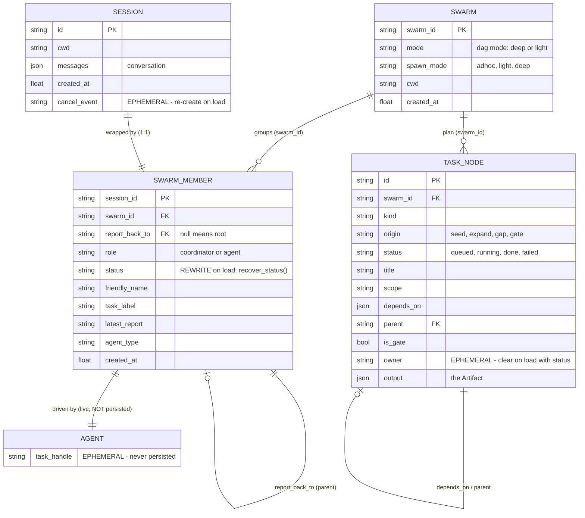

# Building jcode - MVP Learning Plan (Python)
## From one agent to a swarm on a task DAG

> The handbook (`SWARM_HANDBOOK.md`) taught you what jcode's swarm *is*. This
> plan makes you build one. By the end you will have a Python program that
> spawns agents which run genuinely concurrently, talk to each other, and grow
> a task graph that refuses to close until its own reviewers are satisfied.
>
> Language: Python 3.12+ (3.11 is the floor - you need `asyncio.TaskGroup`).
> Typing: real annotations, `Literal` unions, `@dataclass(slots=True)`.
> Validation: Pydantic v2, which also hands you JSON Schema for free.
> Every step cites the real jcode source it is modelled on, so you can always
> go read the production version of what you just wrote.
>
> **This is a port of `JCODE_MVP_LEARNING_PLAN_JS.md`, step-for-step.** Same 44
> steps, same numbering, same file paths (`src/tool_executor.py` where the JS
> plan had `src/toolExecutor.js`). Nothing was dropped in translation. Where
> Python forced a genuine design change rather than a syntax change, the step
> says so in a **PYTHON DIFFERS** box.

---

## THE MINDSET

jcode is ~700K lines of Rust. You are not rebuilding it. You are extracting
the **architecture** and leaving the **language tax** behind.

That distinction is the single most useful thing to hold onto while you build:

```
jcode does this...                         ...because Rust, or because architecture?
-----------------------------------------  ----------------------------------------
Arc<RwLock<HashMap<String, Member>>>       RUST TAX. Many OS threads touch one map.
                                           asyncio runs your coroutines on one
                                           thread. You get a plain dict. Skip it.

JoinSet + CancellationToken                HALF TAX, HALF REAL. asyncio.TaskGroup is
  (RuntimeTaskScope)                       the direct analogue and you should use it.
                                           And Python really does lose a task whose
                                           handle you drop - see Step 13.

InterruptSignal = AtomicBool + Notify,     RUST TAX. Guards a cross-thread lost-wakeup
  plus an enable-before-check race guard   race. asyncio is single-threaded and
                                           task.cancel() already solves this.

report_back_to_session_id forms the tree   ARCHITECTURE. Build it.
Member cap + live-worker budget            ARCHITECTURE. Build it.
Three different fan-in strategies          ARCHITECTURE. Build all three.
DM vs subtree broadcast vs channel         ARCHITECTURE. Build it.
Status snapshot / summary / full read      ARCHITECTURE. Build it.
Task DAG + critique/verify gates           ARCHITECTURE. Build it. This is the point.
```

Roughly 40% of what looks hard in jcode is Rust defending itself against
threads. asyncio hands you most of that for free. What is left - the spawn
tree, the fan-in strategies, the comms topology, and the gated task graph - is
the real design, and all of it is portable.

**One honest amendment for Python.** The JS version of this plan says the
`RuntimeTaskScope` row is pure Rust tax, because a JavaScript promise cannot
vanish once created. That is not true in Python. `asyncio.create_task` returns
a handle the event loop holds only *weakly*; drop your last reference and the
garbage collector may destroy a running task mid-await. jcode's doc comment on
`RuntimeTaskScope` - "accepted work must never discard the handle" - describes
a hazard you will actually hit. Python is closer to Rust here than JavaScript
is, and Step 13 is where it bites.

---

## THE ONE DESIGN RULE THAT DECIDES WHETHER THIS WORKS

Before any code. This is not stylistic - it is the difference between a swarm
that helps and one that produces confidently broken work.

> **Many agents read. One agent writes.**

The failure it prevents is specific: parallel agents make *implicit decisions*
that contradict each other. One worker assumes the config is JSON, another
assumes YAML; each is internally consistent, and the merged result is incoherent
in a way that is hard to debug because no single agent did anything wrong.

The industry converged on this the hard way. Cognition (Devin) published "Don't
Build Multi-Agents" arguing exactly this failure, then revisited it ten months
later with a sharper version: multi-agent works *"when writes stay
single-threaded and the additional agents contribute intelligence rather than
actions."* Anthropic's own research system runs **3-5** subagents, not hundreds -
on a read-heavy research task. Systems that genuinely run 100+ agents use them
for **parallel search**, not collaborative editing.

The shape you are building toward:

```
                 orchestrator (root)
                 - decides
                 - edits files
                 - owns the plan
                        |
       +----------------+----------------+
       |                |                |
   worker            worker            worker
   read/grep         read/grep         read/grep
   reports back      reports back      reports back
```

Step 40 turns this from a convention into something the code enforces, by
handing different tool sets to different roles.

You *can* let workers write - the machinery supports it and jcode allows it.
Just do it knowingly, on tasks touching disjoint files, and expect to spend your
debugging time on merge incoherence rather than on any individual agent.

---

## WHERE PYTHON IS NOT JAVASCRIPT

Read this once now. Five differences, and the first one changes a type
signature you will use in every single step.

### 1. Async generators cannot return a value

This is the only structural change in the whole port.

The JS plan's tool contract is `AsyncGenerator<string, ToolResult>` - it
*yields* progress strings and *returns* a result. Python rejects that outright:

```python
async def execute(self, inp, ctx):
    yield "working..."
    return ToolResult(...)     # SyntaxError: 'return' with value in async generator
```

**The fix, which loses nothing:** yield a tagged union, and let the last item
carry the result.

```python
ToolEvent = Progress | ToolResult      # what execute() yields

async def execute(self, inp, ctx) -> AsyncIterator[ToolEvent]:
    yield Progress("working...")
    yield ToolResult(content="done", is_error=False)   # last item is the result
```

The executor consumes progress as it arrives and keeps the final `ToolResult`.
Same information, same streaming behaviour, one extra `isinstance` check. The
identical treatment applies to `query()` in Step 7, which in JS returned a
`Terminal`.

Why not a plain `async def` with a progress callback? Because the generator is
what makes a tool *suspendable* - the executor drives it one step at a time and
can stop between steps. That property is load-bearing for Step 19's interrupts.

### 2. Task handles get garbage collected

```python
asyncio.create_task(child.run())     # BUG. May be collected mid-flight.
```

The event loop keeps only a weak reference. If nothing else holds the task, the
GC is entitled to destroy it while it is awaiting. This is the exact hazard
jcode's `RuntimeTaskScope` (`crates/jcode-app-core/src/server/runtime.rs:27-79`)
exists to prevent, and unlike in JavaScript, it is real here. Every detached
task in this plan gets stored in a dict (Step 13) or owned by a `TaskGroup`.

### 3. `CancelledError` is a `BaseException`

```python
try:
    result = await tool_call()
except Exception as err:              # correct - does NOT swallow cancellation
    ...
except BaseException:                 # WRONG - eats CancelledError, breaks abort
    ...
```

Cancellation propagates as an exception that deliberately sits *outside*
`Exception` so ordinary error handling cannot eat it. Catch `Exception`, never
bare `except:`. If you must clean up around cancellation, re-raise. Step 6's
executor depends on this.

### 4. Blocking I/O blocks the entire loop

Node's `fs` is async by default; Python's `open()` is not. A synchronous
`Path.read_text()` inside a coroutine stops *every* agent until the disk
answers. For the small files this MVP reads it is survivable, but you will be
measuring concurrency in Step 38 and wondering why the bars do not overlap.

Use `asyncio.to_thread` for file I/O, and `asyncio.create_subprocess_exec` for
processes:

```python
content = await asyncio.to_thread(full.read_text, encoding="utf-8")
```

### 5. The GIL does not matter here

Every agent is waiting on a network socket or a subprocess. That is I/O-bound
work, which asyncio handles on one thread without ever touching the GIL's
limits. You would only care if agents were doing CPU work in-process, and they
are not - they are calling a model.

---

## READ ALONGSIDE: THE HANDBOOK

`SWARM_HANDBOOK.md` explains *why* jcode is built the way it is, with the Rust
walked through chapter by chapter. This plan is the *how*. Read one chapter
before each part:

| Before you build | Read | What it gives you |
|---|---|---|
| Part 0 | Ch 1 - Why parallel agents | Vocabulary: session, member, coordinator, swarm |
| Part 1 | Ch 2 - Anatomy of a spawn | The real spawn path, ancestry, mode gating, member cap |
| Part 2 | Ch 3 - Fan-out / fan-in | The three strategies in jcode's own code, and when each applies |
| Part 2 | Ch 4 - Structured concurrency | Why Rust needs JoinSet + CancellationToken and you need `TaskGroup` |
| Part 3 | Ch 5 - Shared state | Why "no locks" and `RwLock` are both true, at different layers |
| Part 3 | Ch 7 - Communication topology | DM vs subtree vs channel, three read tiers, status-on-reload |
| Part 4 | Ch 6 - The task DAG | Gate machinery, confidence debt, the worked T0-T7 example |
| Part 6 | Ch 8 - Glossary | The pattern -> file -> primitive cheat sheet |

Chapter 6 is worth reading *twice* - once before Part 4 and once after, because
the gate rules only feel inevitable once you have tried to write them yourself.

**One more principle, and it shapes everything after Step 5:** you cannot
learn swarm mechanics if every run costs money and takes ninety seconds. You
will build a deterministic fake model *before* you build the swarm. A twenty
agent run should finish in under a second, offline, with the same result every
time. Real API calls are a flag you flip at the end.

---

## SEQUENCE OF IMPLEMENTATION

<table>
<tr>
<td valign="top" width="55%">

**PART 0** — One agent *(the thing you later swarm)* &nbsp;&nbsp;&nbsp; Handbook Ch1

```
 1. src/types.py                     Message/ContentBlock/QueryEvent unions
 2. src/tool.py                      Tool protocol (async-generator execute)
 3. src/tools/{read,write,bash,grep}  Four real tools
 4. src/api/model.py                 The Model protocol both backends implement
 5. src/api/mock_model.py            Deterministic scripted model  <- before the swarm
 6. src/tool_executor.py             Parallel reads, serialized writes
 7. src/query.py                     The agentic loop
 8. src/session.py                   Session = id + history + cancel scope
```

</td>
<td valign="top" width="45%">

**My notes — how this differs from my use case**

jcode swarms the **same agent** in parallel. My case swarms **different types** of agent in parallel. Artifacts are essentially these agents themselves — created through a curriculum (Voyager-style).

jcode agents differ by *prompt*, not by tools. Every member gets the same tool registry. The `SwarmRole` enum has `Agent`, `Coordinator`, and `Other(String)`, but role is never used to pick a toolset. The only role check in the swarm path is `member.role != "coordinator"` for messaging scope.

My use case is a superset. The seam is already there: **Step 40's `tools_for_member`** — switch on `agent_type` instead of role. ~15 lines:

```python
# src/swarm/types.py
#   agent_type: Literal['researcher','coder','reviewer'] | None

AGENT_TYPES: dict[str, list[Tool]] = {
    "researcher": [READ, GREP, WEB, MESSAGE, GRAPH],
    "coder":      [READ, EDIT, WRITE, BASH, GRAPH],
    "reviewer":   [READ, GREP, BASH, GRAPH],
}

def tools_for_member(member: SwarmMember) -> list[Tool]:
    if member.role == "coordinator":
        return ORCHESTRATOR_TOOLS
    return AGENT_TYPES.get(member.agent_type or "", WORKER_TOOLS)
```

`Swarm.spawn()` passes `agent_type` onto the member; `SpawnTool`'s Pydantic input model gains an `agent_type` field so the orchestrator picks the right specialist. Give each type its own system prompt in `system_prompt_for` — tools define what it *can* do, the prompt defines what it *should*.

</td>
</tr>
</table>

```
PART 1 - One agent becomes many                        Handbook Ch2
 9. src/swarm/types.py               SwarmMember, lifecycle status, role
10. src/swarm/registry.py            The member dict (+ the lock you don't need)
11. src/swarm/ancestry.py            report_back_to edges, depth, subtree walk
12. src/swarm/caps.py                Member cap, worker budget, mode gating
13. src/swarm/swarm.py + tools/spawn.py   The agent-facing spawn
14. src/swarm/lifecycle.py           Completion reports, reparenting on exit

PART 2 - Running them at once                          Handbook Ch3-4
15. src/patterns/plan_fan_out.py     asyncio.gather: planner -> workers -> integrate
16. src/patterns/incremental_drain.py React as each one finishes
17. src/patterns/await_members.py    Event-driven wait with a deadline
18. src/swarm/abort_tree.py          Cancel scopes parent -> child
19. src/swarm/interrupt.py           Soft interrupt at safe points

PART 3 - Talking to each other                         Handbook Ch7
20. src/comms/bus.py                 Event bus + replay buffer
21. src/comms/routing.py             DM vs subtree broadcast vs channel
22. src/comms/reads.py               Snapshot vs summary vs full context
23. src/comms/persist.py             Snapshot, and the rewrite-on-reload trap

PART 4 - The task DAG                                  Handbook Ch6
24. src/dag/types.py                 Mode, NodeKind, gate_kind, NodeOrigin, NodeStatus
25. src/dag/confidence.py            Lenient confidence parsing
26. src/dag/graph.py                 Private nodes, mutations are the only door
27. src/dag/ops.py                   seed, expand_node
28. src/dag/complete.py              complete_node + artifact validation
29. src/dag/gates.py                 Root gate, inject_from_gate, validate_gate_pass
30. src/dag/scheduler.py             ready_nodes, dispatch, assemble_input

PART 5 - Run it and watch it                           Handbook Ch1, Ch8
31. src/runner.py                    The loop that ties Parts 1-4 together
32. src/ui/swarm_view.py             Live member tree (Rich)
33. src/ui/dag_view.py               The graph, seeded vs grown
34. src/demo/multimonitor.py         Fan out -> gate finds gap -> re-synthesize

PART 6 - From demo to daily driver                     what makes it usable
35. src/permissions/rules.py         Real gate  <- BEFORE any real repo
36. src/plan_task.py                 Your task -> seed nodes (the front door)
37. src/cost_tracker.py              What did that run cost
38. src/timeline.py                  Proof the agents actually overlapped
39. src/tools/channel.py             Lets agents join channels
40. src/swarm/roles.py               Enforce single-writer structurally
41. src/tools/graph.py               Agents reshape the plan  <- matches jcode
42. src/compact.py                   Survive long sessions
43. src/cli.py                       Run it on a real repository
44. runner.py + swarm.py             Let it actually change code  <- do not skip
```

**Setup before Step 1:**

```bash
mkdir jcode-mvp && cd jcode-mvp
python3.12 -m venv .venv && source .venv/bin/activate
pip install anthropic pydantic rich
pip install pytest pytest-asyncio
```

`pyproject.toml`:

```toml
[project]
name = "jcode-mvp"
version = "0.1.0"
requires-python = ">=3.11"
dependencies = ["anthropic", "pydantic>=2", "rich"]

[tool.pytest.ini_options]
asyncio_mode = "auto"        # so `async def test_...` just works
```

Then create the package skeleton - Python needs the `__init__.py` files that
JavaScript did not:

```bash
mkdir -p src/{api,tools,swarm,patterns,comms,dag,ui,demo,permissions}
find src -type d -exec touch {}/__init__.py \;
```

Run things as modules, from the repo root:

```bash
python -m src.cli            # not `python src/cli.py`
```

**Why `python -m` and not a direct path.** Running `python src/cli.py` puts
`src/` on the path instead of the repo root, and every `from src.tool import
Tool` fails. `-m` runs it as a package and imports resolve the way the files
are written. If you see `ModuleNotFoundError: No module named 'src'`, this is
why.

**Why the layout matches the JS plan exactly.** `src/tool_executor.py` sits
where `src/toolExecutor.js` sat, so you can read the two documents side by side
and diff the *ideas* rather than hunting for the file. The only systematic
renames are `camelCase` -> `snake_case` for files, functions, and fields. That
rename is a bonus, not a cost: jcode's Rust calls the field
`report_back_to_session_id`, so the Python is closer to the source you are
modelling than the JavaScript was.

---
---

# PART 0 - ONE AGENT

You need something to swarm before you can swarm it. Part 0 is the smallest
agent that can do real work: it streams from a model, calls tools, and loops
until done. If you have built an agent loop before, this is familiar ground -
move fast, but do not skip Step 5.

---

# STEP 1 - `src/types.py`

**What jcode does:** every message, event, and result is a typed enum, and Rust's
compiler enforces which fields exist on which variant.

**Why you want this:** you are about to have a dozen agents emitting events
concurrently. When something goes wrong, the difference between an event whose
shape is written down and one you have to reverse-engineer from a log is the
difference between a five-minute fix and an hour.

**Mental model:** a tagged union is a `match` over a `type` field. The JS plan
had to settle for JSDoc comments that nothing enforced. Python gives you the
real thing - frozen dataclasses in a union, and `match` statements that a type
checker can prove exhaustive.

**What to write:**

```python
# src/types.py
#
# The JS version of this file was comments. This one is executable. Every
# union below is a real discriminated union: `match` on `.type` and your type
# checker narrows the branch for you.

from __future__ import annotations

from dataclasses import dataclass, field
from typing import Any, Literal, TypeAlias

# --- Content blocks -------------------------------------------------------


@dataclass(slots=True)
class TextBlock:
    text: str
    type: Literal["text"] = "text"


@dataclass(slots=True)
class ToolUseBlock:
    id: str
    name: str
    input: dict[str, Any]
    type: Literal["tool_use"] = "tool_use"


@dataclass(slots=True)
class ToolResultBlock:
    tool_use_id: str
    content: str
    is_error: bool = False
    type: Literal["tool_result"] = "tool_result"


ContentBlock: TypeAlias = TextBlock | ToolUseBlock | ToolResultBlock

# --- Messages -------------------------------------------------------------


@dataclass(slots=True)
class UserMessage:
    content: str | list[ContentBlock]
    role: Literal["user"] = "user"


@dataclass(slots=True)
class AssistantMessage:
    content: list[ContentBlock]
    role: Literal["assistant"] = "assistant"


Message: TypeAlias = UserMessage | AssistantMessage

# --- Usage and termination ------------------------------------------------


@dataclass(slots=True)
class Usage:
    input_tokens: int = 0
    output_tokens: int = 0

    def add(self, other: Usage) -> None:
        """Accumulate in place. The query loop sums across turns."""
        self.input_tokens += other.input_tokens
        self.output_tokens += other.output_tokens


StopReason: TypeAlias = Literal["end_turn", "tool_use", "max_tokens"]


@dataclass(slots=True)
class Terminal:
    reason: Literal["end_turn", "max_turns", "aborted", "error"]
    usage: Usage
    error_message: str | None = None


# --- Events the query loop emits ------------------------------------------


@dataclass(slots=True)
class TextEvent:
    session_id: str
    text: str
    type: Literal["text"] = "text"


@dataclass(slots=True)
class ToolStartEvent:
    session_id: str
    tool_use_id: str
    name: str
    description: str
    type: Literal["tool_start"] = "tool_start"


@dataclass(slots=True)
class ToolResultEvent:
    session_id: str
    tool_use_id: str
    content: str
    is_error: bool
    type: Literal["tool_result"] = "tool_result"


@dataclass(slots=True)
class TurnEndEvent:
    session_id: str
    usage: Usage
    type: Literal["turn_end"] = "turn_end"


@dataclass(slots=True)
class TerminalEvent:
    """The last thing query() yields.

    In JavaScript, `query()` was an AsyncGenerator that *returned* a Terminal.
    Python async generators cannot return values, so the terminal arrives as a
    final event instead. See "WHERE PYTHON IS NOT JAVASCRIPT #1".
    """

    session_id: str
    terminal: Terminal
    type: Literal["terminal"] = "terminal"


QueryEvent: TypeAlias = (
    TextEvent | ToolStartEvent | ToolResultEvent | TurnEndEvent | TerminalEvent
)
```

**Why `session_id` is on every event:** in Part 1 these events start arriving
from many agents at once. If an event does not say who emitted it, the UI
cannot attribute it and you will be adding this field back under pressure.
Put it in now.

**Why `type` is last with a default.** Dataclass fields with defaults must come
after fields without them. Putting the discriminant last with a default value
means you write `TextBlock("hello")` rather than `TextBlock("text", "hello")`,
while `match block: case TextBlock():` still works and JSON round-trips keep
the tag. It looks upside-down compared to the JS object literal; that is the
only reason.

**A note on `slots=True`.** It makes each instance a fixed set of attributes
instead of a dict - faster, smaller, and it turns a typo like
`ev.sesion_id = x` into an immediate `AttributeError` rather than a silently
ignored write. With twenty agents emitting events, take the free bug detector.

---

# STEP 2 - `src/tool.py`

**What jcode does:** every tool declares its own concurrency and interrupt
semantics, and the batch executor reads those declarations when it decides
what may overlap (`crates/jcode-app-core/src/tool/batch.rs:282-295`).

**Why it is shaped this way:** the executor cannot know whether two tool calls
can safely overlap - only the tool author knows. Two reads are fine. Two edits
to the same file are corruption. So the tool declares it and the executor obeys.

**Mental model:** a tool is not just a function. It is a function plus a safety
contract.

> ### PYTHON DIFFERS — the execute signature
>
> JavaScript: `execute(input, ctx): AsyncGenerator<string, ToolResult>`
> — yields progress strings, **returns** the result.
>
> Python: `execute(input, ctx) -> AsyncIterator[Progress | ToolResult]`
> — yields progress, and the **last yielded item** is the result.
>
> The executor in Step 6 keeps the last `ToolResult` it sees. A tool that
> yields no `ToolResult` at all is a bug, and the executor reports it as one
> rather than silently returning nothing.

**What to write:**

```python
# src/tool.py
from __future__ import annotations

from dataclasses import dataclass
from typing import (
    TYPE_CHECKING,
    Any,
    AsyncIterator,
    Literal,
    Protocol,
    TypeAlias,
    runtime_checkable,
)

from pydantic import BaseModel

if TYPE_CHECKING:
    import asyncio

    from .session import Session


@dataclass(slots=True)
class Progress:
    """Human-readable progress. Shown in the UI, never sent to the model."""

    text: str


@dataclass(slots=True)
class ToolResult:
    """The value the model sees. The last thing a tool yields."""

    content: str
    is_error: bool = False


ToolEvent: TypeAlias = Progress | ToolResult


@dataclass(slots=True)
class ToolContext:
    session: Session
    cancel: asyncio.Event
    """Set when this session is being torn down. Long-running tools poll it."""
    cwd: str


@runtime_checkable
class Tool(Protocol):
    """A tool is a function plus a safety contract.

    A Protocol, not a base class: anything with these attributes *is* a Tool.
    No inheritance, no registration - which is what let the JS version use bare
    object literals.
    """

    name: str

    @property
    def input_model(self) -> type[BaseModel]:
        """Pydantic model for this tool's arguments. Validates AND generates
        the JSON Schema the model API needs."""
        ...

    @property
    def interrupt_behavior(self) -> Literal["cancel", "block"]:
        """On interrupt: kill it, or let it finish?"""
        ...

    def description(self, inp: Any) -> str:
        """Dynamic: describes THIS call, not the tool in general."""
        ...

    def is_concurrency_safe(self, inp: Any) -> bool:
        """Can two calls to this tool overlap in time?"""
        ...

    def execute(self, inp: Any, ctx: ToolContext) -> AsyncIterator[ToolEvent]:
        """Yields Progress; the final yielded ToolResult is the outcome."""
        ...


def find_tool(tools: list[Tool], name: str) -> Tool | None:
    return next((t for t in tools if t.name == name), None)
```

**Why `description` is a function:** when a status line says "Bash", that is
useless. When it says "Bash: pytest -x tests/", you can actually supervise it.
jcode makes the same choice, and it matters far more once twenty agents are
each running something.

**Why `interrupt_behavior` is per-tool, not global:** cancelling a bash command
kills a process, which is recoverable. Cancelling halfway through a file write
leaves a truncated file on disk, which is not. Only the tool author knows which
is which.

**Why a `Protocol` and not an abstract base class.** The JS plan used plain
object literals with no class anywhere. `Protocol` preserves that: your tools
are small classes (or module-level singletons) that simply *have* the right
attributes. Nothing inherits, nothing registers, and a type checker still
verifies the shape at every call site. `runtime_checkable` additionally lets
`isinstance(x, Tool)` work if you ever want a startup assertion.

**The matrix you will fill in at Step 3:**

| Tool  | interrupt_behavior | is_concurrency_safe | Why |
|-------|--------------------|---------------------|-----|
| read  | block              | True                | Reads never conflict |
| grep  | cancel             | True                | Pure and idempotent, safe to kill |
| write | block              | False               | Never interrupt or overlap a write |
| bash  | cancel             | False               | Killable; side effects prevent overlap |

---

# STEP 3 - `src/tools/*.py`

Five short files, then a package export.

Each tool is a module-level singleton - one instance, created at import, shared
by every agent. They hold no per-call state (everything arrives in `inp` and
`ctx`), so sharing them across twenty concurrent members is safe.

```python
# src/tools/read.py
from __future__ import annotations

import asyncio
from pathlib import Path
from typing import AsyncIterator, Literal

from pydantic import BaseModel, Field

from ..tool import Progress, ToolContext, ToolEvent, ToolResult


class ReadInput(BaseModel):
    path: str = Field(description="File to read, relative to the working directory")


class _ReadTool:
    name = "read"
    input_model = ReadInput
    interrupt_behavior: Literal["cancel", "block"] = "block"

    def description(self, inp: ReadInput) -> str:
        return f"Read {inp.path}"

    def is_concurrency_safe(self, inp: ReadInput) -> bool:
        return True

    async def execute(self, inp: ReadInput, ctx: ToolContext) -> AsyncIterator[ToolEvent]:
        full = Path(ctx.cwd) / inp.path
        try:
            # to_thread, not full.read_text(): a sync read blocks every other
            # agent on this event loop until the disk answers.
            content = await asyncio.to_thread(full.read_text, encoding="utf-8")
            yield ToolResult(content=content)
        except OSError as err:
            yield ToolResult(f"Cannot read {inp.path}: {err}", is_error=True)


ReadTool = _ReadTool()
```

```python
# src/tools/write.py
from __future__ import annotations

import asyncio
from pathlib import Path
from typing import AsyncIterator, Literal

from pydantic import BaseModel

from ..tool import ToolContext, ToolEvent, ToolResult


class WriteInput(BaseModel):
    path: str
    content: str


class _WriteTool:
    name = "write"
    input_model = WriteInput
    interrupt_behavior: Literal["cancel", "block"] = "block"

    def description(self, inp: WriteInput) -> str:
        return f"Write {inp.path} ({len(inp.content)} bytes)"

    def is_concurrency_safe(self, inp: WriteInput) -> bool:
        return False

    async def execute(self, inp: WriteInput, ctx: ToolContext) -> AsyncIterator[ToolEvent]:
        full = Path(ctx.cwd) / inp.path

        def _write() -> None:
            full.parent.mkdir(parents=True, exist_ok=True)
            full.write_text(inp.content, encoding="utf-8")

        await asyncio.to_thread(_write)
        yield ToolResult(f"Wrote {inp.path}")


WriteTool = _WriteTool()
```

```python
# src/tools/bash.py
from __future__ import annotations

import asyncio
from typing import AsyncIterator, Literal

from pydantic import BaseModel

from ..tool import Progress, ToolContext, ToolEvent, ToolResult


class BashInput(BaseModel):
    command: str
    timeout_ms: int | None = None


class _BashTool:
    name = "bash"
    input_model = BashInput
    interrupt_behavior: Literal["cancel", "block"] = "cancel"

    def description(self, inp: BashInput) -> str:
        return f"Bash: {inp.command[:80]}"

    def is_concurrency_safe(self, inp: BashInput) -> bool:
        return False

    async def execute(self, inp: BashInput, ctx: ToolContext) -> AsyncIterator[ToolEvent]:
        timeout = (inp.timeout_ms or 30_000) / 1000
        yield Progress(f"running: {inp.command[:60]}")

        proc = await asyncio.create_subprocess_exec(
            "bash", "-c", inp.command,
            cwd=ctx.cwd,
            stdout=asyncio.subprocess.PIPE,
            stderr=asyncio.subprocess.STDOUT,
        )

        try:
            out, _ = await asyncio.wait_for(proc.communicate(), timeout=timeout)
        except asyncio.TimeoutError:
            proc.terminate()
            await proc.wait()
            yield ToolResult(f"Timed out after {timeout:.0f}s", is_error=True)
            return
        except asyncio.CancelledError:
            # Cancellation is a BaseException. Kill the child, then re-raise -
            # swallowing it here would leave the query loop thinking the tool
            # completed normally.
            proc.kill()
            await proc.wait()
            raise

        text = out.decode("utf-8", errors="replace").strip()
        yield ToolResult(text or "(no output)", is_error=proc.returncode != 0)


BashTool = _BashTool()
```

```python
# src/tools/grep.py
from __future__ import annotations

import asyncio
from typing import AsyncIterator, Literal

from pydantic import BaseModel

from ..tool import ToolContext, ToolEvent, ToolResult


class GrepInput(BaseModel):
    pattern: str
    path: str | None = None


class _GrepTool:
    name = "grep"
    input_model = GrepInput
    interrupt_behavior: Literal["cancel", "block"] = "cancel"

    def description(self, inp: GrepInput) -> str:
        return f'Grep "{inp.pattern}" in {inp.path or "."}'

    def is_concurrency_safe(self, inp: GrepInput) -> bool:
        return True

    async def execute(self, inp: GrepInput, ctx: ToolContext) -> AsyncIterator[ToolEvent]:
        proc = await asyncio.create_subprocess_exec(
            "grep", "-rn", inp.pattern, inp.path or ".",
            cwd=ctx.cwd,
            stdout=asyncio.subprocess.PIPE,
            stderr=asyncio.subprocess.DEVNULL,
        )
        try:
            out, _ = await proc.communicate()
        except asyncio.CancelledError:
            proc.kill()
            await proc.wait()
            raise

        lines = [ln for ln in out.decode("utf-8", errors="replace").split("\n") if ln][:50]
        yield ToolResult("\n".join(lines) or "(no matches)")


GrepTool = _GrepTool()
```

```python
# src/tools/__init__.py
from .bash import BashTool
from .edit import EditTool
from .grep import GrepTool
from .read import ReadTool
from .write import WriteTool

BASE_TOOLS = [ReadTool, WriteTool, EditTool, BashTool, GrepTool]

__all__ = ["BASE_TOOLS", "ReadTool", "WriteTool", "EditTool", "BashTool", "GrepTool"]
```

**One more tool, and it is the difference between a demo and something you would
actually use.** `WriteTool` replaces a whole file. On a 2,000-line source file
that means the model reproduces all 2,000 lines to change three of them - slow,
expensive, and it *will* silently drop code on the way through. Real coding
agents edit by replacing an exact substring:

```python
# src/tools/edit.py
from __future__ import annotations

import asyncio
from pathlib import Path
from typing import AsyncIterator, Literal

from pydantic import BaseModel, Field

from ..tool import ToolContext, ToolEvent, ToolResult


class EditInput(BaseModel):
    path: str
    old_string: str = Field(description="Exact text to replace, including whitespace")
    new_string: str = Field(description="Replacement text")


class _EditTool:
    name = "edit"
    input_model = EditInput
    interrupt_behavior: Literal["cancel", "block"] = "block"

    def description(self, inp: EditInput) -> str:
        return f"Edit {inp.path}"

    def is_concurrency_safe(self, inp: EditInput) -> bool:
        return False

    async def execute(self, inp: EditInput, ctx: ToolContext) -> AsyncIterator[ToolEvent]:
        full = Path(ctx.cwd) / inp.path
        before = await asyncio.to_thread(full.read_text, encoding="utf-8")
        occurrences = before.count(inp.old_string)

        # Refusing ambiguity is the whole value. A model that edits the wrong
        # one of three matches produces a bug that looks like it came from
        # nowhere.
        if occurrences == 0:
            yield ToolResult(
                f"No match in {inp.path}. The file may have changed since you read it - "
                f"read it again and copy the exact text including indentation.",
                is_error=True,
            )
            return
        if occurrences > 1:
            yield ToolResult(
                f"old_string appears {occurrences} times in {inp.path}. "
                f"Include more surrounding lines so it matches exactly once.",
                is_error=True,
            )
            return

        after = before.replace(inp.old_string, inp.new_string, 1)
        await asyncio.to_thread(full.write_text, after, encoding="utf-8")
        yield ToolResult(f"Edited {inp.path}")


EditTool = _EditTool()
```

Note it yields an error *message* rather than raising when the match is
ambiguous - the model reads that string and retries with more context. That is
the same errors-are-control-flow idea you will meet again in the Part 4 gates.

**Note on `ctx.cancel` and cancellation.** In JavaScript every tool threaded an
`AbortSignal` through by hand. Python gives you two mechanisms and you want
both:

- **`asyncio.CancelledError`** does the work for free. When Step 18 cancels a
  member's task, every `await` inside its tools raises. That is why `bash` and
  `grep` catch it, kill their child process, and **re-raise**. Catching without
  re-raising is the single most common asyncio bug.
- **`ctx.cancel`** (an `asyncio.Event`) is for cooperative checks inside long
  loops that never await anything cancellable - `if ctx.cancel.is_set(): break`.

This pair is the whole of what jcode needs `InterruptSignal`
(`crates/jcode-agent-runtime/src/lib.rs:32-40`) and its lost-wakeup race guard
(`:92-106`) for. That guard exists because Rust's atomic flag and its notifier
are two separate objects that can be observed out of order across threads.
asyncio has one thread and one loop, so the race cannot occur.

---

# STEP 4 - `src/api/model.py`

**What jcode does:** providers sit behind one interface
(`crates/jcode-provider-core/`), so Anthropic, OpenAI, Gemini and the rest are
interchangeable. You need exactly two implementations: real, and fake.

**Mental model:** the loop should not know or care whether tokens arrive from a
network socket or a list literal.

```python
# src/api/model.py
from __future__ import annotations

from dataclasses import dataclass, field
from typing import Any, AsyncIterator, Literal, Protocol, TypeAlias

from ..types import Message, StopReason, ToolUseBlock, Usage


@dataclass(slots=True)
class ToolSchema:
    name: str
    description: str
    input_schema: dict[str, Any]


@dataclass(slots=True)
class StreamParams:
    system: str
    messages: list[Message]
    tools: list[ToolSchema]


@dataclass(slots=True)
class TextDelta:
    text: str
    type: Literal["text_delta"] = "text_delta"


@dataclass(slots=True)
class ToolUseEvent:
    block: ToolUseBlock
    type: Literal["tool_use"] = "tool_use"


@dataclass(slots=True)
class DoneEvent:
    stop_reason: StopReason
    usage: Usage
    type: Literal["done"] = "done"


ModelEvent: TypeAlias = TextDelta | ToolUseEvent | DoneEvent


class Model(Protocol):
    """Both the real client and the mock implement this."""

    name: str

    def stream(self, params: StreamParams) -> AsyncIterator[ModelEvent]:
        ...
```

**Where did the `signal` parameter go?** The JS `StreamParams` carried an
`AbortSignal` because that is the only way to cancel a `fetch`. In Python,
cancelling the task that is awaiting the stream raises `CancelledError` inside
it and the HTTP client tears the connection down on the way out. The parameter
would be redundant, so it is gone. This is the first of several places where
the Python version is *smaller* than the JavaScript one for structural reasons,
not because something was skipped.

---

# STEP 5 - `src/api/mock_model.py` - do not skip this

**What jcode does:** nothing like this. This is the one place the MVP is
deliberately better than the real thing for learning purposes.

**Why it exists:** you are about to debug ten agents interleaving. If each run
costs money, takes ninety seconds, and makes slightly different choices every
time, you will not iterate - you will guess. A scripted model turns a swarm run
into a unit test: instant, free, identical every time.

**Mental model:** a fixture. The mock is not pretending to be smart. It replays
a decision transcript you wrote, so the *machinery* is what is under test.

```python
# src/api/mock_model.py
from __future__ import annotations

import asyncio
import itertools
from dataclasses import dataclass, field
from typing import Any, AsyncIterator, Callable

from ..types import ToolUseBlock, Usage
from .model import DoneEvent, ModelEvent, StreamParams, TextDelta, ToolUseEvent


@dataclass(slots=True)
class ScriptedTurn:
    """One scripted turn: some text, then zero or more tool calls."""

    text: str | None = None
    tool_calls: list[tuple[str, dict[str, Any]]] = field(default_factory=list)


# Called once per turn. `turn_index` starts at 0 and increments, so the script
# advances naturally as the loop runs. `params` lets a script branch on what
# the conversation looks like so far.
Script = Callable[[int, StreamParams], ScriptedTurn]

_ids = itertools.count(1)


class MockModel:
    name = "mock"

    def __init__(self, script: Script, latency_ms: int = 0) -> None:
        self._script = script
        self._latency = latency_ms / 1000
        self._turn = 0

    async def stream(self, params: StreamParams) -> AsyncIterator[ModelEvent]:
        turn = self._script(self._turn, params)
        self._turn += 1

        if self._latency > 0:
            await asyncio.sleep(self._latency)

        if turn.text:
            # Emit in chunks so streaming code paths actually get exercised.
            for i in range(0, len(turn.text), 40):
                yield TextDelta(turn.text[i : i + 40])

        for name, inp in turn.tool_calls:
            yield ToolUseEvent(
                ToolUseBlock(id=f"mock_tool_{next(_ids)}", name=name, input=inp)
            )

        yield DoneEvent(
            stop_reason="tool_use" if turn.tool_calls else "end_turn",
            usage=Usage(input_tokens=100, output_tokens=50),
        )
```

**Give the mock a small latency (5-30ms) whenever you are testing the swarm.**
This matters *more* in Python than it did in JavaScript. With `latency_ms=0`
there is no `await` that actually suspends, so a coroutine can run start to
finish without ever yielding to the event loop - your "parallel" agents execute
strictly one after another, you never observe interleaving, and you go chasing
a bug that does not exist. `await asyncio.sleep(0.01)` forces a real suspension
point and makes concurrency visible.

**Note the counter is module-level, not per-instance.** Every mock model in a
run draws tool-use ids from one sequence, so ids stay unique when twenty
members each hold their own `MockModel`. Per-instance counters would collide
and you would spend an afternoon on it.

---

# STEP 6 - `src/tool_executor.py`

**What jcode does:** runs a turn's tool calls concurrently with
`FuturesUnordered`, building the set at
`crates/jcode-app-core/src/tool/batch.rs:282-295` and draining it as results
land at `:300-317`.

**The rule you are implementing:** concurrency-safe tools run in parallel,
everything else is serialized through one lock, and results come back in the
order the model asked for them regardless of finish order.

**Mental model:** a bouncer. Reads go straight in as a group. Writes queue at
the door, one at a time.

```python
# src/tool_executor.py
from __future__ import annotations

import asyncio
from dataclasses import dataclass
from typing import Callable

from pydantic import ValidationError

from .tool import Progress, Tool, ToolContext, ToolResult, find_tool
from .types import ToolUseBlock


@dataclass(slots=True)
class ExecutedCall:
    tool_use_id: str
    name: str
    result: ToolResult


async def execute_tool_calls(
    blocks: list[ToolUseBlock],
    tools: list[Tool],
    ctx: ToolContext,
    on_progress: Callable[[str, str], None] | None = None,
) -> list[ExecutedCall]:
    # One shared lock that unsafe tools queue on. asyncio.Lock is FIFO, so
    # writes execute in the order the model asked for them.
    write_lock = asyncio.Lock()

    async def drive(tool: Tool, parsed, block: ToolUseBlock) -> ToolResult:
        """Run the generator to completion; the last ToolResult wins."""
        last: ToolResult | None = None
        try:
            async for ev in tool.execute(parsed, ctx):
                if isinstance(ev, Progress):
                    if on_progress:
                        on_progress(block.id, ev.text)
                else:
                    last = ev
        except asyncio.CancelledError:
            # BaseException, deliberately not caught by `except Exception`.
            # 'cancel' tools are meant to die here; 'block' tools should not
            # have been cancelled in the first place.
            raise
        except Exception as err:
            return ToolResult(f"Error: {err!r}", is_error=True)

        if last is None:
            return ToolResult(
                f"Tool {tool.name} finished without producing a result", is_error=True
            )
        return last

    async def run_one(block: ToolUseBlock) -> ExecutedCall:
        tool = find_tool(tools, block.name)
        if tool is None:
            return ExecutedCall(
                block.id, block.name, ToolResult(f"Unknown tool: {block.name}", True)
            )

        try:
            parsed = tool.input_model.model_validate(block.input)
        except ValidationError as err:
            # The model reads this. Pydantic's message names the bad field and
            # what it expected, which is exactly what a retry needs.
            return ExecutedCall(
                block.id, block.name, ToolResult(f"Invalid input: {err}", True)
            )

        if tool.is_concurrency_safe(parsed):
            return ExecutedCall(block.id, block.name, await drive(tool, parsed, block))

        # Not concurrency-safe: hold the lock so only one runs at a time.
        async with write_lock:
            return ExecutedCall(block.id, block.name, await drive(tool, parsed, block))

    # Start them all. Ordering is restored by gather, not by finish order.
    return await asyncio.gather(*(run_one(b) for b in blocks))
```

**The subtle bit worth understanding:** `asyncio.gather` preserves *input* order
in its results even though the coroutines complete in whatever order they
finish. That is why the model always sees `tool_result` blocks matching the
order it asked, while reads still genuinely overlap in time. Same guarantee
`Promise.all` gave the JS version.

> ### PYTHON DIFFERS — the serialization primitive
>
> JavaScript had no lock, so the JS plan chained unsafe tools onto a shared
> promise: `writeQueue = writeQueue.then(invoke)`. That works, but it is a lock
> built out of promises, and it needs a `.catch(() => {})` so one failed write
> does not poison the chain for every later one.
>
> Python has `asyncio.Lock`, which is FIFO and releases on exception. `async
> with write_lock:` is the same guarantee in one line with no failure mode to
> remember. This is the rare case where the Python is both shorter and safer.

> ### PYTHON DIFFERS — where the interrupt race went
>
> The JS executor raced each concurrency-safe `'cancel'` tool against an
> abort promise, because a JavaScript promise cannot be cancelled - you can
> only stop waiting for it. That whole block is gone here. Cancelling the task
> raises `CancelledError` *inside* the tool at its next await, which is why
> `bash` and `grep` can kill their subprocess on the way out. The JS version
> abandoned the tool and left the process running.
>
> One consequence to keep straight: `interrupt_behavior` is still meaningful,
> but Step 18 enforces it at the task level (which members get cancelled)
> rather than the executor enforcing it per call.

**Why `except Exception` and not bare `except`.** A bare `except:` catches
`CancelledError` too, converts your cancellation into a normal-looking error
result, and the query loop cheerfully continues to the next turn. The swarm
then refuses to shut down and you will not find out why quickly. Catch
`Exception`; let `BaseException` through.

---

# STEP 7 - `src/query.py`

**What jcode does:** a turn loop that streams, executes tools, appends the
results, and loops until the model stops asking for tools.

**Mental model:** `while model wants tools: run them; hand results back`.
Everything else in a production agent - budgets, compaction, retries - hangs off
this skeleton. You are building the skeleton.

> ### PYTHON DIFFERS — no return value
>
> JS: `AsyncGenerator<QueryEvent, Terminal>` - the caller did
> `step = await gen.next()` in a loop and read `step.value` when `step.done`.
>
> Python: `AsyncIterator[QueryEvent]` where the final event is a
> `TerminalEvent`. Callers `async for` normally and keep the last one. Every
> caller in Parts 1-6 uses the `run_to_completion` helper at the bottom of this
> step, so the pattern appears exactly once.

```python
# src/query.py
from __future__ import annotations

import asyncio
from dataclasses import dataclass, field
from typing import TYPE_CHECKING, AsyncIterator

from .api.model import DoneEvent, Model, StreamParams, TextDelta, ToolSchema, ToolUseEvent
from .tool import Tool, ToolContext, find_tool
from .tool_executor import execute_tool_calls
from .types import (
    AssistantMessage,
    ContentBlock,
    QueryEvent,
    Terminal,
    TerminalEvent,
    TextBlock,
    TextEvent,
    ToolResultBlock,
    ToolResultEvent,
    ToolStartEvent,
    ToolUseBlock,
    TurnEndEvent,
    Usage,
    UserMessage,
)

if TYPE_CHECKING:
    from .session import Session
    from .swarm.swarm import Swarm


@dataclass(slots=True)
class QueryParams:
    session: Session
    model: Model
    tools: list[Tool]
    system_prompt: str
    max_turns: int = 20
    swarm: Swarm | None = None
    """Only swarm-aware tools use it. Threaded through from Step 13."""


def tool_schemas(tools: list[Tool]) -> list[ToolSchema]:
    return [
        ToolSchema(
            name=t.name,
            description=t.input_model.__doc__ or t.name,
            # This one line replaces the entire hand-rolled zod->JSON Schema
            # converter the JS plan needed (its src/api/schema.js).
            input_schema=t.input_model.model_json_schema(),
        )
        for t in tools
    ]


async def query(params: QueryParams) -> AsyncIterator[QueryEvent]:
    session = params.session
    total = Usage()
    turns = 0

    while True:
        if session.cancel.is_set():
            yield TerminalEvent(session.id, Terminal("aborted", total))
            return
        if turns >= params.max_turns:
            yield TerminalEvent(session.id, Terminal("max_turns", total))
            return
        turns += 1

        tool_uses: list[ToolUseBlock] = []
        text = ""
        stop_reason = "end_turn"

        async for ev in params.model.stream(
            StreamParams(
                system=params.system_prompt,
                messages=session.messages,
                tools=tool_schemas(params.tools),
            )
        ):
            match ev:
                case TextDelta():
                    text += ev.text
                    yield TextEvent(session.id, ev.text)
                case ToolUseEvent():
                    tool_uses.append(ev.block)
                case DoneEvent():
                    stop_reason = ev.stop_reason
                    total.add(ev.usage)

        blocks: list[ContentBlock] = []
        if text:
            blocks.append(TextBlock(text))
        blocks.extend(tool_uses)

        session.messages.append(AssistantMessage(content=blocks))
        yield TurnEndEvent(session.id, Usage(total.input_tokens, total.output_tokens))

        if not tool_uses or stop_reason == "end_turn":
            yield TerminalEvent(session.id, Terminal("end_turn", total))
            return

        for b in tool_uses:
            tool = find_tool(params.tools, b.name)
            desc = b.name
            if tool is not None:
                try:
                    desc = tool.description(tool.input_model.model_validate(b.input))
                except Exception:
                    pass  # bad input is reported by the executor, not here
            yield ToolStartEvent(session.id, b.id, b.name, desc)

        executed = await execute_tool_calls(
            tool_uses,
            params.tools,
            ToolContext(session=session, cancel=session.cancel, cwd=session.cwd),
        )

        for e in executed:
            yield ToolResultEvent(
                session.id, e.tool_use_id, e.result.content, e.result.is_error
            )

        session.messages.append(
            UserMessage(
                content=[
                    ToolResultBlock(e.tool_use_id, e.result.content, e.result.is_error)
                    for e in executed
                ]
            )
        )


async def run_to_completion(
    params: QueryParams,
    on_event: Callable[[QueryEvent], None] | None = None,
) -> Terminal:
    """Drive query() to its end and hand back the Terminal.

    This is the helper that makes the missing return value a non-issue. Every
    later step calls this rather than iterating query() by hand.
    """
    terminal = Terminal("error", Usage(), "query produced no terminal event")
    async for ev in query(params):
        if on_event:
            on_event(ev)
        if isinstance(ev, TerminalEvent):
            terminal = ev.terminal
    return terminal
```

Add `from typing import Callable` to the imports at the top - it is used by the
helper.

**`src/api/schema.py` does not exist in this port.** The JS plan needed a
hand-written Zod-to-JSON-Schema converter (its Step 7 appendix) that handled
only flat object schemas. `BaseModel.model_json_schema()` does the whole job,
including nested models, enums, and `Field(description=...)` text that reaches
the model as documentation. That is why every tool's input is a Pydantic model
rather than a dataclass: the schema is not a second thing you maintain.

**Why `match` and not `if ev.type == ...`.** Both work. `match` on the class
lets a type checker narrow `ev` inside each branch, so `ev.text` is checked in
the `TextDelta` arm and would be an error in the `DoneEvent` arm. That is the
static guarantee the JS plan's JSDoc unions could only ask for politely.

---

# STEP 8 - `src/session.py`

**What jcode does:** a session is the unit a swarm member wraps. Spawning an
agent means creating a session and attaching an agent to it
(`crates/jcode-app-core/src/server/comm_session.rs:557-827`).

**Mental model:** the session is *identity and memory*; the query loop is
*behaviour*. Keeping them apart is exactly what makes spawning easy later - a
new agent is just a new session handed to the same loop.

```python
# src/session.py
from __future__ import annotations

import asyncio
import itertools
import random
import string
import time
from dataclasses import dataclass, field

from .types import Message, UserMessage

SessionId = str

_seq = itertools.count(1)


def _new_id() -> str:
    suffix = "".join(random.choices(string.ascii_lowercase + string.digits, k=5))
    return f"s{next(_seq)}_{suffix}"


@dataclass(slots=True)
class Session:
    id: SessionId
    cwd: str
    messages: list[Message] = field(default_factory=list)
    cancel: asyncio.Event = field(default_factory=asyncio.Event)
    created_at: float = field(default_factory=time.time)
    _children: list[asyncio.Event] = field(default_factory=list, repr=False)

    def cancel_tree(self) -> None:
        """Cancel this session and every descendant created under it."""
        self.cancel.set()
        for child in self._children:
            child.set()


def create_session(
    cwd: str,
    prompt: str | None = None,
    parent: Session | None = None,
) -> Session:
    session = Session(id=_new_id(), cwd=cwd)

    if prompt:
        session.messages.append(UserMessage(content=prompt))

    # Cancellation flows downhill: cancelling a parent cancels every descendant.
    if parent is not None:
        if parent.cancel.is_set():
            session.cancel.set()
        else:
            parent._children.append(session.cancel)

    return session
```

> ### PYTHON DIFFERS — no AbortController
>
> JS built the parent->child cancellation chain with
> `parentSignal.addEventListener('abort', ...)`. Python has no event-listener
> model on `asyncio.Event`, so the parent keeps a list of its children's events
> and sets them directly. Same semantics, and `cancel_tree()` makes the intent
> explicit at the call site.
>
> Note this handles *cooperative* cancellation - the flag a running loop
> checks. Step 18 adds the other half: actually cancelling the `asyncio.Task`
> so an agent blocked on a model call dies immediately rather than at its next
> turn boundary. You need both, and the JS version needed both too.

**Checkpoint - Part 0 works.** Create `scratch.py` at the repo root and run
`python -m scratch`:

```python
# scratch.py
import asyncio

from src.api.mock_model import MockModel, ScriptedTurn
from src.query import QueryParams, query
from src.session import create_session
from src.tools import BASE_TOOLS
from src.types import TerminalEvent


def script(turn: int, params) -> ScriptedTurn:
    if turn == 0:
        return ScriptedTurn(
            text="Let me look.",
            tool_calls=[("bash", {"command": "echo hello"})],
        )
    return ScriptedTurn(text="The command printed hello.")


async def main() -> None:
    session = create_session(cwd=".", prompt="Say hello via bash")
    params = QueryParams(
        session=session,
        model=MockModel(script),
        tools=BASE_TOOLS,
        system_prompt="You are helpful.",
    )

    async for ev in query(params):
        if isinstance(ev, TerminalEvent):
            print("TERMINAL", ev.terminal)
        else:
            print(ev)


asyncio.run(main())
```

You should see a `ToolStartEvent`, a `ToolResultEvent` whose content is
`hello`, and a terminal of `end_turn`.

**Do not continue until this runs.** Everything in Parts 1-5 assumes this loop
works.

**If you get `ModuleNotFoundError: No module named 'src'`**, you ran
`python scratch.py`. Use `python -m scratch` from the repo root, or add an
empty `src/__init__.py` if the setup step's `find` missed it.

---
---

# PART 1 - ONE AGENT BECOMES MANY

Here is the whole trick, stated once: **a swarm member is a session plus a
sticky note saying who to report back to.** There is no Agent class, no actor
framework, no scheduler thread. jcode's entire spawn tree is reconstructed by
following one string field. Once that lands, Part 1 is bookkeeping.

---

# STEP 9 - `src/swarm/types.py`

**What jcode does:** members live in a registry keyed by session id, each
carrying status, role, and crucially `report_back_to_session_id`. You can see
the member being inserted with exactly these fields at
`crates/jcode-app-core/src/server/comm_session.rs:502-519`.

**The one field that matters:** `report_back_to`. jcode does not store a tree.
It stores one parent pointer per member and *derives* ancestry, depth, and
subtree membership by walking those pointers. That single choice is why
reparenting (Step 14) is cheap, and why there is no second copy of the tree
that can silently drift out of sync.

```python
# src/swarm/types.py
from __future__ import annotations

import time
from dataclasses import dataclass, field
from typing import Literal, TypeAlias

from ..session import SessionId

SwarmId: TypeAlias = str

MemberStatus: TypeAlias = Literal[
    "spawned",    # session exists, not started
    "ready",      # has scope, waiting for work
    "running",    # actively executing
    "blocked",    # cannot proceed
    "completed",  # scope done
    "failed",     # unrecoverable
    "stopped",    # shut down deliberately
    "crashed",    # died without clean shutdown
]
"""Mirrors jcode's lifecycle states (SWARM_ARCHITECTURE.md, "Agent Lifecycle States")."""

MemberRole: TypeAlias = Literal["coordinator", "agent"]

SpawnMode: TypeAlias = Literal["adhoc", "light", "deep"]
"""Spawn modes, enforced in Step 12.

adhoc / light - only the root may spawn (one level of fan-out)
deep          - any member may spawn, recursively
"""


@dataclass(slots=True)
class SwarmMember:
    session_id: SessionId
    swarm_id: SwarmId
    report_back_to: SessionId | None
    """The whole tree is derived from this one pointer. None means root."""
    role: MemberRole
    status: MemberStatus
    friendly_name: str
    task_label: str | None = None
    latest_report: str | None = None
    agent_type: str | None = None
    """Unused until Step 40. See the notes column in SEQUENCE OF IMPLEMENTATION."""
    created_at: float = field(default_factory=time.time)


TERMINAL_STATUSES: frozenset[str] = frozenset(
    {"completed", "failed", "stopped", "crashed"}
)


def is_terminal_status(s: MemberStatus) -> bool:
    return s in TERMINAL_STATUSES
```

**Why `frozenset` and not a list.** Membership testing is `O(1)` instead of
`O(n)`, and it cannot be mutated by accident from another module. You will call
`is_terminal_status` inside `live_worker_count` on every spawn attempt, which
is inside a loop over every member - a list would make that quadratic. Small
thing, free.

---

# STEP 10 - `src/swarm/registry.py`

**What jcode does:**

```rust
swarm_members: Arc<RwLock<HashMap<String, SwarmMember>>>
```

every read is `.read().await`, every write `.write().await`.

**What you write:** a `dict`.

**This is the clearest Rust-tax moment in the whole build, so sit with it.**
jcode needs that lock because tokio may run its tasks across several OS
threads, so two agents genuinely can touch the map in the same instant. asyncio
runs every coroutine on one thread: between any two lines of synchronous code,
nothing else executes. `d[k] = v` cannot interleave with `d.get(k)`. The lock
defends against a hazard your runtime does not have.

What asyncio does *not* protect you from is the `await` boundary. State can
change across an `await`, so "read, await something, then write based on the
value you read before" is still a bug. That is a logic error, not a data race -
and Step 17 is where it bites.

```python
# src/swarm/registry.py
from __future__ import annotations

from dataclasses import replace
from typing import Any, Iterator

from ..session import Session, SessionId
from .types import MemberStatus, SwarmMember


class SwarmRegistry:
    """The member map. One dict, no lock, and Step 10's prose explains why."""

    def __init__(self) -> None:
        self._members: dict[SessionId, SwarmMember] = {}
        self._sessions: dict[SessionId, Session] = {}

    def add(self, member: SwarmMember, session: Session) -> None:
        self._members[member.session_id] = member
        self._sessions[member.session_id] = session

    def get(self, sid: SessionId) -> SwarmMember | None:
        return self._members.get(sid)

    def session(self, sid: SessionId) -> Session | None:
        return self._sessions.get(sid)

    def all(self) -> list[SwarmMember]:
        return list(self._members.values())

    def update(self, sid: SessionId, **patch: Any) -> None:
        member = self._members.get(sid)
        if member is None:
            return
        for key, value in patch.items():
            setattr(member, key, value)

    def set_status(self, sid: SessionId, status: MemberStatus) -> None:
        self.update(sid, status=status)

    def remove(self, sid: SessionId) -> SwarmMember | None:
        self._sessions.pop(sid, None)
        return self._members.pop(sid, None)

    def snapshot(self) -> list[SwarmMember]:
        """Detached copies, safe to hand to a UI that renders across an await."""
        return [replace(m) for m in self._members.values()]

    def count(self) -> int:
        return len(self._members)

    def __iter__(self) -> Iterator[SwarmMember]:
        return iter(self._members.values())
```

> ### PYTHON DIFFERS — mutate in place, snapshot explicitly
>
> The JS registry did `members.set(id, {...existing, ...patch})` - copy-on-write.
> That has a trap: anything holding the *old* object keeps reading stale values
> forever, and nothing tells you.
>
> Python mutates the dataclass in place, so every holder of a `SwarmMember` sees
> the current truth. The cost is that you no longer get free snapshots, which is
> why `snapshot()` exists as a separate method. Use it when handing state to
> something that will render or serialize across an `await` (Steps 32-33 and
> Step 23); use `all()` everywhere else.
>
> **Why `update(**patch)` instead of typed setters.** It mirrors the JS API so
> the two documents line up, and it keeps the registry from growing a method per
> field. The cost is real: `reg.update(sid, statuss="done")` silently creates a
> junk attribute on a normal dataclass. `slots=True` on `SwarmMember` (Step 9) is
> what turns that typo into an immediate `AttributeError`. This is the concrete
> payoff for that flag.

**Why `_members` and not `__members`.** Python's `#private` equivalent is a
single underscore by convention, not enforcement. Double underscore triggers
name mangling, which mostly just makes debugging annoying. The JS `#members`
was genuinely unreachable from outside; the Python is a strong hint. In
practice, that is enough - and Step 26's `TaskGraph` shows where you *should*
reach for real enforcement.

---

# STEP 11 - `src/swarm/ancestry.py`

**What jcode does:** walks `report_back_to_session_id` to reconstruct the tree
on demand. Ownership - "may I stop this agent?" - is defined as *is it in the
subtree I spawned*. The departure path that depends on this is
`crates/jcode-app-core/src/server/swarm.rs:995-1213`.

**Mental model:** parent pointers in, tree out. Nobody stores the tree.

```python
# src/swarm/ancestry.py
from __future__ import annotations

from collections import deque

from ..session import SessionId
from .registry import SwarmRegistry
from .types import SwarmMember


def parent_of(reg: SwarmRegistry, sid: SessionId) -> SwarmMember | None:
    me = reg.get(sid)
    if me is None or me.report_back_to is None:
        return None
    return reg.get(me.report_back_to)


def children_of(reg: SwarmRegistry, sid: SessionId) -> list[SwarmMember]:
    return [m for m in reg.all() if m.report_back_to == sid]


def depth_of(reg: SwarmRegistry, sid: SessionId) -> int:
    """Root is depth 0. Guards against cycles defensively."""
    depth = 0
    cursor = reg.get(sid)
    seen: set[SessionId] = set()

    while cursor is not None and cursor.report_back_to is not None:
        if cursor.session_id in seen:
            break  # cycle: bail rather than hang
        seen.add(cursor.session_id)
        cursor = reg.get(cursor.report_back_to)
        depth += 1

    return depth


def subtree_of(reg: SwarmRegistry, sid: SessionId) -> list[SwarmMember]:
    """Every transitive descendant, excluding `sid` itself. Breadth-first."""
    out: list[SwarmMember] = []
    queue: deque[SessionId] = deque([sid])
    seen: set[SessionId] = {sid}

    while queue:
        current = queue.popleft()
        for child in children_of(reg, current):
            if child.session_id in seen:
                continue
            seen.add(child.session_id)
            out.append(child)
            queue.append(child.session_id)

    return out


def is_in_subtree(reg: SwarmRegistry, ancestor: SessionId, candidate: SessionId) -> bool:
    """"Do I own this agent?" - the authorization primitive."""
    return any(m.session_id == candidate for m in subtree_of(reg, ancestor))


def roots_of(reg: SwarmRegistry) -> list[SwarmMember]:
    return [m for m in reg.all() if m.report_back_to is None]
```

**Why the cycle guards:** `report_back_to` gets rewritten during reparenting
(Step 14). A bug there turns `depth_of` into an infinite loop that hangs the
whole process with no error message - and in asyncio that means the *entire*
swarm hangs, because a synchronous infinite loop never yields to the event
loop. In a threaded runtime the other agents would keep going and you would at
least see partial progress. Here you get silence. The guard costs four lines and
converts a hang into a wrong-but-visible number, which you can actually debug.

**Why `deque` and not a list.** `list.pop(0)` is `O(n)` - it shifts every
remaining element. `deque.popleft()` is `O(1)`. On a 50-member tree this is
irrelevant; the habit is worth having anyway, and it signals "this is a queue"
to the next reader.

---

# STEP 12 - `src/swarm/caps.py`

**What jcode does:** two independent limits plus a mode gate. An absolute
member cap, a configurable live-worker budget, and the rule that only
`swarm-deep` roots may spawn recursively - normal and light swarms are one
level of fan-out, so a worker cannot spawn at all. See the "Mode-gated
spawning" section of `docs/SWARM_ARCHITECTURE.md`, and the spawn mode enum at
`crates/jcode-config-types/src/lib.rs:643-657`.

**Why the mode gate exists:** recursive spawning is exponential. A worker that
spawns three workers, each of which spawns three more, is forty agents from one
prompt, and every one of them costs tokens. Making recursion opt-in keeps
casual swarm use bounded *by construction*, rather than by hoping the model is
sensible.

```python
# src/swarm/caps.py
from __future__ import annotations

from dataclasses import dataclass

from ..session import SessionId
from .ancestry import depth_of
from .registry import SwarmRegistry
from .types import SpawnMode, is_terminal_status

MAX_SWARM_MEMBERS = 50
"""jcode's absolute ceiling is 1000. Yours is small so mistakes stay cheap."""


@dataclass(slots=True, frozen=True)
class SpawnPolicy:
    mode: SpawnMode
    max_live_workers: int
    """How many members may be non-terminal at once."""


@dataclass(slots=True, frozen=True)
class SpawnDecision:
    ok: bool
    reason: str = ""


def live_worker_count(reg: SwarmRegistry) -> int:
    return sum(1 for m in reg.all() if not is_terminal_status(m.status))


def can_spawn(
    reg: SwarmRegistry, requester: SessionId, policy: SpawnPolicy
) -> SpawnDecision:
    member = reg.get(requester)
    if member is None:
        return SpawnDecision(False, "Requester is not a swarm member")

    if reg.count() >= MAX_SWARM_MEMBERS:
        return SpawnDecision(
            False, f"Swarm is at its cap of {MAX_SWARM_MEMBERS} members"
        )

    live = live_worker_count(reg)
    if live >= policy.max_live_workers:
        return SpawnDecision(
            False,
            f"Live-worker budget exhausted ({live}/{policy.max_live_workers}); "
            f"wait for one to finish",
        )

    # The mode gate: in adhoc/light, only the root fans out.
    if policy.mode != "deep" and depth_of(reg, requester) > 0:
        return SpawnDecision(
            False,
            f"Only the root may spawn in '{policy.mode}' mode. "
            f"Do the work yourself and report back.",
        )

    return SpawnDecision(True)
```

**Write the refusal reason for the model to read.** A refusal that says
"denied" makes the model retry the identical call forever. A refusal that says
"do the work yourself and report back" redirects it. Error strings aimed at an
LLM are part of your control flow, not just diagnostics.

**Why `frozen=True` on the policy.** It is configuration, set once at startup
and read on every spawn attempt from every member. Freezing it means a member
cannot raise its own budget, and it makes the object hashable if you later want
to key a cache on it.

---

# STEP 13 - `src/swarm/swarm.py` and `src/tools/spawn.py`

This is the centre of Part 1: the moment an agent can create another agent.

**What jcode does:** the `swarm` tool's `spawn` action (the action set is
declared at `crates/jcode-app-core/src/tool/communicate.rs:1954-1963`) reaches
`spawn_swarm_agent` at
`crates/jcode-app-core/src/server/comm_session.rs:557-827`, which creates a
session, inserts a member, and then **detaches the child's first turn** with
`tokio::spawn`. The parent's tool call returns immediately without waiting.

**Mental model:** spawning is not calling. It is closer to
`subprocess.Popen` - you get a handle now, the work happens elsewhere, and the
result arrives later through a different channel.

**Two things to notice as you write this:**

1. **Keep the task handle, or Python will eat your agent.** This is the step
   where the mindset table's "half tax, half real" caveat comes due. Writing
   `asyncio.create_task(self.run_member(sid))` and discarding the result is not
   merely untidy - the event loop holds only a *weak* reference, so the garbage
   collector may destroy a running agent mid-await. You typically find out via
   a `Task was destroyed but it is pending!` warning on stderr, long after the
   run produced quietly wrong results. jcode has a dedicated type for this
   exact problem - `RuntimeTaskScope` at
   `crates/jcode-app-core/src/server/runtime.rs:27-79`, whose doc comment says
   outright that dropping a task handle detaches it, so accepted work must
   never discard the handle. Your `dict[SessionId, asyncio.Task]` is that same
   idea in one line, and here it is load-bearing rather than convenient.
2. **The parent authorizes, not the caller.** `can_spawn` is evaluated against
   the requesting member's position in the tree, which the requester cannot lie
   about because it comes from the registry, not from tool input.

**Now the orchestrator:**

```python
# src/swarm/swarm.py
from __future__ import annotations

import asyncio
import itertools
from dataclasses import dataclass, field
from typing import Callable

from ..api.model import Model
from ..query import QueryParams, run_to_completion
from ..session import Session, SessionId, create_session
from ..tool import Tool
from ..types import AssistantMessage, QueryEvent, TextBlock
from .caps import SpawnPolicy, can_spawn
from .lifecycle import report_to_parent
from .registry import SwarmRegistry
from .types import SwarmId, SwarmMember

_names = itertools.count(1)


@dataclass(slots=True)
class SwarmOptions:
    swarm_id: SwarmId
    cwd: str
    model: Model
    tools: list[Tool]
    policy: SpawnPolicy
    system_prompt_for: Callable[[SwarmMember], str]
    on_event: Callable[[QueryEvent], None] | None = None


@dataclass(slots=True)
class SpawnRequest:
    requester: SessionId
    prompt: str
    task_label: str | None = None
    friendly_name: str | None = None


@dataclass(slots=True)
class SpawnResult:
    ok: bool
    member: SwarmMember | None = None
    reason: str = ""


class Swarm:
    def __init__(self, opts: SwarmOptions) -> None:
        self.opts = opts
        self.registry = SwarmRegistry()
        # Detached turns, kept addressable. The Python answer to
        # RuntimeTaskScope - and unlike JS, dropping this dict really would
        # let the GC kill running agents.
        self._running: dict[SessionId, asyncio.Task[str]] = {}

    def create_root(self, prompt: str) -> SwarmMember:
        """Creates the depth-0 member everything else descends from."""
        session = create_session(cwd=self.opts.cwd, prompt=prompt)
        member = SwarmMember(
            session_id=session.id,
            swarm_id=self.opts.swarm_id,
            report_back_to=None,
            role="coordinator",
            status="ready",
            friendly_name="root",
        )
        self.registry.add(member, session)
        return member

    def spawn(self, req: SpawnRequest) -> SpawnResult:
        decision = can_spawn(self.registry, req.requester, self.opts.policy)
        if not decision.ok:
            return SpawnResult(ok=False, reason=decision.reason)

        parent_session = self.registry.session(req.requester)

        session = create_session(
            cwd=self.opts.cwd,
            prompt=req.prompt,
            parent=parent_session,  # cancellation flows downhill
        )

        member = SwarmMember(
            session_id=session.id,
            swarm_id=self.opts.swarm_id,
            report_back_to=req.requester,
            role="agent",
            status="spawned",
            friendly_name=req.friendly_name or f"worker-{next(_names)}",
            task_label=req.task_label,
        )

        self.registry.add(member, session)

        # Fire and forget - but keep the handle.
        task = asyncio.create_task(
            self.run_member(session.id), name=f"member:{member.friendly_name}"
        )
        self._running[session.id] = task

        return SpawnResult(ok=True, member=member)

    async def run_member(self, sid: SessionId) -> str:
        """Runs one member's turn to completion and records its report."""
        member = self.registry.get(sid)
        session = self.registry.session(sid)
        if member is None or session is None:
            return ""

        self.registry.set_status(sid, "running")

        try:
            await run_to_completion(
                QueryParams(
                    session=session,
                    model=self.opts.model,
                    tools=self.opts.tools,
                    system_prompt=self.opts.system_prompt_for(member),
                    swarm=self,
                ),
                on_event=self.opts.on_event,
            )
        except asyncio.CancelledError:
            # Deliberate teardown from Step 18. Record it and let it propagate.
            self.registry.update(sid, status="stopped")
            raise
        except Exception as err:
            self.registry.update(
                sid, status="failed", latest_report=f"Failed: {err!r}"
            )
            return ""

        report = last_assistant_text(session)
        self.registry.update(sid, status="completed", latest_report=report)
        report_to_parent(self.registry, sid, report)
        return report

    async def join(self, sid: SessionId) -> str:
        """Await one member's detached turn."""
        task = self._running.get(sid)
        if task is None:
            return ""
        try:
            return await task
        except asyncio.CancelledError:
            return ""

    async def join_all(self) -> None:
        """Await every detached turn currently in flight.

        return_exceptions=True is the equivalent of Promise.allSettled: one
        member failing must not stop you collecting the rest.
        """
        while self._running:
            batch = list(self._running.values())
            await asyncio.gather(*batch, return_exceptions=True)
            # A member may have spawned more while we waited. Drain again.
            self._running = {
                sid: t for sid, t in self._running.items() if not t.done()
            }


def last_assistant_text(session: Session) -> str:
    for msg in reversed(session.messages):
        if not isinstance(msg, AssistantMessage):
            continue
        text = "\n".join(
            b.text for b in msg.content if isinstance(b, TextBlock)
        ).strip()
        if text:
            return text
    return ""
```

> ### PYTHON DIFFERS — `join_all` has to loop
>
> The JS version was one line: `await Promise.allSettled([...running.values()])`.
> That was correct there because a JS promise for a task that has not started
> yet still exists in the map before anything awaits it.
>
> In Python, a member that spawns *another* member while you are inside
> `gather` adds a task the gather never saw. Awaiting once leaves those
> orphaned - in `deep` mode, most of your swarm. The loop drains until the map
> stops growing. Step 15 shows the `TaskGroup` version, which handles this
> structurally instead.

**And the tool the model actually calls:**

```python
# src/tools/spawn.py
from __future__ import annotations

from typing import AsyncIterator, Literal

from pydantic import BaseModel, Field

from ..tool import ToolContext, ToolEvent, ToolResult


class SpawnInput(BaseModel):
    """Create a new agent to work on part of the task, in parallel with you."""

    prompt: str = Field(description="Full instructions for the new agent")
    task_label: str | None = Field(
        default=None, description="Short label for status views"
    )


class _SpawnTool:
    name = "spawn"
    input_model = SpawnInput
    interrupt_behavior: Literal["cancel", "block"] = "block"

    def description(self, inp: SpawnInput) -> str:
        return f"Spawn agent: {inp.task_label or inp.prompt[:60]}"

    def is_concurrency_safe(self, inp: SpawnInput) -> bool:
        return True  # spawning is cheap and independent

    async def execute(self, inp: SpawnInput, ctx: ToolContext) -> AsyncIterator[ToolEvent]:
        if ctx.swarm is None:
            yield ToolResult("Swarm is not enabled for this session.", is_error=True)
            return

        from ..swarm.swarm import SpawnRequest  # local import avoids a cycle

        result = ctx.swarm.spawn(
            SpawnRequest(
                requester=ctx.session.id,
                prompt=inp.prompt,
                task_label=inp.task_label,
            )
        )

        if not result.ok:
            yield ToolResult(result.reason, is_error=True)
            return

        member = result.member
        assert member is not None
        # Returns immediately. The child is already running.
        yield ToolResult(
            f"Spawned {member.friendly_name} ({member.session_id}). "
            f"It is running now; its report will arrive when it finishes."
        )


SpawnTool = _SpawnTool()
```

**Add `swarm` to `ToolContext`** - one field in `src/tool.py`:

```python
@dataclass(slots=True)
class ToolContext:
    session: Session
    cancel: asyncio.Event
    cwd: str
    swarm: Swarm | None = None      # <- add this; only swarm-aware tools use it
```

and pass it through in `src/query.py`, at the `execute_tool_calls` call site:

```python
        executed = await execute_tool_calls(
            tool_uses,
            params.tools,
            ToolContext(
                session=session,
                cancel=session.cancel,
                cwd=session.cwd,
                swarm=params.swarm,      # <- add this
            ),
        )
```

**Note the docstring on `SpawnInput`.** `tool_schemas` (Step 7) sends
`input_model.__doc__` as the tool's description to the model, so that one line
is the entire pitch for when to use this tool. It is prompt engineering wearing
a docstring, and it is worth more attention than the code beneath it.

**Why the local import inside `execute`.** `tools/spawn.py` needs `SpawnRequest`
from `swarm/swarm.py`, which imports `query.py`, which imports `tool.py`. A
module-level import would close that cycle and fail at startup. Importing
inside the function defers it to first call, by which point every module is
loaded. The alternative - moving `SpawnRequest` into `swarm/types.py` - is
cleaner and you should do it if the cycles multiply.

**Why the tool returns before the child finishes:** if `spawn` awaited the
child, ten spawns would run one after another and you would have built a slow
single agent with extra steps. Returning immediately is what lets the next
`spawn` overlap with this one. Parallelism comes from *not waiting here*, and
from choosing deliberately *where* to wait instead - which is all of Part 2.

---

# STEP 14 - `src/swarm/lifecycle.py`

**What jcode does:** when a member leaves mid-tree, its children are
**reparented rather than orphaned** - they attach to their live grandparent,
falling back to the current coordinator, else they become roots. The design is
stated in `docs/SWARM_ARCHITECTURE.md:40-45` and implemented at
`crates/jcode-app-core/src/server/swarm.rs:1122-1156`, with coordinator
re-election just above it at `:1056-1070`.

**Why this matters more than it sounds:** ownership, stop permissions,
broadcast scope, and report-back routing are *all* derived from parent
pointers. Orphan a node and you have not just lost a link - you have silently
broken authorization ("who may stop this?"), delivery ("who hears this
broadcast?"), and reporting ("who receives this result?") for that whole branch.

```python
# src/swarm/lifecycle.py
from __future__ import annotations

from ..session import SessionId
from ..types import UserMessage
from .ancestry import children_of, parent_of
from .registry import SwarmRegistry
from .types import MemberStatus, SwarmMember, is_terminal_status


def report_to_parent(reg: SwarmRegistry, sid: SessionId, report: str) -> None:
    """Delivers a finished member's report to its parent as a user message,
    so the parent sees it on its next turn."""
    member = reg.get(sid)
    if member is None or member.report_back_to is None:
        return

    parent_session = reg.session(member.report_back_to)
    if parent_session is None:
        return

    label = f" - {member.task_label}" if member.task_label else ""
    parent_session.messages.append(
        UserMessage(content=f"[report from {member.friendly_name}{label}]\n{report}")
    )


def remove_member(
    reg: SwarmRegistry, sid: SessionId, status: MemberStatus = "stopped"
) -> None:
    """Removes a member and reparents its children:
    live grandparent -> current coordinator -> root."""
    member = reg.get(sid)
    if member is None:
        return

    reg.set_status(sid, status)

    grandparent = parent_of(reg, sid)
    fallback = _pick_fallback_parent(reg, sid, grandparent)

    for child in children_of(reg, sid):
        reg.update(child.session_id, report_back_to=fallback)

    reg.remove(sid)


def _pick_fallback_parent(
    reg: SwarmRegistry, leaving: SessionId, grandparent: SwarmMember | None
) -> SessionId | None:
    if grandparent is not None and not is_terminal_status(grandparent.status):
        return grandparent.session_id

    coordinator = next(
        (
            m
            for m in reg.all()
            if m.role == "coordinator"
            and m.session_id != leaving
            and not is_terminal_status(m.status)
        ),
        None,
    )
    return coordinator.session_id if coordinator else None  # None means it becomes a root
```

**Order matters in `remove_member`.** Reparent the children *before* calling
`reg.remove(sid)`. Once the member is gone, `children_of` cannot find them - it
matches on `report_back_to == sid`, and the pointer is still valid only while
the parent exists in the map. Reverse those two lines and you get a silently
orphaned branch, which is exactly the failure this step exists to prevent.

**Checkpoint - Part 1 works.** Write `tests/test_swarm.py`:

```python
# tests/test_swarm.py
import asyncio

import pytest

from src.api.mock_model import MockModel, ScriptedTurn
from src.swarm.ancestry import subtree_of
from src.swarm.caps import SpawnPolicy
from src.swarm.swarm import Swarm, SwarmOptions
from src.tools.spawn import SpawnTool


def fan_out_script(turn: int, params) -> ScriptedTurn:
    if turn == 0:
        return ScriptedTurn(
            text="Splitting the work.",
            tool_calls=[
                ("spawn", {"prompt": "part A", "task_label": "A"}),
                ("spawn", {"prompt": "part B", "task_label": "B"}),
                ("spawn", {"prompt": "part C", "task_label": "C"}),
            ],
        )
    return ScriptedTurn(text="Done.")


async def test_root_fans_out_to_three_workers():
    swarm = Swarm(
        SwarmOptions(
            swarm_id="test",
            cwd=".",
            model=MockModel(fan_out_script, latency_ms=5),
            tools=[SpawnTool],
            policy=SpawnPolicy(mode="light", max_live_workers=8),
            system_prompt_for=lambda m: "You are a worker.",
        )
    )

    root = swarm.create_root("Do a three-part job")
    await swarm.run_member(root.session_id)
    await swarm.join_all()

    assert len(subtree_of(swarm.registry, root.session_id)) == 3
    assert all(m.status == "completed" for m in swarm.registry.all())


async def test_light_mode_forbids_a_worker_from_spawning():
    # Build a swarm in 'light' mode, spawn one worker, then call
    # swarm.spawn(SpawnRequest(requester=<the worker's id>, ...)).
    # Expect ok is False and a reason mentioning 'root'.
    ...
```

Fill in that second test yourself. Getting `can_spawn` to reject a request from
depth 1 is the fastest way to prove your `depth_of` walk is correct, and you
will lean on it constantly from here on.

**Note there is no `@pytest.mark.asyncio` on these.** The `asyncio_mode =
"auto"` line in your `pyproject.toml` (from the setup step) makes
`pytest-asyncio` pick up bare `async def test_*` functions. Without it every
async test is silently *skipped* while reporting as passed - a genuinely
dangerous default, and worth checking once by making a test fail on purpose.

---
---

# PART 2 - RUNNING THEM ALL AT ONCE

You already have parallelism: Step 13's `spawn` returns without waiting, so
three spawn calls in one turn produce three agents running at the same time.
What you do not have yet is a way to *collect* their results.

That is the real subject of this part. Fanning out is easy. Fanning **in** is
where the design decisions live, and jcode contains three genuinely different
answers. The goal of Part 2 is that you can look at a situation and know which
one to reach for.

```
                     Pattern 15            Pattern 16             Pattern 17
                     plan_fan_out          drain_as_completed     await_members
                     ------------          ------------------     -------------
Set of workers       fixed up front        fixed up front         changes while waiting
You find out         all at once, at end   one at a time          on each wake-up
Blocks?              yes, one await        yes, streams results   no, event-driven
Deadline?            no                    no                     yes, required
asyncio primitive    gather / TaskGroup    wait(FIRST_COMPLETED)  Event + listener
jcode analogue       try_join_all          FuturesUnordered       broadcast + select!
```

---

# STEP 15 - `src/patterns/plan_fan_out.py`

**What jcode does:** an agent decomposes a task into subtasks, runs them all
concurrently with `try_join_all`, then feeds every result into an integration
prompt. The call is at
`crates/jcode-app-core/src/server/swarm.rs:1657-1671`.

**One honest caveat, because it will save you confusion later:** that specific
function in jcode (`run_swarm_message`) is reachable *only* from two
debug-socket commands (`crates/jcode-app-core/src/server/debug_command_exec.rs:132-139`
and `crates/jcode-app-core/src/server/debug_jobs.rs:77-95`). It is **not** what
happens when a production agent calls the `swarm` tool - that path is
`spawn_swarm_agent`, which you already built in Step 13. The pattern is real
and shipped; it is just dev tooling rather than the main road. Read it as "here
is the cleanest example of this shape in the codebase", not "here is how jcode
fans out".

**Mental model:** `asyncio.gather`. You know the whole batch up front, you want
every result, and you have nothing useful to do until they all land.

```python
# src/patterns/plan_fan_out.py
from __future__ import annotations

import asyncio
from dataclasses import dataclass, field

from ..session import SessionId
from ..swarm.swarm import SpawnRequest, Swarm


@dataclass(slots=True)
class Subtask:
    prompt: str
    label: str | None = None


@dataclass(slots=True)
class Report:
    label: str
    session_id: SessionId
    report: str


@dataclass(slots=True)
class Refusal:
    label: str
    reason: str


@dataclass(slots=True)
class FanOutResult:
    reports: list[Report] = field(default_factory=list)
    refused: list[Refusal] = field(default_factory=list)


async def plan_fan_out(
    swarm: Swarm, requester: SessionId, subtasks: list[Subtask]
) -> FanOutResult:
    """Spawns every subtask, then waits for all of them.

    Refusals (cap hit, mode gate) are collected rather than raised - a partial
    fan-out is usually still useful, and the caller can decide.
    """
    started: list[tuple[str, SessionId]] = []
    refused: list[Refusal] = []

    # Phase 1: fan out. Every spawn returns immediately, so by the end of this
    # loop all of them are already running concurrently.
    for i, task in enumerate(subtasks):
        label = task.label or f"task-{i + 1}"
        result = swarm.spawn(
            SpawnRequest(requester=requester, prompt=task.prompt, task_label=label)
        )
        if result.ok and result.member is not None:
            started.append((label, result.member.session_id))
        else:
            refused.append(Refusal(label, result.reason))

    # Phase 2: fan in. One await, everything at once.
    texts = await asyncio.gather(*(swarm.join(sid) for _, sid in started))

    return FanOutResult(
        reports=[
            Report(label, sid, text)
            for (label, sid), text in zip(started, texts, strict=True)
        ],
        refused=refused,
    )


def build_integration_prompt(goal: str, result: FanOutResult) -> str:
    """Formats fan-out results into a prompt the coordinator can integrate from."""
    sections = [f"## {r.label}\n{r.report or '(no report)'}" for r in result.reports]
    problems = [f"## {r.label}\nNOT RUN: {r.reason}" for r in result.refused]
    return "\n".join(
        [
            f"Original goal: {goal}",
            "",
            "Your workers have finished. Their reports follow.",
            "",
            *sections,
            *problems,
            "",
            "Synthesize these into a single answer. Call out contradictions between",
            "workers rather than silently picking one.",
        ]
    )
```

**The failure decision you are making here.** Rust's `try_join_all`
short-circuits: the first error aborts the whole join and the other futures are
dropped. `asyncio.gather` behaves the same way by default - the first exception
propagates and the siblings are left running, unawaited. This code never hits
that, because `run_member` (Step 13) catches its own errors and returns a
string, so a failed worker produces an empty report instead of blowing up its
nineteen siblings.

That is a deliberate choice and you should know you made it. If you would
rather one worker's crash cancel the batch, drop the `except Exception` in
`run_member` and let `gather` raise. For a swarm, "nineteen good reports plus
one failure" is almost always more useful than "nothing".

**Note `strict=True` on the `zip`.** If `gather` ever returned a different
number of results than you started, silently truncating would attach the wrong
report to the wrong label - a bug that reads as a hallucinating model rather
than a zip. `strict=True` raises instead. Free, and this class of mistake is
genuinely hard to spot in a swarm transcript.

> ### PYTHON DIFFERS — `TaskGroup` is the better fan-out, once you own the spawns
>
> `gather` is the direct `Promise.all` translation, which is why it is used
> above. But when *you* are creating the tasks rather than joining tasks the
> swarm already created, `asyncio.TaskGroup` is strictly better and is the
> nearest thing Python has to jcode's `RuntimeTaskScope`:
>
> ```python
> async with asyncio.TaskGroup() as tg:
>     tasks = [tg.create_task(swarm.run_member(sid)) for sid in ids]
> # every task is finished here - guaranteed, even if one raised
> reports = [t.result() for t in tasks]
> ```
>
> Three properties `gather` does not give you: the group owns the handles (no
> GC hazard), leaving the block cannot leave a task running, and if one task
> raises the rest are *cancelled* rather than orphaned. The failure arrives as
> an `ExceptionGroup`, so catch it with `except*` if you care about several.
>
> Use `TaskGroup` for anything you construct inside one scope. Use `gather`
> when joining handles that outlive the scope, as `plan_fan_out` does.

---

# STEP 16 - `src/patterns/incremental_drain.py`

**What jcode does:** `FuturesUnordered` plus a drain loop, so results are
processed in *completion* order rather than declaration order - built at
`crates/jcode-app-core/src/tool/batch.rs:282-295`, drained at `:300-317`,
publishing a progress event as each one lands.

**Why you want this separately from Step 15:** `gather` gives you nothing until
the slowest worker finishes. If nine workers take two seconds and one takes two
minutes, you stare at a blank screen for two minutes holding nine finished
results. Draining incrementally lets you show progress, start integrating
early, or stop the moment you have enough.

**Mental model:** a queue you pull from as things ripen, rather than a barrier
you wait at.

```python
# src/patterns/incremental_drain.py
from __future__ import annotations

import asyncio
from dataclasses import dataclass
from typing import Any, AsyncIterator, Awaitable, Hashable


@dataclass(slots=True)
class Completed:
    key: Hashable
    value: Any = None
    error: BaseException | None = None

    @property
    def ok(self) -> bool:
        return self.error is None


async def drain_as_completed(
    entries: dict[Hashable, Awaitable[Any]],
) -> AsyncIterator[Completed]:
    """Yields results in completion order.

    One failing entry produces a Completed with .error set rather than killing
    the loop - the drain keeps going and the caller decides what a failure means.
    """
    tasks: dict[asyncio.Task[Any], Hashable] = {
        asyncio.ensure_future(aw): key for key, aw in entries.items()
    }
    pending = set(tasks)

    try:
        while pending:
            done, pending = await asyncio.wait(
                pending, return_when=asyncio.FIRST_COMPLETED
            )
            for task in done:
                key = tasks[task]
                if task.cancelled():
                    yield Completed(key, error=asyncio.CancelledError())
                elif (err := task.exception()) is not None:
                    yield Completed(key, error=err)
                else:
                    yield Completed(key, value=task.result())
    finally:
        # If the consumer breaks out early, do not leave tasks running
        # unobserved. This is the `break` case in the usage example below.
        for task in pending:
            task.cancel()
```

Using it against a live swarm:

```python
in_flight = {label: swarm.join(sid) for label, sid in started}

async for done in drain_as_completed(in_flight):
    if not done.ok:
        print(f"[{done.key}] failed: {done.error!r}")
        continue
    print(f"[{done.key}] finished: {done.value[:80]}")
    # ...update the UI, or `break` once you have what you need
```

> ### PYTHON DIFFERS — identity comes free
>
> The JS version needed a trick: wrap every promise so it resolves to
> `{key, value}`, because `Promise.race` tells you *a* value but not *which
> promise produced it*. Without the wrapper you cannot remove the right entry
> and the loop spins forever on the same winner.
>
> `asyncio.wait` returns the **Task objects themselves** in its `done` set, so
> identity is preserved by the primitive. A `dict[Task, key]` maps back and the
> wrapper disappears. Same for the JS `settle()` helper: `task.exception()`
> retrieves a failure *without raising it*, so a rejected entry cannot tear
> down the drain the way it could inside `Promise.race`.
>
> Do not reach for `asyncio.as_completed` here. Before Python 3.13 it yields
> bare awaitables rather than your tasks, which puts you right back in the
> identity problem the JS version had.

**Two traps worth knowing about, because both are easy to write by accident:**

1. **Do not `await` inside the fan-out loop.** `for t in tasks: await run(t)`
   is sequential code that looks concurrent. Start everything first, collect
   the tasks, then await the collection. This is the single most common way to
   build a "parallel" swarm that is not.
2. **Breaking out of the loop leaves tasks running.** That `finally` block is
   not decoration. Without it, an early `break` abandons every unfinished task,
   and Python will scold you about it (`Task was destroyed but it is pending!`)
   at some unrelated moment later.

---

# STEP 17 - `src/patterns/await_members.py`

This is the most interesting of the three, and the one people get wrong.

**What jcode does:** a long-lived task that waits on `tokio::select!` between a
deadline timer and a broadcast receiver of swarm events, re-evaluating an
"all/any reached this status" predicate against shared state on every wake-up
(`crates/jcode-app-core/src/server/comm_await.rs:271-300`).

**Why it is different from Steps 15 and 16:** in both of those, *you started
the work*, so you are holding its task. Here you are waiting on agents you may
not own, which may not have existed when you started waiting, and which may
change status for reasons unrelated to you. There is no handle to hold. All you
can do is get woken up and re-check.

**The load-bearing idea, and the reason this step exists:**

> Never trust the event payload. On every wake-up, re-derive the answer from
> the registry.

An event says "worker-3 completed". By the time your handler runs, worker-3 may
have been reparented, another five workers may have finished, and the whole
condition you care about may already be satisfied or newly broken. The event is
a *hint that something changed*, not a fact about the current world. This is
exactly the `await`-boundary hazard from Step 10: asyncio prevents data races,
not stale reads.

**First, give `Swarm` something to listen to.** In `src/swarm/swarm.py`:

```python
# src/swarm/swarm.py - inside __init__
        self._status_listeners: list[Callable[[], None]] = []

    def add_status_listener(self, cb: Callable[[], None]) -> None:
        self._status_listeners.append(cb)

    def remove_status_listener(self, cb: Callable[[], None]) -> None:
        if cb in self._status_listeners:
            self._status_listeners.remove(cb)

    def set_status(self, sid: SessionId, status: MemberStatus, **patch: Any) -> None:
        """The ONLY way a status may change. Use this everywhere."""
        self.registry.update(sid, status=status, **patch)
        for cb in list(self._status_listeners):   # copy: a cb may unsubscribe
            cb()
```

Replace every `self.registry.set_status(...)` and every status write inside
`run_member` with `self.set_status(...)`. If a status change does not notify,
waiters will hang - which is precisely the bug this step teaches you to avoid.

```python
# src/patterns/await_members.py
from __future__ import annotations

import asyncio
from dataclasses import dataclass, field, replace
from typing import Literal

from ..session import SessionId
from ..swarm.swarm import Swarm
from ..swarm.types import MemberStatus


@dataclass(slots=True, frozen=True)
class AwaitSpec:
    members: list[SessionId]
    mode: Literal["all", "any"]
    """'all' - every member must match. 'any' - one is enough."""
    statuses: list[MemberStatus]
    timeout_ms: int


@dataclass(slots=True)
class AwaitOutcome:
    satisfied: bool
    reason: Literal["satisfied", "timeout"]
    matched: list[SessionId] = field(default_factory=list)
    waited: list[SessionId] = field(default_factory=list)


def _evaluate(swarm: Swarm, spec: AwaitSpec) -> AwaitOutcome:
    """The predicate. Reads current truth from the registry - never from an event."""
    matched = []
    for sid in spec.members:
        member = swarm.registry.get(sid)
        # A member that vanished counts as matched: it is never coming back,
        # and treating it as pending would hang the waiter until the deadline.
        if member is None or member.status in spec.statuses:
            matched.append(sid)

    satisfied = (
        len(matched) == len(spec.members) if spec.mode == "all" else len(matched) > 0
    )

    return AwaitOutcome(
        satisfied=satisfied,
        reason="satisfied" if satisfied else "timeout",
        matched=matched,
        waited=list(spec.members),
    )


async def await_members(swarm: Swarm, spec: AwaitSpec) -> AwaitOutcome:
    # Check before subscribing. The condition may already hold, and if it does
    # there may never be another event to wake us.
    immediate = _evaluate(swarm, spec)
    if immediate.satisfied:
        return immediate

    woke = asyncio.Event()

    # Takes no arguments on purpose. See the note below.
    def on_status() -> None:
        if _evaluate(swarm, spec).satisfied:
            woke.set()

    swarm.add_status_listener(on_status)
    try:
        await asyncio.wait_for(woke.wait(), timeout=spec.timeout_ms / 1000)
    except asyncio.TimeoutError:
        return replace(_evaluate(swarm, spec), satisfied=False, reason="timeout")
    finally:
        swarm.remove_status_listener(on_status)

    return _evaluate(swarm, spec)
```

**Read `on_status` again: it takes no arguments.** That is the whole lesson,
made structural. By refusing to accept the payload, the code cannot be tempted
to trust it. jcode reaches the same conclusion the long way round, by
re-checking its shared status map after every `select!` wake-up.

**Three details that are not decoration:**

- **Check before subscribing.** If the condition already holds, no further
  event may ever arrive and you would wait out the full timeout for nothing.
  jcode's `InterruptSignal` fights the same enable-before-check race at
  `crates/jcode-agent-runtime/src/lib.rs:92-106`.
- **A timeout is mandatory, not optional.** Steps 15 and 16 end when their
  tasks end. This one waits on a condition that may simply never become true,
  so without a deadline it is a hang.
- **Always unsubscribe.** That is what the `finally` is for. Forget it and you
  leak a listener per wait; every subsequent status change then runs a growing
  pile of dead predicates, and the swarm gets quadratically slower as it runs.

> ### PYTHON DIFFERS — why each waiter owns its own Event
>
> The obvious design is one shared `asyncio.Event` on the swarm: set it on
> every status change, and have waiters `await event.wait()`. It has a
> lost-wakeup bug.
>
> To reuse a shared event you must `clear()` it after setting. But `set()` only
> schedules the waiters to resume - it does not run them. If the publisher
> calls `set()` then `clear()` in the same synchronous block, the waiter is
> woken to find the flag already false and goes back to sleep forever.
>
> A per-waiter `Event` that is only ever set, never cleared, cannot lose a
> wakeup. That is why one is created inside `await_members` rather than shared.
> If you want the textbook version instead, `asyncio.Condition` with
> `notify_all()` solves it properly, at the cost of the publisher having to
> acquire the lock too.
>
> This *is* jcode's `InterruptSignal` race, in a different runtime. Rust's
> version has two objects (an `AtomicBool` and a `Notify`) that can be observed
> out of order; yours has one object observed at the wrong time. Same class of
> bug, and the same fix: make the state and the notification inseparable.

---

# STEP 18 - `src/swarm/abort_tree.py`

**What jcode does:** `RuntimeTaskScope`
(`crates/jcode-app-core/src/server/runtime.rs:27-79`) pairs a `JoinSet` with a
`CancellationToken` so shutdown can cancel every child and then *wait* for them
to actually finish. Its doc comment spells out the motivation: dropping a
`JoinHandle` detaches the task, so accepting work must never discard the handle.

**What you already have:** `create_session` (Step 8) links each child's cancel
event to its parent, so cooperative cancellation flows downhill by
construction. And `Swarm._running` (Step 13) is your `JoinSet` - the handles you
deliberately did not throw away.

**What is missing:** cancelling is not shutting down. Signalling stop tells
everyone to stop; it does not tell you they *have* stopped. A clean shutdown
does both, with a deadline so one wedged worker cannot block the exit forever.

```python
# src/swarm/abort_tree.py
from __future__ import annotations

import asyncio

from ..session import SessionId
from .ancestry import subtree_of
from .swarm import Swarm
from .types import is_terminal_status


async def stop_subtree(
    swarm: Swarm, root_id: SessionId, grace_ms: int = 2_000
) -> list[SessionId]:
    """Stops a member and every descendant, then waits for their turns to unwind.

    Returns the ids that were still running when the grace period expired.
    """
    targets = [root_id] + [m.session_id for m in subtree_of(swarm.registry, root_id)]

    # 1. Signal, two ways. The cooperative flag lets a tool notice at its next
    #    check; cancelling the task interrupts one that is blocked on a model
    #    call and would otherwise not notice for ninety seconds.
    tasks: list[asyncio.Task[str]] = []
    for sid in targets:
        session = swarm.registry.session(sid)
        if session is not None:
            session.cancel_tree()
        task = swarm._running.get(sid)
        if task is not None and not task.done():
            task.cancel()
            tasks.append(task)

    # 2. Wait, but not forever.
    if tasks:
        _, pending = await asyncio.wait(tasks, timeout=grace_ms / 1000)
    else:
        pending = set()

    if not pending:
        return []

    # 3. Whoever is still non-terminal outlived the grace period. Mark them so
    #    the state does not lie about what is running.
    stragglers = [
        sid
        for sid in targets
        if (m := swarm.registry.get(sid)) is not None and not is_terminal_status(m.status)
    ]
    for sid in stragglers:
        swarm.set_status(sid, "stopped")

    return stragglers
```

> ### PYTHON DIFFERS — you get real cancellation, so use both halves
>
> The JS version could only set a flag and hope. A JavaScript promise cannot be
> cancelled; `AbortController` merely asks politely, and a worker stuck inside a
> 90-second model call ignores it until the call returns.
>
> `Task.cancel()` raises `CancelledError` *inside* the coroutine at its current
> await point, so the model call really is torn down. That is strictly more
> power, and it is why `run_member` (Step 13) catches `CancelledError`, records
> `stopped`, and **re-raises**. Suppressing it would tell the task it may keep
> going, and `asyncio.wait` would time out on a task that was told twice to
> stop.
>
> Keep the cooperative `cancel` event anyway. `Task.cancel()` only fires at an
> await, so a tool grinding through a synchronous loop never sees it. Belt and
> braces, and each covers the other's blind spot.

**The Python version of "silently detached" is worth naming.** Rust drops a
handle and the task keeps running invisibly. Python has three equivalents, and
all three bite in swarms:

- A task nobody holds a reference to may be **garbage collected mid-run** (the
  Step 13 hazard). This is the one JavaScript genuinely does not have.
- A task nobody awaits still runs, and its exception surfaces as
  `Task exception was never retrieved` at GC time - far from the cause, often
  after you gave up looking.
- A pending subprocess keeps the loop alive, so your CLI finishes all its work
  and then simply refuses to exit.

Keeping every detached turn in `Swarm._running` is what makes all three
observable rather than mysterious.

---

# STEP 19 - `src/swarm/interrupt.py`

**What jcode does:** inter-agent messages are delivered as *soft interrupts* -
queued and injected into a running agent at safe points, so a message can be
interleaved into a turn without starting a new one (see the "Communication"
section of `docs/SWARM_ARCHITECTURE.md`).

**Why not just cancel?** Because "your teammate found the schema, stop guessing"
should not throw away the work in progress. Hard cancellation is for stopping.
Soft interrupt is for *steering*. A swarm needs both, and confusing them is how
you end up with agents that either ignore each other or destroy each other's
work.

**Mental model:** a note slipped under the door. The agent reads it when it
finishes what it is doing, not mid-sentence.

```python
# src/swarm/interrupt.py
from __future__ import annotations

from collections import defaultdict

from ..session import SessionId

_queues: defaultdict[SessionId, list[str]] = defaultdict(list)


def queue_injection(sid: SessionId, text: str) -> None:
    """Queue a message for delivery at the target's next safe point."""
    _queues[sid].append(text)


def drain_injections(sid: SessionId) -> list[str]:
    """Take everything queued for this session. Called by the query loop."""
    return _queues.pop(sid, [])


def pending_count(sid: SessionId) -> int:
    return len(_queues.get(sid, ()))
```

**Then define the safe point.** In `src/query.py`, at the top of the `while`
loop, right after the cancel and turn-count checks:

```python
# src/query.py - add the import
from .swarm.interrupt import drain_injections

# ...and inside the while loop, before building the request:
        for text in drain_injections(session.id):
            session.messages.append(UserMessage(content=text))
```

That placement is the entire design. Between turns, the conversation is a
consistent list of complete messages, so appending to it is always valid. Try
to inject mid-stream - while the assistant message is half-assembled, with tool
calls parsed but not yet executed - and you will corrupt the conversation in
ways the model responds to very badly.

**Why `pop` and not read-then-clear.** `_queues.pop(sid, [])` removes and
returns in one operation that cannot be interleaved. Writing it as
`pending = _queues[sid]` then `_queues[sid] = []` has an `await`-shaped hole
between the two lines the moment anyone refactors this to be async, and a
message queued in that window is lost. Single-threaded does not mean
interleaving-free - it means interleaving only at `await`, which is exactly
where people stop paying attention.

**`defaultdict` note:** `pending_count` deliberately uses `.get(sid, ())`
rather than `_queues[sid]`, because indexing a `defaultdict` *creates* the
entry. A read-only helper that silently grows the dict on every UI refresh is a
slow leak, and this one would run once per member per frame.

**Checkpoint - Part 2 works.** A test that proves the workers really do overlap
rather than merely finishing:

```python
# tests/test_patterns.py
import time

from src.api.mock_model import MockModel, ScriptedTurn
from src.patterns.plan_fan_out import Subtask, plan_fan_out
from src.swarm.caps import SpawnPolicy
from src.swarm.swarm import Swarm, SwarmOptions
from src.tools.spawn import SpawnTool


async def test_four_workers_overlap_in_time():
    # 50ms per turn: serial would be 200ms+, parallel should be well under.
    model = MockModel(lambda turn, params: ScriptedTurn(text="done"), latency_ms=50)

    swarm = Swarm(
        SwarmOptions(
            swarm_id="perf",
            cwd=".",
            model=model,
            tools=[SpawnTool],
            policy=SpawnPolicy(mode="light", max_live_workers=10),
            system_prompt_for=lambda m: "worker",
        )
    )

    root = swarm.create_root("go")
    started = time.perf_counter()

    result = await plan_fan_out(
        swarm,
        root.session_id,
        [Subtask("a", "a"), Subtask("b", "b"), Subtask("c", "c"), Subtask("d", "d")],
    )

    elapsed = time.perf_counter() - started
    assert len(result.reports) == 4
    assert elapsed < 0.15      # fails loudly if you made it serial


async def test_await_members_resolves_when_condition_already_holds():
    # Spawn, let it finish, THEN await it. Must resolve immediately rather than
    # waiting out the timeout - this is the check-before-subscribe path.
    ...
```

Write the second test. If your `await_members` hangs for the full timeout on an
already-completed member, you skipped the pre-check - and you have just
reproduced, in miniature, one of the nastier classes of bug in concurrent
systems.

**Use `time.perf_counter()`, not `time.time()`.** The latter is wall-clock and
can jump backwards when NTP adjusts, which turns a timing assertion into a test
that fails once a month for no reason anyone can reproduce.

---
---

# PART 3 - TALKING TO EACH OTHER

Right now your agents communicate through exactly one channel: a child finishes
and its report lands in the parent's message list. That is a tree, and it only
flows one direction.

Real coordination needs more. Two workers editing the same file need to talk to
*each other*, not through their parent. A coordinator needs to check on a
worker without interrupting it. And when one worker discovers the API is
actually GraphQL, everyone downstream needs to hear about it before they waste
a turn on REST.

jcode's answer has three parts, and this part builds all three: a bus that
carries events, routing rules that decide who hears what, and - the piece most
people forget - three *different depths* of reading another agent's state.

---

# STEP 20 - `src/comms/bus.py`

**What jcode does:** one process-wide broadcast bus,
`crates/jcode-base/src/bus.rs`, exposed as a singleton via `Bus::global()`
(`:499-502`). Every subsystem publishes to it and any number of subscribers
receive every event.

**One real difference you should know about**, because it changes how you reason
about delivery: Rust's `tokio::sync::broadcast` is a genuine broadcast channel
with a bounded ring buffer. A subscriber that falls behind does not silently
miss messages - it gets an explicit `Lagged(n)` error telling it exactly how
many it dropped. The callback bus below has no such concept: handlers are called
synchronously, in registration order, and nothing can fall behind because
nothing is buffered. Simpler, but you lose the ability to detect a slow
consumer. For an MVP that is a fine trade; just do not assume the semantics are
identical. (Python *can* express the Rust version - see the note at the end of
this step.)

**Mental model:** a radio tower. Anyone can transmit, everyone tuned in hears
it, and the tower keeps a short tape of what just went out.

```python
# src/comms/bus.py
from __future__ import annotations

import time
from collections import deque
from dataclasses import dataclass, field
from typing import Callable, Literal, TypeAlias

from ..session import SessionId
from ..swarm.types import MemberStatus


@dataclass(slots=True)
class StatusEvent:
    session_id: SessionId
    status: MemberStatus
    at: float = field(default_factory=time.time)
    kind: Literal["status"] = "status"


@dataclass(slots=True)
class DmEvent:
    from_: SessionId
    to: SessionId
    text: str
    at: float = field(default_factory=time.time)
    kind: Literal["dm"] = "dm"


@dataclass(slots=True)
class BroadcastEvent:
    from_: SessionId
    scope: Literal["subtree", "swarm"]
    text: str
    at: float = field(default_factory=time.time)
    kind: Literal["broadcast"] = "broadcast"


@dataclass(slots=True)
class ChannelEvent:
    from_: SessionId
    channel: str
    text: str
    at: float = field(default_factory=time.time)
    kind: Literal["channel"] = "channel"


@dataclass(slots=True)
class FileTouchEvent:
    from_: SessionId
    path: str
    at: float = field(default_factory=time.time)
    kind: Literal["file_touch"] = "file_touch"


SwarmEvent: TypeAlias = (
    StatusEvent | DmEvent | BroadcastEvent | ChannelEvent | FileTouchEvent
)

REPLAY_LIMIT = 200


class SwarmBus:
    def __init__(self) -> None:
        self._handlers: list[Callable[[SwarmEvent], None]] = []
        # deque with maxlen evicts the oldest automatically - no manual trim.
        self._history: deque[SwarmEvent] = deque(maxlen=REPLAY_LIMIT)

    def publish(self, event: SwarmEvent) -> None:
        self._history.append(event)
        # Iterate a copy: a handler may unsubscribe itself while we are in here.
        for handler in list(self._handlers):
            handler(event)

    def subscribe(self, handler: Callable[[SwarmEvent], None]) -> Callable[[], None]:
        """Returns the unsubscribe callable. Always use it."""
        self._handlers.append(handler)

        def unsubscribe() -> None:
            if handler in self._handlers:
                self._handlers.remove(handler)

        return unsubscribe

    def replay(
        self, predicate: Callable[[SwarmEvent], bool] | None = None
    ) -> list[SwarmEvent]:
        """Recent history, for an agent that joined late or a UI that just mounted."""
        events = list(self._history)
        return [e for e in events if predicate(e)] if predicate else events
```

**Why `from_` with a trailing underscore.** `from` is a Python keyword and
cannot be an attribute name in a dataclass field declaration. The trailing
underscore is the standard escape. It is ugly exactly once, in this file.

**Why the replay buffer earns its keep:** a worker spawned thirty seconds into a
run has no idea what has already been decided. Handing it the recent history for
its subtree is far cheaper than having it re-derive context by asking, and far
more accurate than letting it guess. jcode keeps an event history for the same
reason.

**Return the unsubscribe callable from `subscribe`.** In a swarm, subscribers
are created and destroyed constantly as members come and go. An API that makes
unsubscribing awkward guarantees leaks.

> ### PYTHON DIFFERS — you could have the Rust semantics if you wanted them
>
> The callback bus above is the direct `EventEmitter` translation, and it is
> what the rest of this plan uses. But Python can express jcode's actual
> design, which JavaScript could not:
>
> ```python
> def subscribe_queue(self, maxsize: int = 64) -> asyncio.Queue[SwarmEvent]:
>     q: asyncio.Queue[SwarmEvent] = asyncio.Queue(maxsize=maxsize)
>     self._queues.append(q)
>     return q
>
> # in publish():
> for q in self._queues:
>     try:
>         q.put_nowait(event)
>     except asyncio.QueueFull:
>         self.lagged[id(q)] += 1     # <- this is tokio's Lagged(n)
> ```
>
> A bounded per-subscriber queue gives you back exactly the property the
> handbook says `EventEmitter` cannot provide: you can *detect* a slow
> consumer instead of silently blocking on it. Worth doing when a UI subscriber
> starts falling behind a fast swarm; not worth doing before that happens.

---

# STEP 21 - `src/comms/routing.py`

**What jcode does:** one `message` action routes by which fields you supplied -
`to_session` makes it a DM, `channel` posts to that channel, and neither makes
it a broadcast to *the sender's spawned subtree*. The routing branch is at
`crates/jcode-app-core/src/server/client_comm_message.rs:253-269`.

**The important design decision is the default scope.** Broadcast means "my
subtree", not "everybody". The handbook's Chapter 7 covers why, and it is worth
restating: an unscoped broadcast in a fifty-agent swarm is fifty interruptions,
most of them irrelevant, each one costing tokens and attention. Scoping to the
subtree means a message reaches exactly the agents whose work you are
responsible for. Whole-swarm reach exists as an escape hatch for the
coordinator, deliberately awkward enough that nobody reaches for it casually.

```python
# src/comms/routing.py
from __future__ import annotations

from dataclasses import dataclass, field

from ..session import SessionId
from ..swarm.ancestry import subtree_of
from ..swarm.interrupt import queue_injection
from ..swarm.swarm import Swarm
from ..swarm.types import is_terminal_status
from .bus import BroadcastEvent, ChannelEvent, DmEvent, SwarmBus


@dataclass(slots=True)
class SendRequest:
    from_: SessionId
    text: str
    to_session: SessionId | None = None
    """DM if set."""
    channel: str | None = None
    """Channel post if set."""
    swarm_wide: bool = False
    """Whole-swarm reach. Coordinator escape hatch; defaults to subtree."""


@dataclass(slots=True)
class Skipped:
    session_id: SessionId
    reason: str


@dataclass(slots=True)
class SendOutcome:
    delivered: list[SessionId] = field(default_factory=list)
    skipped: list[Skipped] = field(default_factory=list)


_channels: dict[str, set[SessionId]] = {}


def join_channel(name: str, sid: SessionId) -> None:
    _channels.setdefault(name, set()).add(sid)


def channel_members(name: str) -> list[SessionId]:
    return list(_channels.get(name, ()))


def send(swarm: Swarm, bus: SwarmBus, req: SendRequest) -> SendOutcome:
    if req.to_session:
        recipients = [req.to_session]
        bus.publish(DmEvent(from_=req.from_, to=req.to_session, text=req.text))
    elif req.channel:
        recipients = [m for m in channel_members(req.channel) if m != req.from_]
        bus.publish(
            ChannelEvent(from_=req.from_, channel=req.channel, text=req.text)
        )
    elif req.swarm_wide:
        recipients = [
            m.session_id for m in swarm.registry.all() if m.session_id != req.from_
        ]
        bus.publish(BroadcastEvent(from_=req.from_, scope="swarm", text=req.text))
    else:
        # The default: my subtree only.
        recipients = [m.session_id for m in subtree_of(swarm.registry, req.from_)]
        bus.publish(BroadcastEvent(from_=req.from_, scope="subtree", text=req.text))

    outcome = SendOutcome()
    sender = swarm.registry.get(req.from_)
    sender_name = sender.friendly_name if sender else req.from_

    for sid in recipients:
        member = swarm.registry.get(sid)
        if member is None:
            outcome.skipped.append(Skipped(sid, "no such member"))
            continue
        # A finished agent does NOT wake up for a message. See below.
        if is_terminal_status(member.status):
            outcome.skipped.append(Skipped(sid, f"member is {member.status}"))
            continue
        queue_injection(sid, f"[message from {sender_name}]\n{req.text}")
        outcome.delivered.append(sid)

    return outcome
```

**The rule that will feel wrong until it doesn't:** completed and idle agents do
*not* resume when a message arrives. jcode is explicit about this - finished
agents only restart when the coordinator assigns new work, wakes them, or
respawns them.

Consider the alternative. Ten workers finish, each report triggers a broadcast,
each broadcast wakes ten agents, each of which now has a turn to take and
something to say. That is not coordination, it is a feedback loop with a billing
address. Making messages *queue* for live agents and *skip* dead ones keeps
termination a real state rather than a suggestion.

**Now the tool.** Add `src/tools/message.py`:

```python
# src/tools/message.py
from __future__ import annotations

from typing import AsyncIterator, Literal

from pydantic import BaseModel, Field

from ..comms.routing import SendRequest, send
from ..tool import ToolContext, ToolEvent, ToolResult


class MessageInput(BaseModel):
    """Send a message to other agents. Defaults to your own spawned subtree."""

    text: str
    to_session: str | None = Field(
        default=None, description="Send privately to one agent"
    )
    channel: str | None = Field(default=None, description="Post to a named channel")
    swarm_wide: bool = Field(
        default=False, description="Reach the whole swarm (coordinator only)"
    )


class _MessageTool:
    name = "message"
    input_model = MessageInput
    interrupt_behavior: Literal["cancel", "block"] = "block"

    def description(self, inp: MessageInput) -> str:
        if inp.to_session:
            return f"DM {inp.to_session}"
        if inp.channel:
            return f"Post to #{inp.channel}"
        return "Broadcast to whole swarm" if inp.swarm_wide else "Broadcast to my subtree"

    def is_concurrency_safe(self, inp: MessageInput) -> bool:
        return True

    async def execute(
        self, inp: MessageInput, ctx: ToolContext
    ) -> AsyncIterator[ToolEvent]:
        if ctx.swarm is None or ctx.bus is None:
            yield ToolResult("Messaging is not enabled for this session.", is_error=True)
            return

        me = ctx.swarm.registry.get(ctx.session.id)
        if inp.swarm_wide and (me is None or me.role != "coordinator"):
            yield ToolResult(
                "Only the coordinator may broadcast swarm-wide. "
                "Use a subtree broadcast or a DM.",
                is_error=True,
            )
            return

        outcome = send(
            ctx.swarm,
            ctx.bus,
            SendRequest(
                from_=ctx.session.id,
                text=inp.text,
                to_session=inp.to_session,
                channel=inp.channel,
                swarm_wide=inp.swarm_wide,
            ),
        )

        note = ""
        if outcome.skipped:
            reasons = ", ".join(s.reason for s in outcome.skipped)
            note = f" Skipped {len(outcome.skipped)} ({reasons})."

        yield ToolResult(f"Delivered to {len(outcome.delivered)} agent(s).{note}")


MessageTool = _MessageTool()
```

**Add `bus` to `ToolContext`,** the same way you added `swarm` in Step 13 - in
`src/tool.py` add `bus: SwarmBus | None = None`, and pass it through from
`query.py` (`QueryParams` gains `bus: SwarmBus | None = None`) and from
`Swarm.run_member`, which should hold a bus on `SwarmOptions` and pass
`bus=self.opts.bus` into `QueryParams`.

**While you are in `Swarm`, publish status changes to the bus too.** Step 17's
`set_status` currently only notifies local listeners; make it also
`self.opts.bus.publish(StatusEvent(sid, status))` if a bus is configured. Step
32's live view subscribes to that and nothing else.

---

# STEP 22 - `src/comms/reads.py`

**What jcode does:** three genuinely separate operations for looking at another
agent, implemented in `crates/jcode-app-core/src/server/comm_sync.rs` as
`handle_comm_status`, `handle_comm_summary`, and `handle_comm_read_context`.

**Why three and not one, which is the actual lesson here:** they differ in what
they cost and whether they can be served while the target is busy.

```
                 Cost to the reader     Available while target is busy?
status  snapshot ~50 tokens             yes - must be, it is metadata only
summary          ~500 tokens            yes - a digest of recent activity
full context     10K+ tokens            yes, but it will bloat YOUR context
```

Collapse these into one "read agent" call and every status check drags a full
transcript into the reader's context window. Ten checks and the coordinator has
spent its entire budget watching other agents work instead of doing anything.
Cheap observation has to *stay* cheap, which means it has to be a different
operation.

**The property that matters most:** the status snapshot must remain available
even while the target is mid-turn. It is derived from registry metadata, so it
never blocks - which is exactly why the registry holds status separately from
the session's message history.

```python
# src/comms/reads.py
from __future__ import annotations

import json
import time

from ..session import SessionId
from ..swarm.ancestry import children_of, depth_of, is_in_subtree
from ..swarm.swarm import Swarm
from ..types import AssistantMessage, TextBlock, ToolResultBlock, ToolUseBlock
from .bus import SwarmBus


def status_snapshot(swarm: Swarm, sid: SessionId) -> str:
    """Tier 1: metadata only. Always cheap, always available."""
    member = swarm.registry.get(sid)
    if member is None:
        return f"No such member: {sid}"

    kids = len(children_of(swarm.registry, sid))
    return "\n".join(
        [
            f"{member.friendly_name} ({member.session_id})",
            f"  status:   {member.status}",
            f"  task:     {member.task_label or '(none)'}",
            f"  depth:    {depth_of(swarm.registry, sid)}",
            f"  children: {kids}",
            f"  age:      {round(time.time() - member.created_at)}s",
        ]
    )


def activity_summary(
    swarm: Swarm, bus: SwarmBus, sid: SessionId, limit: int = 10
) -> str:
    """Tier 2: a digest of what it has been doing. Bounded."""
    member = swarm.registry.get(sid)
    if member is None:
        return f"No such member: {sid}"

    session = swarm.registry.session(sid)
    tool_names: list[str] = []
    for msg in session.messages if session else []:
        if not isinstance(msg, AssistantMessage):
            continue
        tool_names += [b.name for b in msg.content if isinstance(b, ToolUseBlock)]

    recent = [
        f"  {e.kind}: {getattr(e, 'text', '')[:60]}"
        for e in bus.replay(lambda e: getattr(e, "from_", None) == sid)[-limit:]
    ]

    parts = [
        status_snapshot(swarm, sid),
        f"  tools used: {', '.join(tool_names[-limit:]) or '(none)'}",
    ]
    if recent:
        parts.append("  recent messages:\n" + "\n".join(recent))
    if member.latest_report:
        parts.append(f"  last report: {member.latest_report[:200]}")

    return "\n".join(parts)


def full_context(swarm: Swarm, sid: SessionId) -> str:
    """Tier 3: the whole transcript. Expensive on purpose."""
    session = swarm.registry.session(sid)
    if session is None:
        return f"No such member: {sid}"

    chunks = []
    for msg in session.messages:
        if isinstance(msg.content, str):
            body = msg.content
        else:
            lines = []
            for b in msg.content:
                if isinstance(b, TextBlock):
                    lines.append(b.text)
                elif isinstance(b, ToolUseBlock):
                    lines.append(f"[tool_use {b.name} {json.dumps(b.input)}]")
                elif isinstance(b, ToolResultBlock):
                    lines.append(f"[tool_result {b.content[:200]}]")
            body = "\n".join(lines)
        chunks.append(f"--- {msg.role} ---\n{body}")

    return "\n\n".join(chunks)


def can_read_full_context(swarm: Swarm, reader: SessionId, target: SessionId) -> bool:
    """Guard tier 3 with ownership. jcode restricts full-context reads to the
    agent itself or the coordinator - reading a sibling's entire transcript
    should not be casually available."""
    if reader == target:
        return True
    me = swarm.registry.get(reader)
    if me is not None and me.role == "coordinator":
        return True
    return is_in_subtree(swarm.registry, reader, target)
```

**One Python wrinkle in `activity_summary`.** `getattr(e, "from_", None)` is
doing real work: `StatusEvent` has no `from_` field, so a plain `e.from_` would
raise `AttributeError` the moment any status event is in the replay buffer -
which is always. The JS version got away with `'from' in e` because objects are
bags. With `slots=True` dataclasses, a missing field is an error, so you must
ask before you read. That is the trade you accepted in Step 1, and it is the
right one: it fails at the line with the bug rather than producing `undefined`
that flows three functions downstream.

---

# STEP 23 - `src/comms/persist.py`

**What jcode does:** swarm state is persisted so a restart does not lose the
run - and on load, statuses are deliberately **rewritten**, not restored
verbatim (`crates/jcode-app-core/src/server/swarm_persistence.rs:341-390`).

**This is the most interesting small idea in Part 3.** A member saved as
`running` was running in a process that no longer exists. Restoring it as
`running` produces a swarm that reports work in flight which nothing is
performing - a coordinator will wait on it forever, and `await_members` from
Step 17 will happily block until its deadline on a worker that died last
Tuesday.

The string survived the restart. The thing it described did not.

```python
# src/comms/persist.py
from __future__ import annotations

import json
import time
from dataclasses import asdict, dataclass, field
from pathlib import Path

from ..swarm.swarm import Swarm
from ..swarm.types import MemberStatus, SwarmMember


@dataclass(slots=True)
class Snapshot:
    saved_at: float
    swarm_id: str
    members: list[SwarmMember] = field(default_factory=list)


def save_snapshot(swarm: Swarm, file: str | Path) -> None:
    members = swarm.registry.all()
    payload = {
        "saved_at": time.time(),
        "swarm_id": members[0].swarm_id if members else "unknown",
        # asdict walks nested dataclasses. Sessions are deliberately NOT here:
        # a transcript is large, and Step 42 handles that separately.
        "members": [asdict(m) for m in members],
    }
    Path(file).write_text(json.dumps(payload, indent=2), encoding="utf-8")


def recover_status(saved: MemberStatus) -> MemberStatus:
    """A live process context cannot survive a restart, so any non-terminal
    status is a lie the moment it is reloaded. Rewrite it into the truth."""
    match saved:
        case "running" | "spawned" | "blocked":
            return "crashed"  # it was mid-flight; nothing is running it now
        case "ready":
            return "stopped"  # it was idle; it is simply gone
        case _:
            return saved  # completed/failed/stopped/crashed are already final


def load_snapshot(file: str | Path) -> Snapshot | None:
    try:
        raw = json.loads(Path(file).read_text(encoding="utf-8"))
    except (OSError, json.JSONDecodeError):
        return None

    return Snapshot(
        saved_at=raw["saved_at"],
        swarm_id=raw["swarm_id"],
        members=[
            SwarmMember(**{**m, "status": recover_status(m["status"])})
            for m in raw["members"]
        ],
    )
```

**Note what `asdict` does and does not solve.** It converts nested dataclasses
into plain dicts, so `json.dumps` accepts them. It does *not* give you the
reverse - `SwarmMember(**m)` works here only because every field is a JSON
primitive. The moment a field holds a dataclass, an enum, or a `datetime`, you
need a real deserializer. That is one of the two places this MVP would reach for
Pydantic on the persistence layer as well (`TypeAdapter(Snapshot)` does the
whole job); the other is Step 26's graph.

**Generalise the lesson, because it is not really about swarms:** any state that
describes a live resource - a process, a socket, a lock, a lease - must be
re-derived or invalidated on load, never trusted. Serialisation preserves the
description, not the thing.

**Checkpoint - Part 3 works.**

```python
# tests/test_persist.py
from src.comms.persist import recover_status


def test_rewrites_in_flight_statuses_as_crashed():
    assert recover_status("running") == "crashed"
    assert recover_status("ready") == "stopped"
    assert recover_status("completed") == "completed"


# Also worth writing: a subtree broadcast reaches descendants but NOT the
# sender's parent or siblings. That is the scoping rule, and it is easy to
# get backwards - if your test passes with the whole registry as recipients,
# your subtree_of walk is going the wrong way up the tree.
```

---
---

# PART 4 - THE TASK DAG

This is the part worth building even if you skip everything else.

Parts 1 through 3 gave you agents that can spawn, run in parallel, and talk.
What they cannot do is *stay honest*. An agent says "done, looks good" and
nothing checks whether it actually looked. It says "explored the auth flow"
having read one file. Nothing in the machinery notices, because there is no
machinery - just a coordinator reading self-reports and believing them.

jcode's answer is to stop treating the task list as a list. It is a graph, the
graph has a small closed set of legal mutations, and some of the nodes are
**gates**: reviewer nodes that are auto-inserted, that the work cannot bypass,
and that are structurally prevented from rubber-stamping. An agent cannot
declare a branch finished. It can only ask a gate, and the gate has rules.

```
        Light mode                      Deep mode
        ----------                      ---------
        root                            root
        |- explore-a                    |- explore-a
        |- explore-b                    |- explore-b
        |- explore-c                    |- explore-c
        |- synthesize                   |- gate:critique  <- auto-inserted,
                                        |                    depends on a,b,c
   cheap fan-out, no                    |- synthesize
   gates, closes when                        ^
   children close                            |
                                    cannot pass unless it addresses
                                    every child BY ID, and any child
                                    that admitted low confidence
```

Same engine, same scheduler, same dataflow. `Mode` only decides whether the
rigor machinery is switched on.

---

# STEP 24 - `src/dag/types.py`

**What jcode does:** `crates/jcode-plan/src/dag/mod.rs` - `Mode` at `:37-49`,
`NodeOrigin` at `:58-67`, `NodeKind` plus `gate_kind()` at `:72-102`.

**The four ideas encoded in these types**, each of which is a design decision
rather than bookkeeping:

1. **Two presets, one engine.** `Mode` does not change the scheduler or the
   data model. It only switches on mandatory gates and strict artifact
   validation. Same code path, different rigor.
2. **Nodes remember where they came from.** `NodeOrigin` distinguishes what the
   first agent drafted (`seed`) from what the machinery grew (`expand`, `gap`,
   `gate`). A plan that never outgrew its seed is visibly under-explored - you
   can *measure* whether thinking happened.
3. **Work type determines reviewer type.** Code gets `verify` (does it run?).
   Everything else gets `critique` (what did you miss?). That mapping is one
   function.
4. **`blocked` is not a stored state.** It is computed from dependencies. Store
   it and you have two sources of truth that can disagree.

```python
# src/dag/types.py
from __future__ import annotations

from dataclasses import dataclass, field
from typing import Any, Literal, TypeAlias

from pydantic import BaseModel, Field

Mode: TypeAlias = Literal["deep", "light"]
"""Two presets over one engine. Deep switches on gates + strict validation."""


def requires_gates(mode: Mode) -> bool:
    return mode == "deep"


NodeOrigin: TypeAlias = Literal["seed", "expand", "gap", "gate"]
"""Where a node came from. Growth pressure is measured against this:
a graph that is all 'seed' never actually explored anything.

  seed   - the first agent's draft (or a later re-seed)
  expand - born from decomposing a parent
  gap    - injected by a gate that found a hole
  gate   - an auto-inserted reviewer node
"""

NodeKind: TypeAlias = Literal[
    "explore",     # research. artifact = findings. reviewed by critique
    "implement",   # code change. artifact = what shipped. reviewed by verify
    "verify",      # acceptance check. IS a gate
    "fix",         # repair after a failed verify. reviewed by verify
    "synthesize",  # roll up a parent's children. reviewed by critique
    "critique",    # adversarial gap-finder. IS a gate
]


def is_gate_kind(kind: NodeKind) -> bool:
    return kind in ("critique", "verify")


def gate_kind(kind: NodeKind) -> NodeKind:
    """Which reviewer guards this kind of work.
    Code-shaped work gets tested; everything else gets gap-checked."""
    return "verify" if kind in ("implement", "fix") else "critique"


NodeStatus: TypeAlias = Literal["queued", "running", "done", "failed"]
"""'blocked' is deliberately absent - it is derived from dependencies."""


class Artifact(BaseModel):
    """What a node hands off when it completes.

    `what_i_did_not_check` is the cheat code: explicit unexplored surface that
    gates convert into new nodes instead of letting it evaporate.
    """

    findings: str = Field(description="What you actually found. Not 'done'.")
    evidence: list[str] = Field(default_factory=list)
    validation: str | None = Field(
        default=None, description="For code changes: what you ran and what it printed"
    )
    open_questions: list[str] = Field(default_factory=list)
    confidence: str | None = Field(
        default=None, description="low / medium / high, or a score"
    )
    what_i_did_not_check: list[str] = Field(
        default_factory=list,
        description="Surface you knowingly left unexplored. Gates turn these into nodes.",
    )


@dataclass(slots=True)
class TaskNode:
    id: str
    kind: NodeKind
    origin: NodeOrigin
    status: NodeStatus
    title: str
    scope: str
    depends_on: list[str] = field(default_factory=list)
    parent: str | None = None
    is_gate: bool = False
    owner: str | None = None
    output: Artifact | None = None


@dataclass(slots=True)
class NodeSpec:
    id: str
    kind: NodeKind
    title: str
    scope: str
    depends_on: list[str] = field(default_factory=list)


DagErrorCode: TypeAlias = Literal[
    "duplicate_id",
    "unknown_node",
    "cycle",
    "not_owner",
    "wrong_status",
    "invalid_artifact",
    "stale_gate_scope",
    "unaddressed_low_confidence",
    "uncovered_siblings",
]


@dataclass(slots=True, frozen=True)
class DagError:
    code: DagErrorCode
    message: str


@dataclass(slots=True, frozen=True)
class DagOk:
    value: Any = None
    ok: Literal[True] = True


@dataclass(slots=True, frozen=True)
class DagErr:
    error: DagError
    ok: Literal[False] = False


DagResult: TypeAlias = DagOk | DagErr


def fail(code: DagErrorCode, message: str) -> DagErr:
    """Errors are returned, not raised - their text goes back to the model."""
    return DagErr(DagError(code, message))


def done(value: Any = None) -> DagOk:
    return DagOk(value)
```

> ### PYTHON DIFFERS — errors are returned, and Python fights you about it
>
> Everything in Part 4 returns `DagResult` instead of raising. That is not a
> Python idiom - Python's instinct is `raise InvalidArtifact(...)`. Resist it,
> for the reason the JS plan gives: **the error message is the model's next
> prompt.** An exception that propagates to a `try/except` three frames up has
> lost the structure you need to tell the agent which node ids to name.
>
> `DagOk | DagErr` with a `Literal` discriminant is the closest thing Python has
> to Rust's `Result`, and a type checker will narrow it correctly:
>
> ```python
> result = complete_node(graph, "a", "w1", artifact)
> if not result.ok:
>     return ToolResult(result.error.message, is_error=True)   # .error is known here
> ```
>
> The one wart: you must write `if not result.ok` rather than `match`, because
> `match result: case DagErr(error=e):` works but is longer for a two-case
> union. Use `match` in Step 41 where you switch on the error *code*.

**Why `Artifact` is a Pydantic model and `TaskNode` is a dataclass.** Artifacts
cross the boundary from the model - Step 41 exposes `complete_node` as a tool,
so the LLM produces this JSON and it must be validated on arrival. `TaskNode`
never leaves your process, so it pays no validation cost. Put Pydantic exactly
where untrusted data enters, and dataclasses everywhere else.

---

# STEP 25 - `src/dag/confidence.py`

**What jcode does:** `ConfidenceLevel` at
`crates/jcode-plan/src/dag/mod.rs:129-133`, with a deliberately lenient parser
at `:141-204`.

**Why parse free text at all?** Because the confidence field arrives from an
LLM, and models write "medium-high", "not very sure", "7/10", "High." and
"very low" with equal enthusiasm. You have two options: reject anything that is
not an exact enum (and watch a third of your completions fail on formatting),
or parse leniently and interpret consistently in one place.

**The ordering rule that is easy to get wrong, and important:** check negations
*before* word rungs. "not confident" contains "confident". Match the word rung
first and you will read a hedge as high confidence and silently erase exactly
the doubt the gate machinery exists to catch. Check "low" before "high" for the
same reason - "low-to-high" should resolve pessimistically.

**Why low confidence is load-bearing rather than decorative:** a node completed
at low confidence is an admission that its scope was not adequately covered.
Step 29's gate treats that admission as a debt that must be addressed by id
before the gate may pass. Self-doubt becomes something the scheduler enforces,
instead of a comment nobody reads.

```python
# src/dag/confidence.py
from __future__ import annotations

import re
from typing import Literal, TypeAlias

Confidence: TypeAlias = Literal["low", "medium", "high"]

NEGATIONS = (
    "not high",
    "not confident",
    "not certain",
    "not sure",
    "no confidence",
    "unsure",
    "uncertain",
)

_FRACTION = re.compile(r"(\d+(?:\.\d+)?)\s*(?:/|out of)\s*(\d+(?:\.\d+)?)")
_NUMBER = re.compile(r"(\d+(?:\.\d+)?)")


def _from_ratio(ratio: float) -> Confidence:
    if ratio < 0.5:
        return "low"
    if ratio < 0.8:
        return "medium"
    return "high"


def parse_confidence(raw: str | None) -> Confidence | None:
    """Returns None when nothing recognizable is present."""
    if not raw:
        return None
    s = raw.strip().lower()
    if not s:
        return None

    # Negations FIRST: "not confident" contains "confident".
    if any(n in s for n in NEGATIONS):
        return "low"

    # Word rungs, low before high so hedges resolve pessimistically.
    if "low" in s:
        return "low"
    if "medium" in s or "moderate" in s:
        return "medium"
    if "high" in s or "confident" in s or "certain" in s:
        return "high"

    # Numeric forms: percentages, fractions, and 0-1 / 0-10 / 0-100 scores.
    if (m := _FRACTION.search(s)) is not None:
        numerator, denominator = float(m.group(1)), float(m.group(2))
        if denominator > 0:
            return _from_ratio(numerator / denominator)

    if (m := _NUMBER.search(s)) is not None:
        value = float(m.group(1))
        if "%" in s or value > 10:
            return _from_ratio(value / 100)
        if value > 1:
            return _from_ratio(value / 10)
        return _from_ratio(value)

    return None


def is_high_confidence(raw: str | None) -> bool:
    """Unparseable counts as "not high" wherever that distinction matters."""
    return parse_confidence(raw) == "high"


def is_low_confidence(raw: str | None) -> bool:
    return parse_confidence(raw) == "low"
```

Worth a test of its own, because these cases are the whole point:

```python
assert parse_confidence("not confident") == "low"    # negation beats the word
assert parse_confidence("low-to-high") == "low"      # pessimistic
assert parse_confidence("High.") == "high"           # punctuation tolerated
assert parse_confidence("7 out of 10") == "medium"
assert parse_confidence("banana") is None            # unparseable, not high
```

**Note the `:=` walrus operator on the regex matches.** `if (m := _FRACTION.
search(s)) is not None:` binds and tests in one expression, which is the Python
equivalent of JavaScript's `const m = s.match(...); if (m)`. Without it you
write the search twice or add a temporary above every branch.

---

# STEP 26 - `src/dag/graph.py`

**What jcode does:** the node list is a **private** field
(`crates/jcode-plan/src/dag/mod.rs:541`) - `nodes: Vec<TaskNode>` with no `pub`,
sitting right next to a `pub mode`. Nothing outside the module can touch the
node list directly. Every change goes through a validated operation.

**Mental model:** a REST API that never lets a client write straight to a
database table. Every write goes through a handler that can say no.

**Why this is the load-bearing decision of Part 4:** if agents could mutate the
graph directly, every rule you are about to write - no cycles, only the owner
may expand, gates cannot rubber-stamp - would be a convention that holds until
one agent gets creative. Making the field private converts all of those from
"please don't" into "cannot".

```python
# src/dag/graph.py
from __future__ import annotations

import copy
from dataclasses import dataclass, replace
from typing import Any, Iterable

from .types import Mode, NodeStatus, TaskNode


@dataclass(slots=True, frozen=True)
class Edge:
    from_: str
    to: str


class TaskGraph:
    def __init__(self, mode: Mode) -> None:
        self.mode: Mode = mode
        # Private. The ops in Steps 27-29 are the only legal way to change this.
        self._nodes: dict[str, TaskNode] = {}

    # --- reads (public) ---------------------------------------------------

    def get(self, node_id: str) -> TaskNode | None:
        return self._nodes.get(node_id)

    def has(self, node_id: str) -> bool:
        return node_id in self._nodes

    def all(self) -> list[TaskNode]:
        return list(self._nodes.values())

    def by_status(self, status: NodeStatus) -> list[TaskNode]:
        return [n for n in self._nodes.values() if n.status == status]

    def children_of(self, node_id: str) -> list[TaskNode]:
        return [n for n in self._nodes.values() if n.parent == node_id]

    def dependents_of(self, node_id: str) -> list[TaskNode]:
        """Nodes that depend on `node_id`."""
        return [n for n in self._nodes.values() if node_id in n.depends_on]

    def size(self) -> int:
        return len(self._nodes)

    def growth_stats(self) -> tuple[int, int]:
        """Seeded vs grown - the under-exploration signal from Step 24."""
        seeded = sum(1 for n in self._nodes.values() if n.origin == "seed")
        return seeded, len(self._nodes) - seeded

    # --- writes (module-internal; ops call these, agents never do) --------

    def insert(self, node: TaskNode) -> None:
        """Internal. Call from src/dag/ops.py and gates.py only."""
        self._nodes[node.id] = node

    def patch(self, node_id: str, **changes: Any) -> None:
        """Internal. Call from src/dag/ops.py and gates.py only."""
        existing = self._nodes.get(node_id)
        if existing is None:
            return
        self._nodes[node_id] = replace(existing, **changes)

    def clone(self) -> TaskGraph:
        """Deep copy, used to stage a mutation before committing it (Step 27)."""
        copied = TaskGraph(self.mode)
        for node in self._nodes.values():
            copied.insert(copy.deepcopy(node))
        return copied


def would_cycle(graph: TaskGraph, edges: Iterable[Edge] = ()) -> bool:
    """Would adding these edges create a cycle? Iterative depth-first."""
    extra: dict[str, list[str]] = {}
    for edge in edges:
        extra.setdefault(edge.from_, []).append(edge.to)

    def dependencies_of(node_id: str) -> list[str]:
        node = graph.get(node_id)
        return (node.depends_on if node else []) + extra.get(node_id, [])

    WHITE, GREY, BLACK = 0, 1, 2
    color: dict[str, int] = {}

    roots = {n.id for n in graph.all()} | set(extra)

    for root in roots:
        if color.get(root, WHITE) != WHITE:
            continue
        # (node, has_been_expanded) - the explicit stack replaces recursion.
        stack: list[tuple[str, bool]] = [(root, False)]
        while stack:
            node_id, expanded = stack.pop()
            if expanded:
                color[node_id] = BLACK
                continue
            if color.get(node_id, WHITE) == GREY:
                return True  # back edge: cycle
            if color.get(node_id, WHITE) == BLACK:
                continue
            color[node_id] = GREY
            stack.append((node_id, True))
            for dep in dependencies_of(node_id):
                if color.get(dep, WHITE) != BLACK:
                    stack.append((dep, False))

    return False
```

> ### PYTHON DIFFERS — the cycle check is iterative on purpose
>
> The JS version used a recursive `visit()`. That is more readable, and I would
> normally keep it. Python's default recursion limit is **1000 frames**, shared
> with everything else on the stack, and a `RecursionError` in the middle of a
> graph mutation leaves you staging a half-built clone.
>
> Fifty nodes will never hit it. But the whole point of `expand_node` is that
> agents grow this graph at runtime, and a long dependency *chain* (not a wide
> fan-out) is exactly what a recursive planner produces. An explicit stack has
> no limit but memory, and the three-colour marking is the standard way to
> distinguish "already finished" from "currently on the stack" once you lose
> the call stack's implicit bookkeeping.

**Why `_nodes` is only a convention here, unlike the JS `#nodes`.** JavaScript's
`#` is genuinely unreachable from outside the class. Python's underscore is a
signal. If you want real enforcement, the honest options are: put `TaskGraph`
in its own module and export only the ops functions, or override
`__setattr__`. In practice, the ops functions are the only callers, and the
convention plus the `"""Internal."""` docstrings have held up fine - but know
that you are relying on discipline where the JS relied on the language.

**On `clone()`:** jcode's mutations stage their changes on a copy and only
commit if every check passes. That matters more than it looks. `expand_node`
adds several children, rewires dependencies, and may insert a gate - if the
fourth child fails validation after the first three landed, a graph mutated
in-place is now corrupt in a way nothing will detect. Staging makes the whole
operation atomic: it either fully applies or leaves nothing behind.

**Use `copy.deepcopy`, not `replace(node)`.** `replace` makes a new `TaskNode`
but the `depends_on` list inside it is the *same list object*. Mutate the
staged node's dependencies and you have just mutated the live graph's, which
defeats the entire purpose of staging. This is the one-line bug that makes
atomic mutations silently non-atomic.

---

# STEP 27 - `src/dag/ops.py` - seed and expand

**What jcode does:** `seed` at `crates/jcode-plan/src/dag/ops.rs:19-76`,
`expand_node` at `:227-367`, and `ensure_root_gate` at `:143-209`.

**`seed`** lays down the first batch of nodes. **`expand_node`** is the
recursive step: an agent that owns a node decides it is too big, and replaces
it with children. That is the whole of how the graph grows deeper, and it is
what makes this a *recursive* swarm rather than one round of fan-out.

**Note what `expand_node` does to the parent.** It does not delete it. The
parent stays as the node that will later *synthesize* its children's results,
and it gains a dependency on each child - so it cannot run until they are all
done. One call turns a leaf into a subtree with correct ordering already wired
in.

```python
# src/dag/ops.py
from __future__ import annotations

from .graph import TaskGraph, would_cycle
from .types import (
    DagResult,
    NodeOrigin,
    NodeSpec,
    TaskNode,
    done,
    fail,
    gate_kind,
    is_gate_kind,
    requires_gates,
)


def _to_node(spec: NodeSpec, parent: str | None, origin: NodeOrigin) -> TaskNode:
    return TaskNode(
        id=spec.id,
        kind=spec.kind,
        origin=origin,
        status="queued",
        title=spec.title,
        scope=spec.scope,
        depends_on=list(spec.depends_on),
        parent=parent,
        is_gate=is_gate_kind(spec.kind),
        owner=None,
        output=None,
    )


def _validate_specs(graph: TaskGraph, specs: list[NodeSpec]) -> DagResult:
    seen: set[str] = set()
    for spec in specs:
        node_id = (spec.id or "").strip()
        if not node_id:
            return fail("duplicate_id", "Every node needs an explicit non-blank id")
        if node_id in seen:
            return fail("duplicate_id", f"Duplicate id in this batch: {node_id}")
        if graph.has(node_id):
            return fail("duplicate_id", f"Node id already exists: {node_id}")
        seen.add(node_id)
    return done()


def _check_deps_resolve(graph: TaskGraph) -> DagResult:
    for node in graph.all():
        for dep in node.depends_on:
            if not graph.has(dep):
                return fail(
                    "unknown_node", f"Node {node.id} depends on unknown node {dep}"
                )
    return done()


def seed(graph: TaskGraph, specs: list[NodeSpec]) -> DagResult:
    """Lay down the initial batch. Origin is 'seed' - the first agent's draft."""
    valid = _validate_specs(graph, specs)
    if not valid.ok:
        return valid

    staged = graph.clone()
    for spec in specs:
        staged.insert(_to_node(spec, None, "seed"))

    resolved = _check_deps_resolve(staged)
    if not resolved.ok:
        return resolved

    if would_cycle(staged):
        return fail("cycle", "Those dependencies would create a cycle")

    commit_staged(graph, staged)
    if requires_gates(graph.mode):
        ensure_root_gate(graph)
    return done()


def expand_node(
    graph: TaskGraph, node_id: str, actor: str, specs: list[NodeSpec]
) -> DagResult:
    """Replace a node's work with children. The parent survives as the node that
    will synthesize them, and gains a dependency on each child."""
    parent = graph.get(node_id)
    if parent is None:
        return fail("unknown_node", f"No such node: {node_id}")
    if parent.is_gate:
        return fail("wrong_status", "Gates cannot be expanded; use inject_from_gate")
    if parent.status == "done":
        return fail("wrong_status", f"Node {node_id} is already done")
    if parent.owner is not None and parent.owner != actor:
        return fail(
            "not_owner", f"Node {node_id} is owned by {parent.owner}, not {actor}"
        )
    if not specs:
        return fail("invalid_artifact", "Expanding requires at least one child")

    valid = _validate_specs(graph, specs)
    if not valid.ok:
        return valid

    staged = graph.clone()
    child_ids: list[str] = []

    for spec in specs:
        staged.insert(_to_node(spec, node_id, "expand"))
        child_ids.append(spec.id)

    resolved = _check_deps_resolve(staged)
    if not resolved.ok:
        return resolved

    # The parent now waits on its children.
    parent_deps = list(dict.fromkeys([*parent.depends_on, *child_ids]))
    staged.patch(node_id, depends_on=parent_deps, status="queued", owner=None)

    # In deep mode the children get a reviewer before the parent may synthesize.
    if requires_gates(graph.mode):
        gate_id = f"{node_id}::gate"
        if not staged.has(gate_id):
            kind = gate_kind(parent.kind)
            staged.insert(
                TaskNode(
                    id=gate_id,
                    kind=kind,
                    origin="gate",
                    status="queued",
                    title=f"{kind} of {parent.title}",
                    scope=(
                        f"Audit the children of {node_id}. Address every child BY ID "
                        f"in findings or open_questions. If something was not covered, "
                        f"inject a gap node instead of passing."
                    ),
                    depends_on=list(child_ids),
                    parent=node_id,
                    is_gate=True,
                )
            )
            # The parent waits on the gate, not just on the children.
            staged.patch(
                node_id, depends_on=list(dict.fromkeys([*parent_deps, gate_id]))
            )

    if would_cycle(staged):
        return fail("cycle", "Those dependencies would create a cycle")

    commit_staged(graph, staged)
    return done(child_ids)


def ensure_root_gate(graph: TaskGraph) -> None:
    """In deep mode, the whole seeded set gets one top-level critique."""
    root_gate_id = "root::gate"
    non_gates = [n.id for n in graph.all() if not n.is_gate]

    if graph.has(root_gate_id):
        # Re-seeding widens the audit scope of the existing gate.
        graph.patch(root_gate_id, depends_on=non_gates)
        return

    if not non_gates:
        return

    graph.insert(
        TaskNode(
            id=root_gate_id,
            kind="critique",
            origin="gate",
            status="queued",
            title="critique of the whole plan",
            scope=(
                "Audit every top-level node BY ID. What did this plan not consider? "
                "Inject gap nodes rather than passing over an unexamined area."
            ),
            depends_on=non_gates,
            parent=None,
            is_gate=True,
        )
    )


def commit_staged(target: TaskGraph, staged: TaskGraph) -> None:
    """Copies a staged graph over the live one. Exported - Step 29 uses it too."""
    for node in staged.all():
        target.insert(node)
```

**`dict.fromkeys` is the order-preserving `Set`.** JavaScript's `new Set([...])`
keeps insertion order; Python's `set` does not. `list(dict.fromkeys(xs))`
dedupes *and* preserves order, which matters here because `depends_on` order
determines the order dependencies appear in the assembled prompt (Step 30). A
plain `set` would shuffle the worker's context between runs and destroy your
ability to reproduce a bad run.

**The `owner` check is the multi-agent part.** In a single-threaded planner it
would be pointless. In a swarm, two agents can both decide node `explore-auth`
should be decomposed, and without ownership you get two competing expansions of
the same node. `owner` is set by `dispatch` in Step 30, so whoever the scheduler
handed the node to is the only one who may restructure it.

---

# STEP 28 - `src/dag/complete.py`

**What jcode does:** `complete_node` at
`crates/jcode-plan/src/dag/ops.rs:377-411`, with artifact validation at
`:703-758`.

**The design point:** completing a node is not setting a boolean. It requires
handing over a structured artifact, and in deep mode that artifact is
*validated* before the node is allowed to close. "Done" has to be earned.

Look closely at `what_i_did_not_check`. Most systems have nowhere to put "I ran
out of time before I looked at the websocket path", so that knowledge
evaporates the moment the agent finishes. Here it is a first-class field, and
Step 29's gate turns each entry into a real node. Admitting a gap is how the
graph grows - which means an honest agent makes the plan better rather than
looking worse.

```python
# src/dag/complete.py
from __future__ import annotations

from .confidence import parse_confidence
from .graph import TaskGraph
from .types import Artifact, DagResult, TaskNode, done, fail, requires_gates


def validate_artifact(
    graph: TaskGraph, node: TaskNode, artifact: Artifact
) -> DagResult:
    """Deep mode demands a substantive artifact. Light mode takes what it gets."""
    if not requires_gates(graph.mode):
        return done()

    if len(artifact.findings.strip()) < 20:
        return fail(
            "invalid_artifact",
            f"Node {node.id}: 'findings' must actually describe what you found "
            f"(at least a sentence). A bare \"done\" is not a completion report.",
        )

    if parse_confidence(artifact.confidence) is None:
        return fail(
            "invalid_artifact",
            f"Node {node.id}: 'confidence' is required and must be readable "
            f"(low / medium / high, or a score). "
            f"You wrote: {artifact.confidence or '(nothing)'}",
        )

    # Code-shaped work has to say how it was checked.
    if node.kind in ("implement", "fix") and not artifact.validation:
        return fail(
            "invalid_artifact",
            f"Node {node.id} changed code, so 'validation' is required: "
            f"what did you run, and what did it say?",
        )

    return done()


def complete_node(
    graph: TaskGraph, node_id: str, actor: str, artifact: Artifact
) -> DagResult:
    node = graph.get(node_id)
    if node is None:
        return fail("unknown_node", f"No such node: {node_id}")
    if node.status == "done":
        return fail("wrong_status", f"Node {node_id} is already done")
    if node.owner is not None and node.owner != actor:
        return fail("not_owner", f"Node {node_id} is owned by {node.owner}, not {actor}")

    # Cannot close a parent whose children are still open.
    open_children = [c for c in graph.children_of(node_id) if c.status != "done"]
    if open_children:
        ids = ", ".join(c.id for c in open_children)
        return fail("wrong_status", f"Node {node_id} has unfinished children: {ids}")

    valid = validate_artifact(graph, node, artifact)
    if not valid.ok:
        return valid

    graph.patch(node_id, status="done", output=artifact)
    return done()


def fail_node(graph: TaskGraph, node_id: str, actor: str, reason: str) -> DagResult:
    node = graph.get(node_id)
    if node is None:
        return fail("unknown_node", f"No such node: {node_id}")
    if node.owner is not None and node.owner != actor:
        return fail("not_owner", f"Node {node_id} is owned by {node.owner}, not {actor}")

    graph.patch(
        node_id,
        status="failed",
        output=Artifact(findings=f"FAILED: {reason}", confidence="low"),
    )
    return done()


def requeue_failed(graph: TaskGraph, node_id: str) -> DagResult:
    """Put a failed node back in the queue, e.g. after a fix node landed."""
    node = graph.get(node_id)
    if node is None:
        return fail("unknown_node", f"No such node: {node_id}")
    if node.status != "failed":
        return fail("wrong_status", f"Node {node_id} is {node.status}, not failed")
    graph.patch(node_id, status="queued", owner=None, output=None)
    return done()
```

**Note `len(artifact.findings.strip()) < 20` has no `if not artifact.findings`
guard.** Pydantic already guarantees `findings` is a present `str` - it is the
one required field on `Artifact`. The JS version needed `!artifact.findings`
because nothing enforced the shape. This is Pydantic paying for itself: the
validation function only checks *semantics*, not existence.

---

# STEP 29 - `src/dag/gates.py` - the anti-rubber-stamp machinery

This is the step. Everything else in Part 4 exists to make this possible.

**What jcode does:** `validate_gate_pass` at
`crates/jcode-plan/src/dag/ops.rs:789-878`, `gate_audit_scope` at `:759-765`,
`mentions_node_id` at `:593-628`, and `inject_from_gate` at `:444-540`. The
doc comment above `validate_gate_pass` lays out all three checks and is worth
reading in the original.

**The problem being solved:** a reviewer agent looks at eight finished nodes and
writes "All good, no gaps found." Did it read all eight? Did it read any? A
reviewer that can pass without demonstrating coverage is decoration.

**Three checks, most specific first.** A gate may only pass if:

1. **No stale scope.** Every node it audits is actually `done`. A gate that
   started running before its scope finished is auditing a moving target, so it
   is rejected and re-runs later.
2. **No confidence debt.** Any audited node that self-reported *low* confidence
   must be addressed by id in the gate's `findings` or `open_questions`.
3. **No coverage debt.** Up to 20 audited nodes, the gate must name **every**
   one by id - not just the shaky ones. Above 20, enumeration relaxes for
   high-confidence nodes only, so anything that reported medium, low, or
   unreadable confidence still has to be named.

**And the detail that makes the whole thing work:** the gate's own
`what_i_did_not_check` does **not** count as addressing anything. Saying "I did
not check node-7" is the opposite of auditing node-7. Without that rule a
reviewer could satisfy every check by listing all its siblings as things it
skipped.

```python
# src/dag/gates.py
from __future__ import annotations

import re

from .complete import complete_node
from .confidence import is_high_confidence, is_low_confidence
from .graph import TaskGraph, would_cycle
from .ops import commit_staged
from .types import Artifact, DagResult, NodeSpec, TaskNode, done, fail

GATE_COVERAGE_ENUMERATION_CAP = 20
"""Above this many audited nodes, full enumeration relaxes. jcode uses 20."""


def gate_audit_scope(graph: TaskGraph, gate: TaskNode) -> list[TaskNode]:
    """What a gate is responsible for auditing: its dependencies, minus other gates."""
    scope = []
    for dep_id in gate.depends_on:
        node = graph.get(dep_id)
        if node is not None and not node.is_gate:
            scope.append(node)
    return scope


_ID_CHAR = re.compile(r"[A-Za-z0-9\-_.:]")


def mentions_node_id(text: str, node_id: str) -> bool:
    """Does `text` mention `node_id` as a whole token?

    "node-a" must not match inside "node-ab", or a lazy reviewer gets credit
    for coverage it never provided.
    """
    if not node_id:
        return False

    start = 0
    while start <= len(text):
        at = text.find(node_id, start)
        if at == -1:
            return False

        before = text[at - 1] if at > 0 else ""
        after_index = at + len(node_id)
        after = text[after_index] if after_index < len(text) else ""

        before_ok = before == "" or not _ID_CHAR.match(before)

        if after == "":
            after_ok = True
        elif after in (".", ":"):
            # Ambiguous: legal id characters AND sentence punctuation.
            # "node-a." ending a sentence is a mention; "node-a.b" is another id.
            nxt = text[after_index + 1] if after_index + 1 < len(text) else ""
            after_ok = nxt == "" or not _ID_CHAR.match(nxt)
        else:
            after_ok = not _ID_CHAR.match(after)

        if before_ok and after_ok:
            return True
        start = at + 1

    return False


def _addressed_by(artifact: Artifact, node_id: str) -> bool:
    """Addressed = named in findings or open_questions.
    what_i_did_not_check does NOT count."""
    if mentions_node_id(artifact.findings, node_id):
        return True
    return any(mentions_node_id(q, node_id) for q in artifact.open_questions)


def validate_gate_pass(
    graph: TaskGraph, gate_id: str, artifact: Artifact
) -> DagResult:
    gate = graph.get(gate_id)
    if gate is None:
        return done()

    scope = gate_audit_scope(graph, gate)
    if not scope:
        return done()

    # 1. Stale scope.
    pending = [n for n in scope if n.status != "done"]
    if pending:
        ids = ", ".join(n.id for n in pending)
        return fail(
            "stale_gate_scope",
            f"Gate {gate_id} cannot pass: these nodes are not done yet: {ids}. "
            f"It will re-run once they finish.",
        )

    # 2. Confidence debt - at any scope width.
    debts = [
        n
        for n in scope
        if is_low_confidence(n.output.confidence if n.output else None)
        and not _addressed_by(artifact, n.id)
    ]
    if debts:
        ids = ", ".join(n.id for n in debts)
        return fail(
            "unaddressed_low_confidence",
            f"Gate {gate_id} cannot pass: {ids} reported LOW confidence and you "
            f"did not address them by id. Either examine them in "
            f"findings/open_questions, or inject a gap node to cover them.",
        )

    # 3. Coverage debt.
    if len(scope) <= GATE_COVERAGE_ENUMERATION_CAP:
        must_address = scope  # name everything
    else:
        must_address = [
            n
            for n in scope
            if not is_high_confidence(n.output.confidence if n.output else None)
        ]  # name every doubt

    uncovered = [n for n in must_address if not _addressed_by(artifact, n.id)]
    if uncovered:
        ids = ", ".join(n.id for n in uncovered)
        return fail(
            "uncovered_siblings",
            f"Gate {gate_id} cannot pass: you never named {ids}. "
            f"An audit that does not mention what it audited is a rubber stamp. "
            f"Address each by id, or inject a gap node.",
        )

    return done()


def pass_gate(
    graph: TaskGraph, gate_id: str, actor: str, artifact: Artifact
) -> DagResult:
    """A gate passing = completing, but only after the three checks."""
    valid = validate_gate_pass(graph, gate_id, artifact)
    if not valid.ok:
        return valid
    return complete_node(graph, gate_id, actor, artifact)


def inject_from_gate(
    graph: TaskGraph, gate_id: str, actor: str, specs: list[NodeSpec]
) -> DagResult:
    """The alternative to passing: the gate found a hole and adds work.

    New nodes have origin 'gap', and whatever depended on the gate now waits
    for the new work too.
    """
    gate = graph.get(gate_id)
    if gate is None:
        return fail("unknown_node", f"No such gate: {gate_id}")
    if not gate.is_gate:
        return fail("wrong_status", f"Node {gate_id} is not a gate")
    if gate.owner is not None and gate.owner != actor:
        return fail("not_owner", f"Gate {gate_id} is owned by {gate.owner}, not {actor}")
    if not specs:
        return fail("invalid_artifact", "Injecting requires at least one node")

    staged = graph.clone()
    new_ids: list[str] = []

    for spec in specs:
        if staged.has(spec.id):
            return fail("duplicate_id", f"Node id already exists: {spec.id}")
        staged.insert(
            TaskNode(
                id=spec.id,
                kind=spec.kind,
                origin="gap",  # <- the growth signal
                status="queued",
                title=spec.title,
                scope=spec.scope,
                depends_on=list(spec.depends_on),
                parent=gate.parent,
                is_gate=False,
            )
        )
        new_ids.append(spec.id)

    # The gate goes back in the queue and will re-run once the gap work lands.
    staged.patch(
        gate_id,
        depends_on=list(dict.fromkeys([*gate.depends_on, *new_ids])),
        status="queued",
        owner=None,
        output=None,
    )

    # Whoever was waiting on the gate now waits on the gap work too.
    if gate.parent:
        parent = staged.get(gate.parent)
        if parent is not None:
            staged.patch(
                gate.parent,
                depends_on=list(dict.fromkeys([*parent.depends_on, *new_ids])),
            )

    if would_cycle(staged):
        return fail("cycle", "Those gap nodes would create a cycle")

    commit_staged(graph, staged)
    return done(new_ids)


def gap_specs_from(node: TaskNode, prefix: str = "gap") -> list[NodeSpec]:
    """Turn a completed node's admitted gaps into concrete node specs."""
    gaps = node.output.what_i_did_not_check if node.output else []
    return [
        NodeSpec(
            id=f"{prefix}-{node.id}-{i + 1}",
            kind="explore",
            title=gap[:60],
            scope=f"Cover what {node.id} explicitly did not check: {gap}",
        )
        for i, gap in enumerate(gaps)
    ]
```

**Read the error strings again.** Every one of them tells the model exactly
which ids are unaddressed and offers two legal ways forward: address them, or
inject a gap. That is not politeness - it is what makes the loop converge. A
gate that returns "rejected" produces an agent that retries the same artifact
until it hits max turns. A gate that returns "you never named node-3, node-7"
produces an agent that names node-3 and node-7.

**And notice what the machinery makes true.** A reviewer cannot pass by writing
"looks good". It cannot pass by listing everything as unchecked. It cannot pass
while its scope is still moving. The only paths forward are a real audit, or
more work. That property comes from the data model, not from prompt wording -
which is why it holds even when the model is careless.

**A Python-specific warning about `mentions_node_id`.** The obvious
implementation is `re.search(rf"\b{node_id}\b", text)`. Do not do it. Two
reasons: node ids contain `-`, `.` and `:`, which are not word characters, so
`\b` lands in the wrong places (`\bnode-a\b` matches inside `node-ab` because
the boundary sits between `a` and `b`); and an id like `root::gate` would be
interpolated raw into a pattern, where `.` means "any character" and a
malformed id raises `re.error` mid-mutation. `re.escape` fixes the second, not
the first. Manual scanning is longer and correct.

---

# STEP 30 - `src/dag/scheduler.py`

**What jcode does:** `crates/jcode-plan/src/dag/schedule.rs` - `is_terminal` at
`:15`, `ready_nodes` at `:21`, `dispatch` at `:44`, `assemble_input` at `:64`.

**Small file, three jobs:** decide what can run now, hand a node to a worker,
and build that worker's prompt out of its dependencies' artifacts.

**`ready_nodes` is where "blocked" comes from.** It is computed, never stored -
a node is ready when it is queued, unowned, and every dependency is done.

**`assemble_input` is the dataflow.** This is how a finished node passes
information to the next one. Without it, node B re-derives everything node A
already learned, and your DAG is just a fancy todo list with extra steps.

```python
# src/dag/scheduler.py
from __future__ import annotations

from .graph import TaskGraph
from .types import TaskNode


def is_terminal(node: TaskNode) -> bool:
    return node.status in ("done", "failed")


def ready_nodes(graph: TaskGraph) -> list[TaskNode]:
    """Queued, unowned, and every dependency done. "Blocked" is the absence of this."""
    out = []
    for node in graph.all():
        if node.status != "queued" or node.owner is not None:
            continue
        if all(
            (dep := graph.get(dep_id)) is not None and dep.status == "done"
            for dep_id in node.depends_on
        ):
            out.append(node)
    return out


def dispatch(graph: TaskGraph, node_id: str, worker: str) -> bool:
    """Claim a node for a worker. Returns False if someone else got there first."""
    node = graph.get(node_id)
    if node is None:
        return False
    if node.status != "queued" or node.owner is not None:
        return False

    graph.patch(node_id, status="running", owner=worker)
    return True


def assemble_input(graph: TaskGraph, node_id: str) -> str:
    """Build the prompt for a node from its own scope plus its dependencies' artifacts."""
    node = graph.get(node_id)
    if node is None:
        return ""

    parts = [f"# Task: {node.title}", "", node.scope, ""]

    upstream = [
        dep
        for dep_id in node.depends_on
        if (dep := graph.get(dep_id)) is not None and dep.output is not None
    ]

    if upstream:
        parts += ["## Results from the work you depend on", ""]
        for dep in upstream:
            assert dep.output is not None
            parts.append(f"### {dep.id} - {dep.title}")
            parts.append(dep.output.findings)
            if dep.output.confidence:
                parts.append(f"confidence: {dep.output.confidence}")
            if dep.output.what_i_did_not_check:
                gaps = "; ".join(dep.output.what_i_did_not_check)
                parts.append(f"did NOT check: {gaps}")
            parts.append("")

    if node.is_gate:
        audited = [
            dep_id
            for dep_id in node.depends_on
            if (dep := graph.get(dep_id)) is not None and not dep.is_gate
        ]
        parts += [
            "## You are a gate",
            "",
            f"You must address EVERY one of these by id: {', '.join(audited)}",
            "",
            "Pass only if you genuinely audited each one. If anything is uncovered,",
            "inject a gap node instead of passing. Listing something under",
            "what_i_did_not_check does NOT count as addressing it.",
        ]

    return "\n".join(parts)


def is_complete(graph: TaskGraph) -> bool:
    """Nothing left to do: no ready work and nothing running."""
    return not ready_nodes(graph) and all(
        n.status != "running" for n in graph.all()
    )
```

**Note that `dispatch` returns a boolean rather than raising.** Two workers
polling `ready_nodes` at the same moment will both see the same node. The first
`dispatch` wins, the second gets `False` and moves on. That check-and-claim is
the only mutual exclusion this design needs, and it works precisely because
`dispatch` is **synchronous** - there is no `await` between reading `owner` and
writing it, so no other coroutine can interleave.

That is the Step 10 rule paying off, and it is worth stating as a rule you can
apply elsewhere: **in asyncio, a function with no `await` in it is atomic.** If
you ever find yourself wanting to `await` inside `dispatch` - to log, to
persist, to notify - you have just introduced the exact double-claim race this
design avoids. Do the await *after* the claim returns.

**Checkpoint - Part 4 works.** These tests are the ones worth writing carefully,
because they encode the behaviour that makes the DAG worth having:

```python
# tests/test_dag.py
from src.dag.complete import complete_node
from src.dag.gates import mentions_node_id, pass_gate
from src.dag.graph import TaskGraph
from src.dag.ops import seed
from src.dag.types import Artifact, NodeSpec


def artifact(findings: str, confidence: str = "high") -> Artifact:
    return Artifact(findings=findings, confidence=confidence)


def two_node_graph() -> TaskGraph:
    graph = TaskGraph("deep")
    seed(
        graph,
        [
            NodeSpec("a", "explore", "A", "look at A"),
            NodeSpec("b", "explore", "B", "look at B"),
        ],
    )
    complete_node(graph, "a", "w1", artifact("Found the A subsystem, it uses REST."))
    complete_node(graph, "b", "w2", artifact("Found the B subsystem, it uses gRPC."))
    return graph


def test_rejects_a_rubber_stamp():
    graph = two_node_graph()

    result = pass_gate(graph, "root::gate", "reviewer", artifact("All good, no gaps found."))

    assert not result.ok
    assert result.error.code == "uncovered_siblings"
    assert "a" in result.error.message
    assert "b" in result.error.message


def test_accepts_an_audit_that_names_every_node():
    # ...same setup, then pass an artifact whose findings mention 'a' and 'b'.
    # Expect result.ok is True.
    ...


def test_will_not_pass_over_unaddressed_low_confidence():
    # Complete 'a' with confidence 'low'. Then pass a gate artifact that
    # mentions 'b' but not 'a'. Expect code 'unaddressed_low_confidence'.
    ...


def test_does_not_count_what_i_did_not_check_as_coverage():
    # Gate artifact with findings 'Reviewed.' and what_i_did_not_check=['a','b'].
    # Expect rejection - this is the loophole the rule exists to close.
    ...


def test_mentions_node_id_matches_whole_tokens_only():
    assert mentions_node_id("checked node-a thoroughly", "node-a")
    assert not mentions_node_id("checked node-ab thoroughly", "node-a")
    assert mentions_node_id("checked node-a.", "node-a")
```

Write all of them. The `what_i_did_not_check` one especially - if it passes when
it should fail, your gate has a loophole a careless model will find on its own.

---
---

# PART 5 - RUN IT AND WATCH IT

You have all the machinery. What you do not have is the thing that makes a
swarm feel real: watching six agents work at once and a gate reject a lazy
audit in front of you.

Part 5 is the runner that drives the DAG with real workers, two views, and a
demo that exercises every mechanism end to end.

---

# STEP 31 - `src/runner.py` - the loop that ties Parts 1-4 together

Before any UI, you need the piece nothing else has covered: something that
pulls ready nodes off the graph, hands each to a worker agent, and feeds the
result back in.

**Mental model:** a thread pool over a work queue, except the queue grows while
you drain it - because workers can expand nodes and gates can inject gaps. That
is the whole reason `ready_nodes` is recomputed every pass instead of being
captured once.

```python
# src/runner.py
from __future__ import annotations

import asyncio
import json
import re
from dataclasses import dataclass
from typing import Callable

from .dag.complete import complete_node, fail_node
from .dag.gates import gap_specs_from, inject_from_gate, pass_gate
from .dag.graph import TaskGraph
from .dag.scheduler import assemble_input, dispatch, is_complete, ready_nodes
from .dag.types import Artifact
from .session import SessionId
from .swarm.swarm import SpawnRequest, Swarm

_ARTIFACT_RE = re.compile(r"<artifact>(.*?)</artifact>", re.DOTALL)


@dataclass(slots=True)
class RunnerOptions:
    max_parallel: int = 4
    max_passes: int = 100
    """Safety net: stop after this many dispatch passes."""
    on_dispatch: Callable[[str, SessionId], None] | None = None
    on_result: Callable[[str, bool, str], None] | None = None


@dataclass(slots=True)
class RunSummary:
    passes: int
    completed: int


def parse_artifact(text: str) -> Artifact:
    """Parses a worker's final text as an artifact.

    Real agents would call a tool (Step 41); for the MVP an <artifact> envelope
    keeps the moving parts down. Anything unparseable becomes a low-confidence
    artifact, which the gates then treat as a debt - failure stays visible.
    """
    match = _ARTIFACT_RE.search(text)
    raw = match.group(1) if match else text

    try:
        parsed = json.loads(raw.strip())
        # Pydantic validates the shape AND ignores stray keys the model invented.
        return Artifact.model_validate(parsed)
    except (json.JSONDecodeError, ValueError):
        return Artifact(
            findings=text.strip() or "(no findings reported)",
            confidence="low",
            what_i_did_not_check=["worker did not return a structured artifact"],
        )


@dataclass(slots=True)
class _InFlight:
    node_id: str
    worker_id: SessionId
    is_gate: bool


async def run_graph(
    graph: TaskGraph,
    swarm: Swarm,
    coordinator_id: SessionId,
    opts: RunnerOptions,
) -> RunSummary:
    passes = 0
    completed = 0

    while not is_complete(graph) and passes < opts.max_passes:
        passes += 1

        ready = ready_nodes(graph)[: opts.max_parallel]
        if not ready:
            break

        # Fan out: one worker per ready node, all started before any is awaited.
        in_flight: list[_InFlight] = []
        for node in ready:
            spawned = swarm.spawn(
                SpawnRequest(
                    requester=coordinator_id,
                    prompt=assemble_input(graph, node.id),
                    task_label=node.id,
                )
            )
            if not spawned.ok or spawned.member is None:
                continue

            worker_id = spawned.member.session_id
            if not dispatch(graph, node.id, worker_id):
                continue
            if opts.on_dispatch:
                opts.on_dispatch(node.id, worker_id)

            in_flight.append(_InFlight(node.id, worker_id, node.is_gate))

        if not in_flight:
            break

        # Fan in.
        texts = await asyncio.gather(*(swarm.join(t.worker_id) for t in in_flight))

        # Feed each result back into the graph.
        for task, text in zip(in_flight, texts, strict=True):
            artifact = parse_artifact(text)

            outcome = (
                pass_gate(graph, task.node_id, task.worker_id, artifact)
                if task.is_gate
                else complete_node(graph, task.node_id, task.worker_id, artifact)
            )

            if outcome.ok:
                completed += 1
                if opts.on_result:
                    opts.on_result(task.node_id, True, artifact.findings[:80])

                # An honest admission becomes real work.
                node = graph.get(task.node_id)
                gaps = gap_specs_from(node) if node else []
                if gaps and node is not None and node.parent:
                    gate_id = f"{node.parent}::gate"
                    if graph.has(gate_id):
                        inject_from_gate(graph, gate_id, task.worker_id, gaps)
                continue

            if opts.on_result:
                opts.on_result(task.node_id, False, outcome.error.message)

            # A rejected gate goes back to 'queued' only if the rejection was
            # about its own audit quality; a stale scope means it simply ran
            # too early.
            if task.is_gate:
                graph.patch(task.node_id, status="queued", owner=None)
            else:
                fail_node(graph, task.node_id, task.worker_id, outcome.error.message)

    return RunSummary(passes=passes, completed=completed)
```

**`graph.patch` is internal, and the runner calls it.** That is a real seam: the
runner lives inside the engine's trust boundary, agents do not. If you want the
boundary enforced rather than documented, move that re-queue into a named op in
`gates.py` (`requeue_gate`) and keep `patch` genuinely module-private. Worth
doing once the rest works - it is the same lesson as Step 26, one level up.

**On rejected gates:** note the gate is re-queued rather than failed. It will
run again, and the next worker sees the rejection reason in `assemble_input`. A
gate that rejects forever is a signal your `max_passes` is doing its job - which
is why the cap exists.

**On `Artifact.model_validate` in the parser.** The JS version hand-checked
`typeof parsed.findings === 'string'` and returned whatever else the model sent
through unexamined. Pydantic validates every field, coerces what it safely can,
and *drops* keys the model invented - so a hallucinated `"status": "done"` in
the artifact JSON cannot end up somewhere it gets read later. The `except`
catches `ValidationError` too, since Pydantic's error subclasses `ValueError`.

---

# STEP 32 - `src/ui/swarm_view.py`

**What jcode does:** a live widget showing agents, their status, and current
task, updating from event streams (see the "UI (TUI)" section of
`docs/SWARM_ARCHITECTURE.md`).

**Why bother in an MVP:** because concurrency you cannot see is concurrency you
cannot debug. A static log of "worker-3 completed" tells you nothing about
whether four agents ran together or one at a time. A live tree makes it obvious
in one glance.

> ### PYTHON DIFFERS — Rich instead of Ink, and the views get simpler
>
> Ink is a React renderer that runs inside Node, so it cannot be imported from
> Python. Rich fills the same slot with a different model: instead of components
> that hold state and re-render themselves, you write a **pure function** from
> state to a renderable, and a `Live` display calls it on a timer.
>
> That is less machinery and, for this use, a better fit - there was no
> component state worth keeping anyway (the JS `SwarmView` used `useState` only
> to force re-renders). It also keeps the seam clean: `render_swarm(registry)`
> takes state and returns output, so a future daemon can serialize the same
> input and render it anywhere - including from an Ink client over a socket, if
> you want that later.

```python
# src/ui/swarm_view.py
from __future__ import annotations

from rich.panel import Panel
from rich.text import Text
from rich.tree import Tree

from ..swarm.ancestry import children_of, roots_of
from ..swarm.registry import SwarmRegistry
from ..swarm.types import SwarmMember

COLOR = {
    "spawned": "grey50",
    "ready": "grey50",
    "running": "yellow",
    "blocked": "magenta",
    "completed": "green",
    "failed": "red",
    "stopped": "grey50",
    "crashed": "red",
}

MARK = {
    "spawned": "o",
    "ready": "o",
    "running": "*",
    "blocked": "!",
    "completed": "+",
    "failed": "x",
    "stopped": "-",
    "crashed": "X",
}


def _label(member: SwarmMember) -> Text:
    color = COLOR.get(member.status, "white")
    text = Text()
    text.append(f"{MARK.get(member.status, '?')} ", style=color)
    text.append(member.friendly_name, style="bold")
    if member.task_label:
        text.append(f" {member.task_label}", style="dim")
    text.append(f" [{member.status}]", style=color)
    return text


def _add_children(reg: SwarmRegistry, branch: Tree, member: SwarmMember) -> None:
    for kid in children_of(reg, member.session_id):
        sub = branch.add(_label(kid))
        _add_children(reg, sub, kid)


def render_swarm(reg: SwarmRegistry) -> Panel:
    """Pure function: registry in, renderable out. No state, no subscriptions."""
    members = reg.all()
    live = sum(1 for m in members if m.status == "running")

    tree = Tree(Text(f"{len(members)} members, {live} running", style="dim"))
    for root in roots_of(reg):
        branch = tree.add(_label(root))
        _add_children(reg, branch, root)

    return Panel(tree, title="Swarm", border_style="blue")
```

**Note `render_swarm` subscribes to nothing.** The JS version needed a
`useEffect` that attached a listener *and* an interval, because Ink only
re-renders when component state changes. Rich's `Live` re-renders whenever you
hand it a new renderable, so the polling loop lives in one place (Step 34) and
the view stays a pure function. The JS plan's "correctness by event, liveness by
poll" advice collapses into just the poll - which is all it ever really needed,
since a DAG dispatch changes the view without touching member status.

---

# STEP 33 - `src/ui/dag_view.py`

**The one thing this view must show that a task list cannot:** the seeded/grown
split from Step 24. If the graph is still all `seed` nodes at the end of a deep
run, nothing decomposed, no gate found anything, and your rigor machinery did
not fire. That number is the fastest read on whether the system is working.

```python
# src/ui/dag_view.py
from __future__ import annotations

from rich.console import Group
from rich.panel import Panel
from rich.table import Table
from rich.text import Text

from ..dag.graph import TaskGraph
from ..dag.scheduler import ready_nodes

STATUS_COLOR = {
    "queued": "grey50",
    "running": "yellow",
    "done": "green",
    "failed": "red",
}

ORIGIN_MARK = {"seed": "S", "expand": "E", "gap": "G", "gate": "#"}


def render_dag(graph: TaskGraph) -> Panel:
    nodes = graph.all()
    seeded, grown = graph.growth_stats()
    ready = len(ready_nodes(graph))
    done_count = sum(1 for n in nodes if n.status == "done")

    header = Text(
        f"{done_count}/{len(nodes)} done, {ready} ready | "
        f"seeded {seeded}, grown {grown}",
        style="dim",
    )

    body: list = [header]
    if grown == 0 and nodes:
        body.append(
            Text(
                "nothing grew past the seed - rigor machinery never fired",
                style="bold red",
            )
        )

    table = Table.grid(padding=(0, 1))
    table.add_column()  # origin mark
    table.add_column()  # status
    table.add_column()  # id
    table.add_column()  # deps

    for node in nodes:
        deps = f"<- {', '.join(node.depends_on)}" if node.depends_on else ""
        table.add_row(
            Text(ORIGIN_MARK.get(node.origin, "?"), style="dim"),
            Text(node.status.ljust(7), style=STATUS_COLOR.get(node.status, "white")),
            Text(node.id.ljust(22), style="bold"),
            Text(deps, style="dim"),
        )

    body.append(table)
    body.append(Text("S=seed  E=expand  G=gap  #=gate", style="dim"))

    return Panel(
        Group(*body), title=f"Task graph ({graph.mode} mode)", border_style="blue"
    )
```

**Use `Table.grid`, not `Table`.** A full `Table` draws borders and headers,
which stacked inside a `Panel` produces a box within a box. `Table.grid` is the
same column-alignment machinery with the chrome switched off - the Rich
equivalent of what the JS version got from `padEnd`, but it stays aligned when a
node id contains a wide character.

---

# STEP 34 - `src/demo/multimonitor.py` and `src/cli.py`

The payoff. A scripted run where you can watch every mechanism fire.

**What the script deliberately does:** the first worker admits it did not check
something (so a gap node gets injected), and the first gate attempt is a
rubber stamp (so you watch it get rejected by name). Both are the behaviours
that separate this from a task list, so the demo should make them impossible to
miss.

```python
# src/demo/multimonitor.py
from __future__ import annotations

import json
import re

from ..api.mock_model import ScriptedTurn
from ..api.model import StreamParams


def _artifact(**fields) -> str:
    return f"<artifact>{json.dumps(fields, indent=2)}</artifact>"


_IDS_RE = re.compile(r"address EVERY one of these by id: (.+)")


def multimonitor_script(turn: int, params: StreamParams) -> ScriptedTurn:
    """A worker script keyed off what the prompt asks for.

    Each worker session gets its own MockModel, so `turn` is per-agent rather
    than global - which is what lets the gate rubber-stamp on its turn 0 and
    audit properly on its turn 1.
    """
    prompt = "\n".join(
        m.content for m in params.messages if isinstance(m.content, str)
    )

    if "You are a gate" in prompt:
        match = _IDS_RE.search(prompt)
        ids = [s.strip() for s in match.group(1).split(",")] if match else []

        # FIRST attempt: a rubber stamp. This will be rejected by name.
        if turn == 0:
            return ScriptedTurn(
                text=_artifact(
                    findings="Reviewed the work. All good, no gaps found.",
                    confidence="high",
                )
            )

        # SECOND attempt: an actual audit that names every node.
        detail = " ".join(
            f"{node_id}: reviewed, findings are consistent with its scope."
            for node_id in ids
        )
        return ScriptedTurn(
            text=_artifact(
                findings=f"Audited each node individually. {detail}",
                confidence="high",
            )
        )

    if "display detection" in prompt:
        return ScriptedTurn(
            text=_artifact(
                findings=(
                    "Display detection uses an EDID probe at startup. "
                    "Hotplug is handled by a udev listener."
                ),
                confidence="medium",
                # This admission becomes a real node.
                what_i_did_not_check=[
                    "behaviour when a monitor is unplugged mid-render"
                ],
            )
        )

    if "window placement" in prompt:
        return ScriptedTurn(
            text=_artifact(
                findings=(
                    "Window placement stores absolute coordinates, which breaks "
                    "when the monitor layout changes."
                ),
                confidence="high",
            )
        )

    return ScriptedTurn(
        text=_artifact(
            findings=f"Completed: {prompt[:100]}".replace("\n", " "),
            confidence="high",
        )
    )
```

```python
# src/cli.py
from __future__ import annotations

import argparse
import asyncio

from rich.console import Console, Group
from rich.live import Live

from .api.mock_model import MockModel
from .comms.bus import SwarmBus
from .dag.graph import TaskGraph
from .dag.ops import seed
from .dag.types import NodeSpec
from .demo.multimonitor import multimonitor_script
from .runner import RunnerOptions, run_graph
from .swarm.caps import SpawnPolicy
from .swarm.swarm import Swarm, SwarmOptions
from .tools import BASE_TOOLS
from .ui.dag_view import render_dag
from .ui.swarm_view import render_swarm

console = Console()

WORKER_PROMPT = (
    "You are a worker in a swarm. Do the task described, then reply with ONLY an "
    "<artifact>...</artifact> block containing JSON with: findings, confidence, "
    "and optionally what_i_did_not_check (an array of things you did not examine)."
)


async def main() -> None:
    parser = argparse.ArgumentParser(prog="jcode-mvp")
    parser.add_argument("--mock", action="store_true", help="use the scripted model")
    parser.add_argument("--light", action="store_true", help="light mode: no gates")
    parser.add_argument("--max-parallel", type=int, default=4)
    args = parser.parse_args()

    if not args.mock:
        raise SystemExit("Real model not wired yet - run with --mock")

    # Each member needs its own MockModel: `turn` is per-agent, and the gate
    # relies on that to rubber-stamp once and then audit properly.
    bus = SwarmBus()
    swarm = Swarm(
        SwarmOptions(
            swarm_id="demo",
            cwd=".",
            model=MockModel(multimonitor_script, latency_ms=120),
            tools=BASE_TOOLS,
            policy=SpawnPolicy(mode="deep", max_live_workers=6),
            system_prompt_for=lambda m: WORKER_PROMPT,
            bus=bus,
        )
    )

    graph = TaskGraph("light" if args.light else "deep")
    seed(
        graph,
        [
            NodeSpec(
                "display-detection", "explore", "Display detection",
                "How does display detection work today?",
            ),
            NodeSpec(
                "window-placement", "explore", "Window placement",
                "How does window placement work today?",
            ),
            NodeSpec(
                "synthesis", "synthesize", "Plan multimonitor support",
                "Combine the findings into a plan.",
                depends_on=["display-detection", "window-placement"],
            ),
        ],
    )

    root = swarm.create_root("Add multimonitor support")
    rejections: list[str] = []

    def on_result(node_id: str, ok: bool, detail: str) -> None:
        if not ok:
            rejections.append(f"REJECTED {node_id}: {detail}")

    with Live(console=console, refresh_per_second=8, screen=False) as live:
        # The runner and the repainter run concurrently. The repainter is a
        # plain poll - see Step 32 for why that beats event-driven here.
        async def repaint() -> None:
            while True:
                live.update(Group(render_swarm(swarm.registry), render_dag(graph)))
                await asyncio.sleep(0.12)

        painter = asyncio.create_task(repaint())
        try:
            result = await run_graph(
                graph,
                swarm,
                root.session_id,
                RunnerOptions(max_parallel=args.max_parallel, on_result=on_result),
            )
        finally:
            painter.cancel()
            # Await the cancellation so the final frame is not half-drawn.
            await asyncio.gather(painter, return_exceptions=True)

        live.update(Group(render_swarm(swarm.registry), render_dag(graph)))

    for line in rejections:
        console.print(line, style="red")

    seeded, grown = graph.growth_stats()
    console.print(
        f"\n{result.passes} passes, {result.completed} nodes completed. "
        f"Seeded {seeded}, grown {grown}."
    )


if __name__ == "__main__":
    asyncio.run(main())
```

Run it:

```bash
python -m src.cli --mock
```

**What you should see, and what each thing proves:**

1. **Two workers running side by side** on the first pass - `display-detection`
   and `window-placement` have no dependencies, so `ready_nodes` returns both
   and they dispatch together. Parallelism (Parts 1-2).
2. **A `REJECTED root::gate` line naming both node ids.** The gate's first
   artifact was "All good, no gaps found" and the coverage check refused it.
   This is Step 29 working - and it is the single most satisfying line in the
   run.
3. **The gate re-running and passing** on its second attempt, once it names
   each node.
4. **A `G`-marked gap node appearing** from `display-detection`'s admission
   about unplugging a monitor mid-render. The graph grew because a worker was
   honest.
5. **`synthesis` running last**, because it depends on both explorations and,
   in deep mode, on the gate.
6. **`grown` greater than zero** in the summary. If it is zero, nothing
   decomposed and nothing was injected - go look at why.

Then run `python -m src.cli --mock --light` and watch the difference: no gates,
no rejection, no gap injection. Same engine, same scheduler. Only the rigor
changed - which is exactly the claim Step 24 made.

**One bug this arrangement will expose, and it is worth hitting once.** If you
give every member a *shared* `MockModel` instance rather than one each, `turn`
becomes global: the gate's "first attempt" may land on turn 4, the rubber stamp
never happens, and the demo silently stops demonstrating the thing it exists to
demonstrate. `SwarmOptions.model` holding one instance is exactly that bug. The
fix is to make `SwarmOptions` take a *factory* - `model_for: Callable[[], Model]`
- and call it per member. Left as written above so you can see the failure
first; change it when you do.

---

## Wiring the real model

The mock got you here. To run against Anthropic, implement the same `Model`
protocol from Step 4 - nothing else changes:

```python
# src/api/anthropic_model.py
from __future__ import annotations

from typing import Any, AsyncIterator

from anthropic import AsyncAnthropic

from ..types import (
    AssistantMessage,
    ContentBlock,
    Message,
    TextBlock,
    ToolResultBlock,
    ToolUseBlock,
    Usage,
)
from .model import DoneEvent, ModelEvent, StreamParams, TextDelta, ToolUseEvent

_client = AsyncAnthropic()


def _block_to_api(block: ContentBlock) -> dict[str, Any]:
    match block:
        case TextBlock():
            return {"type": "text", "text": block.text}
        case ToolUseBlock():
            return {
                "type": "tool_use",
                "id": block.id,
                "name": block.name,
                "input": block.input,
            }
        case ToolResultBlock():
            return {
                "type": "tool_result",
                "tool_use_id": block.tool_use_id,
                "content": block.content,
                "is_error": block.is_error,
            }


def _to_api_messages(messages: list[Message]) -> list[dict[str, Any]]:
    out = []
    for m in messages:
        content = (
            m.content
            if isinstance(m.content, str)
            else [_block_to_api(b) for b in m.content]
        )
        out.append({"role": m.role, "content": content})
    return out


class AnthropicModel:
    def __init__(self, model_id: str = "claude-sonnet-5") -> None:
        self.name = model_id

    async def stream(self, params: StreamParams) -> AsyncIterator[ModelEvent]:
        async with _client.messages.stream(
            model=self.name,
            max_tokens=4096,
            system=params.system,
            messages=_to_api_messages(params.messages),
            tools=[
                {
                    "name": t.name,
                    "description": t.description,
                    "input_schema": t.input_schema,
                }
                for t in params.tools
            ],
        ) as stream:
            async for text in stream.text_stream:
                yield TextDelta(text)

            final = await stream.get_final_message()

        for block in final.content:
            if block.type == "tool_use":
                yield ToolUseEvent(
                    ToolUseBlock(id=block.id, name=block.name, input=dict(block.input))
                )

        stop = final.stop_reason
        yield DoneEvent(
            stop_reason=(
                "tool_use"
                if stop == "tool_use"
                else "max_tokens"
                if stop == "max_tokens"
                else "end_turn"
            ),
            usage=Usage(
                input_tokens=final.usage.input_tokens,
                output_tokens=final.usage.output_tokens,
            ),
        )
```

Swap it into `cli.py`, set `ANTHROPIC_API_KEY`, and **start with
`max_live_workers=2`**. A six-way fan-out where every worker is a real model
call gets expensive faster than you expect, and rate limits arrive sooner than
that.

**Two Python-specific notes on this file.** The stream is an `async with` block,
not a bare iterator - leaving the block is what releases the HTTP connection, so
`get_final_message()` must be called *inside* it while the events after it are
yielded outside. And `_client` is created at import: `AsyncAnthropic` holds a
connection pool that is safe to share across twenty concurrent members, whereas
constructing one per member opens twenty pools and you will hit file-descriptor
limits before you hit rate limits.

Two things will differ immediately from the mock, and both are worth seeing:
real models sometimes return prose around the JSON block (which is why
`parse_artifact` degrades to low confidence instead of raising), and real gates
argue back - a rejected gate will sometimes insist it did audit everything.
Read the transcript when that happens. Your error message is the only thing
steering it.

---
---

# PART 6 - FROM DEMO TO DAILY DRIVER

Parts 0-5 give you a swarm that runs a scripted demo. This part is what stands
between that and pointing it at a repository you care about.

Ten steps. Most are not about agents talking to each other - they are the
unglamorous things that decide whether a tool is usable: not destroying your
files, knowing what a run cost, surviving a long session, and turning "here is
my task" into a graph without hand-writing the nodes.

**Do Step 35 before you ever run this against real code.**

**First, three fields to thread through.** Part 6's tools need the bus, the
graph, and the permission mode. Rather than adding parameters everywhere, hang
the first two off `Swarm` (which tools already reach via `ctx.swarm`) and add
the third to `ToolContext`:

```python
# src/swarm/swarm.py - SwarmOptions gains two optional fields

@dataclass(slots=True)
class SwarmOptions:
    swarm_id: SwarmId
    cwd: str
    model: Model
    tools: list[Tool]
    policy: SpawnPolicy
    system_prompt_for: Callable[[SwarmMember], str]
    on_event: Callable[[QueryEvent], None] | None = None
    bus: SwarmBus | None = None          # <- add
    graph: TaskGraph | None = None       # <- add


# ...and expose them on the class:
class Swarm:
    def __init__(self, opts: SwarmOptions) -> None:
        self.opts = opts
        self.registry = SwarmRegistry()
        self.bus = opts.bus or SwarmBus()
        self.graph = opts.graph
        self._running: dict[SessionId, asyncio.Task[str]] = {}
        self._status_listeners: list[Callable[[], None]] = []
```

```python
# src/tool.py - ToolContext gains one field

@dataclass(slots=True)
class ToolContext:
    session: Session
    cancel: asyncio.Event
    cwd: str
    swarm: Swarm | None = None
    bus: SwarmBus | None = None
    permission_mode: PermissionMode = "confined"   # <- add (type from Step 35)
```

Thread `permission_mode` from `QueryParams` into the context object in
`query.py`, the same way you threaded `swarm` in Step 13.

**Note the default is `"confined"`, not `None`.** A permission field that can be
absent is a permission field someone will forget to pass, and the failure mode
is "the agent had full access for one release". Default to the restrictive
value and make `"auto"` something you have to ask for.

---

# STEP 35 - `src/permissions/rules.py`

**The problem, stated plainly:** you have built an agent that runs shell
commands and writes files, then made six copies of it. Nothing in Parts 0-5
ever says no.

**Why a swarm cannot use an interactive prompt.** For one agent, "ask the user
Y/N" is fine. For six concurrent agents you get six modal prompts racing for one
terminal and a human who becomes the bottleneck the parallelism was supposed to
remove. jcode uses rules evaluated per call plus modes that pre-authorise whole
classes of action (`docs/SAFETY_SYSTEM.md`). Rules scale; prompts do not.

```python
# src/permissions/rules.py
from __future__ import annotations

import re
from dataclasses import dataclass
from pathlib import Path
from typing import Any, Literal, TypeAlias

PermissionMode: TypeAlias = Literal["auto", "plan", "confined"]
"""
auto     - allow everything (only against a throwaway clone)
plan     - reads and searches only; every write or command is refused
confined - writes allowed, but only inside cwd; dangerous shell refused
"""


@dataclass(slots=True, frozen=True)
class PermissionDecision:
    granted: bool
    reason: str = ""


DENIED_COMMANDS = [
    re.compile(p)
    for p in (
        r"\brm\s+-rf?\s+/",
        r"\bsudo\b",
        r"\bmkfs\b",
        r"\bdd\s+if=",
        r":\(\)\{.*\};:",             # fork bomb
        r"\bcurl\b[^|]*\|\s*(ba)?sh",  # curl | sh
        r"\bgit\s+push\b.*--force",
        r"\bgit\s+reset\s+--hard\b",
        r"\bshutdown\b|\breboot\b",
    )
]
"""Commands not worth the risk of being wrong about."""

WRITE_TOOLS = frozenset({"write", "edit", "bash"})


def evaluate_permission(
    tool_name: str,
    inp: Any,
    cwd: str,
    permission_mode: PermissionMode = "confined",
) -> PermissionDecision:
    """The single gate every world-touching tool call passes through.

    Pure function: no I/O, no prompts, safe to evaluate from six agents at once.
    """
    if permission_mode == "auto":
        return PermissionDecision(True)

    if permission_mode == "plan" and tool_name in WRITE_TOOLS:
        return PermissionDecision(
            False,
            f"Plan mode: '{tool_name}' is not permitted. Investigate and report "
            f"what you would change, but do not change it.",
        )

    if tool_name == "bash":
        command = str(getattr(inp, "command", ""))
        for pattern in DENIED_COMMANDS:
            if pattern.search(command):
                return PermissionDecision(
                    False,
                    f"Refused: that command matches a destructive pattern "
                    f"({pattern.pattern}). If you genuinely need it, ask the user "
                    f"rather than running it.",
                )

    # Path confinement: the highest-value rule here by some distance. It is what
    # stops an agent writing to ~/.ssh or anywhere outside the project.
    if tool_name in ("write", "edit"):
        root = Path(cwd).resolve()
        target = (root / str(getattr(inp, "path", ""))).resolve()
        if target != root and not target.is_relative_to(root):
            return PermissionDecision(
                False, f"Refused: {target} is outside {root}."
            )

    return PermissionDecision(True)
```

**Wire it into the executor, not into each tool** - one gate, no way to forget
it. In `src/tool_executor.py`, immediately after Pydantic validation:

```python
        decision = evaluate_permission(
            tool.name, parsed, ctx.cwd, ctx.permission_mode
        )
        if not decision.granted:
            return ExecutedCall(
                block.id, block.name, ToolResult(decision.reason, is_error=True)
            )
```

> ### PYTHON DIFFERS — `is_relative_to` does what the string comparison meant
>
> The JS version wrote `target.startsWith(root + path.sep)`, plus an equality
> check because a target equal to the root has no trailing separator. That is
> string surgery standing in for a path question, and it gets `/project` vs
> `/project-evil` wrong if you forget the separator.
>
> `Path.is_relative_to` (3.9+) asks the actual question. Keep the `!= root`
> clause anyway: `is_relative_to` returns `True` for the root itself, and you do
> not want `write` to accept the project directory as a file path.
>
> **Both versions rely on `resolve()` running first**, which collapses `..` and
> follows symlinks. Without it, `../../.ssh/authorized_keys` sails straight
> through, and this rule is the main thing standing between an agent and your
> home directory.

**How this pays off in a swarm.** The refusal is a *string the model reads*, so
a worker denied a write in plan mode does not crash - it reports what it would
have changed. That makes `--plan` genuinely useful: fan out ten agents across a
codebase, let them investigate, get ten reports, risk nothing. It is the safest
and often most valuable thing this whole system does.

---

# STEP 36 - `src/plan_task.py`

**The gap this closes:** everything in Part 5 assumes a graph already exists -
`cli.py` hardcodes `seed(graph, [...])`. This is the front door: *your task*
goes in, *seed nodes* come out.

**Keep the planner dumb on purpose.** It is a single model call with no tools.
It is not an agent, so it cannot wander, cannot spend money, and fails visibly.

```python
# src/plan_task.py
from __future__ import annotations

import json
import re
from dataclasses import dataclass

from pydantic import BaseModel, Field, ValidationError

from .api.model import Model, StreamParams, TextDelta
from .dag.types import NodeKind, NodeSpec
from .types import UserMessage

PLANNER_PROMPT = """You decompose a software task into 2-5 independent
investigation nodes for a team of agents.

Rules:
- Nodes must be independently investigable. If two nodes would need to talk to
  each other, they are one node.
- Prefer investigation over action: "understand how X works", not "change X".
- The LAST node must be a synthesize node depending on all the others.
- Use kind 'explore' for investigation and 'synthesize' for the final rollup.
- ids must be short, lowercase, hyphenated, unique.

Reply with ONLY a JSON array, no prose:
[
  {"id":"...","kind":"explore","title":"...","scope":"a full paragraph telling
   the agent exactly what to find out","depends_on":[]},
  {"id":"synthesis","kind":"synthesize","title":"...","scope":"...",
   "depends_on":["...","..."]}
]"""


class _PlannedNode(BaseModel):
    """Validates the planner's JSON before it reaches the graph."""

    id: str = Field(min_length=1)
    kind: NodeKind
    title: str = Field(min_length=1)
    scope: str = Field(min_length=1)
    depends_on: list[str] = Field(default_factory=list)


@dataclass(slots=True)
class PlanResult:
    ok: bool
    specs: list[NodeSpec] | None = None
    reason: str = ""
    raw: str = ""


_ARRAY_RE = re.compile(r"\[.*\]", re.DOTALL)


async def _ask_once(model: Model, system: str, user: str) -> str:
    """One tool-free turn; returns the assistant's text."""
    text = ""
    async for ev in model.stream(
        StreamParams(system=system, messages=[UserMessage(content=user)], tools=[])
    ):
        if isinstance(ev, TextDelta):
            text += ev.text
    return text


async def plan_task(task: str, model: Model, cwd: str) -> PlanResult:
    raw = await _ask_once(
        model, PLANNER_PROMPT, f"Repository: {cwd}\n\nTask: {task}"
    )

    match = _ARRAY_RE.search(raw)
    if match is None:
        return PlanResult(False, reason="Planner did not return a JSON array", raw=raw)

    try:
        payload = json.loads(match.group(0))
        planned = [_PlannedNode.model_validate(item) for item in payload]
    except (json.JSONDecodeError, ValidationError) as err:
        return PlanResult(False, reason=f"Planner output rejected: {err}", raw=raw)

    ids = {p.id for p in planned}
    if len(ids) != len(planned):
        return PlanResult(False, reason="Planner produced duplicate node ids", raw=raw)

    for p in planned:
        for dep in p.depends_on:
            if dep not in ids:
                return PlanResult(
                    False, reason=f"Node {p.id} depends on unknown {dep}", raw=raw
                )

    return PlanResult(
        True,
        specs=[
            NodeSpec(p.id, p.kind, p.title, p.scope, list(p.depends_on))
            for p in planned
        ],
    )
```

**Pydantic collapses most of this step.** The JS version hand-checked every
required field and produced `Node missing required fields: {...}`. `_PlannedNode`
does all of it, and its error message names the offending field and index -
which matters because you paste that message straight back into the prompt when
you iterate. Note `kind: NodeKind` validates against the `Literal` union for
free, so a planner that invents `"kind": "research"` is caught here rather than
producing a node the scheduler silently never dispatches.

**Keep `raw` on failure.** When a planner misbehaves you want to read exactly
what it said, not a sanitised error. That five-second loop is most of what makes
prompt iteration tolerable.

---

# STEP 37 - `src/cost_tracker.py`

**Why this is not optional:** Anthropic's published figure for their own
multi-agent research system is roughly **15x** the tokens of a single-agent run.
You will not develop instincts about when fan-out is worth it unless you can see
the number.

Your `query.py` already yields `TurnEndEvent` with cumulative usage per session,
and `Swarm` forwards every event through `on_event`.

```python
# src/cost_tracker.py
from __future__ import annotations

from dataclasses import dataclass

from .session import SessionId
from .types import QueryEvent, TurnEndEvent, Usage

PRICING: dict[str, tuple[float, float]] = {
    # model id -> (USD per million input tokens, USD per million output tokens)
    "claude-opus-5": (15.00, 75.00),
    "claude-sonnet-5": (3.00, 15.00),
    "claude-haiku-4-5": (0.80, 4.00),
}
"""Check current pricing before trusting totals - these move."""

_DEFAULT = "claude-sonnet-5"


@dataclass(slots=True)
class Totals:
    input_tokens: int
    output_tokens: int
    usd: float
    sessions: int


class CostTracker:
    def __init__(self, model: str = _DEFAULT) -> None:
        self.model = model
        self._per_session: dict[SessionId, Usage] = {}

    def handle(self, event: QueryEvent) -> None:
        """Pass this as SwarmOptions.on_event."""
        if not isinstance(event, TurnEndEvent):
            return
        # turn_end carries the session's running total, so overwrite rather than add.
        self._per_session[event.session_id] = event.usage

    def totals(self) -> Totals:
        input_tokens = sum(u.input_tokens for u in self._per_session.values())
        output_tokens = sum(u.output_tokens for u in self._per_session.values())
        in_rate, out_rate = PRICING.get(self.model, PRICING[_DEFAULT])
        usd = (input_tokens * in_rate + output_tokens * out_rate) / 1e6
        return Totals(input_tokens, output_tokens, usd, len(self._per_session))

    def report(self) -> str:
        t = self.totals()
        return (
            f"{t.sessions} sessions | in {t.input_tokens:,} / "
            f"out {t.output_tokens:,} | ~${t.usd:.4f}"
        )
```

> ### PYTHON DIFFERS — no arrow-function dance
>
> The JS version had to declare `handle = (event) => {...}` as a class *field*
> rather than a method, because a plain method loses its `this` the moment you
> pass it as `onEvent: cost.handle`.
>
> Python bound methods carry `self` with them permanently. `on_event=cost.handle`
> just works, and `handle` is an ordinary method. One of the few places the
> Python is simply less fiddly with no trade.

**Note `event.usage` is stored, not copied.** `Usage` is mutable and `query()`
accumulates into one instance per session - which is why `TurnEndEvent` in Step
7 is constructed with `Usage(total.input_tokens, total.output_tokens)` rather
than `total` itself. Yield the live object and every stored total silently
becomes the same object, so your per-session breakdown reports the last
session's numbers for everyone. Worth checking you copied that line correctly.

**Run the same task twice - `max_live_workers=1` and then 4 - and compare.**
That one experiment teaches more about when to fan out than any amount of
reading.

---

# STEP 38 - `src/timeline.py`

**The question no other view answers:** did the agents actually run *at the same
time*? The member tree shows the current frame; a log shows an ordered list.
Neither distinguishes true parallelism from fast sequential execution - and that
is exactly what breaks when a tool blocks the event loop or when
`is_concurrency_safe` is wrong.

This matters more in Python than it did in JavaScript. Node's file APIs are
async by default, so it is hard to accidentally block the loop. In Python a
single forgotten `asyncio.to_thread` (Step 3) turns your parallel swarm into a
sequential one, with no error and no obvious symptom. This view is how you find
out.

```python
# src/timeline.py
from __future__ import annotations

import time
from dataclasses import dataclass

from .session import SessionId
from .swarm.swarm import Swarm
from .swarm.types import is_terminal_status


@dataclass(slots=True)
class Span:
    session_id: SessionId
    start: float
    end: float | None = None


class Timeline:
    def __init__(self, swarm: Swarm) -> None:
        self.swarm = swarm
        self._spans: list[Span] = []
        self._started_at = time.perf_counter()

        # Status listeners take no arguments (Step 17), so re-derive from the
        # registry - the same discipline await_members follows.
        self._seen: dict[SessionId, str] = {}
        swarm.add_status_listener(self._on_status)

    def _on_status(self) -> None:
        now = time.perf_counter()
        for member in self.swarm.registry.all():
            previous = self._seen.get(member.session_id)
            if previous == member.status:
                continue
            self._seen[member.session_id] = member.status

            if member.status == "running":
                self._spans.append(Span(member.session_id, now))
            elif is_terminal_status(member.status):
                for span in reversed(self._spans):
                    if span.session_id == member.session_id and span.end is None:
                        span.end = now
                        break

    def render(self, width: int = 60) -> str:
        """ASCII gantt. Stacked bars = real parallelism; a staircase = something
        serialises."""
        now = time.perf_counter()
        total = max(0.001, now - self._started_at)

        rows = []
        for span in self._spans:
            end = span.end if span.end is not None else now
            start_col = int(((span.start - self._started_at) / total) * width)
            length = max(1, int(((end - span.start) / total) * width))
            member = self.swarm.registry.get(span.session_id)
            name = (member.friendly_name if member else span.session_id)[:12].ljust(12)
            label = member.task_label if member and member.task_label else ""
            rows.append(
                f"{name} {' ' * start_col}{'#' * length}"
                f"  {end - span.start:.1f}s {label}"
            )

        header = f"timeline ({total:.1f}s, {len(self._spans)} runs)"
        return "\n".join([header, *rows])

    def peak_concurrency(self) -> int:
        """Peak concurrency actually observed. The number that proves it."""
        now = time.perf_counter()
        points: list[tuple[float, int]] = []
        for span in self._spans:
            points.append((span.start, 1))
            points.append((span.end if span.end is not None else now, -1))
        # Sort ends before starts at the same instant, so two spans that merely
        # touch are not counted as overlapping.
        points.sort(key=lambda p: (p[0], p[1]))

        live = peak = 0
        for _, delta in points:
            live += delta
            peak = max(peak, live)
        return peak

    def stop(self) -> None:
        self.swarm.remove_status_listener(self._on_status)
```

**`peak_concurrency()` is your regression test for parallelism.** Assert it is
greater than 1 and you will catch the day someone reintroduces a blocking call,
which is otherwise nearly invisible.

```python
def test_swarm_actually_overlaps():
    ...
    assert timeline.peak_concurrency() > 1
```

**Why `_seen` exists.** Step 17's listener signature takes no arguments on
purpose, so the timeline cannot be handed "worker-3 became running" - it has to
diff the registry itself. That is more code than the JS version, which read the
event payload directly. It is also the reason this view stays correct when a
status changes twice between notifications, which the payload version silently
missed.

---

# STEP 39 - `src/tools/channel.py`

**Closing a real gap:** Step 21 gave you `join_channel`, but nothing exposes it,
so agents can post to channels they can never join.

```python
# src/tools/channel.py
from __future__ import annotations

from typing import AsyncIterator, Literal

from pydantic import BaseModel, Field

from ..comms.routing import join_channel
from ..tool import ToolContext, ToolEvent, ToolResult


class ChannelInput(BaseModel):
    """Join a named channel so you receive its posts."""

    name: str = Field(description='Channel name, e.g. "parser"')


class _ChannelTool:
    name = "channel"
    input_model = ChannelInput
    interrupt_behavior: Literal["cancel", "block"] = "block"

    def description(self, inp: ChannelInput) -> str:
        return f"Join #{inp.name}"

    def is_concurrency_safe(self, inp: ChannelInput) -> bool:
        return True

    async def execute(
        self, inp: ChannelInput, ctx: ToolContext
    ) -> AsyncIterator[ToolEvent]:
        if ctx.swarm is None:
            yield ToolResult("Swarm is not enabled.", is_error=True)
            return
        join_channel(inp.name, ctx.session.id)
        yield ToolResult(f"Joined #{inp.name}.")


ChannelTool = _ChannelTool()
```

**A note worth carrying:** jcode's own design docs mark channels as
*discouraged* - prefer DMs and task-graph artifacts, because a channel is a
place for agents to converse instead of working, and conversation costs tokens
without producing artifacts. Build it, use it sparingly, and notice if your
agents start chatting more than they report.

---

# STEP 40 - `src/swarm/roles.py`

Time to make the design rule from the top of this document structural rather
than advisory.

**What changes:** `Swarm` hands the same `tools` list to every member. Replace
it with a function of the member.

```python
# src/swarm/swarm.py - SwarmOptions
#   replace  tools: list[Tool]
#   with     tools_for: Callable[[SwarmMember], list[Tool]]

# ...and in run_member where the child's query is configured:
                    tools=self.opts.tools_for(member),
```

```python
# src/swarm/roles.py
from __future__ import annotations

from ..tool import Tool
from ..tools import BashTool, EditTool, GrepTool, ReadTool, WriteTool
from ..tools.channel import ChannelTool
from ..tools.graph import GraphTool
from ..tools.message import MessageTool
from ..tools.spawn import SpawnTool
from .types import SwarmMember

WORKER_TOOLS: list[Tool] = [
    ReadTool, GrepTool, MessageTool, ChannelTool, GraphTool,
]
"""Workers investigate and report. They cannot change the repository."""

ORCHESTRATOR_TOOLS: list[Tool] = [
    ReadTool, GrepTool, BashTool, WriteTool, EditTool,
    SpawnTool, MessageTool, ChannelTool, GraphTool,
]
"""The orchestrator decides, edits, and fans out."""


def tools_for_member(member: SwarmMember) -> list[Tool]:
    """Default policy: single-writer.

    Swap for `lambda m: ORCHESTRATOR_TOOLS` if you want workers that edit -
    read the warning at the top of this document first.
    """
    return ORCHESTRATOR_TOOLS if member.role == "coordinator" else WORKER_TOOLS
```

**What this buys beyond safety.** A worker without `write` cannot be *asked* to
make a change, so its reports become genuinely informational and the
orchestrator sees a consistent set of findings rather than half-applied edits.
The architecture stops depending on the model being disciplined.

**`BashTool` is orchestrator-only here,** which is deliberate and slightly
aggressive - `bash` is a write tool in disguise (`> file`, `git checkout`,
`pip install`). If workers need to run tests, give them a narrow tool that runs
only your test command rather than arbitrary shell.

**This is the seam for agent types** (see the notes column back in SEQUENCE OF
IMPLEMENTATION). `tools_for_member` already takes the whole member, so branching
on `member.agent_type` instead of `member.role` is a change to this one
function - the field is already on `SwarmMember` from Step 9, and `SpawnInput`
needs one extra field so the orchestrator can pick a specialist:

```python
AGENT_TYPES: dict[str, list[Tool]] = {
    "researcher": [ReadTool, GrepTool, MessageTool, GraphTool],
    "coder":      [ReadTool, EditTool, WriteTool, BashTool, GraphTool],
    "reviewer":   [ReadTool, GrepTool, BashTool, GraphTool],
}


def tools_for_member(member: SwarmMember) -> list[Tool]:
    if member.role == "coordinator":
        return ORCHESTRATOR_TOOLS
    return AGENT_TYPES.get(member.agent_type or "", WORKER_TOOLS)
```

Pair each type with its own branch in `system_prompt_for`: tools define what an
agent *can* do, the prompt defines what it *should*. Note that giving a
`coder` type write access is a deliberate departure from single-writer - do it
on tasks touching disjoint files, and expect merge incoherence to be where your
debugging time goes.

---

# STEP 41 - `src/tools/graph.py` - let the agents reshape the plan

**This is the step that closes the last architectural gap with jcode.**

**What you have after Part 5:** `runner.py` reads the worker's text, parses an
artifact, and calls `complete_node` *on the worker's behalf*. The graph grows
only mechanically, from `what_i_did_not_check`.

**What jcode does instead:** the agent mutates the graph itself, through tool
calls, with itself as the actor:

```
tool schema      crates/jcode-app-core/src/tool/communicate.rs:1959
                   "task_graph", "expand_node", "complete_node", "inject_gap"
dispatch         communicate.rs:2629-2718
server handler   crates/jcode-app-core/src/server/comm_graph.rs
  dag::expand_node(&mut graph, &node_id, &req_session_id, specs)      :368
  dag::complete_node(&mut graph, &node_id, &req_session_id, artifact) :444
  dag::inject_from_gate(&mut graph, &gate_id, &req_session_id, specs) :511
```

Note `&req_session_id` in every call - **the calling agent is the actor.** That
is precisely the `actor` parameter your `expand_node` and `complete_node`
already take, which the runner currently fills in from outside.

**Why it matters concretely.** Without this, a worker that discovers its task is
really four tasks can only write prose about it and hope the gate notices. With
it, the worker calls `expand_node`, four children appear, the scheduler picks
them up next pass, and the plan adapts to evidence. That is the difference
between a plan decided up front and a plan that responds to what was found.

**It changes nothing about what an agent is.** Members remain durable sessions
with their own history, tools, and lifecycle. This is about who edits the plan.

```python
# src/tools/graph.py
from __future__ import annotations

from typing import AsyncIterator, Literal

from pydantic import BaseModel, Field

from ..dag.complete import complete_node
from ..dag.gates import inject_from_gate, pass_gate
from ..dag.ops import expand_node
from ..dag.types import Artifact, DagResult, NodeKind, NodeSpec
from ..tool import ToolContext, ToolEvent, ToolResult


class GraphNodeSpec(BaseModel):
    id: str
    kind: NodeKind
    title: str
    scope: str
    depends_on: list[str] = Field(default_factory=list)


class GraphInput(BaseModel):
    """Read or reshape the shared task graph. You are always the actor."""

    action: Literal["task_graph", "expand_node", "complete_node", "inject_gap"]
    node_id: str | None = None
    specs: list[GraphNodeSpec] = Field(default_factory=list)
    artifact: Artifact | None = None


def _report(result: DagResult, ok_message: str) -> ToolResult:
    if result.ok:
        return ToolResult(ok_message)
    return ToolResult(
        f"Rejected ({result.error.code}): {result.error.message}", is_error=True
    )


class _GraphTool:
    name = "graph"
    input_model = GraphInput
    # Two staged mutations from the same clone would lose one. Never overlap.
    interrupt_behavior: Literal["cancel", "block"] = "block"

    def description(self, inp: GraphInput) -> str:
        suffix = f" {inp.node_id}" if inp.node_id else ""
        return f"graph:{inp.action}{suffix}"

    def is_concurrency_safe(self, inp: GraphInput) -> bool:
        return False

    async def execute(
        self, inp: GraphInput, ctx: ToolContext
    ) -> AsyncIterator[ToolEvent]:
        graph = ctx.swarm.graph if ctx.swarm else None
        if graph is None:
            yield ToolResult("No task graph on this session.", is_error=True)
            return

        # The actor is ALWAYS the calling session. An agent cannot claim to be
        # another agent, because this never comes from tool input.
        actor = ctx.session.id
        specs = [
            NodeSpec(s.id, s.kind, s.title, s.scope, list(s.depends_on))
            for s in inp.specs
        ]

        match inp.action:
            case "task_graph":
                lines = [
                    f"{n.id} [{n.status}] {'(gate) ' if n.is_gate else ''}{n.title}"
                    + (f" <- {', '.join(n.depends_on)}" if n.depends_on else "")
                    for n in graph.all()
                ]
                seeded, grown = graph.growth_stats()
                yield ToolResult(
                    "\n".join(lines) + f"\n\nseeded {seeded}, grown {grown}"
                )

            case "expand_node":
                if not inp.node_id or not specs:
                    yield ToolResult(
                        "expand_node needs node_id and a non-empty specs array.",
                        is_error=True,
                    )
                    return
                result = expand_node(graph, inp.node_id, actor, specs)
                children = ", ".join(result.value) if result.ok else ""
                yield _report(result, f"Expanded {inp.node_id} into: {children}.")

            case "complete_node":
                if not inp.node_id or inp.artifact is None:
                    yield ToolResult(
                        "complete_node needs node_id and an artifact.", is_error=True
                    )
                    return
                node = graph.get(inp.node_id)
                # Gates go through the three checks; ordinary nodes do not.
                result = (
                    pass_gate(graph, inp.node_id, actor, inp.artifact)
                    if node is not None and node.is_gate
                    else complete_node(graph, inp.node_id, actor, inp.artifact)
                )
                yield _report(result, f"Completed {inp.node_id}.")

            case "inject_gap":
                if not inp.node_id or not specs:
                    yield ToolResult(
                        "inject_gap needs node_id (the gate) and a specs array.",
                        is_error=True,
                    )
                    return
                result = inject_from_gate(graph, inp.node_id, actor, specs)
                injected = ", ".join(result.value) if result.ok else ""
                yield _report(
                    result,
                    f"Injected: {injected}. This gate re-runs after they finish.",
                )


GraphTool = _GraphTool()
```

**This is where Pydantic earns its place most visibly.** `Artifact` is a nested
model inside `GraphInput`, so `model_json_schema()` (Step 7) emits the whole
nested schema - including every `Field(description=...)` - straight to the
model. The agent is told, in its own tool definition, that
`what_i_did_not_check` exists and what it is for. The JS version's hand-rolled
converter only handled flat objects, so its `artifact` parameter reached the
model as an untyped blob and the prompt had to explain the shape in prose.

**Then the runner stops writing results and starts noticing them.** Replace the
result-handling loop in `src/runner.py`:

```python
        for task, text in zip(in_flight, texts, strict=True):
            node = graph.get(task.node_id)

            # The worker completed it via the graph tool. Nothing to do.
            if node is not None and node.status == "done":
                completed += 1
                findings = node.output.findings[:80] if node.output else ""
                if opts.on_result:
                    opts.on_result(task.node_id, True, findings)

                gaps = gap_specs_from(node)
                if gaps and node.parent:
                    gate_id = f"{node.parent}::gate"
                    if graph.has(gate_id):
                        inject_from_gate(graph, gate_id, task.worker_id, gaps)
                continue

            # The worker expanded it instead of finishing. Legitimate: it is
            # queued again and now waits on its new children.
            if (
                node is not None
                and node.status == "queued"
                and graph.children_of(task.node_id)
            ):
                if opts.on_result:
                    opts.on_result(task.node_id, True, "expanded into children")
                continue

            # The worker finished its turn without recording anything. Fall back
            # to parsing its text so a model that ignores the tool still makes
            # progress.
            artifact = parse_artifact(text)
            outcome = (
                pass_gate(graph, task.node_id, task.worker_id, artifact)
                if task.is_gate
                else complete_node(graph, task.node_id, task.worker_id, artifact)
            )

            if outcome.ok:
                completed += 1
                if opts.on_result:
                    opts.on_result(task.node_id, True, artifact.findings[:80])
                continue

            if opts.on_result:
                opts.on_result(task.node_id, False, outcome.error.message)
            if task.is_gate:
                graph.patch(task.node_id, status="queued", owner=None)
            else:
                fail_node(graph, task.node_id, task.worker_id, outcome.error.message)
```

**Keep the fallback.** Models forget to call tools, especially early in a
session. Without it, a worker that writes a perfect report in prose fails its
node for a formatting reason, and you spend an hour thinking the graph is broken
when the prompt is.

---

# STEP 42 - `src/compact.py`

**The failure this prevents:** a swarm burns context far faster than one agent.
Six workers, each accumulating tool results, each eventually exceeding the
model's window - and the error arrives mid-run, after you have already paid for
everything before it. jcode has an entire crate for this
(`crates/jcode-compaction-core`).

**The MVP version is local and instant** - no extra API call. Drop the oldest
messages, leave a marker so the model knows history was trimmed, and keep the
most recent turns intact.

```python
# src/compact.py
from __future__ import annotations

import json
from dataclasses import dataclass

from .types import Message, UserMessage

CHARS_PER_TOKEN = 4
DEFAULT_LIMIT = 120_000
PRESERVE_LAST = 6


def estimate_tokens(messages: list[Message]) -> int:
    chars = 0
    for m in messages:
        if isinstance(m.content, str):
            chars += len(m.content)
        else:
            # Cheap and good enough: the blocks are small dataclasses.
            chars += sum(len(str(b)) for b in m.content)
    return -(-chars // CHARS_PER_TOKEN)  # ceiling division


@dataclass(slots=True)
class CompactResult:
    messages: list[Message]
    compacted: bool
    evicted: int


def compact_messages(
    messages: list[Message],
    limit: int = DEFAULT_LIMIT,
    preserve_last: int = PRESERVE_LAST,
) -> CompactResult:
    """Trims a session's history to fit.

    Preserves the first message (the task) and the last few turns, and replaces
    the middle with a boundary marker.
    """
    if estimate_tokens(messages) <= limit:
        return CompactResult(messages, compacted=False, evicted=0)

    first = messages[:1]  # the original task
    tail = messages[-preserve_last:]
    middle = messages[1:-preserve_last]

    # Walk forward through the middle, dropping until we fit.
    cut = 0
    while (
        cut < len(middle)
        and estimate_tokens([*first, *middle[cut:], *tail]) > limit
    ):
        cut += 1

    marker = UserMessage(
        content=(
            f"[context compacted: {cut} earlier messages were removed to fit the "
            f"context window. Your original task and recent turns are intact. If "
            f"you need something from the removed history, re-derive it with a "
            f"tool.]"
        )
    )

    return CompactResult(
        messages=[*first, marker, *middle[cut:], *tail],
        compacted=True,
        evicted=cut,
    )
```

**Wire it into the loop.** In `src/query.py`, at the top of the `while` body,
just after the cancel check:

```python
        compacted = compact_messages(session.messages)
        if compacted.compacted:
            session.messages = compacted.messages
            yield TextEvent(
                session.id, f"[compacted {compacted.evicted} messages]"
            )
```

**A Python trap in `compact_messages`.** `messages[-preserve_last:]` on a list
shorter than `preserve_last` returns the *whole list*, and
`messages[1:-preserve_last]` then returns empty - so a short history that
somehow exceeds the limit produces duplicated messages rather than compaction.
It cannot happen with a 120K limit and six preserved turns, but it will the
first time you write a test with `limit=10`. Guard it if you test that path:
`if len(messages) <= preserve_last + 1: return CompactResult(messages, False, 0)`.

**Two things worth knowing.** First, the marker matters: without it the model
sees a conversation that jumps and will confidently invent what it thinks it
missed. Second, the higher-quality approach is to summarise the evicted span
with a cheap model (Haiku) instead of dropping it - jcode does something closer
to that. Start with dropping; add summarisation when you see it hurt.

---

# STEP 43 - `src/cli.py` - run it on a real repository

**This replaces the Step 34 entrypoint.** One entrypoint: `--mock` runs Step
34's scripted demo, and without it the same file plans your real task and runs
it against a real repository.

```python
# src/cli.py  (replaces the Step 34 version)
from __future__ import annotations

import argparse
import asyncio
import os
import time

from rich.console import Console, Group
from rich.live import Live

from .api.anthropic_model import AnthropicModel
from .api.mock_model import MockModel
from .comms.bus import SwarmBus
from .cost_tracker import CostTracker
from .dag.graph import TaskGraph
from .dag.ops import seed
from .dag.types import NodeSpec
from .demo.multimonitor import multimonitor_script
from .plan_task import plan_task
from .runner import RunnerOptions, run_graph
from .swarm.caps import SpawnPolicy
from .swarm.roles import tools_for_member
from .swarm.swarm import Swarm, SwarmOptions
from .swarm.types import SwarmMember
from .timeline import Timeline
from .ui.dag_view import render_dag
from .ui.swarm_view import render_swarm

console = Console()

COORDINATOR_PROMPT = (
    "You orchestrate a team of agents working on a codebase, and you are the "
    "only one who may change files.\n"
    "When given an implement or fix task, make the change with edit/write, run "
    "the relevant tests with bash, then call the graph tool with action "
    '"complete_node", the node id, and an artifact whose validation field says '
    "what you ran and what it printed.\n"
    "Your teammates investigated first - their findings are in the task you "
    "were given. Trust them, but verify anything that would be expensive to "
    "get wrong."
)

WORKER_PROMPT = (
    "You are an investigator on a team. Investigate using read and grep.\n"
    'When done, call the graph tool with action "complete_node", your node id, '
    "and an artifact containing findings, confidence, and what_i_did_not_check.\n"
    "If the task turns out to be several separate investigations, call "
    '"expand_node" with 2-4 child specs instead of doing all of it.\n'
    "If you are a gate, either complete_node with an audit naming every node by "
    "id, or inject_gap with the work that is missing."
)

DEMO_SPECS = [
    NodeSpec("display-detection", "explore", "Display detection",
             "How does display detection work today?"),
    NodeSpec("window-placement", "explore", "Window placement",
             "How does window placement work today?"),
    NodeSpec("synthesis", "synthesize", "Plan multimonitor support",
             "Combine the findings into a plan.",
             depends_on=["display-detection", "window-placement"]),
]


def system_prompt_for(member: SwarmMember) -> str:
    return COORDINATOR_PROMPT if member.role == "coordinator" else WORKER_PROMPT


async def main() -> None:
    parser = argparse.ArgumentParser(prog="jcode-mvp")
    parser.add_argument("task", nargs="*", help="what you want the swarm to do")
    parser.add_argument("--mock", action="store_true")
    parser.add_argument("--plan", action="store_true", help="read-only: no writes")
    args = parser.parse_args()

    task = " ".join(args.task)
    cwd = os.environ.get("SWARM_FOLDER", os.getcwd())
    permission_mode = "plan" if args.plan else "confined"
    max_live_workers = int(os.environ.get("SWARM_WORKERS", "3"))

    if not task and not args.mock:
        raise SystemExit('usage: python -m src.cli "your task" [--plan] [--mock]')

    model = (
        MockModel(multimonitor_script, latency_ms=120)
        if args.mock
        else AnthropicModel()
    )

    # 1. Seed nodes: scripted in mock mode, planned by the model otherwise.
    if args.mock:
        specs = DEMO_SPECS
    else:
        planned = await plan_task(task, model, cwd)
        if not planned.ok or planned.specs is None:
            console.print(f"Planning failed: {planned.reason}", style="red")
            console.print(f"Model said:\n{planned.raw}", style="dim")
            raise SystemExit(1)
        specs = planned.specs

    console.print(f"Plan: {', '.join(s.id for s in specs)}\n")

    # 2. Build the graph and the swarm.
    graph = TaskGraph("deep")
    seeded = seed(graph, specs)
    if not seeded.ok:
        console.print(f"Seeding failed: {seeded.error.message}", style="red")
        raise SystemExit(1)

    bus = SwarmBus()
    cost = CostTracker(model.name)

    swarm = Swarm(
        SwarmOptions(
            swarm_id=f"run-{int(time.time())}",
            cwd=cwd,
            model=model,
            tools_for=tools_for_member,
            policy=SpawnPolicy(mode="light", max_live_workers=max_live_workers),
            bus=bus,
            graph=graph,
            on_event=cost.handle,
            system_prompt_for=system_prompt_for,
            permission_mode=permission_mode,
        )
    )

    timeline = Timeline(swarm)
    root = swarm.create_root(task or "Add multimonitor support")
    rejections: list[str] = []

    def on_result(node_id: str, ok: bool, detail: str) -> None:
        if not ok:
            rejections.append(f"REJECTED {node_id}: {detail}")

    with Live(console=console, refresh_per_second=8) as live:

        async def repaint() -> None:
            while True:
                live.update(Group(render_swarm(swarm.registry), render_dag(graph)))
                await asyncio.sleep(0.12)

        painter = asyncio.create_task(repaint())
        try:
            result = await run_graph(
                graph,
                swarm,
                root.session_id,
                RunnerOptions(max_parallel=max_live_workers, on_result=on_result),
            )
        finally:
            painter.cancel()
            await asyncio.gather(painter, return_exceptions=True)

        live.update(Group(render_swarm(swarm.registry), render_dag(graph)))

    timeline.stop()

    for line in rejections:
        console.print(line, style="red")

    seeded_count, grown = graph.growth_stats()
    console.print("\n" + timeline.render())
    console.print(f"\npeak concurrency: {timeline.peak_concurrency()}")
    console.print(
        f"nodes: {result.completed} completed, seeded {seeded_count}, grown {grown}"
    )
    console.print(f"cost: {cost.report()}")

    for node in graph.all():
        if node.status == "done" and not node.is_gate and node.output:
            console.print(f"\n=== {node.id} - {node.title} ===\n{node.output.findings}")


if __name__ == "__main__":
    asyncio.run(main())
```

`permission_mode` is a new `SwarmOptions` field; pass it into `QueryParams`
where `Swarm.run_member` configures each member's query, and `query.py` puts it
on the `ToolContext` for Step 35's gate.

**Your first real run should be this:**

```bash
export ANTHROPIC_API_KEY=...
export SWARM_FOLDER=/path/to/a/repo/you/do/not/mind/breaking
export SWARM_WORKERS=2

python -m src.cli "Explain how authentication works in this codebase" --plan
```

`--plan` means no writes at all - agents can only read, grep, and report. It is
the safest possible first contact with real code, and mapping an unfamiliar
codebase is genuinely one of the best things this architecture does. Expect 2-4
workers, a gate rejection or two, and a few cents.

**Then, when you trust it,** drop `--plan` and give it something small and
verifiable: *"add input validation to the signup handler and run the tests"*.
Watch the timeline. Read the rejected gates.

**What to expect, honestly.** The first three or four real runs will disappoint
in specific, informative ways: a worker returns prose instead of calling
`complete_node`, a gate insists it audited everything, the planner produces four
nodes that are really one. Every one of those is a prompt problem, not an
architecture problem, and fixing them is the actual work of building agents.
What you built is what makes those failures *visible* instead of silent.

**Checklist before you call it done:**

- `--plan` on a real repo produces useful findings and touches nothing
- `timeline.peak_concurrency()` is greater than 1
- at least one gate rejection appears, and the re-run passes
- `graph.growth_stats()` shows grown greater than 0
- at least once, a worker calls `expand_node` and the DAG grows mid-run
- the cost line appears and the number is not a surprise
- a deliberately dangerous instruction is refused by Step 35 rather than tried
- **no `RuntimeWarning: coroutine ... was never awaited`** anywhere in the
  output. That warning is Python telling you a coroutine was created and
  dropped, which in this codebase means a member never ran. It is the
  Python-specific line item on this checklist, and it is easy to miss because
  the run still "succeeds"

---

# STEP 44 - Let it actually change code

Without this step your swarm investigates and reports. With it, edits land on
disk. This is the last thing standing between the MVP and what jcode does.

**The problem, precisely.** `run_graph` routes every ready node to a spawned
worker, and Step 40 gave workers `[Read, Grep, Message, Channel, Graph]` - no
write, no edit, no bash. So a node of kind `implement` gets dispatched to an
agent that has no way to implement it. It investigates, reports what it would
change, and the node closes having changed nothing.

**The fix, which keeps the single-writer rule intact.** Split dispatch by node
kind:

- `explore` / `critique` / `synthesize` -> spawned workers, in parallel, as now
- `implement` / `fix` / `verify` -> the **coordinator**, one at a time

That is exactly the shape the rule at the top of this document describes. Many
agents read; one agent writes. The coordinator already holds the write tools
(Step 40) and accumulates context across successive edits, which is what makes
a series of changes coherent rather than a set of independent guesses.

## 1. A helper on the swarm

The coordinator is a member like any other, but it already exists and already
has history - so give it a new task rather than spawning it.

```python
# src/swarm/swarm.py - add to the Swarm class

    async def run_task_on(self, sid: SessionId, prompt: str) -> str:
        """Hands an existing member a new task and runs it.

        Used for the coordinator, which persists across nodes and accumulates
        context as it edits.
        """
        session = self.registry.session(sid)
        if session is None:
            return ""
        session.messages.append(UserMessage(content=prompt))
        return await self.run_member(sid)
```

## 2. Split the dispatch

In `src/runner.py`, replace the dispatch section of the `while` loop:

```python
# src/runner.py

WRITE_KINDS = frozenset({"implement", "fix", "verify"})
"""Kinds that change the repository. One writer, serialized."""

# ...inside run_graph's while loop, replacing `ready = ready_nodes(graph)[...]`:

        all_ready = ready_nodes(graph)
        parallel = [n for n in all_ready if n.kind not in WRITE_KINDS][
            : opts.max_parallel
        ]
        serial = [n for n in all_ready if n.kind in WRITE_KINDS]

        if not parallel and not serial:
            break

        # --- read-only work: fan out as before ---------------------------
        in_flight: list[_InFlight] = []
        for node in parallel:
            spawned = swarm.spawn(
                SpawnRequest(
                    requester=coordinator_id,
                    prompt=assemble_input(graph, node.id),
                    task_label=node.id,
                )
            )
            if not spawned.ok or spawned.member is None:
                continue
            worker_id = spawned.member.session_id
            if not dispatch(graph, node.id, worker_id):
                continue
            if opts.on_dispatch:
                opts.on_dispatch(node.id, worker_id)
            in_flight.append(_InFlight(node.id, worker_id, node.is_gate))

        texts = list(await asyncio.gather(*(swarm.join(t.worker_id) for t in in_flight)))

        # --- write work: the coordinator, one node at a time --------------
        for node in serial:
            if not dispatch(graph, node.id, coordinator_id):
                continue
            if opts.on_dispatch:
                opts.on_dispatch(node.id, coordinator_id)

            text = await swarm.run_task_on(
                coordinator_id, assemble_input(graph, node.id)
            )
            in_flight.append(_InFlight(node.id, coordinator_id, node.is_gate))
            texts.append(text)
```

The result-handling block below it needs no changes: it already reads the graph
to see what the agent recorded, and falls back to parsing text. Note both lists
are appended in lockstep so the `zip(..., strict=True)` still lines up - if you
get a `ValueError` from that zip, you added to one list and not the other.

## 3. Tell the coordinator it is allowed to act

That is the `COORDINATOR_PROMPT` already written into Step 43's `cli.py`. Read
it again now that you know why it says what it says.

**Note the `validation` requirement is not decoration.** `validate_artifact`
(Step 28) already refuses to close an `implement` or `fix` node without it, in
deep mode. So an agent that edits a file and claims success without running
anything gets rejected by machinery you wrote three parts ago. That is the
gate system paying rent on code changes, not just on research.

## 4. What a real run looks like now

Give it something small and verifiable:

```bash
python -m src.cli "add input validation to the signup handler and run the tests"
```

Expect roughly:

```
Plan: find-handler, understand-validation-conventions, implement-validation, synthesis

worker-1  [========]                    find-handler
worker-2  [==========]                  understand-validation-conventions
root                  [==============]  implement-validation
root                                 [====] synthesis
```

Two workers investigating at once, then the coordinator making the change with
both reports already in its context. Files on disk actually change. `git diff`
shows the work.

**The two failure modes you will hit first**, both prompt problems:

- The coordinator edits, does not run tests, and the node is rejected for a
  missing `validation` field. Correct behaviour - it will retry and run them.
- The plan produces only `explore` nodes because the planner (Step 36) is told
  to prefer investigation. For tasks that should change code, add a line to
  `PLANNER_PROMPT`: *"If the task requires changing code, the final nodes
  before synthesis should be kind 'implement'."*

**Now it does what jcode does**, at MVP scale: durable agents that talk, a task
graph they reshape as they learn, gates that refuse unverified work, and real
edits landing on disk. What remains is scope - worktrees, MCP, compaction
strategies, multi-provider, a daemon - not foundation.

---

---
---

# WHAT YOU BUILT, NEXT TO WHAT JCODE DOES

| Concept | jcode (Rust) | Your MVP (Python) | Notes |
|---|---|---|---|
| Member registry | `Arc<RwLock<HashMap<..>>>` | `dict` in `SwarmRegistry` | Lock is Rust tax. asyncio is single-threaded |
| Spawn | `spawn_swarm_agent` (`comm_session.rs:557-827`) | `Swarm.spawn` + `SpawnTool` | Both detach the child's first turn |
| Ancestry | `report_back_to_session_id` | `report_back_to` | One parent pointer; tree is derived, never stored |
| Ownership check | subtree membership | `is_in_subtree` | Authorization primitive for stop and full-context read |
| Reparenting | `swarm.rs:1122-1156` | `remove_member` | grandparent -> coordinator -> root |
| Caps | 1000 members + worker budget | `MAX_SWARM_MEMBERS` + `max_live_workers` | Plus the mode gate on recursion |
| Detached task tracking | `RuntimeTaskScope` (`runtime.rs:27-79`) | `dict[SessionId, asyncio.Task]` | **Same hazard, not just the same idea** - Python GCs dropped handles |
| Structured concurrency | `JoinSet` | `asyncio.TaskGroup` | Near-exact analogue; owns handles, cancels siblings on failure |
| Cancellation | `CancellationToken`, `InterruptSignal` | `Task.cancel()` + `asyncio.Event` | Task cancel interrupts a blocked call; the Event covers sync loops |
| Fan-out/fan-in (batch) | `try_join_all` (`swarm.rs:1671`) | `plan_fan_out` / `asyncio.gather` | jcode's is a debug path; the shape is real |
| Fan-out/fan-in (streaming) | `FuturesUnordered` (`batch.rs:282-317`) | `asyncio.wait(FIRST_COMPLETED)` | Returns the Tasks, so identity is free |
| Fan-in (event-driven) | `broadcast` + `select!` (`comm_await.rs:271-300`) | `await_members` | Re-derive from state; never trust the payload |
| Soft interrupt | notifications injected at safe points | `queue_injection` / `drain_injections` | Safe point = between turns |
| Event bus | `tokio::sync::broadcast` (`bus.rs:499-502`) | callback list + `deque(maxlen=)` | Rust detects lag; add bounded `asyncio.Queue` if you want that back |
| Message routing | `client_comm_message.rs:253-269` | `send()` | Default scope is subtree, not everyone |
| Reading another agent | `comm_sync.rs` (3 handlers) | `status_snapshot` / `activity_summary` / `full_context` | Three tiers because they cost different amounts |
| Reload semantics | `swarm_persistence.rs:341-390` | `recover_status` | running -> crashed, ready -> stopped |
| DAG types | `dag/mod.rs:37-102` | `dag/types.py` | `Mode`, `NodeKind`, `gate_kind`, `NodeOrigin` |
| Confidence parsing | `dag/mod.rs:141-204` | `parse_confidence` | Negations before word rungs |
| Private node list | `dag/mod.rs:541` | `_nodes` in `TaskGraph` | Convention, not enforcement - see Step 26 |
| Graph ops | `dag/ops.rs` (seed/expand/complete/inject) | `ops.py` / `complete.py` / `gates.py` | Staged on a clone, committed atomically |
| Gate validation | `validate_gate_pass` (`ops.rs:789-878`) | `validate_gate_pass` | The anti-rubber-stamp core |
| Scheduler | `dag/schedule.rs` | `scheduler.py` | `ready_nodes`, `dispatch`, `assemble_input` |
| Result type | `Result<T, DagError>` | `DagOk \| DagErr` | Errors returned, not raised - the message is the model's prompt |
| Schema for tools | hand-written JSON | `BaseModel.model_json_schema()` | Replaces the JS plan's whole `schema.js` step |

**Deliberately not built,** and where jcode does each one:

| Skipped | Where jcode has it |
|---|---|
| Git worktree isolation | `docs/SWARM_ARCHITECTURE.md`, "Worktree Usage" (design doc; no `WorktreeManager` type exists in source) |
| Multi-provider abstraction | `crates/jcode-provider-*` (~15 crates) |
| MCP tool servers | `crates/jcode-mcp-*` |
| Durable multi-session storage | `crates/jcode-storage`, `swarm_persistence.rs` |
| Client-server daemon | jcode runs as a daemon many clients attach to; yours is one process |

**Built in Part 6, in simplified form** - the foundations are there, the
production hardening is not:

| Built | Yours | jcode's full version |
|---|---|---|
| Permission gate | `permissions/rules.py` - modes, path confinement, command denylist | `crates/jcode-command-risk`, `docs/SAFETY_SYSTEM.md` |
| Context compaction | `compact.py` - local snip with a boundary marker | `crates/jcode-compaction-core` (multiple strategies, API summarisation) |
| Cost accounting | `cost_tracker.py` - per-session tokens and USD | usage tracking across providers, cache-aware |
| Agent-driven planning | `tools/graph.py` - expand/complete/inject as tools | `communicate.rs:1959` -> `comm_graph.rs:368-511` |

**One naming collision to keep straight,** because jcode has it too and it
catches people: there are two unrelated things called "mode".

- **Spawn mode** (`adhoc` / `light` / `deep`, Step 12) decides *who may spawn*.
  jcode: `SwarmSpawnMode`, `crates/jcode-config-types/src/lib.rs:643-657`.
- **DAG mode** (`deep` / `light`, Step 24) decides *whether gates are
  mandatory*. jcode: `dag::Mode`, `crates/jcode-plan/src/dag/mod.rs:37-49`.

They share the words "deep" and "light" and mean different things. In `cli.py`
they are set independently on purpose - re-read that file if it looked like a
bug. (Python will not help you here: both are `Literal` string unions, and
`"deep"` type-checks fine in either slot. Naming the variables `spawn_mode` and
`dag_mode` at every call site is the only defence.)

---

# THE PYTHON CHEAT SHEET

Everything the port turned on, in one table. If you read the JavaScript version
first, this is the diff.

| Idea | JavaScript | Python | Notes |
|---|---|---|---|
| Tagged union | JSDoc `@typedef` on `type` field | frozen dataclasses + `Literal` discriminant | `match` narrows; the JS could only ask politely |
| Schema validation | `zod` | `pydantic.BaseModel` | `model_json_schema()` replaces a whole step |
| Tool progress + result | `AsyncGenerator<string, Result>` | `AsyncIterator[Progress \| ToolResult]` | **The one structural change.** Generators cannot return values |
| Wait for all | `Promise.all` | `asyncio.gather` | Both preserve input order |
| Own a scope of tasks | (nothing) | `asyncio.TaskGroup` | Cancels siblings on failure; the `RuntimeTaskScope` analogue |
| Settle without throwing | `Promise.allSettled` | `gather(..., return_exceptions=True)` | Or `task.exception()` |
| First to finish | `Promise.race` | `asyncio.wait(FIRST_COMPLETED)` | Python returns the Tasks - identity comes free |
| Serialize writes | promise chain + `.catch` | `async with asyncio.Lock()` | FIFO, releases on exception |
| Cancellation | `AbortController` (advisory) | `Task.cancel()` (raises inside) + `asyncio.Event` | Python actually interrupts a blocked call |
| Cancellation is caught by | `try/catch` | **not** `except Exception` | `CancelledError` is a `BaseException`. Never bare `except:` |
| Detached work | `void promise` (still runs) | `asyncio.create_task` (**may be GC'd**) | Always keep the handle in a dict or TaskGroup |
| Event emitter | `EventEmitter` | list of callbacks, or `asyncio.Queue` per subscriber | The Queue version gives you tokio's `Lagged` back |
| Timer wakeup | `setTimeout` + Promise | `asyncio.wait_for` | Raises `TimeoutError`; wrap in try |
| Private field | `#field` (enforced) | `_field` (convention) | Real privacy needs module boundaries |
| Copy with changes | `{...obj, ...patch}` | `dataclasses.replace(obj, **patch)` | Shallow both ways - `deepcopy` for staging |
| Ordered dedupe | `[...new Set(xs)]` | `list(dict.fromkeys(xs))` | Python's `set` does not preserve order |
| File I/O | `fs/promises` (async) | `asyncio.to_thread(path.read_text)` | **Sync I/O blocks every agent.** The most common perf bug |
| Subprocess | `child_process.spawn` | `asyncio.create_subprocess_exec` | Remember to kill it on `CancelledError` |
| Path confinement | `resolve` + `startsWith(root + sep)` | `resolve()` + `Path.is_relative_to` | Resolve first, or `..` walks out |
| Bound callback | `handle = (e) => {...}` class field | plain method, `obj.handle` | Python methods are already bound |
| Monotonic time | `Date.now()` | `time.perf_counter()` | Never `time.time()` for durations |
| Test async | `vitest` | `pytest` + `asyncio_mode = "auto"` | Without the setting, async tests silently skip |

---

# THE 5-MINUTE MENTAL MODEL

If you can explain these eight things, you understand the architecture:

```
1. MEMBER:   a swarm member is a session plus report_back_to. There is no Agent
             class. The tree is derived by walking parent pointers, never
             stored - which is why reparenting is cheap and cannot desync.

2. SPAWN:    creating an agent returns immediately. The child's first turn is
             detached, but the Task is kept in a dict so it can still be
             awaited, joined, or cancelled - and in Python, so the garbage
             collector cannot destroy it mid-run. Parallelism comes from not
             waiting at spawn, and choosing deliberately where to wait instead.

3. FAN-IN:   three strategies, and picking correctly is the skill.
               gather             - fixed set, want everything, nothing to do meanwhile
               incremental drain  - fixed set, want to react as each lands
               await_members      - set changes while you wait; needs a deadline;
                                    re-derive truth from the registry on every wake

4. CANCEL:   two mechanisms, both needed. Task.cancel() raises inside a coroutine
             so a blocked model call really dies; the cancel Event covers loops
             that never await. Shutting down means signal AND wait, with a grace
             period, then mark the stragglers.

5. STATE:    a plain dict. One thread removes the data race, but not the stale
             read: state can change across any await, so re-derive rather than
             remembering. dispatch() is safe precisely because it contains no
             await - in asyncio, a function with no await is atomic.

6. COMMS:    a bus carries events; routing decides reach. Broadcast defaults to
             your own subtree, not the whole swarm. Messages queue as soft
             interrupts delivered between turns. Finished agents do not wake up
             for messages - or you get a feedback loop with a billing address.

7. DAG:      work is a graph with a private node list and a closed set of
             validated mutations: seed, expand_node, complete_node,
             inject_from_gate. Nodes remember their origin, so "seeded vs grown"
             measures whether thinking actually happened. Mutations stage on a
             deep copy and commit atomically.

8. GATES:    the reason for all of it. A reviewer node is auto-inserted, cannot
             be bypassed, and cannot pass unless it (a) has a settled scope,
             (b) addresses every low-confidence node by id, and (c) names every
             node it audited. Listing something as unchecked does not count as
             checking it. Rigor comes from the data model, not the prompt -
             which is why it holds when the model is careless.
```

---

# WHAT TO BUILD NEXT

**Worktree isolation.** Give each subtree its own `git worktree` so risky
parallel edits cannot collide, with one member responsible for integrating that
branch. jcode designs this in `SWARM_ARCHITECTURE.md` but - worth knowing -
has not implemented a `WorktreeManager` type; the role exists in the design doc
and in prompt text, not in the code. Building it is genuinely novel work rather
than a port.

**Real conflict detection.** You have `FileTouchEvent` in the `SwarmEvent` union
and never publish it. Publish it from `WriteTool` and `EditTool`, and when two
live members touch the same path, DM them each other's ids and let them sort it
out. jcode's stance is optimistic-by-default: no locks, conflicts route to
direct conversation between the agents involved.

**Compaction that summarises.** Step 42 drops the middle of a transcript. The
better version summarises it with Haiku and keeps the summary - jcode has a
whole crate for this. Twenty agents with long transcripts will blow your context
budget long before anything else does.

**Human-in-the-loop.** Add an `ask_user` tool that awaits an `asyncio.Future`
the UI resolves. The agent loop needs no changes - a tool whose result happens
to be computed by a human is still just a tool result. This is markedly easier
in Python than the JS plan implied: `future = loop.create_future()`, hand it to
the UI, `await future`.

**Model factory instead of a shared model.** Step 34 flagged this: `SwarmOptions`
holds one `Model` instance, so a stateful mock shares its turn counter across
every member. Change `model: Model` to `model_for: Callable[[], Model]`. Real
API clients are stateless so it changes nothing in production - but it makes
scripted tests mean what they look like they mean.

**Type-check it.** Everything in this plan is annotated, but nothing has
verified the annotations. `pip install mypy && mypy src/` will find the places
where a `TaskNode | None` is used without a guard - which is most of the bugs
this document warns about, caught statically. Add `--strict` once it passes.

**Cost tracking across models.** `CostTracker` assumes one model for the whole
swarm. Once workers use Haiku and the coordinator uses Opus, sum per model.
You will discover fan-out is expensive faster than any amount of reading will
convince you.

**Persistence and resume.** You have `save_snapshot`/`load_snapshot` for members;
extend it to the graph, then resume a run after a crash. `recover_status`
already encodes the hard-won lesson: never restore a status that described a
live process.

**Durable store as source of truth (SQLite) — do this before the daemon.**
My use case is agents-as-artifacts grown over a Voyager-style curriculum, so
state *accumulates across many runs over days* rather than being disposable per
task. That makes durability the load-bearing requirement, not a nice-to-have.
The model: make a durable store (SQLite, or JSON-file checkpoints to start) the
**source of truth** for the agent library, sessions, and DAG state; treat any
running process as a cache/worker that rebuilds RAM from the store on start and
checkpoints as it goes. `save_snapshot`/`load_snapshot` + `recover_status`
(Step 23) are the seam — extend them from members to the graph and the agent
library. Once the store is the source of truth, "daemon vs one-shot" stops being
a correctness question and becomes a performance/UX one.

Python makes this cheaper than the JS plan implied: `sqlite3` is in the standard
library, and `pydantic.TypeAdapter` round-trips your dataclasses to JSON columns
without a hand-written deserializer (the gap Step 23 flagged). Use
`aiosqlite` if checkpoint writes start showing up in the timeline as blocking;
until then, `asyncio.to_thread` around the sync driver is enough.

**Daemon (NEXT VERSION — I think my use case needs this).** Turn the one-shot
CLI into a long-running background process that holds the swarm alive between
interactions, so a separate client can attach to watch or steer a run in
progress without restarting it. This is the client↔server boundary jcode has
(daemon + attached UI over a socket) and the MVP deliberately omits. Notes for
when I build it:
- Do the **SQLite source-of-truth** work *first* — a daemon keeps state in RAM
  and still loses everything on crash, so persistence is the prerequisite, not
  the alternative. The daemon is a liveness/attach layer *on top of* durable
  state.
- The socket only earns its keep at a real process boundary: a detached UI
  (e.g. a browser dashboard watching live), multiple clients steering one
  session, or workers in separate processes. Inside one process it is pure
  overhead.
- Because the store is the source of truth, adding the daemon is *additive* —
  wrap the existing core, don't rewrite it. jcode's shape to model:
  `crates/jcode-app-core/src/server/` (the daemon) with clients attaching over
  its protocol.
- Watch the "is it already running?" lifecycle problems (stale sockets, single
  instance, clean shutdown) — this is most of the actual work a daemon adds.
- Python specifics: `asyncio.start_unix_server` gives you the socket in about
  ten lines, and JSON-lines over it is enough of a protocol. **This is also
  where an Ink/React frontend becomes possible again** — the daemon emits the
  same `render_swarm` / `render_dag` inputs as JSON, and any client can draw
  them. The views were written as pure functions of state (Steps 32-33) exactly
  so this stays a new file rather than a rewrite.

**Full persistence (source-of-truth store) — additive, zero functional change.**
Persistence is a layer *on top of* the existing code, not a rewrite. The rule
that keeps functionality intact: **the store is the source of truth; RAM is a
cache the store rebuilds on start.** Every entity splits into durable fields
(write them) and ephemeral fields that describe a live process (re-derive on
load, never trust) — `recover_status` (Step 23) generalized to every entity.

The data model to persist:



**The two ephemeral-field rules, restated as code you would write:**

```python
# on load, for every member:
member.status = recover_status(member.status)     # running -> crashed

# on load, for every node:
if node.status == "running":
    node.status, node.owner = "queued", None      # nothing is running it
```

A `TASK_NODE` saved as `running` with an `owner` is the graph-level version of
the exact bug Step 23 exists to prevent: the owner is a session id from a
process that no longer exists, so `dispatch` will never re-claim it and the node
blocks its whole subtree forever. Clear both together or neither.

| Entity | Persist | Re-derive on load |
|---|---|---|
| Session | `id`, `cwd`, `messages`, `created_at` | `cancel` (new `asyncio.Event`), `_children` |
| SwarmMember | all fields incl. `report_back_to` | `status`: `running`→`crashed`, `ready`→`stopped` |
| TaskNode | all fields incl. `output` | `status`: `running`→`queued`; `owner`→`None` |
| Swarm internals | *(nothing)* | `_running` dict → empty; `_status_listeners` → empty |
| Agent library | everything (your product) | — |

Where the plan changes — persistence hooks onto seams you already built:
- **Step 17 `set_status`** — every status write also persists the member. It is
  already the single funnel for status changes, which is exactly why Step 17
  insisted you route every write through it.
- **Step 7 `TurnEndEvent`** — persist `session.messages` (same safe point as
  soft-interrupt injection; crash loses at most one turn, then it re-runs).
- **Part 4 mutations** — `commit_staged` already stages-then-commits atomically;
  wrap it in one SQLite transaction and the graph is never half-written.
- **Step 23** — expands from members to the whole store; add
  `recover_node_status` beside `recover_status`, plus a startup rehydration path.

New pieces (small, contained): `src/store/store.py` (SQLite, WAL mode), a single
`persist(entity)` seam, and a rehydration function run once at startup.

Commercialization must-haves (easy to miss):
- **Stable IDs.** `itertools.count(1)` in `session.py` and `swarm.py` resets per
  process and will collide with persisted ids — switch to `uuid.uuid4()` or a
  store-backed sequence. Python makes this a one-line change in `_new_id()`,
  which is why that function exists rather than inlining the id format.
- **Atomic writes** = one SQLite transaction per mutation, on the existing
  commit points. Turn on **WAL** so reads don't block writes.
- **Single-writer discipline is already yours** — the "one agent writes" rule
  and the synchronous, await-free `dispatch()` map cleanly onto SQLite's
  single-writer model.
- **Multi-tenancy** — scope every table by `swarm_id` (later `user_id`); you
  already thread `swarm_id` everywhere.
- **Schema versioning** — a `schema_version` row now saves a painful migration
  once real customer data exists.
- **Undelivered messages** — soft-interrupt queues (Step 19) and channel
  membership (Step 21) are module-level dicts in memory; persist them for a
  hardened product (jcode does — `soft_interrupt_store::append`). Note both are
  *module globals*, which also makes them untestable in isolation and shared
  across swarms in one process — moving them onto `Swarm` is worth doing at the
  same time.
- **Serialization** — use `pydantic.TypeAdapter` rather than hand-written
  `from_dict` functions. `TypeAdapter(list[SwarmMember]).validate_python(rows)`
  round-trips the dataclasses, including the `Literal` unions, and fails loudly
  on a schema drift instead of quietly producing a member with a status no
  branch handles.

What does **not** change: the agent loop, tool executor, fan-out/fan-in, gates,
scheduler, routing. Persistence only *observes* transitions the code already
produces at boundaries it already defined, and reconstructs RAM from the mirror
on start.

---

# FURTHER READING

- `docs/handbook/SWARM_HANDBOOK.md` - the concepts behind everything here, with
  the Rust side explained chapter by chapter.
- `docs/handbook/JCODE_MVP_LEARNING_PLAN_JS.md` - the JavaScript version of this
  same plan. Worth reading side by side when a **PYTHON DIFFERS** box says
  something changed and you want to see what it changed *from*.
- `docs/SWARM_ARCHITECTURE.md` - roles, lifecycle states, communication model,
  worktree design.
- `docs/SWARM_TASK_GRAPH.md` - the DAG-first design. Section 9 is a worked
  example of a graph evolving over time; section 6 covers the rigor mechanics
  you implemented in Step 29.
- `crates/jcode-plan/src/dag/` - the real engine. `mod.rs` for types, `ops.rs`
  for mutations, `schedule.rs` for the scheduler. Under 1,700 lines total and
  well worth reading now that you have written your own.
- `crates/jcode-app-core/src/server/` - `comm_session.rs` (spawn),
  `comm_await.rs` (fan-in), `swarm.rs` (registry and lifecycle),
  `comm_sync.rs` (the three read tiers).

On the Python side, three documents are worth having open while you build:

- **PEP 492 and the asyncio docs on tasks** - specifically the note that the
  event loop keeps only a weak reference to a task. That one sentence is the
  whole of Step 13's warning, and it is easy to read past.
- **`asyncio.TaskGroup`** (3.11+) - the structured-concurrency primitive this
  plan uses in Step 15 and recommends everywhere you own the task's scope.
- **Pydantic v2's JSON Schema docs** - because `model_json_schema()` is what the
  model actually reads about your tools. When a model misuses a tool, read the
  emitted schema before you rewrite the prompt.

A closing note on the citations in this document: they point at jcode as of
commit `5ae238574`. Line numbers drift. If one does not resolve, search for the
function name instead - the names have been far more stable than their
positions.
